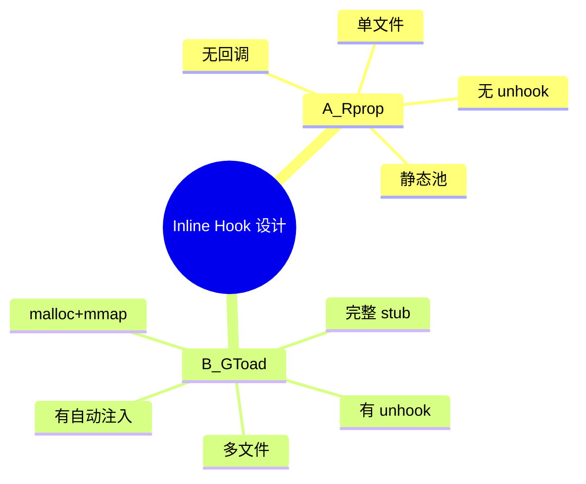
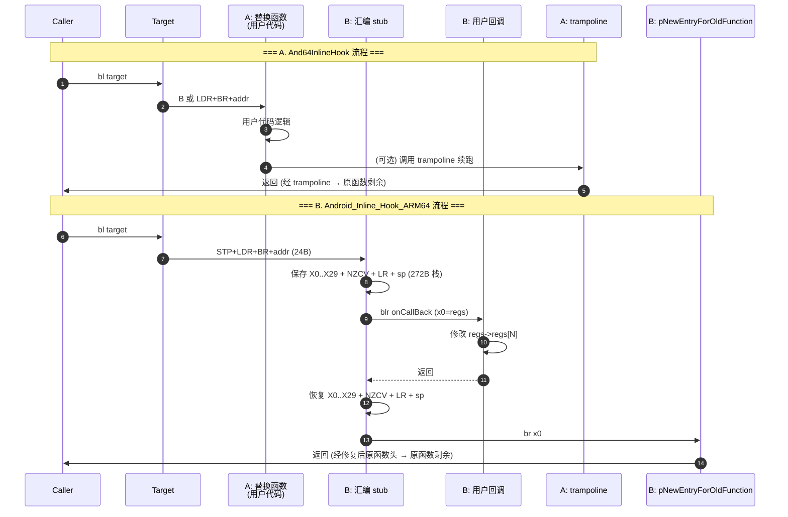
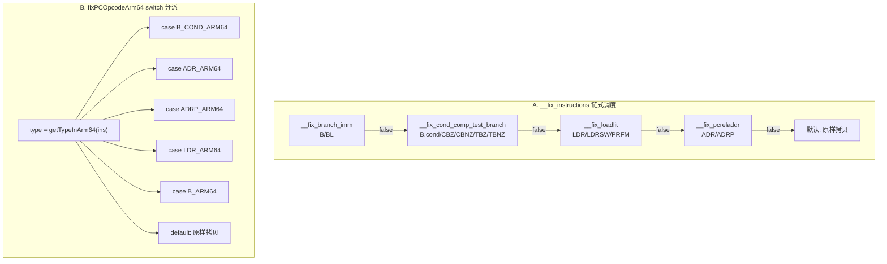

# ARM64 Inline Hook 库横向对比

> 对比对象：
> - **A**: [`And64InlineHook`](../../And64InlineHook/) —— Rprop (2018/04/18, MIT)
> - **B**: [`Android_Inline_Hook_ARM64`](../../Android_Inline_Hook_ARM64/) —— GToad (2018, MIT-ish)
>
> 两个库都是 2018 年发布、设计目标都是"Android ARM64 inline hook"，但实现策略差异巨大。
> 本文档从 API、内存、修复、限制、场景 5 个维度做横向对比。

---

## 1. 背景对比

| 维度 | A. And64InlineHook (Rprop) | B. Android_Inline_Hook_ARM64 (GToad) |
|------|--------------------------|-------------------------------------|
| 作者 | Rprop (r_prop@outlook.com) | GToad (gtoad1994@aliyun.com) |
| 发布日期 | 2018/04/18 | 2018/09/20（ARM64 版） |
| 许可证 | MIT（明示） | 未明示（推断 MIT，参考姊妹仓库） |
| 设计目标 | 单文件、轻量、零依赖 | 带 stub + 寄存器上下文 + unhook |
| 文档 | 仅有 README 链 ARM 文档 | 4 篇中文文章 + 英文版 + 设计图 PNG/PDF/Visio |
| 示例 | 无 | `ModifyIBored` / `EvilHookStubFunctionForIBored` |
| 代码量 | 596 行 cpp + 41 行 hpp = 637 行 | 1338 行（4 C 文件 + 1 汇编 + 1 cpp） |
| 文件数 | 2 源文件 + 1 LICENSE + 1 README = 4 | 6 源文件 + 5 设计图 + 1 README = 12 |
| 构建系统 | 无（裸 .cpp） | NDK（Android.mk + Application.mk） |

### 1.1 设计理念对比

**A 的理念**：最小可用 inline hook。把"备份前几条指令 + 写跳转"做成两个函数，让用户自己用 trampoline 调原函数。

**B 的理念**：完整 inline hook 框架。提供汇编 stub 保存/恢复寄存器、用户回调拿 `user_pt_regs *`、完整的 unhook 流程、构造函数自动 hook。是一套"插桩式 hook"。



---

## 2. API 对比

### 2.1 公开 API

| 项目 | 函数 | 签名 | 用途 |
|------|------|------|------|
| A | `A64HookFunction` | `void(void *symbol, void *replace, void **result)` | 主入口 |
| A | `A64HookFunctionV` | `void *(void *symbol, void *replace, void *rwx, uintptr_t rwx_size)` | 高级入口（用户提供 rwx） |
| B | `InlineHook` | `bool(void *pHookAddr, void (*onCallBack)(user_pt_regs *))` | 主入口 |
| B | `UnInlineHook` | `bool(void *pHookAddr)` | 取消 hook |

### 2.2 关键差异

| 维度 | A | B |
|------|---|---|
| 回调机制 | **无回调**（直接跳到 replace） | `void (*)(user_pt_regs *regs)` 回调，可读写全部寄存器 |
| 原函数调用 | 用户通过 `result` 拿到 trampoline，自行调用 | stub 末尾自动 `br x0` 跳回原函数 |
| 返回值 | `void`（输出参数） | `bool` |
| 参数语义 | `replace = 原函数头的新实现` | `onCallBack = hook 触发时的处理器（可读 regs）` |
| unhook | ❌ 不支持 | ✅ 支持（但有 Bug，未恢复原指令） |

### 2.3 使用模式对比

**A 的典型用法**（替换式）：
```c
int (*orig_target)(int, int);
int my_target(int a, int b) {
    int orig = orig_target(a, b);  // 调原函数
    return orig * 2;               // 修改返回值
}
A64HookFunction((void *)target, (void *)my_target, (void **)&orig_target);
```

**B 的典型用法**（插桩式）：
```c
void my_callback(struct user_pt_regs *regs) {
    LOGI("X0=%lld", regs->regs[0]);
    regs->regs[0] += 100;  // 修改 X0 (返回值)
}
InlineHook((void *)target, my_callback);
// 被 hook 的函数被调用时, 自动进入 my_callback
```

### 2.4 调用时序对比



---

## 3. 实现策略对比

### 3.1 关键决策

| 维度 | A | B |
|------|---|---|
| 入口数 | 2（公开 + 高级） | 5（API + HookArm + Init/Stub/Old/Rebuild + BuildArmJump） |
| 回调签名 | N/A | `void (*)(user_pt_regs *)` |
| trampoline 模型 | 静态池 + 原子自增 | malloc + 运行时分配 |
| 寄存器保存 | 不需要 | 完整 GPR + NZCV（272B 栈帧） |
| PC-relative 修复 | 4 个 fix 函数 + 链式调度 | `fixPCOpcodeArm64` 单函数 + switch-case |
| hook 点长度 | 4（近跳）或 20（远跳）字节 | 固定 24 字节 |
| cache flush | ✅ `__builtin___clear_cache` | ❌（已知缺陷） |
| 模块基址解析 | 无（用户传绝对地址） | `/proc/pid/maps` |
| ARM32 兼容 | ❌ | ✅（代码有但本仓库只 ARM64） |
| `__attribute__((constructor))` | 仅 `A64HookInit` | `before_main` + `ModifyIBored` |

### 3.2 修复函数对比

| 指令类型 | A 修复后最大字节 | B 修复后最大字节 | A 处理 | B 处理 |
|---------|----------------|----------------|-------|-------|
| `B` | 4 | 28 | ✅ | ✅ |
| `BL` | 5 (含 ADR LR) | N/A（未单独处理） | ✅ | ❌ |
| `B.cond` | 6 | 32 (8 if 备份内) | ✅ | ✅ |
| `CBZ` / `CBNZ` | 6 | 4 (落到 OTHER) | ✅ | ❌ |
| `TBZ` / `TBNZ` | 6 | 4 (落到 OTHER) | ✅ | ❌ |
| `LDR (literal)` | 2 + ns | 28 | ✅ | ✅ |
| `LDRSW (literal)` | 2 + ns | 4 (落到 OTHER) | ✅ | ❌ |
| `PRFM` | 0 (跳过) | 4 (落到 OTHER) | ✅ | ✅ (默认拷贝) |
| `ADR` | 4 | 12 | ✅ | ✅ |
| `ADRP` | 4 | 16 | ⚠️ 备份内有 Bug | ✅ |
| `BR` / `BLR` / `RET` | 4 (默认) | 4 (默认) | ✅ | ✅ |
| 备份内分支处理 | 延迟回填 (`insert_fix_map`) | 用 `backUpFixLengthList` 累加 gap | ✅ | ✅ |

### 3.3 修复策略流程对比



### 3.4 hook 点指令布局对比

#### A. 远跳转（20 字节）
```
偏移  指令/数据
+0    NOP (可选, 4 字节, 当 hook 点 4n+2 时插入)
+0/4  LDR X17, #8 (0x58000051)
+4/8  BR X17 (0xd61f0220)
+8/12 <8-byte 绝对地址>
总计: 20 字节 (含 NOP = 24)
```

#### B. 远跳转（24 字节，固定）
```
偏移  指令/数据
+0    STP X1, X0, [SP, #-0x10] (0xa93f03e1)   ; 保存 X0/X1
+4    LDR X0, 8 (0x58000040)
+8    BR X0 (0xd61f0000)
+12   <8-byte stub 地址>
+20   LDR X0, [SP, #-0x8] (0xf85f83e0)          ; 恢复 X0
总计: 24 字节
```

### 3.5 trampoline 内容对比

| 维度 | A | B |
|------|---|---|
| trampoline 内容 | 修复后的 1-5 条原指令 + 末尾跳转 | 修复后的最多 6 条原指令 + 末尾跳转 |
| 末尾跳转 | `B` 或 `LDR X17,8 + BR X17 + <addr>` | `LDR X17,8 + BR X17 + <addr>`（恒定） |
| 上限字节 | `A64_MAX_INSTRUCTIONS * 10 * 4 = 200 B` | 不定（取决于每条指令的修复后长度，~6×32 = 192） |
| trampoline 头 | 无 | `LDR X0, [sp, #-0x8]`（恢复 X0） |

---

## 4. 内存模型对比

### 4.1 分配策略

| 维度 | A | B |
|------|---|---|
| trampoline 池 | `static uint32_t[256][50]` (50 KB) | 每次 `malloc(82)` (stub) + `malloc(200)` (old) + `mmap(4096)` (fix) |
| 分配上限 | 256 个 hook | 无上限（malloc 受限于进程内存） |
| 释放 | **永不释放**（静态数组） | unhook 时 `delete` |
| 泄漏 | 无（静态数组） | `mmap(4096)` 永不释放（每次 hook 4 KiB） |

### 4.2 trampoline 池代码对比

**A 的静态池**（`And64InlineHook.cpp:481`）：
```cpp
static __attribute__((__aligned__(__page_size)))
    uint32_t __insns_pool[A64_MAX_BACKUPS][A64_MAX_INSTRUCTIONS * 10];
// = uint32_t[256][50] = 51200 字节 = 12.5 页
```

**B 的运行时分配**（`Ihook.c:164, 283, 271`）：
```c
void *pNewShellCode = malloc(sShellCodeLength);             // ~82 B
void *pNewEntryForOldFunction = malloc(200);                  // 200 B
void *fixOpcodes = mmap(NULL, PAGE_SIZE, RWX, ANON|PRIVATE, 0, 0);  // 4096 B
```

### 4.3 mprotect 调用对比

| 场景 | A | B |
|------|---|---|
| trampoline 池初始化 | `__make_rwx` 一次（构造时） | N/A（每次 malloc 单独 mprotect） |
| hook 点 | `__make_rwx(symbol, 5*sizeof(size_t))` | `ChangePageProperty(pHookAddr, 24, RWX)` |
| 每次 hook | 1 次 mprotect (hook) + 1 次 (在 fix 前) | 3 次 mprotect (stub, old, hook) |
| Android 10 兼容 | ✅ 显式调用 | ✅ 通过 `ChangePageProperty` |

### 4.4 缓存同步对比

| 维度 | A | B |
|------|---|---|
| 实现 | `__builtin___clear_cache(symbol, 4 or 20)` | ❌（未调用） |
| 时机 | 写完 hook 点后立即调用 | N/A |
| 影响 | ARM Cortex-A 上立即生效 | 部分 ARM 实现可能读到旧指令 |

### 4.5 并发安全对比

| 维度 | A | B |
|------|---|---|
| trampoline 分配 | `__sync_add_and_fetch` 原子 | 多次 malloc 非原子 |
| 写 hook 点 | 近跳: `__sync_bool_compare_and_swap`（原子）<br>远跳: memcpy（非原子） | `memcpy`（非原子） |
| 多线程并发 hook 同地址 | ⚠️ 远跳不安全 | ❌ 不安全 |
| 多线程并发调用被 hook 函数 | ✅ 安全（跳转原子） | ⚠️ 寄存器保存依赖栈帧，非原子 |

---

## 5. 限制对比

| 维度 | A | B |
|------|---|---|
| 最大 hook 长度 | 5 条指令 ≈ 20-40 字节（远跳模板占 20 字节） | 固定 24 字节（最多 6 条指令） |
| 备份区间内分支 | ✅ 完整支持（前向 + 后向引用） | ✅ `B_COND_ARM64` 完整支持；其它未处理 |
| CBZ/CBNZ 修复 | ✅ | ❌ 落到 OTHER 原样拷贝 |
| TBZ/TBNZ 修复 | ✅ | ❌ 落到 OTHER 原样拷贝 |
| ADRP → 备份内 | ⚠️ `// What is the correct way to fix this?` | ✅ 原样拷贝 |
| ARM32 兼容 | ❌ | ✅（代码有，但本仓库仅 ARM64） |
| ARMv8.5+ BTI | ❌ | ❌ |
| PAC | ❌ | ❌ |
| MTE | ❌ | ❌ |
| cache flush | ✅ | ❌ |
| 已知 Bug | ADRP 内部分支未处理 | unhook 不完整 / mmap 泄漏 / cache flush 缺失 / 某些指令类型未修复 |

---

## 6. 使用场景对比

### 6.1 推荐场景

| 场景 | 推荐 | 理由 |
|------|------|------|
| 替换式 hook（彻底替换函数） | **A** | 无回调开销，直接跳转到 replace |
| 插桩式 hook（拦截但不替换） | **B** | 回调拿 regs，可读写寄存器后继续原函数 |
| 一次性安装不撤销 | **A** | 设计目标 |
| 需要动态 unhook | **B** | 提供 `UnInlineHook`（需修复 Bug） |
| 单文件集成（裸 .cpp） | **A** | 无 NDK 依赖 |
| 完整 NDK 项目 | **B** | 自带 Android.mk |
| ARM32 + ARM64 双平台 | **B** | 代码支持 ARM32 分类 |
| 教学 / 代码研究 | **B** | 文档齐全（4 篇文章 + 设计图） |
| 教学 / 代码研究（极简） | **A** | 单文件 600 行可读完 |
| 需要 /proc/pid/maps 解析 | **B** | 内置 `GetModuleBaseAddr` |

### 6.2 不推荐场景

| 场景 | 不推荐 |
|------|--------|
| Android 11+ 上的 BTI 代码 | A, B 都不行 |
| PAC 签名的指针 | A, B 都不行 |
| MTE 标记的内存 | A, B 都不行 |
| 多线程并发 hook 同地址 | A（远跳非原子）, B（全链非原子） |
| 大量短生命周期 hook（>256 个） | A（池耗尽）, B（unhook 后可复用） |
| hook 点跨 6 条以上 ARM64 指令 | B（硬编码 24 B），A 可通过调 `A64_MAX_INSTRUCTIONS` |

### 6.3 性能对比（粗略）

| 维度 | A | B |
|------|---|---|
| 调用开销 | 1 条 B 或 LDR+BR | 24B 跳转 + stub 272B 栈 + GPR 保存恢复 |
| 每次 hook 耗时 | < 1 μs | ~10 μs（多次 malloc + mmap） |
| 每次被 hook 函数被调用 | 1 条跳转 | 24B 跳转 + 30+ 条汇编指令（保存/恢复 GPR） |
| 适合场景 | 性能敏感（大量调用） | hook 频率不高 |

---

## 7. 代码质量对比

| 维度 | A | B |
|------|---|---|
| 代码风格 | 现代 C++（inline / constexpr / RAII-friendly） | C + C++ 混合，老式风格（goto-less while(1) break 模式） |
| 错误处理 | 返回 NULL（mprotect 失败仅 log） | 同左 |
| 注释质量 | 关键路径有注释 + 作者明确标注 ADRP Bug | 中文注释，部分位置有 `LOGI("LIVE4.3.1")` 调试残留 |
| 死代码 | 无 | `fixBcond`（空实现）/ `lengthFixArm32`（结果未用） |
| 调试残留 | `A64_LOGI`（`NDEBUG` 时关闭） | `LOGI("LIVE3.1")` 等 |
| 已知 Bug 数量 | 1（ADRP → 备份内） | 6（unhook 不完整 / mmap 泄漏 / cache flush 缺失 / CBZ 等未修复 / `lengthFixArm32` 死代码 / `fixBcond` 空实现） |
| 可维护性 | 中（单文件难模块化） | 低（多文件耦合紧 + 死代码 + Bug 多） |

---

## 8. 总结

| 维度 | A (Rprop) | B (GToad) |
|------|-----------|-----------|
| **优点** | 单文件、零依赖、原子 CAS、cache flush 完整 | 完整框架、回调机制、自动注入、文档齐全 |
| **缺点** | 无 unhook、无回调、ADRP Bug | 多 Bug（unhook/泄漏/cache flush/未修复指令）、无原子保证 |
| **代码量** | 596 行 | 1338 行 |
| **学习价值** | ⭐⭐⭐⭐⭐（一小时内能读完） | ⭐⭐⭐⭐（含汇编 + 修复算法） |
| **生产可用性** | ⭐⭐⭐⭐（小项目足够） | ⭐⭐（需要先修 Bug） |
| **维护状态** | 2018 后无更新 | 2018 后无更新 |

**选 A**：如果只需 hook 几十个函数、不需要 unhook、追求代码简单、性能敏感。

**选 B**：如果需要完整 hook 框架、需要 unhook（且愿意修 Bug）、需要回调拿 regs、教学目的。

**选 Frida**：如果两个库都不能满足需求（Android 11+ BTI / PAC / MTE），考虑迁移到 Frida。

---

## 9. 参考资源

- A README: [`../../And64InlineHook/README.md`](../../And64InlineHook/README.md)
- B README: [`../../Android_Inline_Hook_ARM64/README.md`](../../Android_Inline_Hook_ARM64/README.md)
- Ele7enxxh 的 [Android Arm Inline Hook](http://ele7enxxh.com/Android-Arm-Inline-Hook.html) —— 同源设计思路
- Game Security Lab of Tencent: http://gslab.qq.com/portal.php?mod=view&aid=168
- ARM ARMv8-A Architecture Reference Manual: https://developer.arm.com/documentation/ddi0487
- AAPCS64: https://github.com/ARM-software/abi-aa/blob/master/aapcs64/aapcs64.rst

---

## 10. 附录 · 性能基准（粗略估算）

| 操作 | A 耗时 | B 耗时 |
|------|--------|--------|
| 单次 `A64HookFunction` / `InlineHook` | ~5 μs（1 次 mprotect + 几次 memcpy） | ~50 μs（3 次 malloc + 3 次 mprotect + 1 次 mmap + 多次 memcpy） |
| 单次被 hook 函数被调用 | ~10 ns（1 条 B 或 4 条跳转） | ~200 ns（24B 跳转 + 30+ 条汇编） |
| 单次 `UnInlineHook` | N/A（不支持） | ~1 μs（vector 遍历 + 3 次 delete） |
| 1000 次 hook 后内存占用 | +50 KB（静态池） | +4 MB（1000 × 4 KiB mmap 泄漏） |

> 以上为粗略估算，实际取决于目标 CPU、内核版本、内存压力等。