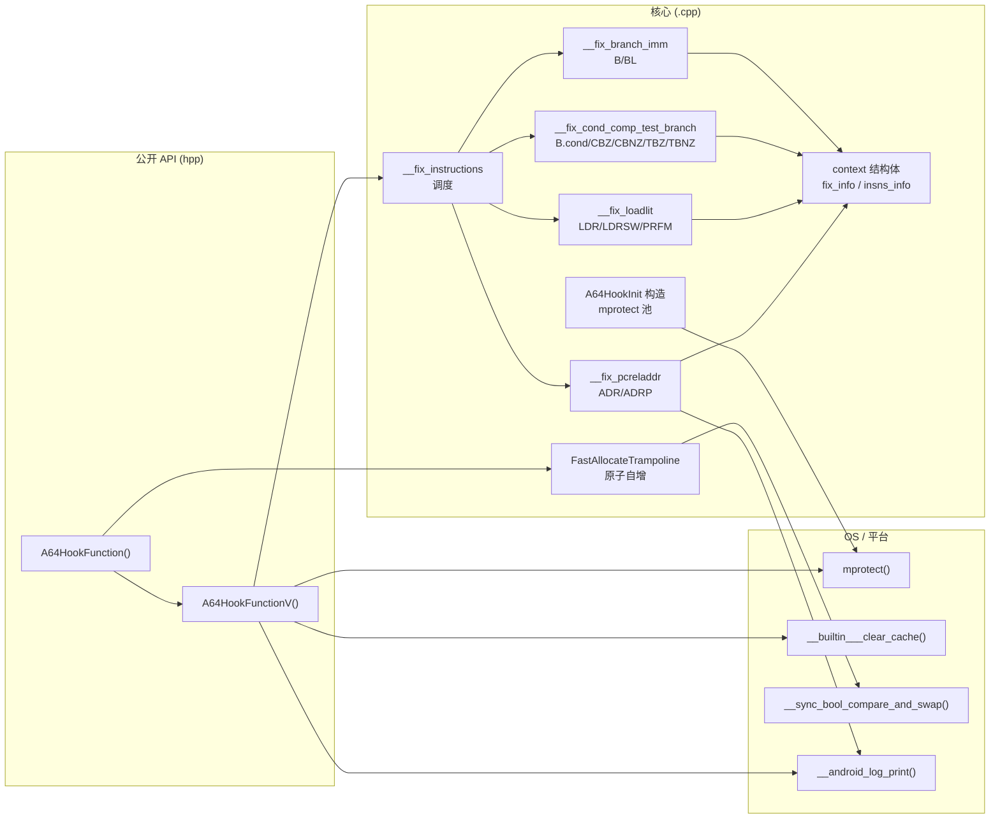

# 02 · 模块布局（按代码段分组）

> 项目是单文件实现（`And64InlineHook.cpp`），故"模块"按代码段划分。

## 2.1 文件清单

| 文件 | 行数 | 角色 |
|------|------|------|
| `And64InlineHook.hpp` | 41 | 公开 API 声明 + MIT License + `A64_MAX_BACKUPS` |
| `And64InlineHook.cpp` | 596 | 完整实现，被 `#if defined(__aarch64__)` 守护 |
| `LICENSE` | 33 | MIT |
| `README.md` | 16 | 简要说明 + 文档参考链接 |

## 2.2 `.cpp` 代码段分布

```
行号      段名                              说明
─────────────────────────────────────────────────────────────
1-28     License Header                    MIT 全文
29-35    Include Header                    inttypes, stdlib, string, errno, sys/mman, android/log
37-49    Aarch64 Guard + Constants         A64_MAX_INSTRUCTIONS=5, A64_MAX_REFERENCES=10,
                                          A64_MAX_BACKUPS=256, A64_NOP=0xd503201f, 日志宏
51-106   context Structure + Methods       核心数据：fix_info、insns_info、is_in_fixing_range、
                                          get_ref_ins_index、get_and_set_current_index、
                                          reset_current_ins、insert_fix_map、process_fix_map
110-125  Utility Macros                    __intval/__uintval/__ptr/__page_align/__align_up/down,
                                          __countof/__atomic_increase/__sync_cmpswap/
                                          __predict_true/__flush_cache/__make_rwx
129-190  __fix_branch_imm                  B / BL 修复
194-254  __fix_cond_comp_test_branch       B.cond / CBZ / CBNZ / TBZ / TBNZ 修复
258-333  __fix_loadlit                     LDR (literal) / LDRSW (literal) / PRFM 修复
337-426  __fix_pcreladdr                   ADR / ADRP 修复
430-476  __fix_instructions                调度 4 个 fix 函数 + 末尾追加跳转
480-494  A64HookInit (constructor)         静态初始化 → mprotect 整个 trampoline 池为 RWX
498-510  FastAllocateTrampoline            __sync_add_and_fetch 分配 slot
514-573  A64HookFunctionV                  高级 API：根据 PC 偏移选 short B / long LDR+BR
577-593  A64HookFunction                   公开 API：调 FastAllocateTrampoline + 二次 mprotect
595-596  #endif                            aarch64 守护结束
```

## 2.3 `.hpp` 内容

```cpp
#pragma once
#define A64_MAX_BACKUPS 256

#ifdef __cplusplus
extern "C" {
#endif
    void A64HookFunction(void *const symbol, void *const replace, void **result);
    void *A64HookFunctionV(void *const symbol, void *const replace,
                           void *const rwx, const uintptr_t rwx_size);
#ifdef __cplusplus
}
#endif
```

仅两个声明 + 一个最大备份数宏。所有其他宏（`A64_MAX_INSTRUCTIONS`、`A64_MAX_REFERENCES`、`A64_NOP`）都在 `.cpp` 内 `#define`，对用户不可见。

## 2.4 模块依赖图



## 2.5 段间调用关系

| 调用方 | 被调方 | 位置 |
|--------|--------|------|
| `A64HookFunction` | `FastAllocateTrampoline` | `.cpp:581` |
| `A64HookFunction` | `__make_rwx` (symbol) | `.cpp:587` |
| `A64HookFunction` | `A64HookFunctionV` | `.cpp:589` |
| `A64HookFunctionV` | `__fix_instructions` | `.cpp:530` (远跳转) / `.cpp:556` (近跳转) |
| `A64HookFunctionV` | `__make_rwx` (original) | `.cpp:533` / `.cpp:559` |
| `A64HookFunctionV` | `__flush_cache` | `.cpp:541` / `.cpp:561` |
| `A64HookFunctionV` | `__sync_cmpswap` (近跳转) | `.cpp:560` |
| `__fix_instructions` | `__fix_branch_imm` | `.cpp:447` |
| `__fix_instructions` | `__fix_cond_comp_test_branch` | `.cpp:448` |
| `__fix_instructions` | `__fix_loadlit` | `.cpp:449` |
| `__fix_instructions` | `__fix_pcreladdr` | `.cpp:450` |
| `__fix_instructions` | `__flush_cache` | `.cpp:475` |
| 4 个 fix 函数 | `context::get_and_set_current_index` / `insert_fix_map` / `process_fix_map` | `.cpp:143/172/176/222/239/243/265/301/310/325/356/372/377/390/423` |
| `A64HookInit` (ctor) | `__make_rwx` | `.cpp:490` |