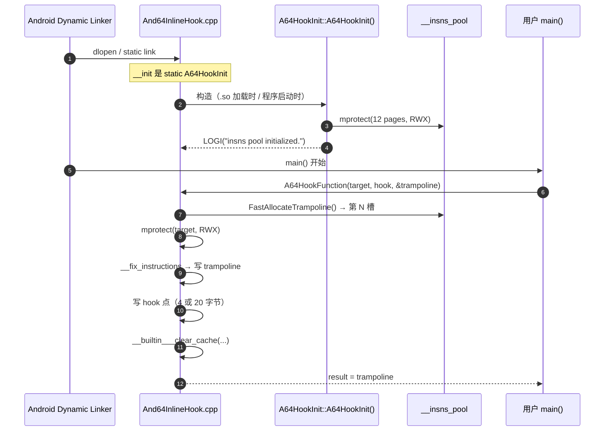
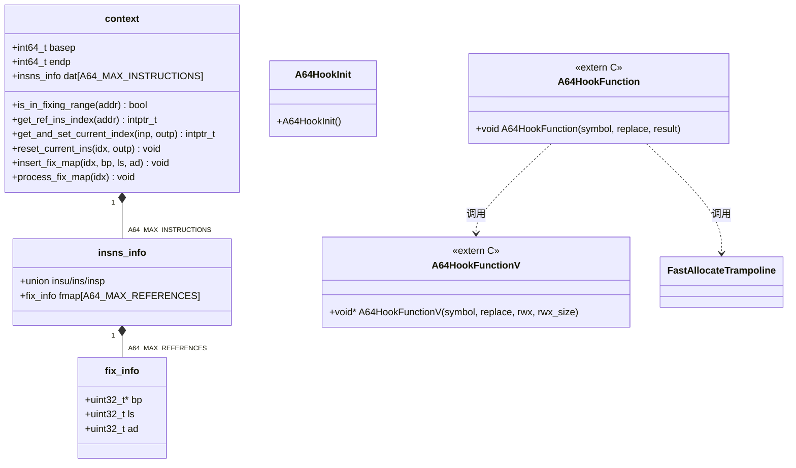
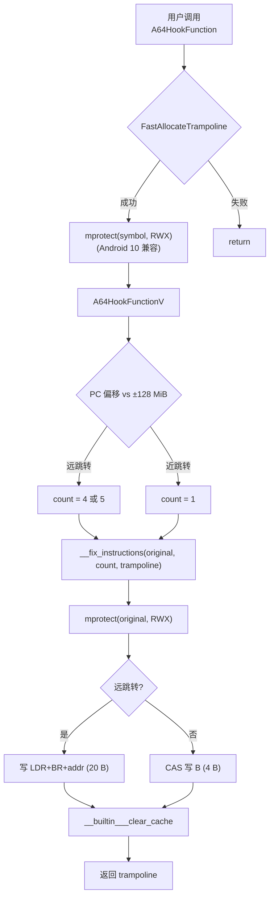
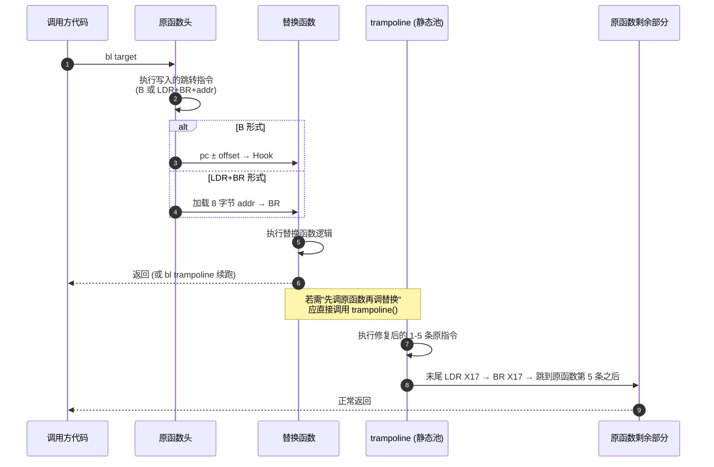

# 03 · 架构总览

## 3.1 分层

```
┌──────────────────────────────────────────────────────────────┐
│  用户代码                                                     │
│  void *orig = NULL;                                          │
│  A64HookFunction(target_fn, my_hook, &orig);                  │
│  // 调用 orig(target_fn) 会跳到 trampoline（=原函数头 5 条）  │
└──────────────────────────────────────────────────────────────┘
                            │
                            ▼
┌──────────────────────────────────────────────────────────────┐
│  公开 API 层                                                  │
│  ┌─────────────────────┐   ┌──────────────────────────┐      │
│  │ A64HookFunction     │──▶│ A64HookFunctionV         │      │
│  │ (分配 trampoline)   │   │ (写入 hook 点)            │      │
│  └─────────────────────┘   └──────────────────────────┘      │
└──────────────────────────────────────────────────────────────┘
                            │
                            ▼
┌──────────────────────────────────────────────────────────────┐
│  核心修复调度层                                                │
│  __fix_instructions(inp, count, outp)                         │
│  ├─ while (count--) {                                        │
│  │    __fix_branch_imm  │ __fix_cond_comp_test_branch        │
│  │    __fix_loadlit     │ __fix_pcreladdr                    │
│  │    // 默认: 原样拷贝                                       │
│  │  }                                                        │
│  // 末尾: 跳回原函数剩余部分                                   │
└──────────────────────────────────────────────────────────────┘
                            │
                            ▼
┌──────────────────────────────────────────────────────────────┐
│  上下文管理层 (context)                                       │
│  ├─ fix_info { bp, ls, ad }  → 待回填字段                     │
│  ├─ insns_info { ins, fmap[] }→ 单条指令 + 修复槽              │
│  ├─ basep/endp              → 输入范围                         │
│  └─ 方法: get_ref_ins_index, insert_fix_map, process_fix_map  │
└──────────────────────────────────────────────────────────────┘
                            │
                            ▼
┌──────────────────────────────────────────────────────────────┐
│  平台抽象层（宏）                                              │
│  __make_rwx (mprotect)                                       │
│  __flush_cache (__builtin___clear_cache)                      │
│  __sync_cmpswap (CAS)                                        │
│  __align_up/down                                             │
└──────────────────────────────────────────────────────────────┘
```

## 3.2 内存布局

### 静态 trampoline 池

```cpp
// And64InlineHook.cpp:481
static __attribute__((__aligned__(__page_size))) uint32_t
    __insns_pool[A64_MAX_BACKUPS][A64_MAX_INSTRUCTIONS * 10];
```

- 类型：`uint32_t[A64_MAX_BACKUPS][50]` → 256 × 50 × 4 = **51200 字节 = 12.5 pages**
- 对齐：4 KiB 页对齐（`.bss` 段自动保证）
- 构造时由 `A64HookInit` mprotect 为 RWX
- 分配：`FastAllocateTrampoline()` 用 `__sync_add_and_fetch(&__index, 1)` 自增

### hook 点指令布局

近跳转（`llabs(pc_offset) < (1<<25)`，即 ±128 MiB）：

```
偏移  字节         指令
─────────────────────────────────────────
+0   0x14000000   B <offset>            (4 字节)
```

远跳转（超过 ±128 MiB）：

```
偏移  字节          指令                          含义
─────────────────────────────────────────────────────────────
+0   0xd503201f   NOP                          (仅当 hook 点 4n+2 时插入, 4 字节)
+0   0x58000051   LDR X17, #0x8                (4 字节, PC-relative)
+4   0xd61f0220   BR X17                       (4 字节)
+8   <8 bytes>    绝对地址 (int64_t)             (8 字节)
─────────────────────────────────────────────────────────────
总计：4 条指令 = 20 字节（含 NOP = 24 字节）
```

### trampoline 内容（典型 4 指令备份）

```
偏移  字节          含义
─────────────────────────────────────────────────────────────
+0   <原始 insn 0>  可能为多条（修复后膨胀）
+4   <原始 insn 1>  ...
+8   <原始 insn 2>  ...
+12  <原始 insn 3>  ...
+?   LDR X17, #8    PC-relative load
+?+4 BR X17         跳转到下面 8 字节存的地址
+?+8 <int64>        原函数剩余部分入口（=原始 instr[4..end] 的第一条）
─────────────────────────────────────────────────────────────
```

## 3.3 启动 / 静态初始化时序



## 3.4 类图（context 结构体）



## 3.5 控制流（hook 时）



## 3.6 调用时控制流（被 hook 的函数被调用时）



> **设计意图**：And64InlineHook **不提供回调机制**，只把 `target` 替换为 `replace`。若要"插入式"hook（先调原函数再调替换），调用方应在 `replace` 中显式调用保存下来的 trampoline。