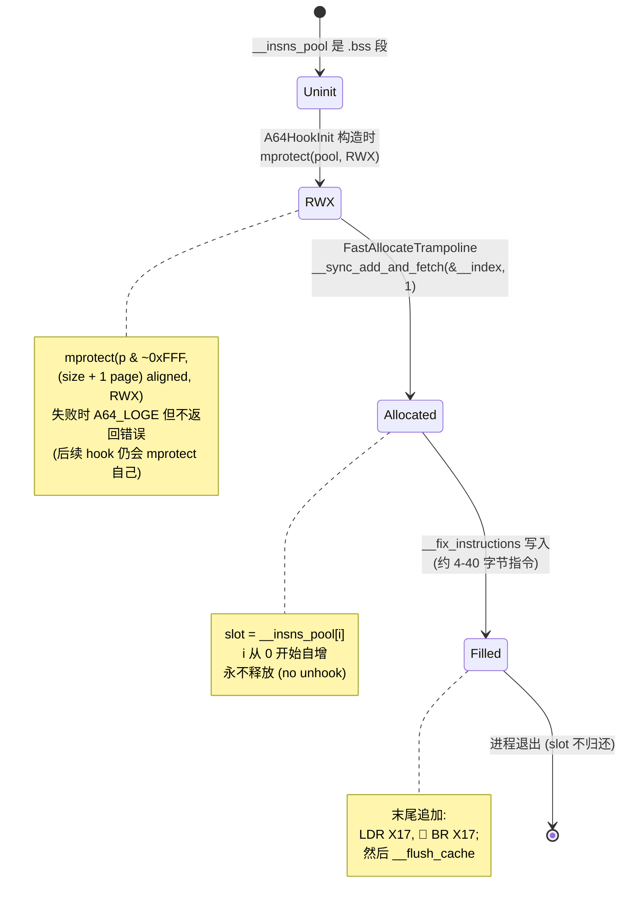
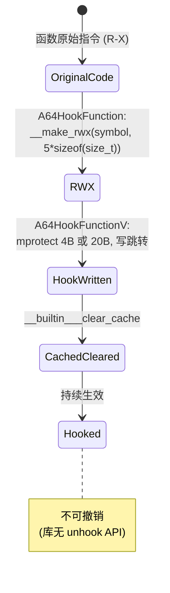
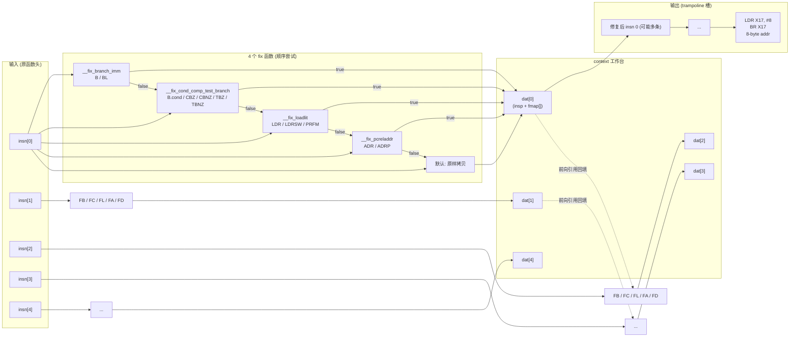

# 04 · 数据流与生命周期

## 4.1 核心数据结构

### `struct context`

定义于 `And64InlineHook.cpp:51-106`，是整个修复调度器的"工作台"：

```cpp
struct context {
    struct fix_info {            // 行 53-58
        uint32_t *bp;            // 指向输出区中"待回填位置"（uint32_t*）
        uint32_t  ls;            // 左移位数（构造时固定）
        uint32_t  ad;            // AND 掩码（构造时固定）
    };
    struct insns_info {          // 行 59-68
        union {
            uint64_t insu;
            int64_t  ins;        // 输出区中该指令对应位置（绝对地址）
            void    *insp;
        };
        fix_info fmap[A64_MAX_REFERENCES];  // 每条 insn 最多 2 个待回填字段
    };
    int64_t    basep;            // 输入指令区起点（inp 的绝对地址）
    int64_t    endp;             // 输入指令区终点
    insns_info dat[A64_MAX_INSTRUCTIONS];   // 每条原指令一个槽
    // ... methods ...
};
```

### 成员函数

| 方法 | 签名 | 作用 | 行号 |
|------|------|------|------|
| `is_in_fixing_range` | `bool(int64_t)` | `absolute_addr ∈ [basep, endp)`？用于判断跳转目标是否落在备份区间内 | `74-76` |
| `get_ref_ins_index` | `intptr_t(int64_t)` | 把绝对地址转成 `(addr - basep) / 4`，即指令序号 | `77-79` |
| `get_and_set_current_index` | `intptr_t(uint32_t*, uint32_t*)` | 计算当前输入/输出指令的序号，把 `insp` 设为输出地址，返回序号 | `80-84` |
| `reset_current_ins` | `void(intptr_t, uint32_t*)` | 插入 NOP 对齐后，重新设置 `insp` | `85-87` |
| `insert_fix_map` | `void(intptr_t, uint32_t*, uint32_t, uint32_t)` | 把"待回填字段"登记到 `fmap` 第一个空槽 | `88-98` |
| `process_fix_map` | `void(intptr_t)` | 把 `dat[idx].ins - bp` 编码到 `bp` 指向的指令字段 | `99-105` |

### 字段用途对照

| 字段 | 何时写入 | 何时读取 |
|------|---------|---------|
| `basep` | `__fix_instructions` 入口 | 各 fix 函数判断"是否在备份区间内" |
| `endp` | `__fix_instructions` 入口 | 同上 |
| `dat[i].insp` | `get_and_set_current_index` / `reset_current_ins` | 后续指令判断"该位置已被定下来"时回填引用 |
| `dat[i].fmap[k]` | 当前指令为分支目标、且目标在更后面 → `insert_fix_map` 登记到"目标的 fmap" | 处理目标指令时 `process_fix_map` 回填 |

## 4.2 trampoline 数据生命周期



## 4.3 hook 点数据生命周期



## 4.4 数据流总图



## 4.5 关键修复决策表

每个 `__fix_*` 函数对指令的决策分支相同：

| 条件 | 处理 |
|------|------|
| 跳转目标在备份区间外 **且** 偏移超过 `±mask>>1` | 膨胀为 `LDR Xn, #8; BR Xn; <addr>` 模式（必要时 NOP 对齐） |
| 跳转目标在备份区间外 **且** 偏移可表达 | 直接写原指令，调整 PC-relative 字段 |
| 跳转目标在备份区间内、且指向已处理过的指令 (`ref_idx <= current_idx`) | 用 `dat[ref_idx].ins - outp` 重算偏移 |
| 跳转目标在备份区间内、且指向未处理的指令 (`ref_idx > current_idx`) | **延迟回填**：把 `{bp, ls, ad}` 登记到 `dat[ref_idx].fmap`，`new_pc_offset = 0`，等 `process_fix_map(current_idx)` 在该指令被处理时填入 |

## 4.6 数据流示例

设原函数前 4 条指令：

```asm
0x1000: LDR X0, =global_var      ; 0x58000040 (LDR literal)
0x1004: CBZ X0, 0x1020           ; 0xb4000010 ...
0x1008: ADD X1, X0, #1           ; 0x91000401
0x100c: B   0x2000               ; 0x140003fc
0x1010: ... (后续)
```

修复后 trampoline（假设 hook 到 0x1000）：

```asm
trampoline+0:  LDR X0, 8            ; LDR literal → 改走下面 8 字节
trampoline+4:  B 12                 ; 跳过 NOP（？）
trampoline+8:  <8-byte addr of global_var>  ; 直接放常量
trampoline+16: B.anti 8             ; CBZ 的反条件 (always-equivalent: skip)
trampoline+20: <原 0x1020 的指令>   ; CBZ 目标直接嵌入
trampoline+24: STP X0, X0, [SP, -0x10]?  ; loadlit 修复模式（取决于模板）
...
trampoline+?:  LDR X17, #8
trampoline+?+4: BR X17
trampoline+?+8: <8-byte addr = 0x100c>  ; 跳到原函数第 4 条之后 (跳过前 4 条)
```

具体布局由每个 fix 函数的膨胀比例决定，**`A64_MAX_INSTRUCTIONS * 10` = 50 uint32 = 200 字节是上限。**