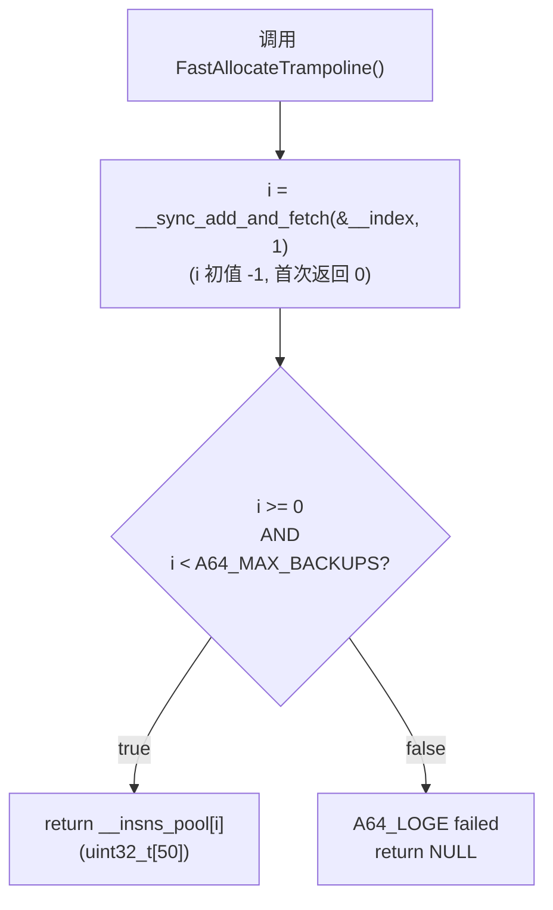
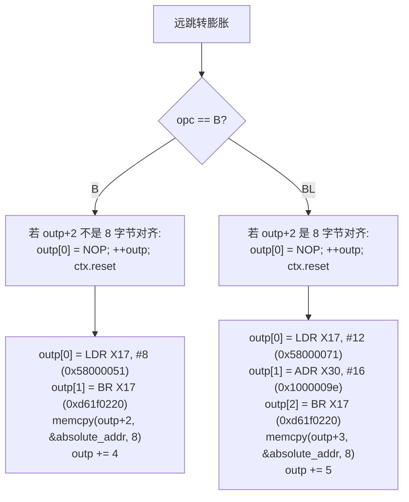
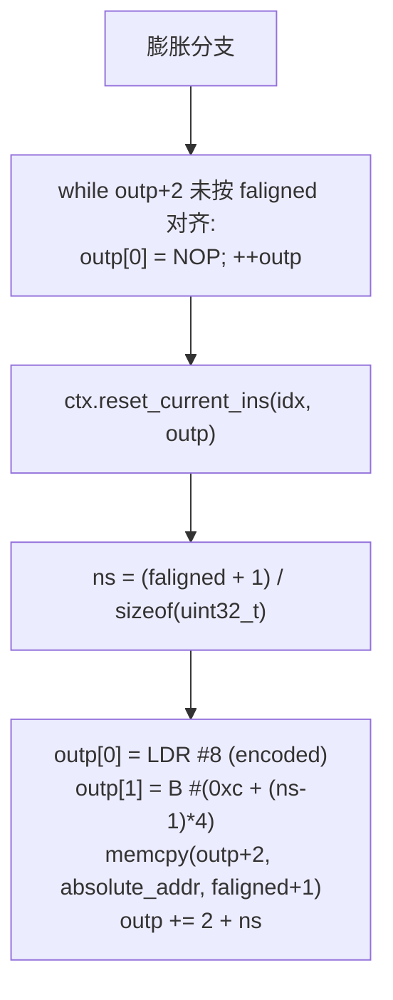
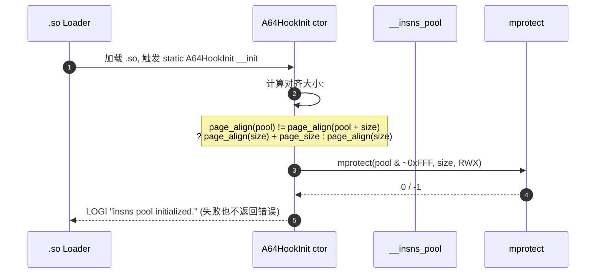

# 05 · 主要操作链（每条配 mermaid）

> 每条链都标注：输入 → 入口文件 + 函数 → 关键步骤 → 输出。

---

## 5.1 主入口 `A64HookFunction` 完整流程

**入口**：`And64InlineHook.cpp:577` `A64HookFunction(symbol, replace, result)`

```mermaid
sequenceDiagram
    autonumber
    participant U as User
    participant API as A64HookFunction
    participant AL as FastAllocateTrampoline
    participant MP as mprotect
    participant V as A64HookFunctionV
    participant FX as __fix_instructions
    participant CA as __builtin___clear_cache
    participant CAS as __sync_bool_compare_and_swap

    U->>API: A64HookFunction(target, hook, &trampoline)
    API->>AL: 分配槽位 i = __atomic_increase(&__index)
    AL-->>API: __insns_pool[i]
    API->>MP: mprotect(target, 5*sizeof(size_t), RWX)<br/>Android 10 兼容
    MP-->>API: 0 / -1 (仅日志, 不影响后续)
    API->>V: A64HookFunctionV(target, hook, slot, 50*4)
    V->>V: 计算 pc_offset = (hook - target) >> 2
    alt pc_offset < ±128 MiB (近跳转)
        V->>FX: __fix_instructions(target, 1, slot)
        FX-->>V: 写入 trampoline
        V->>MP: mprotect(target, 1 insn, RWX)
        V->>CAS: CAS(*target, B-encoded)
        V->>CA: __builtin___clear_cache(target, 4)
    else pc_offset ≥ ±128 MiB (远跳转)
        V->>V: count = (target+8) & 7 ? 5 : 4
        V->>FX: __fix_instructions(target, count, slot)
        FX-->>V: 写入 trampoline
        V->>MP: mprotect(target, 5 insns, RWX)
        V->>V: 必要时先写 NOP 对齐
        V->>V: 写 LDR X17, #8; BR X17; <addr>
        V->>CA: __builtin___clear_cache(target, 20)
    end
    V-->>API: trampoline / NULL
    API-->>U: *result = trampoline (or NULL)
```

---

## 5.2 trampoline 分配（`FastAllocateTrampoline`）

**入口**：`And64InlineHook.cpp:498`



> **注意**：索引到 256 后仍会自增，越界检查靠 `__countof`。本库**不释放槽位**，所有 hook 永久占位。

---

## 5.3 远跳转生成（`__fix_instructions` + 4 个 fix 路由）

**入口**：`And64InlineHook.cpp:430`

```mermaid
sequenceDiagram
    autonumber
    participant FX as __fix_instructions
    participant FB as __fix_branch_imm
    participant FC as __fix_cond_comp_test_branch
    participant FL as __fix_loadlit
    participant FA as __fix_pcreladdr
    participant FD as default (memcpy)
    participant CX as context
    participant TC as __builtin___clear_cache

    FX->>CX: basep = inp; endp = inp + count; memset(dat)
    loop count 次
        FX->>FB: __fix_branch_imm(&inp, &outp, &ctx)
        alt 匹配 (B / BL)
            FB->>CX: get_and_set_current_index → idx
            FB->>FB: 解析 imm26 → absolute_addr
            FB->>FB: 计算 new_pc_offset
            alt 目标超出 ±32 MiB 且在备份外
                FB->>FB: 写 LDR X17, #8; BR X17; <addr> (4 insns)
            else
                FB->>FB: 写 B/BL 调整后偏移 (1 insn)
            end
            FB->>CX: process_fix_map(idx)
            FB-->>FX: true
        else 不匹配
            FX->>FC: __fix_cond_comp_test_branch(...)
            alt 匹配 (B.cond/CBZ/CBNZ/TBZ/TBNZ)
                FC-->>FX: true
            else 不匹配
                FX->>FL: __fix_loadlit(...)
                alt 匹配 (LDR/LDRSW/PRFM literal)
                    FL-->>FX: true
                else 不匹配
                    FX->>FA: __fix_pcreladdr(...)
                    alt 匹配 (ADR/ADRP)
                        FA-->>FX: true
                    else 不匹配
                        FX->>FD: 登记索引 + 原样拷贝 (outp++ = inp++)
                    end
                end
            end
        end
    end
    FX->>FX: 计算 callback = inp (原始剩余入口)
    FX->>FX: 若 |pc_offset| ≥ ±32 MiB: LDR+BR+addr; 否则 B
    FX->>TC: __builtin___clear_cache(outp_base, total)
```

---

## 5.4 近跳转分支（PC 偏移 < ±128 MiB）

**入口**：`A64HookFunctionV` 在 `.cpp:550` 进入 else 分支

```mermaid
flowchart TD
    A["pc_offset < ±128 MiB"] --> B["trampoline 不为空?<br/>(用户传入了 rwx)"]
    B -->|true| C["rwx_size < 10u?<br/>→ A64_LOGE + return NULL"]
    B -->|false| D
    C -.-> END[end]
    B -->|false (无 rwx)| D
    D["__fix_instructions(original, 1, trampoline)"]
    D --> E["mprotect(original, 4, RWX)"]
    E -->|失败| F["A64_LOGE + trampoline = NULL"]
    E -->|成功| G["CAS: *original = B-encoded"]
    G --> H["__builtin___clear_cache(symbol, 4)"]
    H --> I["LOGI inline hook OK"]
```

---

## 5.5 修复函数：`__fix_branch_imm` 详细流程

**入口**：`And64InlineHook.cpp:129`

```mermaid
flowchart TD
    A["进入 __fix_branch_imm<br/>读取 ins = *(*inpp)"] --> B{ins & 0xfc000000}
    B -->|0x14000000 (B)| C
    B -->|0x94000000 (BL)| C
    B -->|其它| END[return false]

    C["opc = B / BL"] --> D["idx = ctx.get_and_set_current_index<br/>(登记 outp 到 dat[idx].insp)"]
    D --> E["absolute_addr = *inpp + signext(ins << 6 >> 4)"]
    E --> F["new_pc_offset = (absolute_addr - outp) >> 2"]
    F --> G{特殊?<br/>target ∈ [basep, endp)}
    G -->|true| H[是备份内分支, 见 5.5.1]
    G -->|false| I{new_pc_offset<br/>绝对值 ≥ 2^25?}
    I -->|true| J[膨胀为远跳转, 见 5.5.2]
    I -->|false| K[直接写原指令调整偏移]

    H --> Z["process_fix_map(idx)<br/>++inp, return true"]
    J --> Z
    K --> Z
```

### 5.5.1 备份内分支 (`special_fix_type == true`)

```mermaid
flowchart TD
    A[备份内分支] --> B["ref_idx = ctx.get_ref_ins_index(absolute_addr)"]
    B --> C{ref_idx <= current_idx?}
    C -->|true (已处理)| D["new_pc_offset = (dat[ref_idx].ins - outp) >> 2"]
    C -->|false (未处理)| E["ctx.insert_fix_map(ref_idx, outp, 0, 0x03ffffff)<br/>new_pc_offset = 0"]
    D --> F["outp[0] = opc | (new_pc_offset & 0x03ffffff)<br/>++outp"]
    E --> F
```

### 5.5.2 远跳转膨胀 (`!special && |pc| >= 2^25`)



> **关键点**：BL 还多一条 `ADR X30, #16` 用于恢复 LR（即返回地址），因为 BL 在 hook 上下文中需要正确返回到 caller。

---

## 5.6 修复函数：`__fix_loadlit` 详细流程

**入口**：`And64InlineHook.cpp:258`

```mermaid
flowchart TD
    A["读取 ins = *(*inpp)"] --> B{ins & 0xff000000 == 0xd8000000?}
    B -->|是 (PRFM)| C["process_fix_map + ++inp; return true<br/>(跳过)"]
    B -->|否| D{ins & 0xbf000000 == 0x18000000?}
    D -->|是 (LDR Wt/Xt literal)| E["faligned = (bit30 ? 7 : 3)"]
    D -->|否| F{ins & 0x3f000000 == 0x1c000000?}
    F -->|是 (LDR St/Dt/Qt literal)| G["faligned = (bit31 ? 15 : 3)"]
    F -->|否| H{ins & 0xff000000 == 0x98000000?}
    H -->|是 (LDRSW literal)| I["faligned = 7"]
    H -->|否| END[return false]

    E --> J
    G --> J
    I --> J
    J["idx = get_and_set_current_index<br/>absolute_addr = *inpp + signext(imm19)<br/>new_pc_offset = (absolute_addr - outp) >> 2"] --> K{special?<br/>或<br/>pc_offset 超限?}
    K -->|true (膨胀)| L[见 5.6.1]
    K -->|false (内联)| M["计算对齐 NOP 数<br/>outp[0] = LDR #8 (ins & lmask)<br/>outp[1] = B #(4 + ns)<br/>memcpy(outp+2, &absolute_addr, faligned+1)<br/>outp += 2 + ns"]
```

### 5.6.1 loadlit 膨胀 (literal 数据就地嵌入)



> **关键点**：把 `LDR literal` 改成 `LDR (pc-relative, #8) + B + 内嵌数据`。读取到的常量被原样拷贝到 trampoline。

---

## 5.7 修复函数：`__fix_pcreladdr` 详细流程

**入口**：`And64InlineHook.cpp:337`

```mermaid
flowchart TD
    A["ins = *(*inpp)"] --> B{switch ins & 0x9f000000}
    B -->|0x10000000 (ADR)| C["ADR 处理: 见 5.7.1"]
    B -->|0x90000000 (ADRP)| D["ADRP 处理: 见 5.7.2"]
    B -->|其它| END[return false]

    C --> Z["process_fix_map(idx); ++inp; return true"]
    D --> Z
```

### 5.7.1 ADR 处理

```mermaid
flowchart TD
    A["ADR Rd, label"] --> B["absolute_addr = *inpp + signext(imm21) | lsb_bytes"]
    B --> C{特殊?}
    C -->|true| D["ref_idx = get_ref_ins_index(absolute_addr & ~3)<br/>if ref_idx > idx: 延迟登记 (insert_fix_map)<br/>else: 重算 new_pc_offset = dat[ref_idx].ins - outp"]
    C -->|false| E{|new_pc_offset| >= 2^20?}
    E -->|true (膨胀)| F["outp[0] = LDR Rd, #8<br/>outp[1] = B #0xc<br/>memcpy(outp+2, &absolute_addr, 8)<br/>outp += 4"]
    E -->|false (内联)| G["outp[0] = (new_pc_offset << 3) & 0x00ffffff | (ins & lmask)<br/>++outp"]
    D --> G
    F --> H["process_fix_map"]
    G --> H
```

### 5.7.2 ADRP 处理

```mermaid
flowchart TD
    A["ADRP Rd, label"] --> B["absolute_addr = (*inpp & ~0xfff) + (signext(immhi) << 12)"]
    B --> C{目标在备份内?}
    C -->|true (必然 ref_idx <= idx)| D["*outp++ = ins<br/>LOGI 'What is the correct way to fix this?'<br/>(作者承认 ADRP→备份内未正确处理)"]
    C -->|false| E["outp[0] = LDR Rd, #8<br/>outp[1] = B #0xc<br/>memcpy(outp+2, &absolute_addr, 8)<br/>outp += 4"]
```

> **已知缺陷**：`And64InlineHook.cpp:404` 注释 `// What is the correct way to fix this?` 表明 ADRP 指向备份区间内的目标未正确处理，会原样拷贝 ADRP 指令。后续调用 ADRP 时 PC 已变，可能得到错误的 page base。

---

## 5.8 静态初始化（`A64HookInit`）

**入口**：`And64InlineHook.cpp:485-494`



> **注意**：构造器对 `mprotect` 失败仅 `A64_LOGE` 但不抛出，**仍认为池就绪**。后续每次 hook 都会重新 `mprotect` hook 点，但 trampoline 池可能仍是不可写状态，导致后续 hook 失败且错误信息含糊。