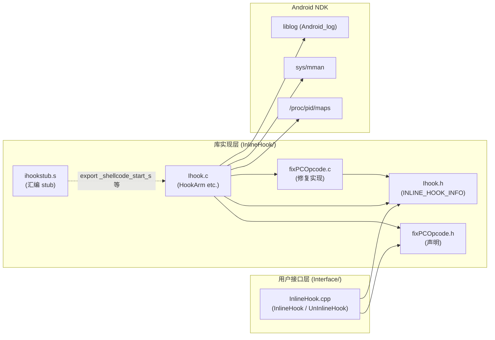

# 02 · 目录树

```
Android_Inline_Hook_ARM64/
├── README.md                            # 简介 + 4 篇中文文章链接
├── arm64hook.png                        # ARM64 设计图（PNG）
├── arm64hook4.png                       # ARM64 设计图 v4
├── arm64hook.pdf                        # 设计图 PDF 版
├── arm64hook.vsdx                       # Visio 源文件
├── arm64hook.xlsx                       # Excel 版（疑似寄存器表）
├── stack.png / stack.pdf / stack.vsdx / stack.xlsx
│                                        # 栈帧设计图
├── STACK1.png / STACK1.pdf              # 栈帧图 v1
├── STACK2.png / STACK2.pdf              # 栈帧图 v2
├── .vscode/                             # VSCode 配置（被忽略）
├── libs/                                # 编译产物 .so
│   └── arm64-v8a/                       # (空 / 由 NDK 写入)
├── obj/                                 # NDK 中间产物
│   └── local/
└── jni/                                 # ★ 源码根
    ├── Android.mk                       # 顶层 build, 仅 include 子目录
    ├── Application.mk                   # APP_ABI := arm64-v8a, gnustl_static
    ├── InlineHook/                      # ★ 库实现层（生成 libIHook.a）
    │   ├── Android.mk                   # LOCAL_MODULE := IHook (STATIC_LIBRARY)
    │   ├── Ihook.h                      # 71 行: 宏 + INLINE_HOOK_INFO + 函数声明
    │   ├── Ihook.c                      # 435 行: 编排 (ChangePageProperty/HookArm 等)
    │   ├── fixPCOpcode.h                # 21 行: 修复函数声明
    │   ├── fixPCOpcode.c                # 594 行: 修复实现
    │   └── ihookstub.s                  # 82 行: 汇编 stub 模板
    └── Interface/                       # ★ 用户接口层（生成 libInlineHook.so）
        ├── Android.mk                   # LOCAL_MODULE := InlineHook (SHARED_LIBRARY)
        └── InlineHook.cpp               # 135 行: InlineHook / UnInlineHook / 示例回调
```

## 2.1 构建产物结构

```
jni/InlineHook/Android.mk    →  libIHook.a      (静态库, 给 Interface 用)
jni/Interface/Android.mk     →  libInlineHook.so (动态库, 注入到目标进程)
```

`libs/arm64-v8a/libInlineHook.so` 是最终交付物。

## 2.2 文件依赖图



## 2.3 文件大小统计

| 文件 | 行数 | 字节 |
|------|------|------|
| `InlineHook/Ihook.h` | 71 | 2101 |
| `InlineHook/Ihook.c` | 435 | 12590 |
| `InlineHook/fixPCOpcode.h` | 21 | 567 |
| `InlineHook/fixPCOpcode.c` | 594 | 16244 |
| `InlineHook/ihookstub.s` | 82 | 1748 |
| `Interface/InlineHook.cpp` | 135 | 3428 |
| 合计 | 1338 | 36678 |

## 2.4 各文件职责一句话

| 文件 | 职责 |
|------|------|
| `Ihook.h` | 定义 `INLINE_HOOK_INFO` 结构、宏（`OPCODEMAXLEN`、`BACKUP_CODE_NUM_MAX`、`PAGE_START`）、函数声明 |
| `Ihook.c` | 4 步编排：备份 → 构 stub → 构旧函数入口 → 改写 hook 点。`HookArm` 是顶层入口 |
| `fixPCOpcode.h` | 修复函数声明 |
| `fixPCOpcode.c` | 指令分类（`getTypeInArm64`）、修复长度计算（`lengthFixArm64`）、按类型修复（`fixPCOpcodeArm64`） |
| `ihookstub.s` | 汇编 stub 模板，含 4 个全局符号 `_shellcode_start_s`、`_shellcode_end_s`、`_hookstub_function_addr_s`、`_old_function_addr_s` |
| `Interface/InlineHook.cpp` | 公开 API `InlineHook` / `UnInlineHook`、`gs_vecInlineHookInfo` 注册表、`ModifyIBored` 示例 |