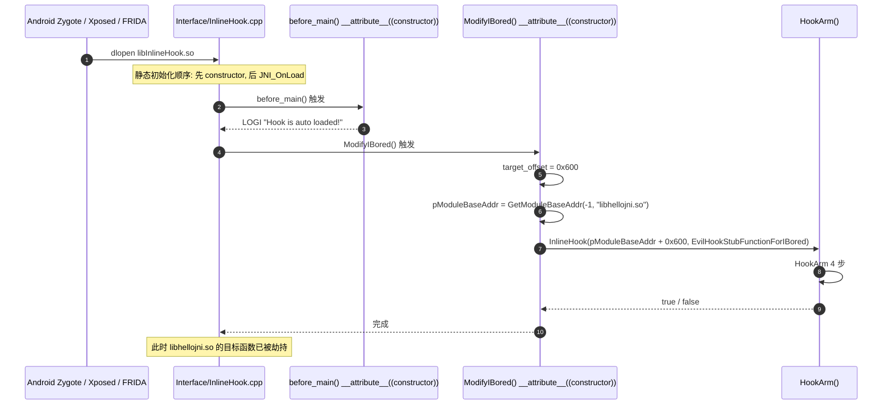
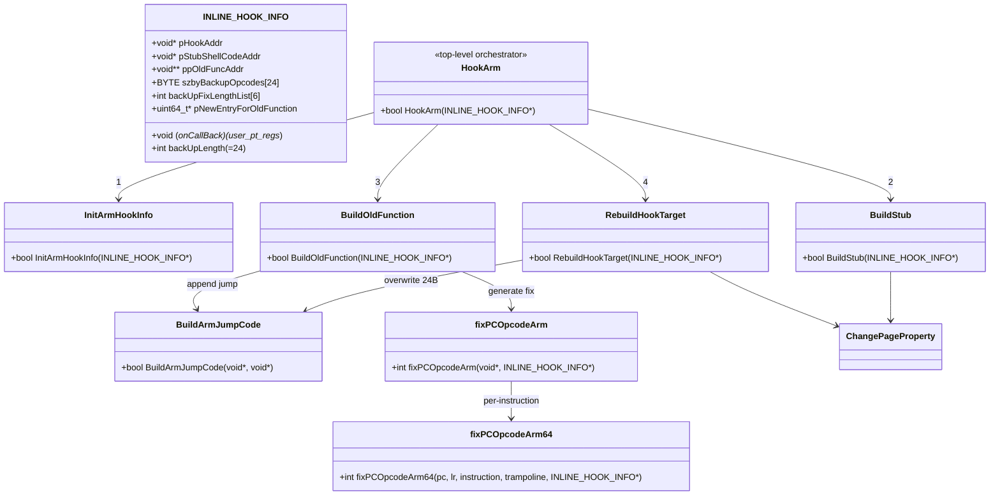
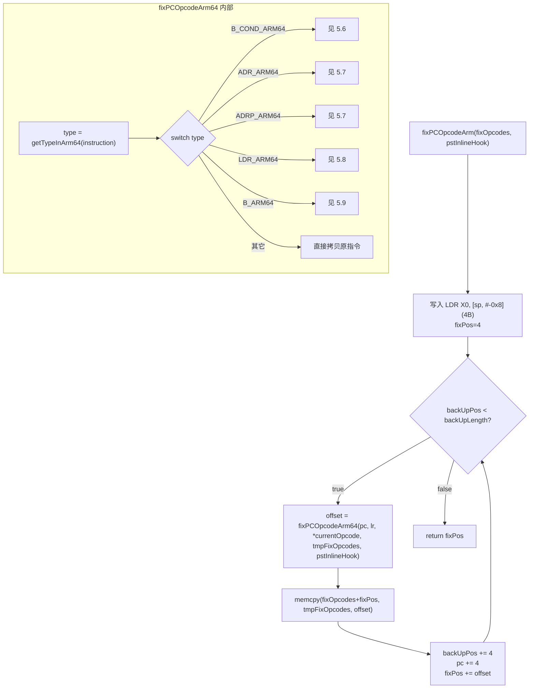

# 03 · 架构总览

## 3.1 分层

```
┌────────────────────────────────────────────────────────────────┐
│  用户层 (C++)                                                  │
│  InlineHook(pHookAddr, EvilHookStubFunctionForIBored);         │
│  UnInlineHook(pHookAddr);                                      │
│  // __attribute__((constructor)) ModifyIBored()                 │
└────────────────────────────────────────────────────────────────┘
                            │
                            ▼
┌────────────────────────────────────────────────────────────────┐
│  注册表 (Interface/InlineHook.cpp:24)                           │
│  static std::vector<INLINE_HOOK_INFO*> gs_vecInlineHookInfo;    │
└────────────────────────────────────────────────────────────────┘
                            │
                            ▼
┌────────────────────────────────────────────────────────────────┐
│  顶层编排 (InlineHook/Ihook.c:372 HookArm)                      │
│  1. InitArmHookInfo     → 备份 24 字节                         │
│  2. BuildStub           → malloc + memcpy 汇编 stub             │
│  3. BuildOldFunction    → malloc + 修复 + 跳转                 │
│  4. RebuildHookTarget   → 写 24 字节长跳转                      │
└────────────────────────────────────────────────────────────────┘
                            │
        ┌───────────────────┼───────────────────┐
        ▼                   ▼                   ▼
┌────────────────┐  ┌────────────────┐  ┌────────────────┐
│ 备份           │  │ 汇编 stub      │  │ PC-relative 修复│
│ Ihook.c:108    │  │ ihookstub.s    │  │ fixPCOpcode.c  │
│ InitArmHookInfo│  │ 240 字节栈帧   │  │ getTypeInArm64 │
│ lengthFixArm64 │  │ + 调回调       │  │ fixPCOpcodeArm64│
│                │  │ + 跳回旧函数   │  │                  │
└────────────────┘  └────────────────┘  └────────────────┘
                            │
                            ▼
┌────────────────────────────────────────────────────────────────┐
│  OS 层                                                          │
│  mprotect (ChangePageProperty), malloc, mmap, /proc/pid/maps    │
└────────────────────────────────────────────────────────────────┘
```

## 3.2 内存布局（运行时）

```
目标进程内存空间:
─────────────────────────────────────────────────────
0x1000: target_function
   +0: LDR X0, [PC, #imm]    ┐
   +4: CBZ X0, ...           │ 24 字节备份区间
   +8: ADD X1, X0, #1        │ (备份到 szbyBackupOpcodes)
   +12: B somewhere          │ 
   +16: ...                  │
   +20: ...                  ┘
   +24: (hook 点写入的跳转)
       STP X1, X0, [SP, -0x10]
       LDR X0, 8             
       BR X0                 → 跳到 stub
       <8-byte addr = stub>  
       LDR X0, [SP, -0x8]
─────────────────────────────────────────────────────
malloc: stub shellcode (sShellCodeLength = 82 bytes)
   +0:  sub sp, sp, #0x20           ┐
   +4:  mrs x0, NZCV                │
   +8:  str x0, [sp, #0x10]         │ 保存 NZCV + LR
   +12: str x30, [sp]               │
   +16: add x30, sp, #0x20          │
   +20: str x30, [sp, #0x8]         │
   +24: ldr x0, [sp, #0x18]         │
   +28: sub sp, sp, #0xf0           │ 分配 240 字节栈帧
   +32: stp X0, X1, [SP]            ┐
   +36: stp X2, X3, [SP, #0x10]     │
   ...                              │ 保存全部 GPR
   +144: stp X28, X29, [SP, #0xe0]  ┘
   +148: mov x0, sp                 ; x0 = 指向栈帧 (=regs 指针)
   +152: ldr x3, 8                  ; 加载 _hookstub_function_addr_s
   +156: b 12                       ; 跳过 8-byte 槽
   +160: <8-byte onCallBack>        ; _hookstub_function_addr_s 处
   +168: blr x3                     ; 调回调 (x0=regs)
   +172: ldr x0, [sp, #0x100]       ┐
   +176: msr NZCV, x0               │ 恢复 NZCV
   +180: ldp X0, X1, [SP]           ┐
   ...                              │ 恢复 GPR
   +292: ldp X28, X29, [SP, #0xe0]  ┘
   +296: add sp, sp, #0xf0          │ 释放 240 字节栈帧
   +300: ldr x30, [sp]              ┐
   +304: add sp, sp, #0x20          │ 恢复 LR + 释放 32 字节栈帧
   +308: stp X1, X0, [SP, #-0x10]   ; 保存 X0/X1 (因为长跳转要覆盖)
   +312: ldr x0, 8                  ; 加载 _old_function_addr_s
   +316: b 12                       ; 跳过 8-byte 槽
   +320: <8-byte pNewEntryForOldFunction>  ; _old_function_addr_s 处
   +328: br x0                      ; 跳到修复后的旧函数
─────────────────────────────────────────────────────
malloc: pNewEntryForOldFunction (200 字节, mprotect RWX)
   +0:  LDR x0, [sp, #-0x8]         ; 恢复 X0 (被 hook 点写入时覆盖了)
   +4:  <修复后的 insn 0>           ┐
   +? : <修复后的 insn 1>           │ 修复后的原函数头
   ...                              │ (fixPCOpcodeArm 输出)
   +?:  LDR X17, 8                  ┐
   +?+4: BR X17                     │ 跳回原函数剩余部分
   +?+8: <8-byte addr>              ┘
─────────────────────────────────────────────────────
mmap: fixOpcodes buffer (PAGE_SIZE, PROT_RWX, MAP_ANON)
   (临时, fixPCOpcodeArm 输出到此, memcpy 到 pNewEntryForOldFunction)
─────────────────────────────────────────────────────
```

## 3.3 启动 / 自动注入时序



## 3.4 类图（INLINE_HOOK_INFO）



## 3.5 调用时控制流（被 hook 的函数被调用时）

```mermaid
sequenceDiagram
    autonumber
    participant Caller as 调用方代码
    participant Target as 原函数头 (24B 已改写)
    participant Stub as shellcode stub (malloc)
    participant User as 用户回调<br/>(EvilHookStubFunctionForIBored)
    participant Old as pNewEntryForOldFunction (malloc)

    Caller->>Target: bl target_function
    Target->>Target: STP X1, X0, [SP, -0x10]<br/>LDR X0, 8<br/>BR X0<br/>LDR X0, [SP, -0x8]
    Note over Target: 4 条指令共 24 字节<br/>(STP + LDR + BR + 8B + LDR)
    Target->>Stub: br x0 → stub
    Stub->>Stub: sub sp, #0x20 (32B)
    Stub->>Stub: mrs/str NZCV, str X30, add X30, str X30
    Stub->>Stub: sub sp, #0xf0 (240B)
    Stub->>Stub: stp X0..X29 (16×2 = 16 对 stp, 64B×15=240B)
    Stub->>Stub: mov x0, sp (x0 = 栈帧指针)
    Stub->>Stub: ldr x3, 8 (加载回调地址)
    Stub->>Stub: b 12 (跳过 8B 槽)
    Stub->>User: blr x3 (调回调, x0=regs)
    User->>User: 修改 regs (如 regs->regs[9]=0x333)
    User-->>Stub: 返回
    Stub->>Stub: msr NZCV, x0; ldp X0..X29
    Stub->>Stub: add sp, #0xf0; ldr X30; add sp, #0x20
    Stub->>Stub: stp X1, X0 (保存 X0/X1)
    Stub->>Stub: ldr x0, 8 (加载旧函数入口)
    Stub->>Stub: b 12 (跳过 8B 槽)
    Stub->>Old: br x0
    Old->>Old: LDR X0, [sp, -0x8] (恢复被覆盖的 X0)
    Old->>Old: <修复后的 insn 0..5>
    Old->>Old: LDR X17, 8; BR X17; <addr of insn[6]>
    Old->>Caller: 返回 (经过原函数剩余部分)
```

## 3.6 修复调度流程图



> 详见 [05_operation_chains.md](05_operation_chains.md)。