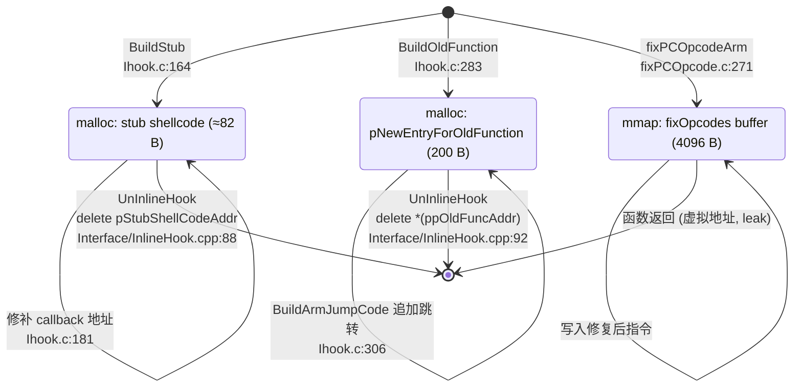
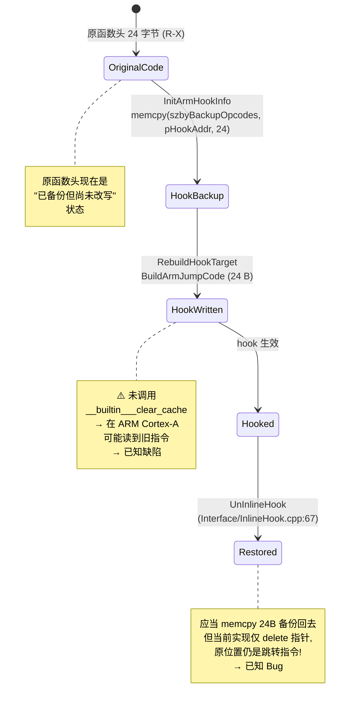
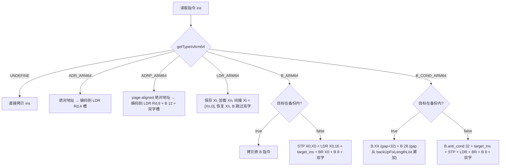

# 04 · 数据流与生命周期

## 4.1 `INLINE_HOOK_INFO` 结构

定义于 `jni/InlineHook/Ihook.h:43-52`：

```c
typedef struct tagINLINEHOOKINFO {
    void *pHookAddr;                                       // hook 目标地址
    void *pStubShellCodeAddr;                              // 分配的 stub 地址
    void (*onCallBack)(struct user_pt_regs *);             // 回调
    void **ppOldFuncAddr;                                  // stub 中旧函数地址指针
    BYTE szbyBackupOpcodes[OPCODEMAXLEN];                  // 原指令备份 (24 字节)
    int backUpLength;                                      // 备份长度 (固定 24)
    int backUpFixLengthList[BACKUP_CODE_NUM_MAX];          // 每条修复后长度 (6 条)
    uint64_t *pNewEntryForOldFunction;                     // 重建的旧函数入口
} INLINE_HOOK_INFO;
```

### 字段生命周期

| 字段 | 何时被设置 | 何时被读取 |
|------|-----------|-----------|
| `pHookAddr` | `InlineHook` (`Interface/InlineHook.cpp:47`) | `InitArmHookInfo` (`:111`), `BuildOldFunction` (`:306`), `RebuildHookTarget` (`:345`, `:352`) |
| `onCallBack` | `InlineHook` (`:48`) | `BuildStub` (`:181`) |
| `szbyBackupOpcodes` | `InitArmHookInfo` (`memcpy` 24B, `Ihook.c:127`) | `fixPCOpcodeArm` (`fixPCOpcode.c:310`) |
| `backUpLength` | `InitArmHookInfo` (`= 24`, `Ihook.c:125`) | `fixPCOpcodeArm` (`:314`, `:378`), `BuildOldFunction` (`:306`) |
| `backUpFixLengthList` | `InitArmHookInfo` (`lengthFixArm64` 6 次, `Ihook.c:113-115, 129-135`) | `fixPCOpcodeArm64` 的 `B_COND_ARM64` 路径 (`:441-443`) |
| `pStubShellCodeAddr` | `BuildStub` (`:189`) | `RebuildHookTarget` (`:352`) |
| `ppOldFuncAddr` | `BuildStub` (`:186`) | `BuildOldFunction` (`:313`) |
| `pNewEntryForOldFunction` | `BuildOldFunction` (`malloc` + `mprotect`, `:283, 291`) | `UnInlineHook` (`Interface/InlineHook.cpp:92`) |

## 4.2 内存块生命周期



> **已知问题**：`mmap` 出来的 `fixOpcodes` 缓冲区（`fixPCOpcodeArm` 第 271 行）**永不释放**——它在函数返回后失去引用。这是库的内存泄漏点。

## 4.3 hook 点生命周期



> **重要 Bug**：`UnInlineHook` 当前实现只释放 `pStubShellCodeAddr` 和 `pNewEntryForOldFunction`，**没有把 `szbyBackupOpcodes` 写回 hook 点**。所以 unhook 后 hook 点仍然指向已释放的 stub 内存，会导致崩溃。

## 4.4 数据流总图

```mermaid
flowchart LR
    subgraph Hook["hook_addr (pHookAddr)"]
        H0["insn[0]"]
        H1["insn[1]"]
        H2["insn[2]"]
        H3["insn[3]"]
        H4["insn[4]"]
        H5["insn[5]"]
    end

    subgraph Step1["Step 1: InitArmHookInfo"]
        Backup["memcpy(szbyBackupOpcodes,<br/>hook_addr, 24)"]
        FixLenList["backUpFixLengthList[i] =<br/>lengthFixArm64(insn[i])"]
    end

    subgraph Step2["Step 2: BuildStub"]
        StubMalloc["malloc(sShellCodeLength)"]
        StubMemcpy["memcpy from ihookstub.s"]
        StubMprotect["ChangePageProperty RWX"]
        StubPatch["*ppHookStubFunctionAddr = onCallBack"]
    end

    subgraph Step3["Step 3: BuildOldFunction"]
        OldMalloc["malloc(200)"]
        OldMprotect["ChangePageProperty RWX"]
        FixArm["fixPCOpcodeArm → fixPCOpcodeArm64"]
        OldMemcpy["memcpy(pNewEntryForOldFunction,<br/>fixOpcodes, fixLength)"]
        OldJump["BuildArmJumpCode(<br/>pNewEntryForOldFunction + fixLength,<br/>hook_addr + 24 - 4)"]
        OldPtrPatch["*ppOldFuncAddr = pNewEntryForOldFunction"]
    end

    subgraph Step4["Step 4: RebuildHookTarget"]
        HookMprotect["ChangePageProperty(pHookAddr, 24, RWX)"]
        HookWrite["BuildArmJumpCode(pHookAddr, pStubShellCodeAddr)"]
    end

    Hook --> Backup
    Hook --> FixLenList
    Backup --> Step2
    FixLenList --> Step3
    Step2 --> Step3
    Step3 --> Step4
```



## 4.5 修复后 trampoline 模式（每类指令）

| 指令类型 | trampoline 序列 | 字节数 |
|---------|---------------|-------|
| `B_COND_ARM64` (备份内) | `B.XX (gap+32) + B 28` | 8 |
| `B_COND_ARM64` (备份外) | `B.anti_cond 32 + target_ins + STP X0,X0 + LDR X0,12 + BR X0 + B 8 + hi + lo` | 32 |
| `ADR_ARM64` | `LDR Rd,4 + hi + lo` | 12 |
| `ADRP_ARM64` | `LDR Rd,8 + B 12 + lo + hi` | 16 |
| `LDR_ARM64` | `STP Xt,Xn + LDR Xn,16 + LDR Xt,[Xn,0] + LDR Xn,[sp,-8] + B 8 + hi + lo` | 32 |
| `B_ARM64` | `STP X0,X0 + LDR X0,16 + target_ins + BR X0 + B 8 + hi + lo` | 28 |
| 其他 | 原样拷贝 | 4 |

## 4.6 修复决策表（每条指令）



## 4.7 已知数据流问题

| 问题 | 位置 | 影响 |
|------|------|------|
| `mmap` 缓冲区永不释放 | `fixPCOpcodeArm` `fixPCOpcode.c:271` | 每次 hook 泄漏 4 KiB |
| 未调用 `__builtin___clear_cache` | `BuildArmJumpCode` (`Ihook.c:207`) | 部分 ARM CPU 上 hook 不立即生效 |
| `UnInlineHook` 不恢复原指令 | `Interface/InlineHook.cpp:67-100` | unhook 后原位置仍是跳转，函数被破坏 |
| `change page property` 仅一页 | `ChangePageProperty` (`Ihook.c:12-42`) | 跨页 hook 范围处理不全 |
| 备份长度硬编码 24 | `InitArmHookInfo` `Ihook.c:125` | 真实 hook 区间可能跨越更多指令 |
| `lengthFixArm32` 调用存在但未用 | `InitArmHookInfo` `Ihook.c:132` | 死代码 |
| `fixBcond` 空实现 | `fixPCOpcode.c:397-400` | 死代码 |