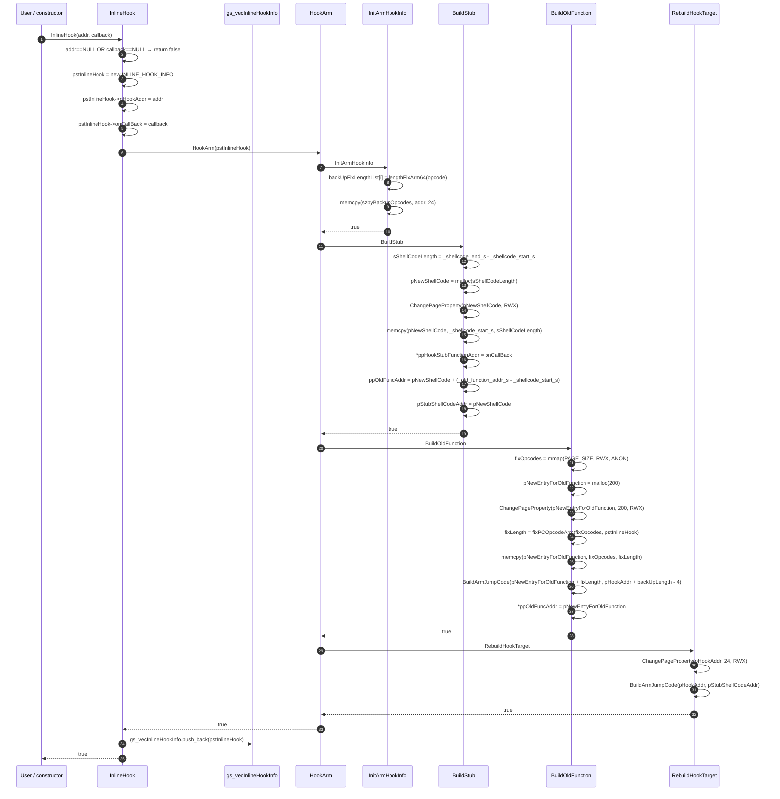
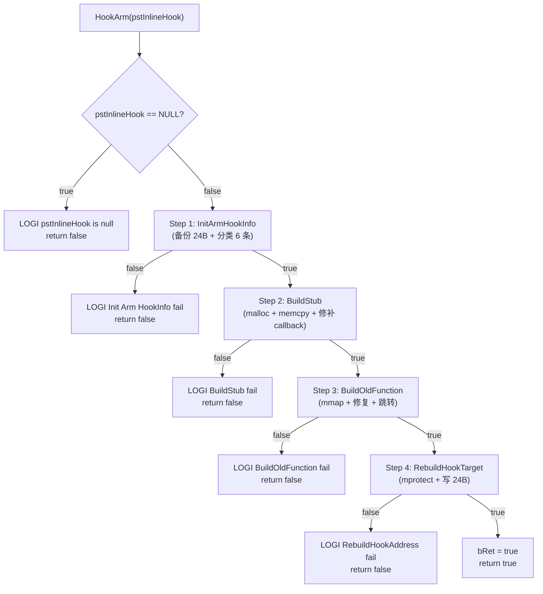
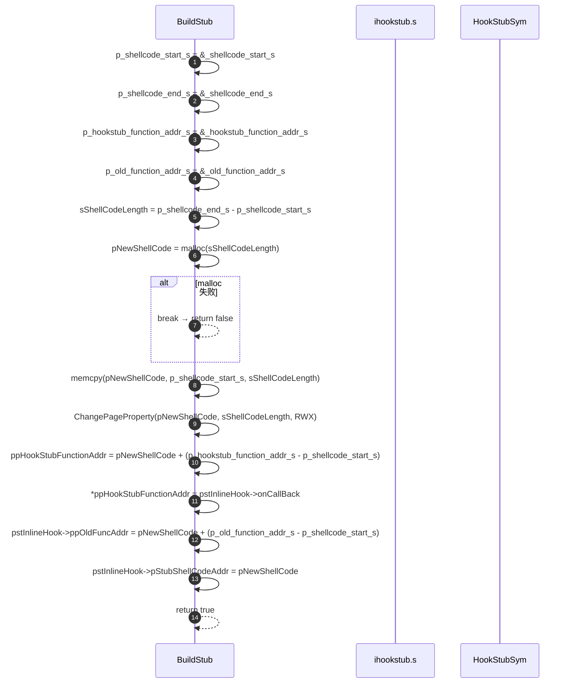
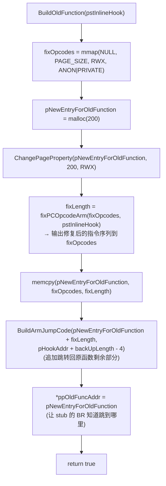
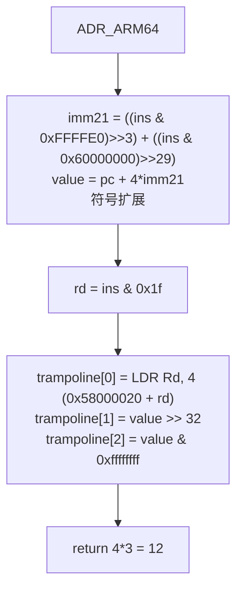
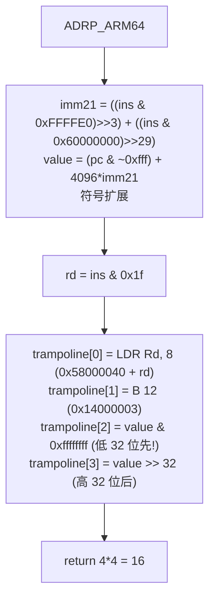
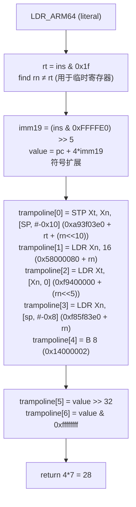
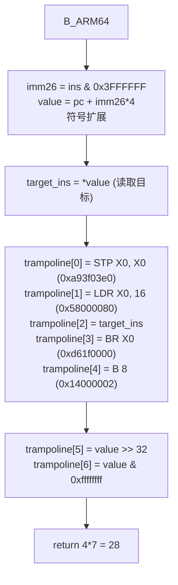
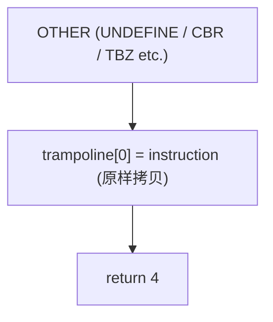

# 05 · 主要操作链（每条配 mermaid）

---

## 5.1 公开 API `InlineHook` 主流程

**入口**：`Interface/InlineHook.cpp:36` `InlineHook(pHookAddr, onCallBack)`



---

## 5.2 `HookArm` 4 步编排

**入口**：`jni/InlineHook/Ihook.c:372` `HookArm(pstInlineHook)`



---

## 5.3 `BuildStub` shellcode 复制 + callback 修补

**入口**：`jni/InlineHook/Ihook.c:145` `BuildStub(pstInlineHook)`



> **关键点**：`_shellcode_start_s` / `_shellcode_end_s` / `_hookstub_function_addr_s` / `_old_function_addr_s` 是汇编文件里的全局符号（`.global`）。链接器保证它们的相对偏移在 stub 内是稳定的，所以 `pNewShellCode + offset` 就是对应槽位的位置。

---

## 5.4 `BuildOldFunction` mmap + 修复 + 跳转回原函数

**入口**：`jni/InlineHook/Ihook.c:263` `BuildOldFunction(pstInlineHook)`



---

## 5.5 `RebuildHookTarget` 写入 24 字节长跳转

**入口**：`jni/InlineHook/Ihook.c:331` `RebuildHookTarget(pstInlineHook)`

```mermaid
sequenceDiagram
    autonumber
    participant R as RebuildHookTarget
    participant MP as mprotect
    participant B as BuildArmJumpCode

    R->>R: ChangePageProperty(pHookAddr, 24, RWX)
    Note over R: ⚠️ 仅 1 页, 跨页可能不全
    R->>B: BuildArmJumpCode(pHookAddr, pStubShellCodeAddr)
    B->>B: 构造 szLdrPCOpcodes[24]:
    Note over B:
        +0:  STP X1, X0, [SP, #-0x10]   0xa93f03e1
        +4:  LDR X0, 8                  0x58000040
        +8:  BR X0                      0xd61f0000
        +12: <8-byte pStubShellCodeAddr>
        +20: LDR X0, [SP, -0x8]         0xf85f83e0
    end note
    B->>B: memcpy(pHookAddr, szLdrPCOpcodes, 24)
    B-->>R: true
    R-->>R: return true
    Note over R: ⚠️ 未调 __builtin___clear_cache
```

> **24 字节跳转布局**：
> ```
> 0xa9 0x03 0x3f 0xe1   STP X1, X0, [SP, #-0x10]   ; 保存 X0/X1 (hook 用)
> 0x40 0x00 0x00 0x58   LDR X0, 8                   ; 加载 stub 地址
> 0x00 0x00 0x1f 0xd6   BR X0                       ; 跳到 stub
> <8 bytes>             pStubShellCodeAddr          ; stub 地址
> 0xe0 0x83 0x5f 0xf8   LDR X0, [SP, -0x8]          ; 恢复 X0
> ```

---

## 5.6 `fixPCOpcodeArm64` 各类指令修复

**入口**：`jni/InlineHook/fixPCOpcode.c:402` `fixPCOpcodeArm64(pc, lr, ins, trampoline, pstInlineHook)`

### 5.6.1 `B_COND_ARM64` 路径

```mermaid
flowchart TD
    A["B_COND_ARM64"] --> B["imm19 = (ins & 0xFFFFE0) >> 5<br/>value = pc + imm19*4<br/>符号扩展"]
    B --> C{value ∈ 备份区间?}
    C -->|true (backup-to-backup)| D["target_idx = (value - hook_addr) / 4<br/>bc_ins_idx = (pc - hook_addr) / 4<br/>gap = Σ backUpFixLengthList[idx] for idx ∈ [bc_ins_idx+1, target_idx)"]
    D --> E["trampoline[0] = B.XX (gap+32) (编码 ins & 0xff00000f + ((gap+32)<<3))<br/>trampoline[1] = B 28 (0x14000007)"]
    E --> Z["return 4*trampoline_pos"]

    C -->|false (backup-to-outside)| F["trampoline[0] = B.anti_cond 32 (ins & 0xff00000f + (32<<3)) ^ 1<br/>trampoline[1] = *value (目标指令, 可能需再次修复)<br/>trampoline[2] = STP X0, X0 (0xa93f03e0)<br/>trampoline[3] = LDR X0, 12 (0x58000080)<br/>trampoline[4] = BR X0 (0xd61f0000)<br/>trampoline[5] = B 8 (0x14000002)<br/>trampoline[6] = value >> 32<br/>trampoline[7] = value & 0xffffffff"]
    F --> Z
```

### 5.6.2 `ADR_ARM64` 路径



### 5.6.3 `ADRP_ARM64` 路径



> **注意**：ADRP 的修复顺序是"低 32 位先，高 32 位后"，与 ADR 相反。这是因为 ADR 的 LDR 是小端加载，需要先放高位才符合"地址高位的偏移模式"——但实际上 LDR 一次加载 8 字节，小端布局应是低位在前。**作者此处可能有 bug**。

### 5.6.4 `LDR_ARM64` 路径



### 5.6.5 `B_ARM64` 路径



### 5.6.6 其它（默认）



> **注意**：CBZ/CBNZ/TBZ/TBNZ 被 `getTypeInArm64` 识别但在 `fixPCOpcodeArm64` 中**没有 case 分支**，会落到 OTHER 分支，原样拷贝。这是已知功能缺失。

---

## 5.7 汇编 stub 寄存器保存与恢复

**入口**：`jni/InlineHook/ihookstub.s:8-80` `_shellcode_start_s` 到 `_shellcode_end_s`

```mermaid
sequenceDiagram
    autonumber
    participant C as Caller (被 hook 的原函数)
    participant H as hook_addr (24B 跳转)
    participant S as Stub (≈82B)
    participant U as User Callback
    participant O as pNewEntryForOldFunction

    C->>H: bl target
    H->>S: STP/LDR/BR (24B 跳转)
    S->>S: sub sp, sp, #0x20 (32B 栈帧)
    S->>S: mrs x0, NZCV<br/>str x0, [sp, #0x10]   ; 保存 NZCV
    S->>S: str x30, [sp]                    ; 保存 LR 到 sp[0]
    S->>S: add x30, sp, #0x20               ; x30 = 父 sp
    S->>S: str x30, [sp, #0x8]              ; 备份 sp 到 sp[8]
    S->>S: ldr x0, [sp, #0x18]              ; x0 = 父 sp (= caller 视角的 sp)
    S->>S: sub sp, sp, #0xf0 (240B 栈帧)
    Note over S: stp X0,X1; stp X2,X3; ... stp X28,X29<br/>共 15 对 = 240B<br/>保存全部 GPR
    S->>S: mov x0, sp                       ; x0 = 指向 GPR 栈帧
    S->>S: ldr x3, 8                        ; 加载 _hookstub_function_addr_s 处的 8B
    S->>S: b 12                             ; 跳过 8B 槽
    S->>U: blr x3 (调回调, x0 = regs 指针)
    U->>U: 修改 regs (如 regs->regs[9]=0x333)
    U-->>S: 返回
    S->>S: ldr x0, [sp, #0x100]             ; 加载 NZCV
    S->>S: msr NZCV, x0                     ; 恢复 NZCV
    Note over S: ldp X0,X1; ldp X2,X3; ... ldp X28,X29<br/>恢复全部 GPR
    S->>S: add sp, sp, #0xf0                ; 释放 240B 栈帧
    S->>S: ldr x30, [sp]                    ; 恢复 LR (caller 的返回地址)
    S->>S: add sp, sp, #0x20                ; 释放 32B 栈帧
    S->>S: stp X1, X0, [SP, #-0x10]         ; 保存 X0/X1 (因为下一条会改 X0)
    S->>S: ldr x0, 8                        ; 加载 _old_function_addr_s 处的 8B
    S->>S: b 12                             ; 跳过 8B 槽
    S->>O: br x0 (跳到 pNewEntryForOldFunction)
```

> **栈帧结构**（自顶向下）：
> ```
> [sp]              = saved LR (x30)
> [sp + 0x8]        = saved parent sp
> [sp + 0x10]       = saved NZCV
> [sp + 0x18]       = parent sp (caller 视角, 加载到 x0 给回调)
> [sp + 0x20 .. 0x110] = 15 对 stp, 共 240B, 保存 X0..X29
> ```
> 总栈使用：32B (LR+NZCV+sp 备份) + 240B (GPR) = 272B

---

## 5.8 完整调用链（被 hook 函数被调用时）

```mermaid
sequenceDiagram
    autonumber
    participant Caller as Caller
    participant Target as target_function
    participant Stub as stub shellcode
    participant CB as onCallBack (用户)
    participant OldEntry as pNewEntryForOldFunction
    participant Rest as 原函数剩余部分

    Caller->>Target: bl target_function
    Target->>Stub: 24B 跳转 (STP+LDR+BR+addr+LDR)
    Stub->>Stub: 保存 NZCV, LR, sp
    Stub->>Stub: 保存 X0..X29 (240B)
    Stub->>CB: x0 = sp (regs 指针), blr onCallBack
    CB->>CB: 读/写 regs->regs[N]
    CB-->>Stub: return
    Stub->>Stub: 恢复 X0..X29, NZCV, LR, sp
    Stub->>OldEntry: br x0 (跳到 pNewEntryForOldFunction)
    OldEntry->>OldEntry: LDR X0, [sp, -0x8] (恢复被 hook 跳转覆盖的 X0)
    OldEntry->>OldEntry: <修复后的 insn 0..5>
    OldEntry->>Rest: 末尾 LDR X17, 8; BR X17; <addr of insn[6]>
    Rest->>Rest: 原函数剩余逻辑
    Rest-->>Caller: 返回
```