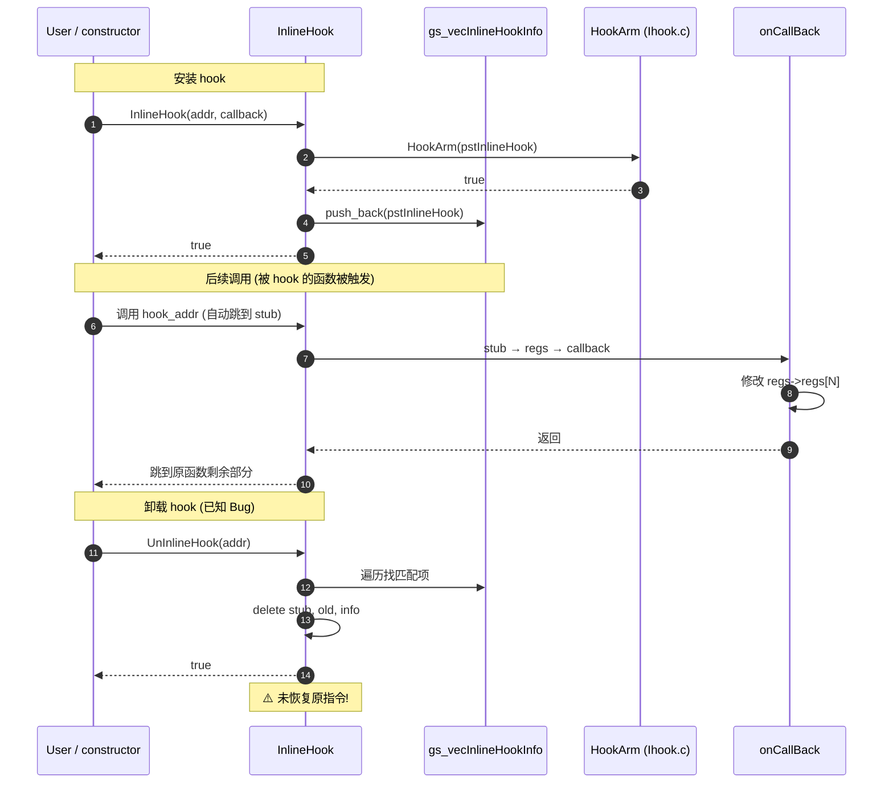

# 08 · 函数详细说明（用户接口层 - Interface/InlineHook.cpp）

> 本文件覆盖 `jni/Interface/InlineHook.cpp` 全部 5 个函数 + 1 个全局变量。

---

## 全局变量

### `gs_vecInlineHookInfo`
- **类型**: `static std::vector<INLINE_HOOK_INFO*>`
- **位置**: `Interface/InlineHook.cpp:24`
- **可见性**: `static`（文件作用域）
- **作用**: hook 注册表，记录所有已安装 hook
- **生命周期**: 程序启动到退出
- **元素类型**: `INLINE_HOOK_INFO*`（**裸指针**，由 `new` 分配，未使用智能指针）

---

## `before_main`
- **签名**: `void before_main()`
- **位置**: `Interface/InlineHook.cpp:26-28`
- **可见性**: `extern "C"` 默认（C++ 默认有 extern "C++"，但全局非 static 函数均为外部链接）
- **属性**: `__attribute__((constructor))`
- **副作用**: 输出 `LOGI("Hook is auto loaded!\n")`
- **调用**: 静态初始化时由 .so 加载器在 main 前调用
- **调用了**: `LOGI` 宏
- **简要说明**: 占位构造函数，提示库已加载。无实际逻辑。

---

## `InlineHook`
- **签名**: `bool InlineHook(void *pHookAddr, void (*onCallBack)(struct user_pt_regs *))`
- **位置**: `Interface/InlineHook.cpp:36-60`
- **可见性**: extern（无 static）
- **参数**:
  - `pHookAddr`: hook 目标地址
  - `onCallBack`: 回调函数（`void (*)(struct user_pt_regs *)`）
- **返回值**: `bool` —— 成功 true，失败 false（参数 NULL 或 HookArm 失败）
- **副作用**:
  - `new INLINE_HOOK_INFO` 分配结构体
  - 设置 `pHookAddr`、`onCallBack`
  - 调用 `HookArm`（4 步）
  - 失败时 `delete pstInlineHook`
  - 成功时 `gs_vecInlineHookInfo.push_back(pstInlineHook)`
- **调用**: 用户调用 / `ModifyIBored` (`:134`)
- **调用了**: `HookArm` (`:50`), `LOGI` (多处), `delete` (`:53`), `push_back` (`:58`)
- **简要说明**: 公开 API。包装 `HookArm` + 注册表维护。

---

## `UnInlineHook`
- **签名**: `bool UnInlineHook(void *pHookAddr)`
- **位置**: `Interface/InlineHook.cpp:67-100`
- **可见性**: extern
- **参数**: `pHookAddr`
- **返回值**: `bool` —— 找到并删除 true，否则 false
- **副作用**:
  - 遍历 `gs_vecInlineHookInfo`
  - 找到匹配时：`gs_vecInlineHookInfo.erase(itr)`
  - `delete pTargetInlineHookInfo->pStubShellCodeAddr`（释放 stub）
  - `delete *(pTargetInlineHookInfo->ppOldFuncAddr)`（释放 pNewEntryForOldFunction）
  - `delete pTargetInlineHookInfo`（释放 INLINE_HOOK_INFO）
- **调用**: 用户调用
- **调用了**: `gs_vecInlineHookInfo.begin/end/erase` (`:76-85`), `delete` (`:88`, `:92`, `:94`)
- **简要说明**: 公开 API。按地址查找 hook 并清理。**已知 Bug**：未恢复原指令，hook 点仍指向已释放的 stub 内存！

---

## `EvilHookStubFunctionForIBored`
- **签名**: `void EvilHookStubFunctionForIBored(user_pt_regs *regs)`
- **位置**: `Interface/InlineHook.cpp:107-112`
- **可见性**: extern
- **参数**: `regs` —— 由 stub 传入的寄存器快照指针
- **返回值**: `void`
- **副作用**:
  - 输出日志
  - 修改 `regs->regs[9]`（X9 寄存器）为 0x333
- **调用**: 通过 `InlineHook` 安装到 hook 点的回调
- **调用了**: `LOGI` (`:109`)
- **简要说明**: 示例回调。用户可仿写此函数做实际 hook 工作。

> **注意**：行 110 `regs->uregs[2] = 0x333` 是注释掉的 ARM32 版本；行 111 `regs->regs[9]=0x333` 是 ARM64 版本（修改 X9）。

---

## `ModifyIBored`
- **签名**: `void ModifyIBored()`
- **位置**: `Interface/InlineHook.cpp:117-135`
- **可见性**: extern
- **属性**: `__attribute__((constructor))`
- **副作用**:
  - `LOGI("In IHook's ModifyIBored.")`
  - 调用 `GetModuleBaseAddr(-1, "libhellojni.so")` 获取目标模块基址
  - 调用 `InlineHook(pModuleBaseAddr + 0x600, EvilHookStubFunctionForIBored)` 安装 hook
- **调用**: 静态初始化时由 .so 加载器在 main 前调用
- **调用了**: `LOGI` (`:119`), `GetModuleBaseAddr` (`:123`), `InlineHook` (`:134`)
- **简要说明**: 示例 hook 设置函数。用户应修改 `target_offset`、`pszModuleName`、`EvilHookStubFunctionForIBored` 实现自定义 hook。

### 默认值

| 变量 | 默认值 | 含义 |
|------|--------|------|
| `target_offset` | `0x600` | hook 目标在 `libhellojni.so` 中的偏移 |
| `pszModuleName` | `"libhellojni.so"` | 目标模块名 |

---

## 公开 API 用法流程图

