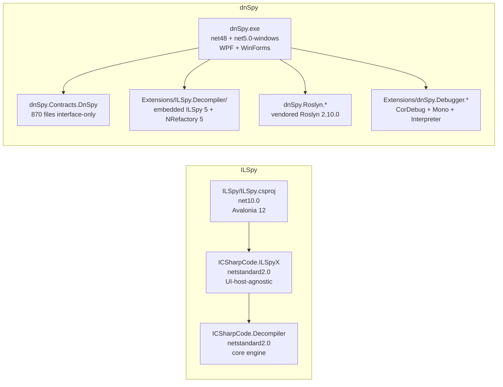
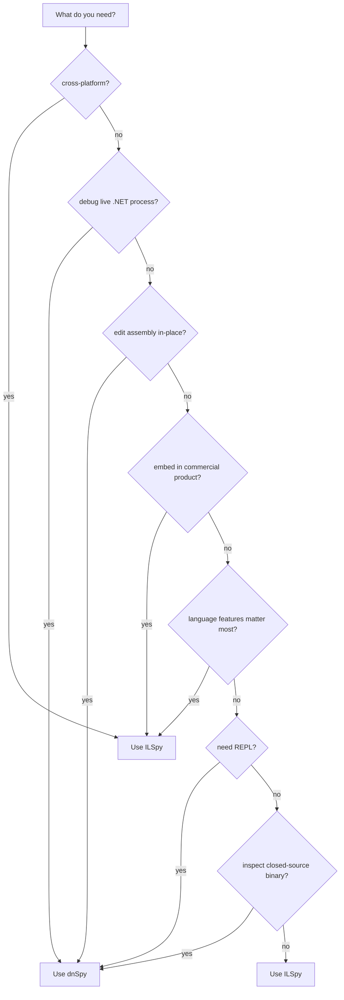

# ILSpy vs dnSpy — Side-by-Side Comparison

> ILSpy source root: `/home/leo/文档/android-crack/tools/source-projects/ILSpy/`
> dnSpy source root: `/home/leo/文档/android-crack/tools/source-projects/dnSpy/`

Both projects target the same fundamental problem: turn ECMA-335 CIL bytes back into readable C# (and friends). They share DNA (ILSpy 5 is embedded inside dnSpy as its decompiler engine) but diverge sharply on what they do beyond decompilation.

## 1. Background and lineage

**ILSpy** is the spiritual successor to the original .NET Reflector by Lutz Roeder, reimplemented as a cross-platform FOSS tool. It is maintained by the ICSharpCode team (notably Siegfried Pammer, Daniel Grunwald, and contributors), hosted at github.com/icsharpcode/ILSpy. The project has been continuously developed since 2011 and is currently on the 8.x series, with active monthly commits. License: **MIT (X11)** — permissive, allowing commercial re-use.

**dnSpy** is a debugger + decompiler + editor, started by 0xd4d around 2014, hosted at github.com/dnSpy/dnSpy. It grew out of the need for a free .NET debugger that could also patch binaries at runtime, a capability that no other FOSS tool offered. After the original maintainer stepped back in 2020, community maintainers kept it on .NET Framework + .NET 5 for several years; modernization paused because the vendored Roslyn 2.10.0 + VS-MEF stack is hard to retarget. License: **GPL v3** — copyleft.

Practical impact: ILSpy can be embedded in any commercial product; dnSpy can only be embedded in GPL-compatible projects. ILSpy is more friendly to library-style consumption; dnSpy is more friendly to "I want a tool that does everything."

## 2. GUI framework

ILSpy uses **Avalonia 12**, a cross-platform XAML UI framework modeled after WPF. Avalonia is open-source (MIT) and runs natively on Windows, Linux, macOS. The ILSpy GUI therefore runs unchanged on all three OSes — the only Linux-specific build path is `ILSpy.XPlat.slnf`. The text editor is `AvaloniaEdit`; the dock layout is `wieslawsoltes/Dock`. Theme: Simple (custom). Notable library: `Avalonia.ExtendedToolkit`.

dnSpy uses **WPF + WinForms interop**, which is Windows-only. The text editor is **AvalonEdit** reimplemented over `Microsoft.VisualStudio.Text.*` (vendored in `dnSpy/dnSpy/Text/`); the dock layout is custom (`MainWindowControl.cs`, 638 LoC). Themes: blue / dark / light / dark-high-contrast (`.dntheme` binary XAML files). The WPF stack is a deep moat: it lets dnSpy integrate with Windows-specific UI affordances (NotifyIcon, Win32 dialogs via `Ookii.Dialogs.Wpf`, COM refs like `IWshRuntimeLibrary`) but it is also the reason dnSpy cannot target non-Windows.

Practical impact: ILSpy is the right choice for cross-platform tooling; dnSpy is the right choice when Windows-only is fine and you want deeper OS integration.

## 3. Core decompiler

ILSpy's decompiler is `ICSharpCode.Decompiler` — a `netstandard2.0` library shipped as a NuGet package (`ICSharpCode.Decompiler`). The same library powers ILSpy itself, the `ilspycmd` CLI, the ILSpy VS 2022 extension, the PowerShell cmdlets, and third-party consumers (decompilation services, build tools, reverse-engineering products). The decompiler is **the** public surface of the project; the GUI is one consumer among many. Total LoC: ~85K (engine) + ~14K (Avalonia GUI) + ~3.5K (ILSpyX) + ~1.2K (CLI) ≈ **105K**.

dnSpy's decompiler is **embedded ILSpy 5 + NRefactory 5**, vendored under `Extensions/ILSpy.Decompiler/ICSharpCode.Decompiler/` and `NRefactory/` (pre-8 versions). It is wrapped by `dnSpy.Decompiler.ILSpy.Core.CSharp.CSharpDecompiler` (525 LoC) and exposed through dnSpy's own `IDecompiler` contract (defined in `dnSpy.Contracts.Logic/Decompiler/IDecompiler.cs`). dnSpy also bundles a **dnlib-driven** model layer that allows write-back: the user can edit a method and dnSpy recompiles via Roslyn and saves back to the PE via dnlib. This is a feature ILSpy does not have. Total LoC: ~70K (main WPF) + ~80K (contracts) + ~15K (debugger contracts) + ~25K (CorDebug) + ~72K (AsmEditor) + ~50K (vendored ILSpy 5) ≈ **~312K**, of which ~150K is "real" code and the rest is vendored / generated.

Practical impact: ILSpy is the right choice if you want to embed a decompiler in your own product. dnSpy's decompiler is not separately consumable.

## 4. Decompilation strategy

ILSpy uses a **two-stage pipeline** with a dedicated intermediate representation called ILAst:

1. `ILReader` turns CIL bytes into an `ILFunction` (`BlockContainer` of `Block`s + `ILInstruction`s) with stack-type inference via `UnionFind<ILVariable>`.
2. A **30-step pipeline** of `IILTransform`s de-sugars the ILAst: `ControlFlowSimplification` -> `ILInlining` -> `AsyncAwaitDecompiler` -> `YieldReturnDecompiler` -> `PatternMatchingTransform` -> ... -> `AssignVariableNames`. The order is documented inline at `CSharpDecompiler.cs:88` (`GetILTransforms()`) and is critical.
3. `StatementBuilder` + `ExpressionBuilder` + `CallBuilder` translate the de-sugared ILAst into an NRefactory `SyntaxTree`.
4. A **16-step pipeline** of `IAstTransform`s does AST cleanup (introduce operators as syntax sugar, declare variables, fix name collisions, ...).
5. `CSharpOutputVisitor` (3164 LoC) walks the `SyntaxTree` and emits C# tokens via `TextWriterTokenWriter`, wrapped by `InsertParenthesesVisitor` + `InsertMissingTokensDecorator` + `InsertRequiredSpacesDecorator`.

dnSpy uses the embedded ILSpy 5 / NRefactory 5, which has its **own** ILAst abstraction (the `ILAst/` folder inside `dnSpy.Decompiler.ILSpy.Core`). The transform list is shorter (legacy NRefactory transforms: `AssemblyInfoTransform`, `DecompileTypeMethodsTransform`, `DecompilePartialTransform`). The output is written via the per-decompiler `IDecompilerOutput` (`dnSpy.Contracts.Logic/Decompiler/IDecompilerOutput.cs`), which carries color information so the GUI can syntax-highlight while writing — this is the key reason dnSpy output looks nice in the tab without a separate highlight pass.

Practical impact: ILSpy's pipeline is more rigorous and produces cleaner output for modern C# (records, pattern matching, async). dnSpy's output is good enough for reading and patching but lags ILSpy on language features added after ILSpy 5.

## 5. Plugin / extension system

ILSpy uses **`System.Composition` MEF** (`System.Composition.MEF`, aka "System.Composition"). Plugins are discovered as `*.Plugin.dll` files next to `ILSpy.exe`; `AppComposition.RegisterPluginResolver()` hooks `AssemblyLoadContext.Default.Resolving` and enumerates them. `AppComposition.Initialize()` builds `ContainerConfiguration().WithAssemblies(...).CreateContainer()`. Plugins export `[Export][Shared]` types consumed by the rest of the app. Built-in plugins: `ILSpy.ReadyToRun` (ReadyToRun viewer). Sample plugin: `TestPlugin/`.

dnSpy uses **TWO MEF implementations**:

1. **VS-MEF** (`Microsoft.VisualStudio.Composition`) for the core app + contracts. Faster startup (cached `CachedMefInfo` blob) and supports async discovery. Used because the 80K-LoC contract layer needs every part available from the start.
2. **Classic MEF** (`System.ComponentModel.Composition`) for extensions. Lower friction for plugin authors (no `Microsoft.VisualStudio.Composition` dependency).

Extensions are `*.x.dll` files next to `dnSpy.exe` or in the `Extensions/` directory. `App.LoadExtensionAssemblies()` enumerates them; `CanLoadExtension(file)` reads `<file>.xml` `ExtensionConfig` for OS / Framework / App version checks; `CanLoadExtension(asm)` verifies the public key + minimum reference version (5.0.0.0). The `[ExportExtension]` attribute is `[MetadataAttribute, Export(typeof(IExtension))]`.

Built-in dnSpy extensions: `dnSpy.Decompiler.ILSpy` (decompiler), `dnSpy.Debugger` + `dnSpy.Debugger.DotNet` + `dnSpy.Debugger.DotNet.CorDebug` + `dnSpy.Debugger.DotNet.Mono` + `dnSpy.Debugger.DotNet.Interpreter` + `dnSpy.Debugger.DotNet.Metadata`, `dnSpy.Scripting.Roslyn` (REPL), `dnSpy.Analyzer`, `dnSpy.AsmEditor` (largest, ~72K LoC), `dnSpy.BamlDecompiler`. Sample plugins: `Examples/Example1.Extension`, `Examples/Example2.Extension`.

Practical impact: ILSpy's plugin surface is smaller (one purpose per plugin: add a file loader, an analyzer, or a tree node kind). dnSpy's plugin surface is much larger (extension == "an independent subsystem that ships as a `*.x.dll`") but more complex.

## 6. Debugger

**ILSpy has no debugger.** It is a static analysis tool. You can decompile, browse, search, and export — but you cannot attach to a running process or step through code. PDB generation (`-genpdb`) is a static feature, not a debugging one.

**dnSpy has a full debugger**, and this is its main differentiator. The contract is `dnSpy.Contracts.Debugger` (~145 files, ~15K LoC): abstract `DbgManager`, `DbgEngine`, `DbgRuntime`, `DbgProcess`, `DbgThread`, `DbgModule`, `DbgAppDomain`, `DbgObject`, plus messages (`MessageRuntimeCreated`, `MessageModuleLoaded`, `MessageExceptionThrown`, ...). Concrete implementations:

- **CorDebug** (`Extensions/dnSpy.Debugger.DotNet.CorDebug/`): the main engine. `DbgEngineImpl.cs` is 974 LoC; the partial files (`Breakpoints`, `Evaluation`, `ModuleDef`, `Threads`) add another ~2K LoC. Adapter over `ICorDebug` / `ICorDebugManagedCallback`. Works for .NET Framework + .NET 5/6/7+ on Windows.
- **Mono soft-debugger** (`Extensions/dnSpy.Debugger.DotNet.Mono/`): for Unity / older Mono runtimes. Uses the vendored `Mono.Debugger.Soft/` protocol client.
- **IL Interpreter** (`Extensions/dnSpy.Debugger.DotNet.Interpreter/`): pure-IL virtual machine (`ILVM`, `ILVMFactory`, `ILValue`) that executes method bodies without a live runtime. Useful when no process is available.
- **Anti-anti-debug** (`Extensions/dnSpy.Debugger.DotNet.CorDebug/AntiAntiDebug/`): P/Invoke patches that bypass managed anti-debug checks (`IsDebuggerPresent`, `CheckRemoteDebuggerPresent`, `NtQueryInformationProcess`).
- **DAC** (Data Access Component) for crash-dump inspection via `Microsoft.Diagnostics.Runtime` (ClrMD).

The debugger UI surfaces 12+ tool windows: CallStack, Locals, Watch, Autos, Threads, Processes, Modules, Code Breakpoints, Module Breakpoints, Exceptions, Memory, Logger.

Practical impact: If you need to debug a running .NET process, dnSpy is the only FOSS option. ILSpy is read-only.

## 7. Scripting

**ILSpy** ships PowerShell cmdlets (`ICSharpCode.Decompiler.PowerShell/`, netstandard2.0): `Get-DecompiledCSharp`, `Export-DecompiledProject`, `Get-DecompiledEntities`, etc. Each cmdlet wraps a `CSharpDecompiler` call. The cmdlets are a thin integration layer for PowerShell users.

**dnSpy** ships a full **Roslyn REPL** (`Extensions/dnSpy.Scripting.Roslyn/`). The C# Interactive / VB Interactive window accepts arbitrary code, compiles it via `Microsoft.CodeAnalysis.Scripting.CSharpScript.RunAsync`, and maintains persistent state (globals, references, imports, lib paths) in `ReplSettings`. `ScriptGlobals` exposes dnSpy internals to user code (current assembly list, debugger). Commands: `#help`, `#reset`, `#cls`. The REPL is the killer feature for power users.

Practical impact: dnSpy's REPL is much more capable than ILSpy's PowerShell cmdlets. For ad-hoc scripting against a live set of assemblies, dnSpy wins. For batch automation, ILSpy's `ilspycmd` is the right tool.

## 8. Edit capability

**ILSpy is read-only at the decompiler level.** You can decompile, search, navigate, export a `.csproj`, generate a PDB — but you cannot modify an assembly and save it back. (There is no `AsmEditor`-equivalent extension.)

**dnSpy has a full assembly editor** (`Extensions/dnSpy.AsmEditor/`, ~400 .cs files, ~72K LoC — the largest single extension). The flow:

1. User opens a `.dll` and edits a C# method in the decompile tab.
2. `RoslynLanguageCompiler` (`dnSpy.Roslyn/Compiler/`) parses the buffer and builds a `CSharpCompilation`.
3. `Emit` produces a PE blob.
4. `AsmEditor` saves the blob back to the original `DsDocument` via dnlib. Metadata tokens are preserved where possible; token renumbering happens when structural changes are required.
5. `DocumentTreeView.DocumentService.CollectionChanged` raises `NotifyDocumentCollectionChangedEventArgs`; tree nodes refresh.

Sub-directories of AsmEditor: `Assembly/`, `Commands/`, `Compiler/`, `Converters/`, `DnlibDialogs/`, `Event/`, `Field/`, `Hex/`, `Method/`, `MethodBody/`, `Module/`, `Namespace/`, `Property/`, `Resources/`, `SaveModule/`, `Themes/`, `Types/`, `UndoRedo/`, `Utilities/`, `ViewHelpers/`.

Practical impact: AsmEditor is dnSpy's second-most-differentiated feature. It is unmatched by any other FOSS tool.

## 9. Dependency management and build

**ILSpy** uses **Central Package Management** (`Directory.Packages.props`): every `PackageReference` in any csproj references a `PackageVersion` declared in the central file. Every project generates a `packages.lock.json` (`RestorePackagesWithLockFile` set in `Directory.Build.props`); core libraries additionally set `RestoreLockedMode=true`. CI NuGet caching keys off the lock files. After adding/bumping a `PackageReference` / `PackageVersion`, run `updatedeps.ps1` to regenerate the lock files. `restore.ps1` passes `-p:RestoreEnablePackagePruning=false` to keep every lock file whole — a bare `dotnet restore` would silently prune the lock files. Pre-commit hook runs `dotnet format` (the project formatter). Build target frameworks: `net10.0` GUI / `netstandard2.0` libraries / `net11.0` tests.

**dnSpy** uses traditional NuGet (`packages.config` is still present in some projects). Version pinning is centralized in `DnSpyCommon.props`. Build target frameworks: `net48` + `net5.0-windows` (multi-target); RIDs `win-x86;win-x64`. The `net48` target sets `<HasCOMReference>true</HasCOMReference>` to enable COM references (`IWshRuntimeLibrary` etc.); the `net5.0-windows` target strips them. Signed with `SignAssembly=true` + `dnSpy.snk`. Cached MEF composition blob (`CachedMefInfo`) speeds up repeat startups.

Practical impact: ILSpy's CPM approach is more modern and scales better to multi-target builds; it also makes lock-file management more rigorous. dnSpy's traditional approach is more familiar to .NET Framework developers.

## 10. Typical use scenarios

**Use ILSpy when:**
- You need a cross-platform .NET decompiler (Windows + Linux + macOS).
- You want to embed a decompiler in a commercial product (MIT license).
- You want the most up-to-date C# decompiler output (records, pattern matching, async, etc.).
- You want to author a small plugin (file loader, analyzer, or tree node).
- You want a CLI tool for batch decompilation (`ilspycmd`).
- You want a PowerShell integration (`Get-DecompiledCSharp`).
- You want to inspect ReadyToRun images (the `ILSpy.ReadyToRun` plugin).

**Use dnSpy when:**
- You need to debug a running .NET process on Windows (CorDebug).
- You need to debug a Unity / Mono application (Mono soft-debugger).
- You need to edit a .NET assembly in-place and save it back (AsmEditor).
- You need an interactive REPL against loaded assemblies (`dnSpy.Scripting.Roslyn`).
- You need static analysis ("Used By", "Is Overridden By", ...) for a closed-source binary.
- You need to disassemble a WPF assembly's BAML resources (`dnSpy.BamlDecompiler`).
- You need to inspect crash dumps via ClrMD (DAC).
- You are willing to use a GPL-licensed tool.

## Summary

ILSpy and dnSpy occupy different points in the .NET tooling space. **ILSpy is a decompiler first** — a library + GUI + CLI, designed to be embedded, cross-platform, MIT-licensed. **dnSpy is a reverse-engineering workstation first** — debugger + editor + decompiler + REPL, designed to be the only tool you need on a Windows machine, GPL-licensed. Both share DNA (ILSpy 5 lives inside dnSpy), and both are excellent at what they do, but they are NOT substitutes for each other.

For most day-to-day "I need to see the C# behind this DLL" tasks, ILSpy is the right answer (smaller, faster, cleaner output, runs anywhere). For "I need to debug, patch, and analyze a closed-source .NET binary on Windows," dnSpy is the only FOSS answer.