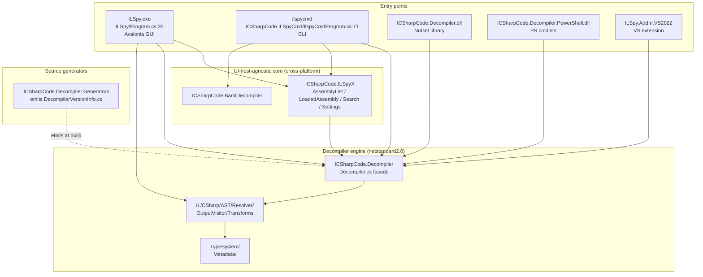
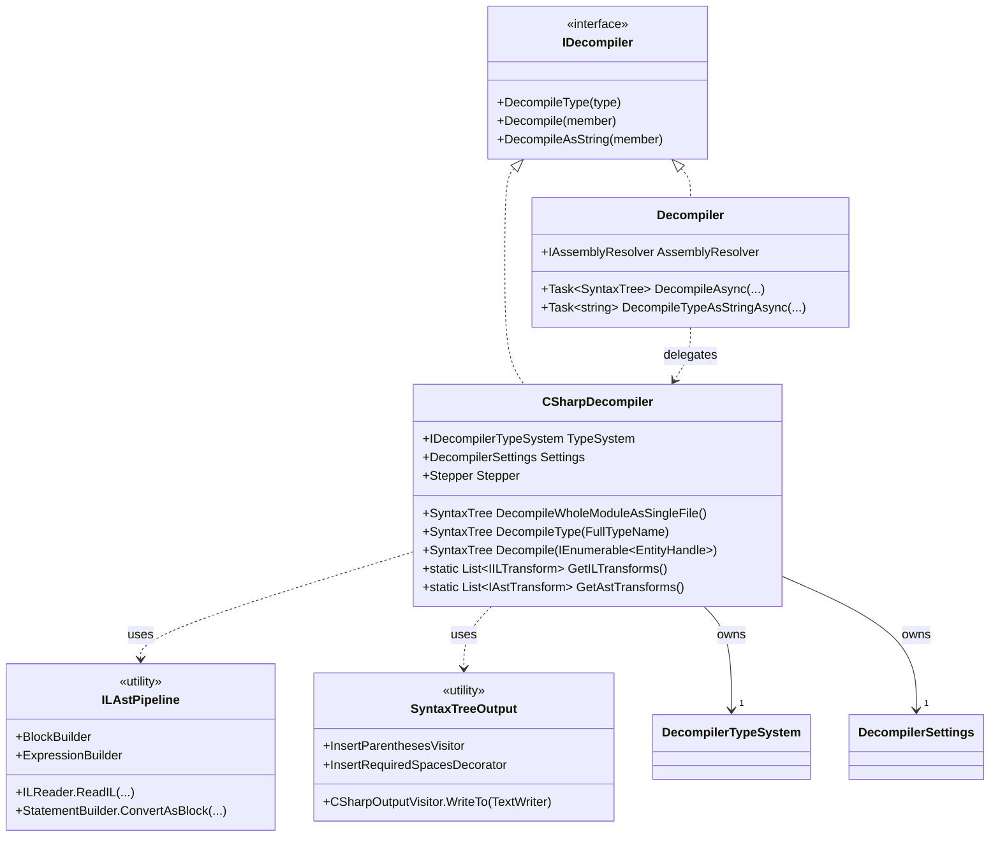
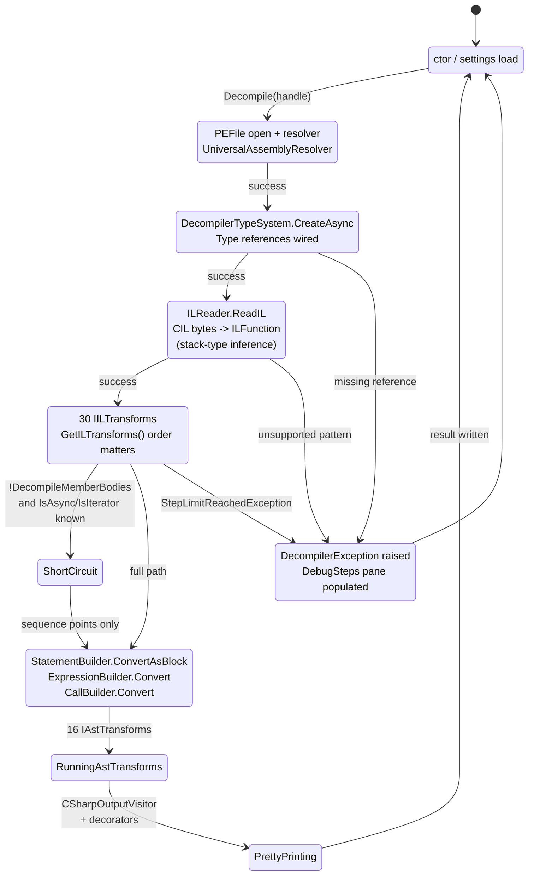
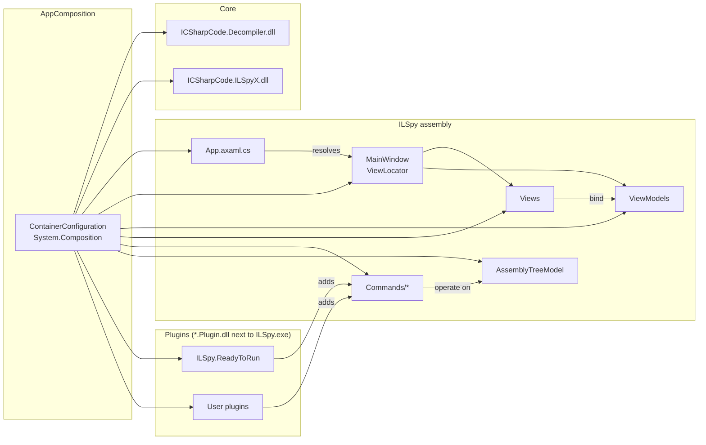

# 03 — Architecture

This document captures the static structure of ILSpy: how sub-projects depend on each other, the inheritance hierarchy of the public engine API, and the lifetime of one decompilation request as a state diagram.

## 3.1 Module dependency graph

The CLI and the GUI share the same engine. `ICSharpCode.ILSpyX` is a UI-host-agnostic layer that both runtimes can consume. The GUI adds Avalonia-specific views; the CLI uses the engine directly.

## 3.2 Public engine class hierarchy

## 3.3 Per-decompilation state

## 3.4 Engine layering

There are four concentric layers; the inner layers do not know about the outer ones.

| Layer | Concrete types | Responsibility |
|---|---|---|
| Metadata | `PEFile`, `MetadataFile`, `UniversalAssemblyResolver`, `MetadataExtensions` | Read PE / NuGet / bundle / WebCIL; resolve `AssemblyRef` to files |
| Type system | `DecompilerTypeSystem`, `IType`, `IMethod`, `IField`, ... `Implementation/MetadataTypeDefinition`, `MetadataMethod`, `MetadataField` | Adapt SRM types to a resolver-friendly `ICompilation` |
| IL | `ILReader`, `IL/Instructions/*.cs` (`Block`, `ILFunction`, `IfInstruction`, `Call`, `Branch`, ...), `IL/Transforms/*.cs` (49 transforms), `IL/ControlFlow/*.cs` | CIL bytes -> ILAst -> de-sugared statement list |
| C# AST | `Syntax/*.cs` (AstNode, statements, expressions, types), `Transforms/*.cs` (21 AST transforms), `Resolver/*.cs` (CSharpResolver, overload resolution, conversions), `OutputVisitor/CSharpOutputVisitor.cs` | ILAst -> NRefactory SyntaxTree -> C# text |

The split between IL and C# AST layers is the key design decision: by the time control reaches the AST layer, the IL has been maximally de-sugared so the AST only does cosmetic work (introducing operators as syntactic sugar, joining adjacent `using` statements, fixing name collisions, etc.). This makes the C# output largely independent of the IL dialect the input was compiled from.

## 3.5 MEF composition graph (GUI)

