# 04 — Data Flow

This document traces the lifecycle of one method body from raw PE bytes to the final C# string. It is the canonical end-to-end view; the operation chains in [05_operation_chains.md](./05_operation_chains.md) cover specific variants (whole-module export, project export, IL output, ...).

## Top-level pipeline

```mermaid
flowchart LR
    A["PE file<br/>(.dll / .exe / .nupkg / bundle / WebCIL)"] --> B["FileLoaderRegistry<br/>(PEFileLoader / ArchiveFileLoader / BundleFileLoader / WebCilFileLoader)"]
    B --> C["MetadataFile<br/>(PEFile, SingleFileBundle, WebCilFile)"]
    C --> D["UniversalAssemblyResolver<br/>+ Microsoft.NETCore.App.Ref"]
    C --> E["DecompilerTypeSystem<br/>CreateAsync"]
    E --> F["ICompilation +<br/>Type references wired"]
    F --> G["CSharpDecompiler.Decompile(handle)"]

    subgraph "Per-method pipeline"
        G --> H["ILReader.ReadIL<br/>CIL bytes -> ILFunction"]
        H --> I["IILTransform pipeline<br/>30 steps via GetILTransforms()"]
        I --> J["StatementBuilder.ConvertAsBlock<br/>ExpressionBuilder.Convert<br/>CallBuilder.Convert"]
        J --> K["IAstTransform pipeline<br/>16 steps via GetAstTransforms()"]
        K --> L["SyntaxTree<br/>(AstNode hierarchy)"]
    end

    L --> M["CSharpOutputVisitor.WriteTo<br/>+ InsertParenthesesVisitor<br/>+ InsertRequiredSpacesDecorator"]
    M --> N["Output string<br/>or TextWriter"]

    G --> O["CreateSequencePoints<br/>when -genpdb or GUI navigation"]
    O --> P["PortablePdbBuilder<br/>(System.Reflection.Metadata)"]
```

## Phase-by-phase detail

### Phase 1: Load

`FileLoaderRegistry.Load(fileName)` (`ICSharpCode.ILSpyX/FileLoaders/FileLoaderRegistry.cs`) tries each loader in priority order. `PEFileLoader` is the default; if the file is a ZIP (`ArchiveFileLoader`), the registry looks for `.dll` / `.exe` inside. The result is a `MetadataFile` — usually a `PEFile` wrapping the PE stream with `PEStreamOptions.PrefetchEntireImage`.

### Phase 2: Assembly resolution

`UniversalAssemblyResolver` (`ICSharpCode.Decompiler/Metadata/UniversalAssemblyResolver.cs`) is constructed with the assembly file name, target-framework identifier, optional `TargetFrameworkMoniker`, and a list of search directories. When a `TypeRef` / `AssemblyRef` is encountered, the resolver probes each directory and falls back to the .NET shared-framework cache (`DotNetCorePathFinder`). The CLI accepts `-r|--referencepath` to add more directories; the GUI reads them from settings.

### Phase 3: Type system build

`DecompilerTypeSystem.CreateAsync` (`ICSharpCode.Decompiler/TypeSystem/DecompilerTypeSystem.cs:127`) reads all TypeDefs / TypeRefs / AssemblyRefs / ModuleRefs and constructs the decompiler `ICompilation`. A `MetadataTypeDefinition` is created per TypeDef; the same per MethodDef / FieldDef / PropertyDef / EventDef. `TypeSystemOptions` controls what additional features are enabled (extension methods, tuples, dynamic, nullability annotations, ...).

### Phase 4: IL import

`ILReader.ReadIL(methodDefinitionHandle, methodBodyBlock, ...)` (`ICSharpCode.Decompiler/IL/ILReader.cs:720`) walks the IL byte stream. Stack-type inference decides which locals are `int` vs `long` vs `object`; reference merging is captured via `UnionFind<ILVariable>` so that two locals that always carry the same value get unified. The result is an `ILFunction` — the root of an ILAst subtree (`Block` -> nested `Block` / `IfInstruction` / `Call` / `Branch` / `Leave` / ...). PDB hints from `IDebugInfoProvider` influence `SequencePointCandidates` and local names if `UseDebugSymbols` is set.

### Phase 5: IL transform pipeline

`CSharpDecompiler.GetILTransforms()` (`ICSharpCode.Decompiler/CSharp/CSharpDecompiler.cs:88`) returns a fixed 30-step pipeline of `IILTransform`s. The order is documented inline (see `GetILTransforms()` source lines 90-175). Critical interleavings:

- `SplitVariables` runs both before and after `EarlyExpressionTransforms` and again after `SwitchOnNullableTransform`.
- `ControlFlowSimplification` runs twice: once early and once after `SplitVariables` re-runs.
- `YieldReturnDecompiler`, `AsyncAwaitDecompiler`, `DetectCatchWhenConditionBlocks` must run after `ILInlining` but before loop detection.
- `BlockILTransform` interleaves per-block transforms (ConditionDetection, LockTransform, UsingTransform, StatementTransform) so each block sees all earlier transformations.

`function.CheckInvariant(ILPhase.Normal)` runs after each transform in DEBUG builds.

### Phase 6: AST conversion

Three builders translate the de-sugared ILAst into NRefactory `AstNode`s:

- `StatementBuilder.ConvertAsBlock(function.Body)` (`ICSharpCode.Decompiler/CSharp/StatementBuilder.cs:1`) — ILAst `Block` -> `BlockStatement`.
- `ExpressionBuilder.Convert(inst)` (`ICSharpCode.Decompiler/CSharp/ExpressionBuilder.cs:1`) — ILAst instructions -> `Expression` (largest file: 5018 LoC).
- `CallBuilder.Convert(call, ...)` (`ICSharpCode.Decompiler/CSharp/CallBuilder.cs:1`) — ILAst `Call` / `CallVirt` -> `InvocationExpression` or `MemberReferenceExpression`.

The resolver (`CSharpResolver` 2986 LoC + `CSharpConversions`, `OverloadResolution`, `TypeInference`) walks the partial AST and resolves overloads, generic type arguments, conversions, lambda return types. `RequiredNamespaceCollector` walks each member and gathers the namespaces to import; `UsingScope` is assembled and emitted at the top of the file.

### Phase 7: AST transform pipeline

`CSharpDecompiler.GetAstTransforms()` (`CSharpDecompiler.cs:185`) returns 16 `IAstTransform`s applied AFTER the ILAst pipeline. These do syntactic cleanup:

- `PatternStatementTransform` — convert `if (x is T y) y.Foo()` to switch patterns
- `ReplaceMethodCallsWithOperators` — `a.op_Addition(b)` -> `a + b`
- `DeclareVariables` — hoist `var` declarations to first use
- `IntroduceExtensionMethods` / `IntroduceUsingDeclarations` / `IntroduceQueryExpressions` / `IntroduceUnsafeModifier`
- `CombineQueryExpressions` / `AddCheckedBlocks` / `NormalizeBlockStatements` / `FlattenSwitchBlocks`
- `FixNameCollisions` / `PrettifyAssignments` / `AddXmlDocumentationTransform`
- `EscapeInvalidIdentifiers` / `RemoveCLSCompliantAttribute` / `TransformFieldAndConstructorInitializers`

`rootNode.CheckInvariant()` runs after each `IAstTransform.Run` in DEBUG builds.

### Phase 8: Pretty-print

`CSharpOutputVisitor` (`ICSharpCode.Decompiler/CSharp/OutputVisitor/CSharpOutputVisitor.cs`) walks the `SyntaxTree` and writes tokens to a `TextWriter` via a `TextWriterTokenWriter`. Three decorators wrap the visitor in sequence:

1. `InsertParenthesesVisitor` — adds parentheses when operator precedence would change the parse tree.
2. `InsertMissingTokensDecorator` — synthesizes missing semicolons / commas / braces when nodes are constructed without them.
3. `InsertRequiredSpacesDecorator` — adds the spaces the lexer would otherwise lose between adjacent tokens.

`CSharpFormattingOptions` (and `FormattingOptionsFactory`) configure brace placement, indentation, line endings.

### Phase 9: Output

The CLI writes the string to stdout or to `-o` / a per-type file when `-p`. The GUI binds the `TextWriter` to the AvaloniaEdit `TextDocument` of the active `ContentTabPage`.

## Sequence-point side path (PDB / GUI navigation)

When `--generate-pdb` is requested, or when the GUI needs to navigate from text position to IL offset, `CSharpDecompiler.CreateSequencePoints(syntaxTree)` (`CSharpDecompiler.cs:2509`) walks the IL->AST mapping that each ILAst instruction carries via `ILInstruction.AddAnnotation(new SequencePoint(...))`. The result is a `Dictionary<ILFunction, List<SequencePoint>>` mapping back to IL offsets. `PortablePdbBuilder` then emits the binary PDB.

## Errors and diagnostics

- `StepLimitReachedException` (`DecompilerSettings.DecompilationMaxStepCount`) — raised when a transform's step count exceeds the limit. Visible in the GUI's Debug Steps pane.
- `DecompilerException` — structured exception with `Module`, `Method`, `InnerException`. The GUI surfaces it inline with a stack-trace detail dialog.
- `ReferenceResolvingException` — the resolver cannot find an assembly. With `ThrowOnAssemblyResolveErrors = false` (the default in the GUI), the missing type is rendered as `unknown`; the CLI sets it to `true` by default.
- Per-transform invariant checks (DEBUG) catch shape corruption early.