# 05 — Operation Chains

This document enumerates 12 end-to-end operation chains. Each chain has an input contract, a numbered sequence of file:line references, and a mermaid diagram. The chains come from the inventory report (`/tmp/ilspy-dnspy-inventory/ILSpy.md` §6) and cross-reference [09_callstacks.md](./09_callstacks.md) for the text-based view.

**Chain index:**

| # | Name | Input | Trigger |
|---|---|---|---|
| 1 | CLI single-file decompile | `ilspycmd sample.dll` | `IlspyCmdProgram.Main` |
| 2 | CLI whole-project export | `ilspycmd -p -o out sample.dll` | `-p` flag |
| 3 | Single method body to AST | `CSharpDecompiler.Decompile(handle)` | `CSharpDecompiler.Decompile` |
| 4 | ILAst pipeline (de-sugaring) | `ILFunction` | `GetILTransforms()` |
| 5 | Control-flow graph construction | `BlockContainer` | `ControlFlowGraph` ctor |
| 6 | async/await de-sugaring | compiler-generated state machine | `AsyncAwaitDecompiler.Run` |
| 7 | Plugin loading | `*.Plugin.dll` next to exe | `AppComposition.Initialize` |
| 8 | Avalonia GUI lifecycle | process start | `Program.Main` |
| 9 | Search (assembly / member / metadata-token) | `t:List` | `SearchPane` |
| 10 | Multi-language output (C# / IL / VB) | chosen language | `LanguageSettings` |
| 11 | HTML diagrammer | `--generate-diagrammer` | `GenerateHtmlDiagrammer` |
| 12 | PDB generation | `-genpdb -o out` | `PortablePdbBuilder` |

---

## Chain 1 — CLI single-file decompile

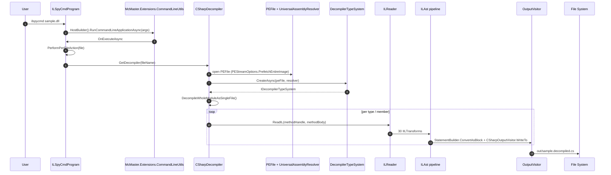

Steps:

1. `IlspyCmdProgram.Main(args)` -> `HostBuilder().RunCommandLineApplicationAsync<ILSpyCmdProgram>(args)` (`ICSharpCode.ILSpyCmd/IlspyCmdProgram.cs:71`)
2. `CommandLineUtils` builds the `[Command]` and parses options. `OnExecuteAsync` is invoked.
3. With no `-p`, no `--list`, no `-il`, no resource flags, the dispatch falls through to `PerformPerFileAction(file)` -> `Decompile(fileName, output, TypeName)`.
4. `Decompile` calls `GetDecompiler(fileName)`: opens the `PEFile`, builds `UniversalAssemblyResolver`, applies `--referencepath` and `--ilspy-settingsfile`, applies `-ds` overrides by reflection, defaults `DecompilerSettings(LanguageVersion)`.
5. `CSharpDecompiler.TypeSystem` is created via `DecompilerTypeSystem.CreateAsync(PEFile, resolver)`.
6. `CSharpDecompiler.DecompileWholeModuleAsSingleFile()` runs `DecompileModuleAndAssemblyAttributes` + `DoDecompileTypes` + `RunTransforms`.
7. Per method, the ILAst pipeline (`GetILTransforms()`, 30 steps) runs.
8. The 16 AST transforms (`GetAstTransforms()`) run.
9. `SyntaxTreeToString` writes the final text via `CSharpOutputVisitor`.

Output: `sample.decompiled.cs` at stdout or at `-o`.

---

## Chain 2 — CLI whole-project export

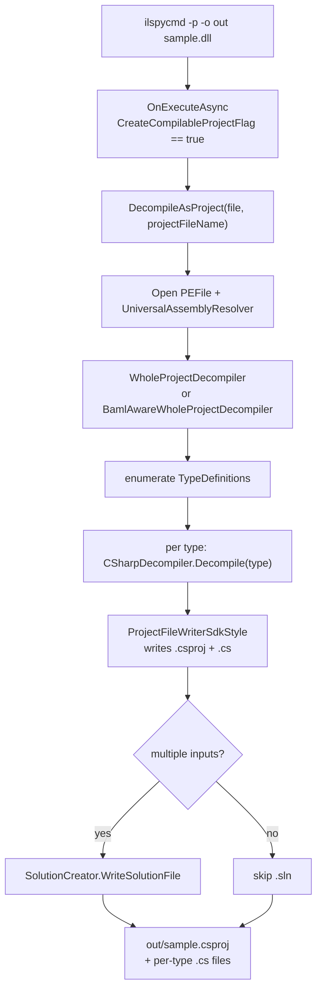

Steps:

1. `OnExecuteAsync` detects `CreateCompilableProjectFlag` and dispatches to `DecompileAsProject(file, projectFileName)` (`IlspyCmdProgram.cs:275`).
2. Opens `PEFile`, builds the resolver.
3. Calls `WholeProjectDecompiler.DecompileProject(module, dir, writer)`, or `BamlAwareWholeProjectDecompiler` if `--decompile-baml`.
4. `WholeProjectDecompiler` enumerates all `TypeDefinition`s and calls `CSharpDecompiler.Decompile(type)` for each.
5. `WholeProjectDecompiler` writes `<assembly>.csproj` (SDK-style if `CanUseSdkStyleProjectFormat`) plus per-type `.cs` files via `ProjectFileWriterSdkStyle`.
6. If multiple inputs, `SolutionCreator.WriteSolutionFile` adds a `.sln`.

Output: `.csproj` + per-type `.cs` files + optional `.sln`.

---

## Chain 3 — Single method body to AST

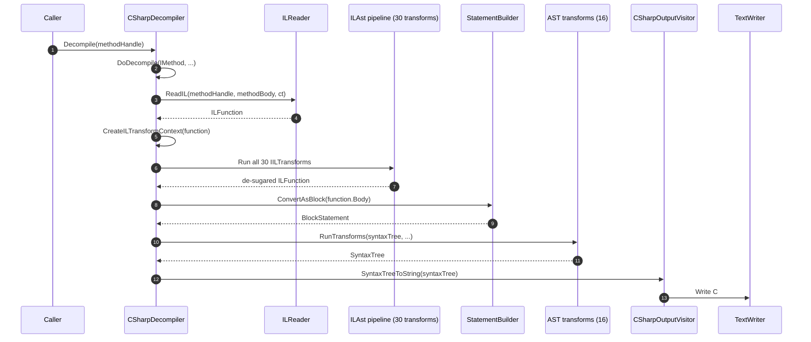

Steps:

1. `CSharpDecompiler.Decompile(IEnumerable<EntityHandle>)` (`CSharpDecompiler.cs:1244`).
2. Dispatches to `DoDecompile(IMethod, ...)` (`CSharpDecompiler.cs:1993`).
3. `DecompileBody` (`CSharpDecompiler.cs:2136`):
   - `new ILReader(typeSystem.MainModule)` with `UseDebugSymbols = settings.UseDebugSymbols`.
   - `ilReader.ReadIL(methodHandle, methodBody, cancellationToken)` -> `ILFunction` (`ILReader.cs:720`).
   - Builds `ILTransformContext(function, typeSystem, DebugInfoProvider, localSettings)`.
   - Runs all 30 `IILTransform`s in order from `GetILTransforms()`.
   - Short-circuits after `AsyncAwaitDecompiler` when `!DecompileMemberBodies` (cheap `IsAsync` / `IsIterator` check).
   - `StatementBuilder.ConvertAsBlock(function.Body)` -> `BlockStatement`.
4. `RunTransforms(syntaxTree, ...)` (`CSharpDecompiler.cs:727`) runs the 16 AST transforms.
5. `SyntaxTreeToString` writes to a `TextWriter`.

Output: `string DecompileAsString(...)` or `SyntaxTree Decompile(...)`.

---

## Chain 4 — ILAst pipeline (single-method de-sugaring)

```mermaid
flowchart TD
    A[ILFunction from ILReader] --> B[ControlFlowSimplification<br/>+ SplitVariables]
    B --> C[ILInlining]
    C --> D[InlineReturnTransform]
    D --> E[RemoveInfeasiblePathTransform]
    E --> F[DetectPinnedRegions]
    F --> G[YieldReturnDecompiler]
    G --> H[AsyncAwaitDecompiler]
    H --> I[DetectCatchWhenConditionBlocks]
    I --> J[DetectExitPoints]
    J --> K[LdLocaDupInitObjTransform]
    K --> L[EarlyExpressionTransforms]
    L --> M[SplitVariables #2]
    M --> N[RemoveDeadVariableInit]
    N --> O[ControlFlowSimplification #2]
    O --> P[DynamicCallSiteTransform]
    P --> Q[SwitchDetection / SwitchOnString / SwitchOnNullable]
    Q --> R[SplitVariables #3]
    R --> S[IntroduceRefReadOnlyModifierOnLocals]
    S --> T[BlockILTransform<br/>LoopDetection]
    T --> U[DetectExitPoints #2]
    U --> V[PatternMatchingTransform]
    V --> W[BlockILTransform<br/>ConditionDetection / LockTransform / UsingTransform / StatementTransform]
    W --> X[ProxyCallReplacer]
    X --> Y[FixRemainingIncrements]
    Y --> Z[CopyPropagation]
    Z --> AA[DelegateConstruction]
    AA --> AB[LocalFunctionDecompiler]
    AB --> AC[TransformDisplayClassUsage]
    AC --> AD[HighLevelLoopTransform]
    AD --> AE[ReduceNestingTransform]
    AE --> AF[RemoveRedundantReturn]
    AF --> AG[IntroduceDynamicTypeOnLocals]
    AG --> AH[IntroduceNativeIntTypeOnLocals]
    AH --> AI[AssignVariableNames]
```

The pipeline is a single static method: `CSharpDecompiler.GetILTransforms()` at `ICSharpCode.Decompiler/CSharp/CSharpDecompiler.cs:88-176`. Order matters: comments above each `new` call explain why a transform must run before or after its neighbors. Per-transform invariant checks run after each step in DEBUG builds.

Notable interleavings:

- `BlockILTransform` wraps two loops: one with `LoopDetection` post-order (line 116-125), another with `ConditionDetection` + `LockTransform` + `UsingTransform` + `CachedDelegateInitialization` + `StatementTransform` post-order (line 129-162). The `StatementTransform` interleaves a fine-grained sequence (ILInlining-with-ldloca -> ExpressionTransforms -> DynamicIsEventAssignment -> TransformAssignment -> NullCoalescing -> NullableLifting -> NullPropagation -> array/collection initializers -> expression trees -> IndexRange -> Deconstruction -> NamedArgument -> RemoveUnconstrainedGenericReferenceTypeCheck -> UserDefinedLogic -> InterpolatedString).
- `RemoveDeadVariableInit` must run AFTER `EarlyExpressionTransforms` so that `stobj(ldloca V, ...)` is collapsed into `stloc(V, ...)`.

---

## Chain 5 — Control-flow graph construction

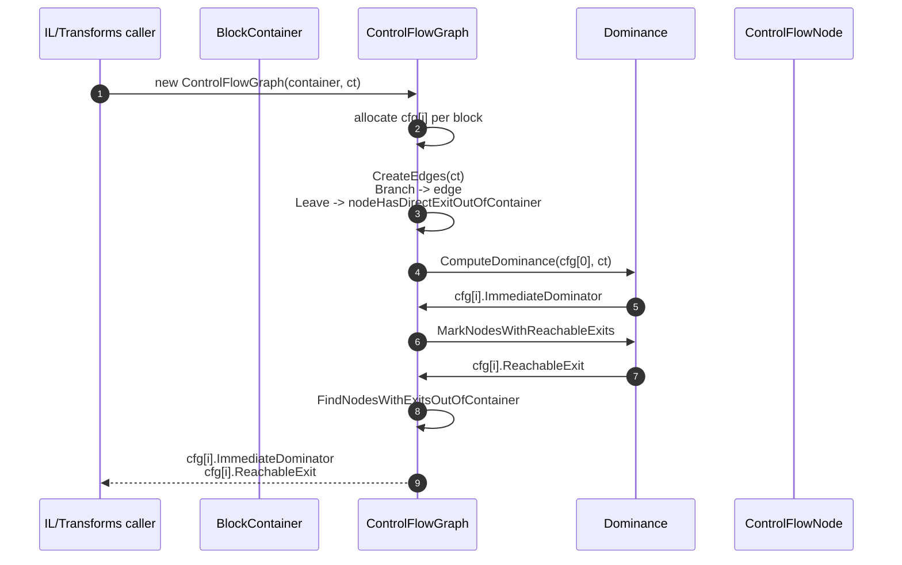

Steps:

1. `new ControlFlowGraph(container, cancellationToken)` (`ICSharpCode.Decompiler/IL/ControlFlow/ControlFlowGraph.cs:69`).
2. Allocates `cfg[i]` per block.
3. `CreateEdges` walks each `Branch`: when `TargetBlock.Parent == container` it adds an edge; `Leave` instructions leaving the container mark `nodeHasDirectExitOutOfContainer`.
4. `Dominance.ComputeDominance(cfg[0], cancellationToken)` (`FlowAnalysis/Dominance.cs`).
5. `Dominance.MarkNodesWithReachableExits` builds `nodeHasReachableExit`.
6. `FindNodesWithExitsOutOfContainer` propagates the exit bit-set.

Output: `cfg[i].ImmediateDominator`, `cfg[i].ReachableExit` for each `ControlFlowNode`.

---

## Chain 6 — async / await de-sugaring

```mermaid
flowchart TD
    A[ILFunction with compiler-generated state machine] --> B[AsyncAwaitDecompiler.Run]
    B --> C[Find IAsyncStateMachine.MoveNext()]
    C --> D[Walk state labels]
    D --> E[Detect AwaitOnCompletion / AwaitUnsafeOnCompletion patterns]
    E --> F[Convert state machine switch + state = -1<br/>into await expression in original method]
    F --> G[RunTransforms / PatternMatchingTransform<br/>cleanup]
    G --> H[C# method body with async / await keywords]
```

Steps:

1. `AsyncAwaitDecompiler.Run(ILFunction)` (`ICSharpCode.Decompiler/IL/ControlFlow/AsyncAwaitDecompiler.cs`).
2. Find `IAsyncStateMachine.MoveNext()` (compiler-generated).
3. Walk state labels (numeric `switch`), detect `AwaitOnCompletion` / `AwaitUnsafeOnCompletion` patterns.
4. Convert state-machine `switch` + `state = -1` into C# `await` in original method.
5. `RunTransforms` / `PatternMatchingTransform` cleans up subsequent patterns.

Output: C# method body with `async` / `await` keywords.

---

## Chain 7 — Plugin loading

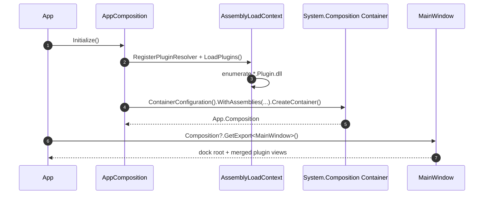

Steps:

1. `App.OnFrameworkInitializationCompleted` -> `AppComposition.Initialize()` (`App.axaml.cs:74`).
2. `AppComposition.Initialize()` -> `RegisterPluginResolver()` then `CreateContainer()` (`AppEnv/AppComposition.cs:67-110`).
3. `RegisterPluginResolver` hooks `AssemblyLoadContext.Default.Resolving` and calls `LoadPlugins()` to enumerate every `*.Plugin.dll`.
4. `CreateContainer` builds `ContainerConfiguration().WithAssemblies(composedAssemblies).CreateContainer()` (System.Composition.MEF) and assigns `App.Composition`.
5. `desktop.MainWindow = Composition?.GetExport<MainWindow>()` resolves the root view.
6. Plugin `[Export]` `[Shared]` types become resolvable across the app via `AppComposition.TryGetExport<T>()`.

Output: plugin views merged into the dock layout; plugin services resolvable everywhere.

---

## Chain 8 — Avalonia GUI lifecycle

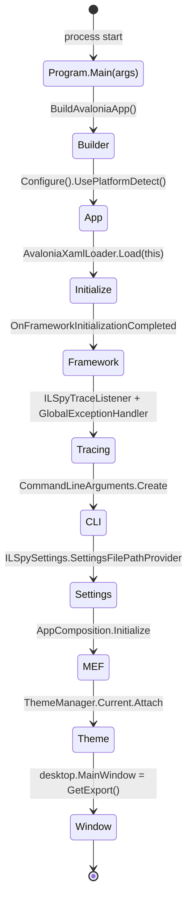

Steps:

1. `[STAThread] Main` -> `BuildAvaloniaApp().StartWithClassicDesktopLifetime(args)` (`ILSpy/Program.cs:35-49`).
2. `BuildAvaloniaApp` returns `AppBuilder.Configure<App>().UsePlatformDetect().With(new X11PlatformOptions { OverlayPopups = true }).LogToTrace()`.
3. Avalonia instantiates `App` -> `Initialize()` (`AvaloniaXamlLoader.Load(this)`).
4. Avalonia calls `OnFrameworkInitializationCompleted` (`App.axaml.cs:36`).
5. Install `ILSpyTraceListener` + `GlobalExceptionHandler`.
6. Parse `CommandLineArguments.Create(Environment.GetCommandLineArgs()[1..])`.
7. Resolve `ILSpySettings.SettingsFilePathProvider` (`ILSpy.xml` next to exe or `%AppData%\ICSharpCode\ILSpy.xml`).
8. `Composition = AppComposition.Initialize()`.
9. `ThemeManager.Current.Attach(settingsService.SessionSettings)`, apply culture.
10. `desktop.MainWindow = Composition?.GetExport<MainWindow>()`.
11. `desktop.Exit += (_,_) => Composition?.GetExport<SettingsService>().Save(); Composition?.Dispose();`.

Output: Avalonia window appears with the dock workspace ready.

---

## Chain 9 — Search (assembly / member / metadata-token / constant / resource)

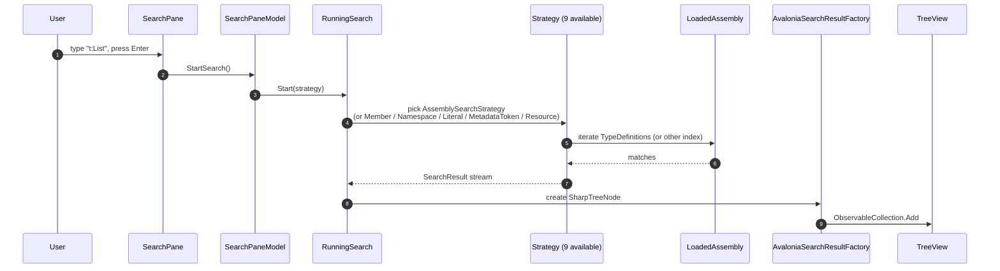

Steps:

1. `SearchPane.axaml.cs` -> `SearchPaneModel.StartSearch()` (`ILSpy/Search/SearchPaneModel.cs`).
2. `RunningSearch.Start(strategy)` (`ILSpy/Search/RunningSearch.cs`) — picks the right strategy based on the `t:` / `m:` / `c:` / `r:` prefix.
3. The strategy iterates `LoadedAssembly.TypeSystem.MainModule.TypeDefinitions` (or other index) and yields matches.
4. Each match produces a `SearchResult` + `AvaloniaSearchResultFactory` -> `SharpTreeNode`.
5. Results stream to the `SearchPane` TreeView via `ObservableCollection`.

Output: live result list in the Search pane; clicking navigates the tree.

---

## Chain 10 — Multi-language output (C# / IL / VB)

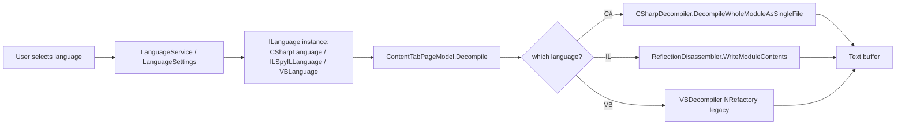

Steps:

1. `MainWindow` selects language via `LanguageService` / `LanguageSettings` (`ILSpy/LanguageSettings.cs`).
2. `ILanguage.TypeToString` / `GetEntityName` is used for tree nodes, tooltips, and decompilation target.
3. `ContentTabPageModel.Decompile` invokes the chosen backend.
4. For IL: `ReflectionDisassembler.WriteModuleContents(peFile)` (`ICSharpCode.Decompiler/Disassembler/ReflectionDisassembler.cs`) emits `.il` text.
5. For VB: in the GUI, the legacy `VBDecompiler` (NRefactory-based) is invoked.

Output: text buffer with the chosen language source.

---

## Chain 11 — HTML diagrammer (CLI flag)

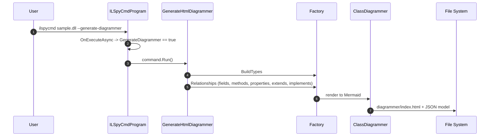

Steps:

1. `OnExecuteAsync` -> `GenerateDiagrammer == true` -> `command.Run()` for each input.
2. `GenerateHtmlDiagrammer.Assembly = file` / `OutputFolder` / `Include` / `Exclude` (`ICSharpCode.ILSpyX/MermaidDiagrammer/GenerateHtmlDiagrammer.cs`).
3. `Factory.BuildTypes` enumerates types.
4. `Factory.Relationships` walks fields, methods, properties, extends, implements.
5. `ClassDiagrammer` produces Mermaid syntax.
6. Embedded HTML template + JSON model written next to the assembly (or under `-o`).

Output: `diagrammer/index.html` with an interactive Mermaid class diagram.

---

## Chain 12 — PDB generation

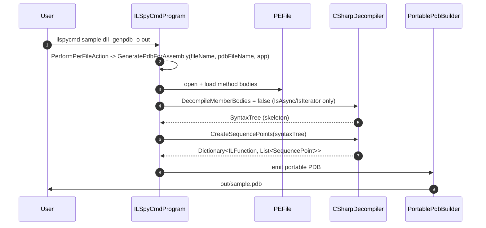

Steps:

1. `PerformPerFileAction` -> `GeneratePdbForAssembly(fileName, pdbFileName, app)` (`IlspyCmdProgram.cs:330`).
2. Opens `PEFile`, loads each method body via `PEFile.GetMethodBody`.
3. Runs `CSharpDecompiler` with `DecompileMemberBodies = false` — only needs `IsAsync` / `IsIterator` to be set for sequence points.
4. Builds sequence points via `CSharpDecompiler.CreateSequencePoints(syntaxTree)` (`CSharpDecompiler.cs:2509`).
5. `PortablePdbBuilder` (`System.Reflection.Metadata`) emits a portable PDB.

Output: `out/sample.pdb`.