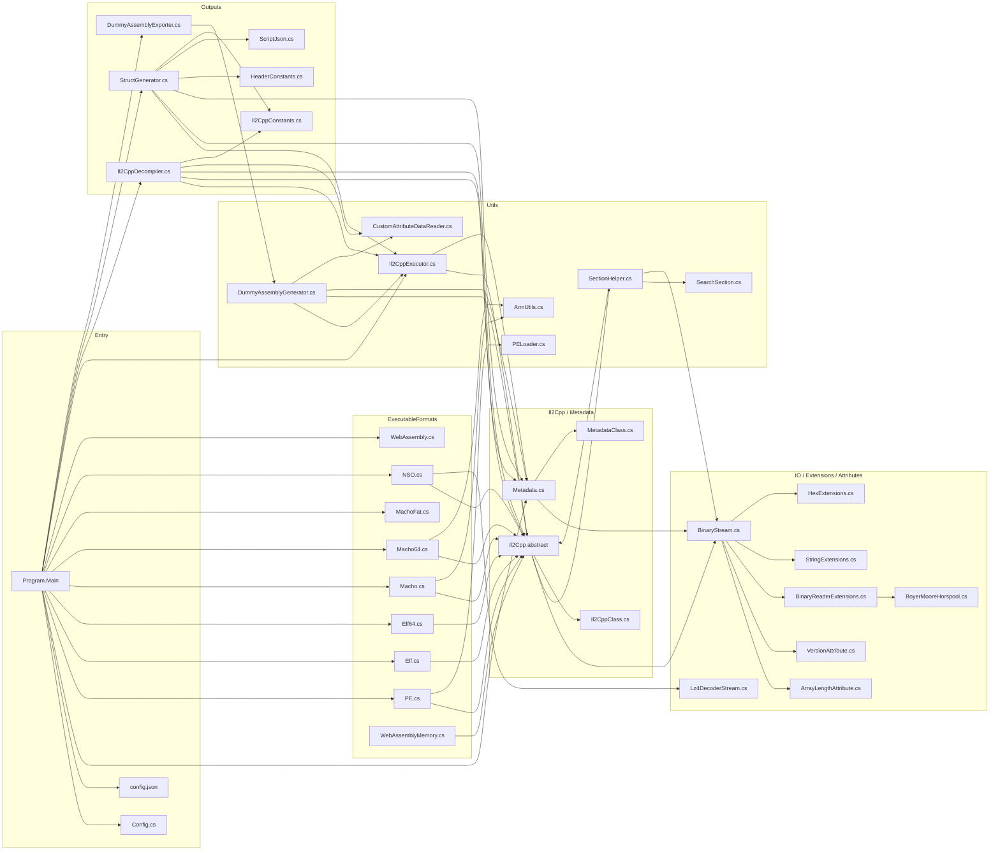
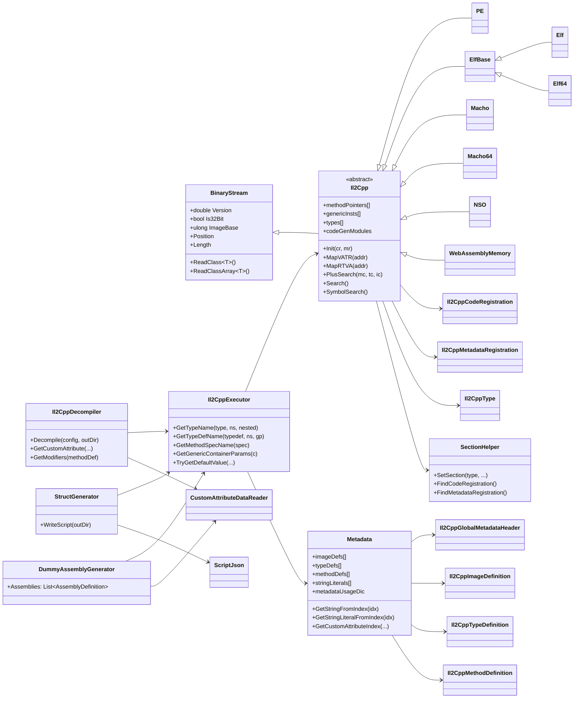

# 03 架构

## 总体分层

Il2CppDumper 的代码高度分层，每一层只依赖下层：

```
┌────────────────────────────────────────────────────────────────────┐
│ Program.cs (Main)                                                  │
│   - 解析 CLI args / GUI 弹窗                                        │
│   - 调度 Init() -> Dump()                                          │
└────────────────────────────────────────────────────────────────────┘
                          │
                          ▼
┌────────────────────────────────────────────────────────────────────┐
│ Formatter layer (ExecutableFormats/*.cs)                           │
│   - PE / Elf / Elf64 / Macho / Macho64 / MachoFat / NSO / WASM     │
│   - 共同的基类 Il2Cpp (abstract) + BinaryStream                    │
│   - 提供 MapVATR(addr) -> fileOffset, MapRTVA(fileOffset) -> addr  │
└────────────────────────────────────────────────────────────────────┘
                          │
                          ▼
┌────────────────────────────────────────────────────────────────────┐
│ il2cpp runtime layer (Il2Cpp/Il2Cpp.cs)                            │
│   - 解析 Il2CppCodeRegistration / Il2CppMetadataRegistration       │
│   - 持有 methodPointers / genericInsts / types / fieldOffsets …    │
│   - 子类 PE / Elf / Elf64 / Macho / Macho64 / NSO / WebAssemblyMem │
└────────────────────────────────────────────────────────────────────┘
                          │
                          ▼
┌────────────────────────────────────────────────────────────────────┐
│ metadata layer (Il2Cpp/Metadata.cs)                                │
│   - 解析 global-metadata.dat                                        │
│   - imageDefs / typeDefs / methodDefs / fieldDefs / stringLiterals │
│   - metadataUsageDic (v19~v26), attributeDataRanges (v29+)          │
└────────────────────────────────────────────────────────────────────┘
                          │
                          ▼
┌────────────────────────────────────────────────────────────────────┐
│ executor layer (Utils/Il2CppExecutor.cs)                           │
│   - 名称解析 (GetTypeName / GetMethodSpecName / GetGenericContainerParams) │
│   - 默认值 / BlobValue 解码                                          │
│   - customAttributeGenerators 索引聚合                              │
└────────────────────────────────────────────────────────────────────┘
                          │
                          ▼
┌────────────────────────────────────────────────────────────────────┐
│ output layer (Outputs/*.cs)                                        │
│   - Il2CppDecompiler   -> dump.cs                                  │
│   - StructGenerator    -> il2cpp.h + script.json + stringliteral   │
│   - DummyAssemblyGenerator + DummyAssemblyExporter -> DummyDll/   │
└────────────────────────────────────────────────────────────────────┘
```

## 模块依赖图（Mermaid）



## 关键设计点

### 1. `Il2Cpp` 抽象基类

`Il2Cpp/Il2Cpp.cs:8` 定义了所有格式子类的契约：

```csharp
public abstract class Il2Cpp : BinaryStream
{
    public abstract ulong MapVATR(ulong addr);      // VA → file offset
    public abstract ulong MapRTVA(ulong addr);      // file offset → VA
    public abstract bool Search();
    public abstract bool PlusSearch(int methodCount, int typeDefinitionsCount, int imageCount);
    public abstract bool SymbolSearch();
    public abstract SectionHelper GetSectionHelper(int methodCount, int typeDefinitionsCount, int imageCount);
    public abstract bool CheckDump();
}
```

子类（`PE.cs:8`、`Elf.cs:9`、`Elf64.cs:9`、`Macho.cs:10`、`Macho64.cs:10`、`NSO.cs:9`、`WebAssemblyMemory.cs:5`）负责把 VA 与 file offset 的转换关系封装为 `MapVATR/MapRTVA`。`Init(codeRegistration, metadataRegistration)` 一次性把全局表加载到内存。

### 2. 版本驱动的 struct sizing

`MetadataClass.cs` 中每个字段都可能携带 `[Version(Min, Max)]` / `[ArrayLength(Length=N)]`。`BinaryStream.ReadClass<T>()` 在 `IO/BinaryStream.cs:115` 处用反射 + attribute cache 动态跳过当前版本不需要的字段，从而一套 C# struct 兼容 v16~v31 的 metadata。

### 3. PlusSearch → SymbolSearch → Search → 手动 兜底链

每种格式子类都实现了三个搜索入口：
- `PlusSearch` — 基于 `SectionHelper.FindCodeRegistration` 的 `mscorlib.dll` 字符串 + 交叉引用扫描（v24.2+）
- `Search` — 旧版（v<24.2）的 ARM/x86 字节模式扫描（Macho / Elf 32-bit）
- `SymbolSearch` — 优先用 `g_CodeRegistration` / `g_MetadataRegistration` ELF 符号（ELF/Mach-O）

`Program.Main` 依次尝试：`PlusSearch` → `SymbolSearch` → `Search` → 手动输入 → `Init`。

### 4. 输出层与 Executor 解耦

`Il2CppExecutor` (`Utils/Il2CppExecutor.cs`) 是名称解析、默认值、attribute range 解析的唯一入口。`Il2CppDecompiler`、`StructGenerator`、`DummyAssemblyGenerator` 全部依赖它，而不是直接读 metadata。这样：
- 名称解析可缓存。
- 多输出格式（dump.cs / il2cpp.h / DummyDll）保持一致。

### 5. 平台二义性的处理

- `PE` 的 section 用 Characteristics `0x60000020` (exec) / `0x40000040` (data) / `0xC0000040` (data) 区分。
- ELF 的 PHDR 用 `p_flags` (`1u`=PF_X, `2u`=PF_W)。
- Mach-O 的 section 用 `sectname == "__mod_init_func"` 找 init 函数数组；用 `flags == 0x80000400` 找 code section。
- NSO 强制 LZ4 解压（`Lz4DecoderStream`）。

## 静态类全景



## 线程模型

Il2CppDumper 是纯同步单线程：
- `Main` 在当前线程顺序执行 `Init` → `Dump`。
- 所有 `ReadClass<T>` / `MapVATR` / `Search` 都是阻塞 IO（基于 `MemoryStream`，无真正磁盘等待）。
- 无并行（`Parallel.ForEach` 在本项目不出现）。

这是与 rodroid-il2cppdumper（Tauri 命令异步）的关键差异——后者把整条流水线搬到后台线程，并通过 Tauri Event 与前端通信。