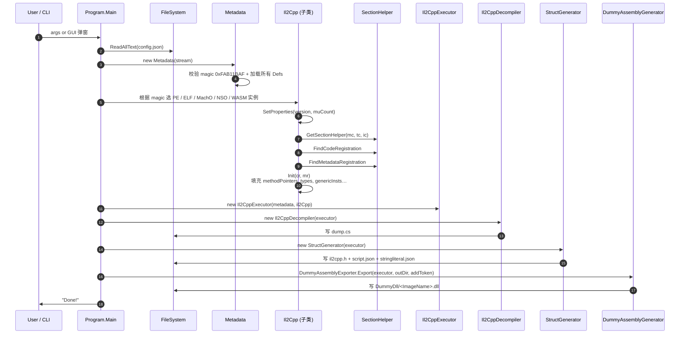

# 04 核心数据流

## 关键数据结构

### `Il2Cpp`（`Il2Cpp/Il2Cpp.cs:8`）

IL2CPP 运行时的内存视图，**核心字段**（行号见 `08_functions_detail/core.md`）：

| 字段 | 类型 | 含义 |
|------|------|------|
| `methodPointers` | `ulong[]` | 每个 methodDef 的 native 实现函数指针（RVA） |
| `genericMethodPointers` | `ulong[]` | 泛型方法专用化指针 |
| `invokerPointers` | `ulong[]` | 反向调用包装 |
| `customAttributeGenerators` | `ulong[]` | CustomAttribute generator 函数 |
| `reversePInvokeWrappers` | `ulong[]` | 反向 P/Invoke 包装（v22+） |
| `unresolvedVirtualCallPointers` | `ulong[]` | 未解析虚调用桩（v22+） |
| `fieldOffsets` | `ulong[]` | 字段偏移表（指针或 uint） |
| `types` | `Il2CppType[]` | 运行时所有 Il2CppType 记录 |
| `genericInsts` | `Il2CppGenericInst[]` | 泛型实例 |
| `methodSpecs` | `Il2CppMethodSpec[]` | 泛型方法特化 |
| `codeGenModules` | `Dictionary<string, Il2CppCodeGenModule>` | 每 image 的代码生成模块（v24.2+） |
| `rgctxsDictionary` | `Dictionary<string, Dictionary<uint, Il2CppRGCTXDefinition[]>>` | RGCTX 解析表（v24.2+） |
| `IsDumped` | `bool` | 输入文件是内存转储 |

### `Metadata`（`Il2Cpp/Metadata.cs:10`）

`global-metadata.dat` 的内存视图：

| 字段 | 类型 | 含义 |
|------|------|------|
| `header` | `Il2CppGlobalMetadataHeader` | 头部 |
| `imageDefs` | `Il2CppImageDefinition[]` | 每个 DLL/EXE 一项 |
| `assemblyDefs` | `Il2CppAssemblyDefinition[]` | assembly 一览 |
| `typeDefs` | `Il2CppTypeDefinition[]` | 所有 TypeDef |
| `methodDefs` | `Il2CppMethodDefinition[]` | 所有 MethodDef |
| `parameterDefs` | `Il2CppParameterDefinition[]` | 所有参数 |
| `fieldDefs` | `Il2CppFieldDefinition[]` | 所有字段 |
| `propertyDefs` | `Il2CppPropertyDefinition[]` | 所有属性 |
| `eventDefs` | `Il2CppEventDefinition[]` | 所有事件 |
| `genericContainers` | `Il2CppGenericContainer[]` | 泛型容器 |
| `genericParameters` | `Il2CppGenericParameter[]` | 泛型形参 |
| `stringLiterals` | `Il2CppStringLiteral[]` | 字符串字面量（`string user, foo = "hello"` 的 `"hello"`） |
| `attributeTypeRanges` | `Il2CppCustomAttributeTypeRange[]` | v21~v28 attribute 范围 |
| `attributeDataRanges` | `Il2CppCustomAttributeDataRange[]` | v29+ attribute blob 范围 |
| `metadataUsageDic` | `Dictionary<Il2CppMetadataUsage, SortedDictionary<uint, uint>>` | v19~v26 metadata usage 反向索引 |

### `Config`（`Config.cs:3`）

JSON 反序列化的运行配置：

| 字段 | 默认 | 含义 |
|------|------|------|
| `DumpMethod` | true | 输出方法签名 |
| `DumpField` | true | 输出字段 |
| `DumpProperty` | false | 输出属性 |
| `DumpAttribute` | false | 还原 `[Foo(...)]` attribute |
| `DumpFieldOffset` | true | 字段后注释 `// 0xN` |
| `DumpMethodOffset` | true | 方法前注释 `// RVA: 0xN Offset: 0xN VA: 0xN` |
| `DumpTypeDefIndex` | true | 类型后注释 `// TypeDefIndex: N` |
| `GenerateDummyDll` | true | 写 `DummyDll/` |
| `GenerateStruct` | true | 写 `il2cpp.h` |
| `DummyDllAddToken` | true | 在 stub 上加 `[Token("0xN")]` |
| `RequireAnyKey` | true | 退出前等待按键 |
| `ForceIl2CppVersion` | false | 强制使用 `ForceVersion` 而非 metadata 探测值 |
| `ForceVersion` | 24.3 | 强制版本 |
| `ForceDump` | false | 输入视为内存转储（无 reloc） |
| `NoRedirectedPointer` | false | 不重写 ELF 的 pointer（dump 场景） |

### `Il2CppType`（`Il2Cpp/Il2CppClass.cs:139`）

P/Invoke layout（`[StructLayout(Sequential)]` 隐含）：

| 字段 | 字节 | 说明 |
|------|------|------|
| `datapoint` | 8 | 通用指针 |
| `bits` | 4 | 低 16 bits attrs / bit 16~23 type / bit 24+ mods (byref/pinned/valuetype) |
| `attrs` (from `bits`) | – | 通过 `Init(version)` 拆分 |
| `type` | – | `Il2CppTypeEnum` |
| `num_mods` / `byref` / `pinned` / `valuetype` | – | 同上 |
| `Union.data` | 8 | 多语义（klassIndex / typeHandle / array / generic_class） |

## 数据生命周期

```mermaid
flowchart TD
    A["<b>磁盘</b><br/>il2cpp binary<br/>global-metadata.dat"] --> B[File.ReadAllBytes]
    B --> C1["<b>MemoryStream</b><br/>il2cppBytes"]
    B --> C2["<b>MemoryStream</b><br/>metadataBytes"]
    C2 --> D1["Metadata (解析 header + 所有 Defs)"]
    C1 --> D2["PE / ELF / MachO / NSO / WASM 实例<br/>(解析 executable header)"]
    D2 --> E[SetProperties version + muCount]
    E --> F[Search CodeRegistration & MetadataRegistration]
    F --> G[Init(cr, mr)<br/>填充 methodPointers, types, genericInsts, fieldOffsets, codeGenModules …]
    D1 --> H[Il2CppExecutor<br/>封装 metadata + il2Cpp]
    H --> I1[Il2CppDecompiler -> dump.cs]
    H --> I2[StructGenerator -> il2cpp.h + script.json + stringliteral.json]
    H --> I3[DummyAssemblyGenerator -> DummyDll/*.dll]
```

## 数据流（按操作链）



## 关键映射关系

- **TypeDefIndex → ImageName**：在 `Metadata.imageDefs[i]` 中查 `typeStart / typeCount`，再在 `Metadata.GetStringFromIndex(imageDef.nameIndex)` 得 image 名。
- **methodIndex → methodPointer**：
  - v<24.2：`il2Cpp.methodPointers[methodDef.methodIndex]`（`methodIndex >= 0`）。
  - v>=24.2：`il2Cpp.codeGenModuleMethodPointers[imageName][(methodDef.token & 0x00FFFFFF) - 1]`。
- **typeIndex → TypeDefinition**：
  - 普通：`metadata.typeDefs[il2CppType.klassIndex]`。
  - v>=27 + IsDumped：用 `data.typeHandle` 反推 index（`il2CppType.typeHandle - metadata.ImageBase - metadata.header.typeDefinitionsOffset) / SizeOf(TypeDef)`）。
- **token → AttributeData**：v29+ 通过 `metadata.attributeDataRanges[i]` 的 `startOffset`，从 `header.attributeDataOffset` 起读 blob 给 `CustomAttributeDataReader`。