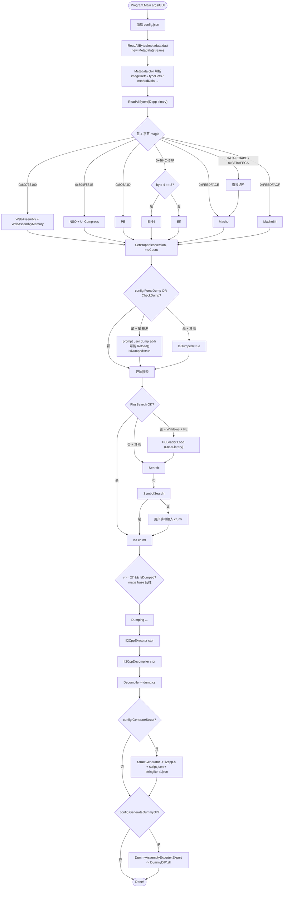
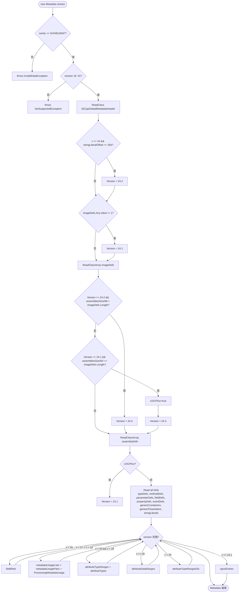
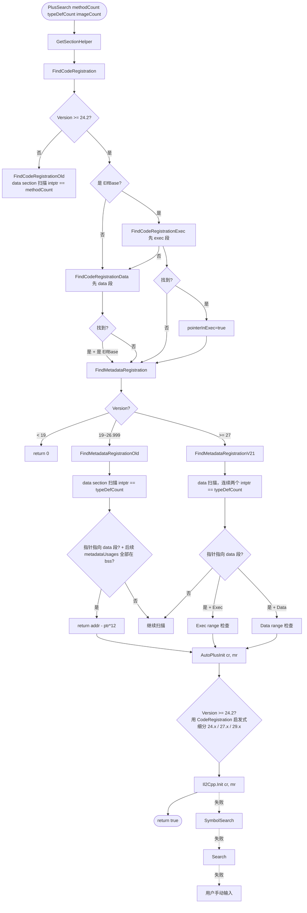
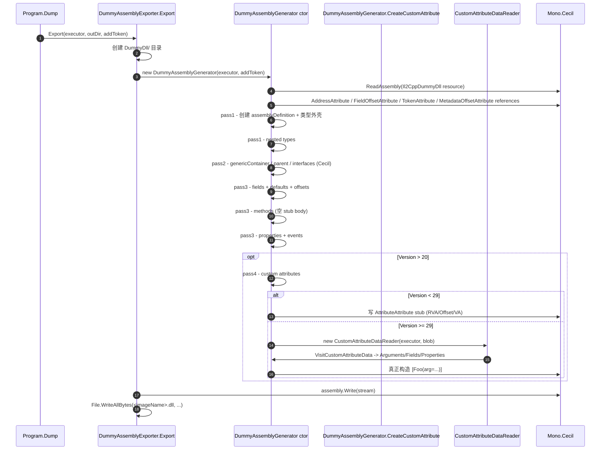
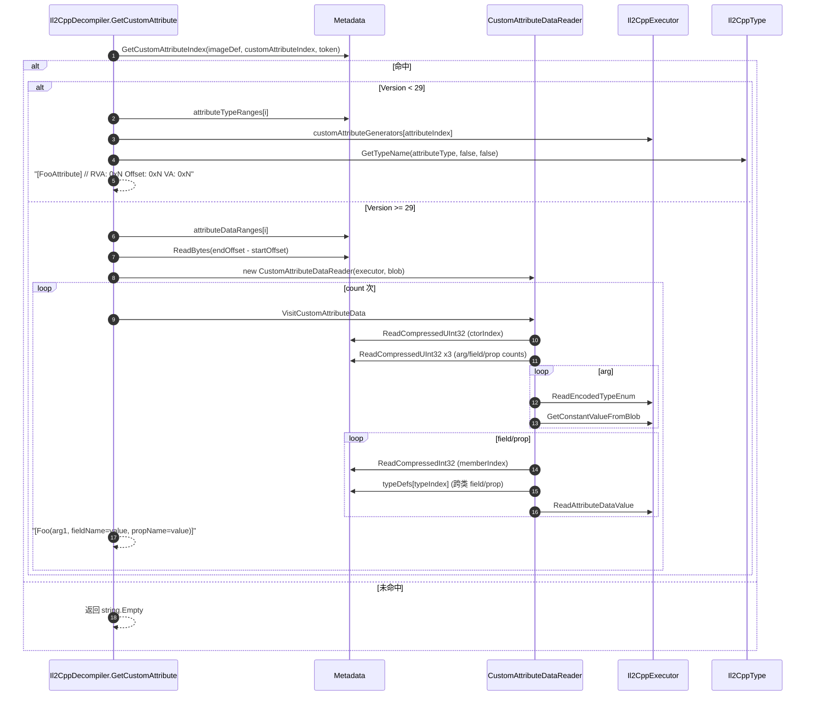

# 05 操作链

下面用 mermaid 图与文字描述 Il2CppDumper 的 7 条主操作链。

---

## 链 1 — 自动模式完整 Dump 流程

`Program.Main` 入口 → 探测格式 → `Init(cr, mr)` → `Dump(...)` 三输出。



文字版：

1. `Program.Main:14` 解析 CLI args / 弹 GUI。
2. `Program.Init:119` 加载 metadata → `Metadata` ctor 解析所有 Defs。
3. `Program.Init:127` 读 il2cpp binary，按 magic 实例化格式子类。
4. `Program.Init:181` `il2Cpp.SetProperties(version, metadataUsagesCount)`（来自 `Il2Cpp/Il2Cpp.cs:45`）。
5. `Program.Init:184` 决定是否 IsDumped；ELF 时可能 `Reload()`（`ElfBase.cs:13`）。
6. `Program.Init:210` `PlusSearch` → 失败则尝试 `PELoader.Load`（仅 Windows + PE）。
7. `Program.Init:223` `Search()` → `Program.Init:227` `SymbolSearch()` → `Program.Init:236` 用户手动。
8. `Il2Cpp.Init:120` 填充 methodPointers、genericInsts、types、codeGenModules（v24.2+）等。
9. `Program.Init:238` v>=27 + IsDumped 时用 typeDef[0] 反推 metadata.ImageBase。
10. `Program.Dump:254` 启动 dump：decompiler → struct → DummyDll。

---

## 链 2 — Metadata 解析 + 版本分支



`Metadata.cs:43-158` 集中体现了"分支因版本而异"的实现风格：所有数组加载用 `ReadMetadataClassArray<T>`，根据 `Version` 决定 `count / SizeOf`。

---

## 链 3 — PlusSearch → SymbolSearch → Search 兜底链



`PlusSearch` 在 PE/ELF/MachO/NSO/WASM 各自子类中实现，但都委托给同一 `SectionHelper`（`Utils/SectionHelper.cs`）的 `FindCodeRegistration/FindMetadataRegistration`。`Search()` 是 MachO/Macho64/Elf32 的 ARM 字节模式扫描；`SymbolSearch()` 仅 Elf/Elf64 实现了基于 ELF `.dynsym` 的符号表查找。

---

## 链 4 — `dump.cs` 生成

```mermaid
sequenceDiagram
    autonumber
    participant U as Program.Dump
    participant Dec as Il2CppDecompiler
    participant Exe as Il2CppExecutor
    participant Meta as Metadata
    participant I as Il2Cpp
    participant FW as StreamWriter

    U->>Dec: Decompile(config, outputDir)
    Dec->>FW: new StreamWriter(dump.cs)
    loop imageIndex in imageDefs
        Dec->>FW: "// Image N: <name> - <typeStart>"
    end
    loop imageDef in imageDefs
        Dec->>Exe: 解析 parent/interfaces
        Dec->>FW: 写 namespace
        Dec->>Dec: visibility/static/abstract/sealed 决定
        Dec->>Exe: GetTypeDefName(typeDef, false, true)
        Dec->>FW: 写 class Foo : Parent, IFoo // TypeDefIndex: N {
        opt config.DumpField
            loop fieldDef
                Dec->>Meta: GetFieldDefaultValueFromIndex
                Dec->>Exe: TryGetDefaultValue
                Dec->>I: GetFieldOffsetFromIndex
                Dec->>FW: "  public int x = 5; // 0x10"
            end
        end
        opt config.DumpProperty
            loop propertyDef
                Dec->>FW: "  int Bar { get; set; }"
            end
        end
        opt config.DumpMethod
            loop methodDef
                opt config.DumpMethodOffset
                    Dec->>I: GetMethodPointer(imageName, methodDef)
                    Dec->>I: GetRVA(pointer)
                    Dec->>FW: "// RVA: 0x... Offset: 0x... VA: 0x... Slot: N"
                end
                Dec->>Exe: GetModifiers
                Dec->>FW: "  public int M(int p) { }"
                opt methodDefinitionMethodSpecs 命中
                    Dec->>FW: GenericInstMethod 注释块
                end
            end
        end
        Dec->>FW: "}"
    end
    Dec->>FW: Close()
```

`Outputs/Il2CppDecompiler.cs:25` 入口。详细字段规则见 `08_functions_detail/output.md`。

---

## 链 5 — `il2cpp.h` + scripts 生成

```mermaid
flowchart TD
    Start([StructGenerator.WriteScript outDir]) --> InitDic[遍历 imageDef.typeDefs<br/>填 typeDefImageNames + structNameDic]
    InitDic --> GenInst[遍历 IL2CPP_TYPE_GENERICINST 的 type<br/>填 nameGenericClassDic + genericClassStructNameDic]
    GenInst --> Loop[遍历每个 typeDef 方法]
    Loop --> PerMethod[Per-method 生成 ScriptMethod<br/>含 Address / Name / Signature / TypeSignature]
    PerMethod --> PerSpec[methodSpecs 的每个 instance<br/>生 MethodInfo_{addr:X} 结构]
    PerSpec --> OrderPtr[合并 codeGenModuleMethodPointers / genericMethodPointers / invokerPointers / customAttributeGenerators / reversePInvokeWrappers / unresolvedVirtualCallPointers -> 去重 + 排序 + 去 0]
    OrderPtr --> Addrs[填 json.Addresses]
    Addrs --> MU{Version >= 27?}
    MU -->|是| ScanData["data section 扫描 encoded token<br/>调 AddMetadataUsage* 写入 ScriptMetadata/Method/String"]
    MU -->|否| MU19{Version > 16?}
    MU19 -->|是| LookupMU["遍历 metadataUsageDic[Usage]<br/>填 Script* via metadataUsages[i.Key]"]
    MU19 -->|否| Skip[跳过]
    ScanData --> StrLit[写 stringliteral.json]
    LookupMU --> StrLit
    Skip --> StrLit

    StrLit --> ScriptJSON[写 script.json]
    ScriptJSON --> GenStruct[遍历 genericClassList 添加 generic class struct]
    GenStruct --> Recurse[RecursionStructInfo 递归输出 _Fields/_RGCTXs/_VTable/_c/_o/_StaticFields]
    Recurse --> HeaderV{"Version?"}
    HeaderV -->|22| H22[HeaderV22]
    HeaderV -->|23/24| H240[HeaderV240]
    HeaderV -->|24.1| H241[HeaderV241]
    HeaderV -->|24.2~24.5| H242[HeaderV242]
    HeaderV -->|27/27.1/27.2| H27[HeaderV27]
    HeaderV -->|29/29.1/31| H29[HeaderV29]
    HeaderV -->|其他| Warn[WARNING: 不支持生成 .h]
    H22 --> WriteH[写 il2cpp.h]
    H240 --> WriteH
    H241 --> WriteH
    H242 --> WriteH
    H27 --> WriteH
    H29 --> WriteH
    Warn --> End
    WriteH --> End([结束])
```

`Outputs/StructGenerator.cs:42` 入口；关键策略：

- 每个 typeDef 对应一个 `TypeName_o` C struct，内嵌 `TypeName_c`（类常量）和 `TypeName_Fields`（实例字段）。
- v24.2+ 用 `codeGenModuleMethodPointers`；v<24.2 用 `methodPointers`。
- MetadataUsage 还原成 IDA 可读的 `Method$<FullName>()`、`Field$<FullName>`、`String$...`。

---

## 链 6 — DummyDll 生成



`Utils/DummyAssemblyGenerator.cs:27` 入口。stub body：

- `void` 方法：单条 `ret`
- 值类型方法：`initobj` + `ldloc.0` + `ret`
- 引用类型方法：`ldnull` + `ret`

---

## 链 7 — v29+ Custom Attribute 恢复



`Utils/CustomAttributeDataReader.cs:98` `VisitCustomAttributeData` 是核心；`AttributeDataToString:71` 把 BlobValue 转字符串。枚举值的处理走 `ReadEncodedTypeEnum:464` (`Il2CppExecutor.cs:464`)。