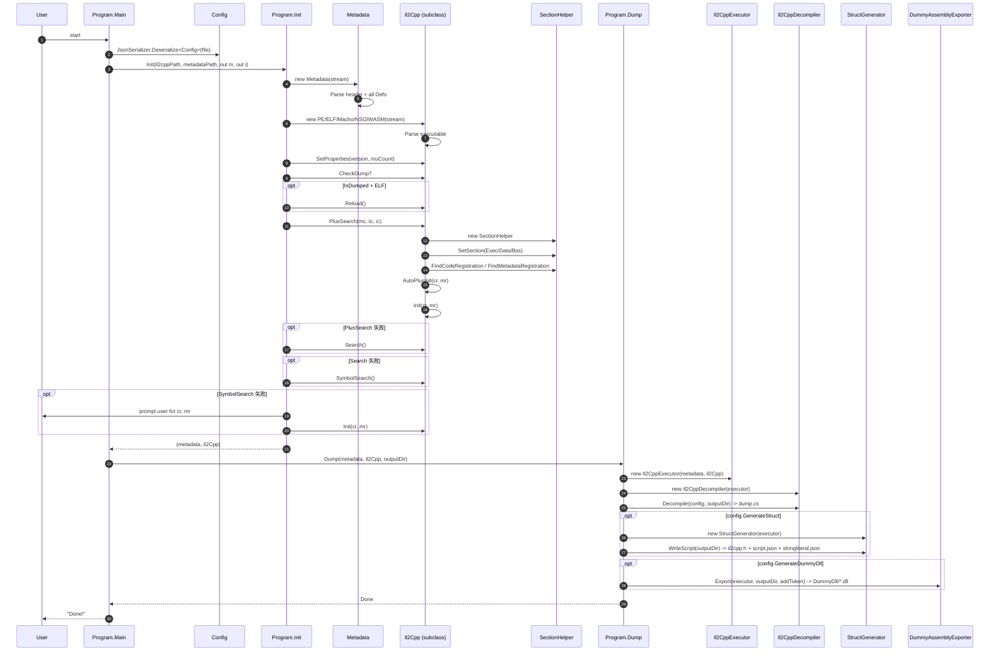
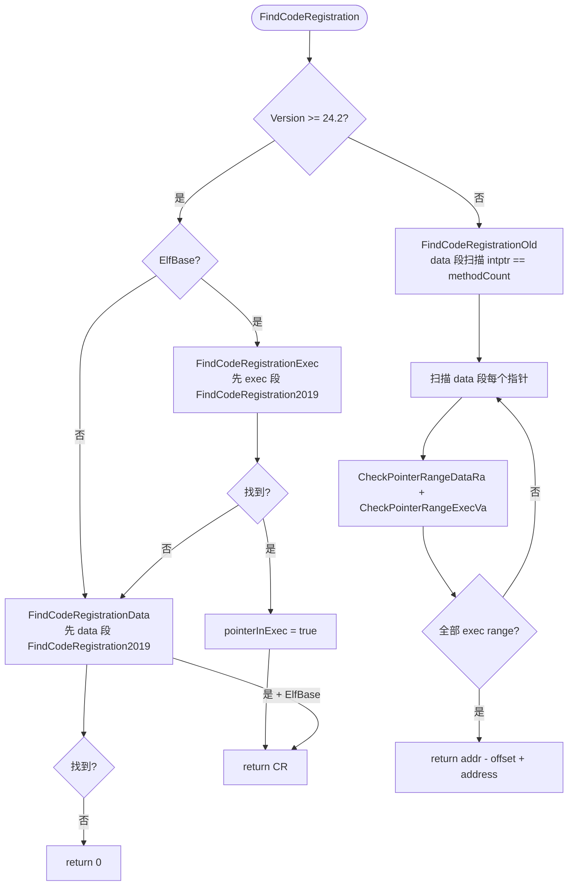

# 09 — 关键调用栈汇总

下面用 mermaid 时序图描绘核心调用关系。每张图都聚焦一条主线。

---

## 栈 1 — `Main` → `Init` → `Dump` 总览



---

## 栈 2 — `Il2CppDecompiler.Decompile` 内部

```mermaid
sequenceDiagram
    autonumber
    participant D as Decompile
    participant Meta as Metadata
    participant Exe as Il2CppExecutor
    participant I as Il2Cpp
    participant FW as StreamWriter
    participant CAD as CustomAttributeDataReader

    D->>FW: new StreamWriter(dump.cs)
    D->>Meta: GetStringFromIndex(imageDef.nameIndex)
    D->>FW: Write("// Image N: name - typeStart")

    loop imageDef
        D->>Meta: GetStringFromIndex(imageDef.nameIndex)
        loop typeDefIndex
            D->>I: types[parentIndex]
            D->>Exe: GetTypeName(parent)
            D->>Meta: GetStringFromIndex(typeDef.namespaceIndex)
            opt config.DumpAttribute
                D->>D: GetCustomAttribute(imageDef, typeDef.customAttributeIndex, typeDef.token)
                opt Version < 29
                    D->>Meta: GetCustomAttributeIndex
                    D->>Meta: attributeTypeRanges[i]
                else Version >= 29
                    D->>Meta: attributeDataRanges[i], attributeDataRanges[i+1]
                    D->>Meta: ReadBytes(endOffset - startOffset)
                    D->>CAD: new CustomAttributeDataReader(executor, blob)
                    CAD->>Exe: ReadEncodedTypeEnum / GetConstantValueFromBlob
                end
            end
            D->>Exe: GetTypeDefName(typeDef, false, true)
            opt config.DumpField
                loop field
                    D->>Meta: GetFieldDefaultValueFromIndex
                    D->>Exe: TryGetDefaultValue
                    D->>I: GetFieldOffsetFromIndex
                end
            end
            opt config.DumpProperty
                loop property
                    D->>Exe: GetModifiers
                end
            end
            opt config.DumpMethod
                loop method
                    opt config.DumpMethodOffset
                        D->>I: GetMethodPointer(imageName, methodDef)
                        D->>I: GetRVA(pointer)
                    end
                    D->>Exe: GetModifiers(methodDef)
                    D->>Exe: GetGenericContainerParams (if generic)
                    loop param
                        D->>Meta: GetParameterDefaultValueFromIndex
                        D->>Exe: TryGetDefaultValue
                    end
                    opt methodDefinitionMethodSpecs 命中
                        D->>Exe: GetMethodSpecName(methodSpec)
                        D->>I: GetRVA(genericMethodPointer)
                    end
                end
            end
        end
    end
    D->>FW: Close()
```

---

## 栈 3 — `StructGenerator.WriteScript` 内部

```mermaid
sequenceDiagram
    autonumber
    participant W as WriteScript
    participant Exe as Il2CppExecutor
    participant Meta as Metadata
    participant I as Il2Cpp
    participant SJ as ScriptJson
    participant F as File

    W->>W: Build structNameDic per typeDef
    W->>I: types.filter(IL2CPP_TYPE_GENERICINST)
    W->>Exe: GetGenericClassTypeDefinition(genericClass)
    W->>W: Fill nameGenericClassDic + genericClassStructNameDic

    loop imageDef + typeDef + methodDef
        W->>I: GetMethodPointer(imageName, methodDef)
        opt methodPointer > 0
            W->>SJ: new ScriptMethod { Address, Name, Signature, TypeSignature }
            W->>Exe: GetTypeName / ParseType (return + params)
        end
        opt methodDefinitionMethodSpecs
            W->>Exe: GetMethodSpecName(spec, true)
            W->>Exe: GetMethodSpecGenericContext(spec)
            W->>Exe: GenerateRGCTX
        end
    end

    W->>W: orderedPointers = codeGenModuleMethodPointers ∪ genericMethodPointers ∪ invokerPointers ∪ customAttributeGenerators ∪ reversePInvokeWrappers ∪ unresolvedVirtualCallPointers (Distinct + sort + remove 0)
    W->>I: GetRVA(orderedPointers[i])
    W->>SJ: json.Addresses = RVA[]

    opt Version >= 27
        W->>I: sectionHelper.Data 扫描
        W->>W: AddMetadataUsage*(json, idx, va)
    else Version > 16 && Version < 27
        W->>Meta: metadataUsageDic[Usage]
        W->>I: metadataUsages[key]
        W->>W: AddMetadataUsage*(json, decodedIdx, va)
    end

    W->>F: WriteAllText(stringliteral.json)
    W->>F: WriteAllText(script.json)

    W->>W: for genericClassList -> AddGenericClassStruct
    W->>W: RecursionStructInfo (BFS through structInfoList + parents + fields)
    W->>W: Append GenericHeader + HeaderV{22/240/241/242/27/29} + structInfo + arrayClassHeader + methodInfoHeader
    W->>F: WriteAllText(il2cpp.h)
```

---

## 栈 4 — `DummyAssemblyGenerator` 构造器四遍 pass

```mermaid
sequenceDiagram
    autonumber
    participant G as DummyAssemblyGenerator ctor
    participant Res as Resource1.Il2CppDummyDll
    participant MD as Metadata
    participant I as Il2Cpp
    participant Cec as Mono.Cecil
    participant CAD as CustomAttributeDataReader

    G->>Res: ReadAssembly(Il2CppDummyDll)
    G->>Res: AddressAttribute / FieldOffsetAttribute / AttributeAttribute / MetadataOffsetAttribute / TokenAttribute
    G->>G: new MyAssemblyResolver + ModuleParameters

    Note over G: Pass 1: 创建 assembly 外壳
    loop imageDef
        G->>MD: GetStringFromIndex(aname.nameIndex)
        G->>Cec: AssemblyDefinition.CreateAssembly
        G->>MD: typeDefs[typeStart..typeEnd)
        G->>Cec: TypeDefinition(ns, name, flags) -> moduleDefinition.Types.Add
    end

    Note over G: Pass 1b: nested
    loop imageDef + typeDef
        G->>MD: nestedTypeIndices[def.nestedTypesStart + i]
        G->>Cec: typeDefinition.NestedTypes.Add(nestedTypeDefinition)
    end

    Note over G: Pass 2: generic / parent / interfaces
    loop typeDef
        opt addToken
            G->>Cec: typeDefinition.CustomAttributes.Add([Token("0xN")])
        end
        opt typeDef.genericContainerIndex >= 0
            G->>MD: genericContainers + genericParameters
            G->>G: CreateGenericParameter
            G->>Cec: typeDefinition.GenericParameters.Add
        end
        opt typeDef.parentIndex >= 0
            G->>I: types[parentIndex]
            G->>G: GetTypeReference
        end
        loop interfaces
            G->>I: types[interfaceIndices[...]]
            G->>Cec: typeDefinition.Interfaces.Add
        end
    end

    Note over G: Pass 3: fields + methods + properties + events
    loop typeDef
        loop field
            G->>MD: fieldDefs[i]
            G->>I: types[fieldDef.typeIndex]
            G->>Cec: FieldDefinition + [Token] + [FieldOffset] + [MetadataOffset] (default)
        end
        loop method
            G->>MD: methodDefs[i]
            G->>I: types[methodDef.returnType]
            G->>Cec: MethodDefinition(returnType) + ImplAttributes + [Token]
            opt HasBody and !delegate
                G->>Cec: Body stub (ret / initobj / ldnull)
            end
            loop param
                G->>MD: parameterDefs[methodDef.parameterStart + j]
                G->>I: types[parameterDef.typeIndex]
                G->>Cec: ParameterDefinition
                opt parameterDefault
                    G->>Exe: TryGetDefaultValue
                end
            end
            opt !abstract
                G->>I: GetMethodPointer(imageName, methodDef)
                G->>I: GetRVA(methodPointer)
                G->>Cec: [Address(RVA, Offset, VA, Slot?)]
            end
        end
        loop property
            G->>MD: propertyDefs[i]
            G->>Cec: PropertyDefinition(getMethod, setMethod)
        end
        loop event
            G->>MD: eventDefs[i]
            G->>Cec: EventDefinition(add, remove, raise)
        end
    end

    Note over G: Pass 4: custom attributes (Version > 20)
    loop typeDef + field + method + param + property + event
        G->>MD: GetCustomAttributeIndex
        opt 命中
            opt Version < 29
                G->>MD: attributeTypeRanges[i]
                G->>G: TryRestoreCustomAttribute or stub AttributeAttribute(RVA/Offset)
            else Version >= 29
                G->>MD: attributeDataRanges[i] + [i+1]
                G->>MD: ReadBytes
                G->>CAD: new CustomAttributeDataReader(executor, blob)
                CAD->>G: VisitCustomAttributeData()
                G->>Cec: CustomAttribute(real ctor + Arguments/Fields/Properties)
            end
        end
    end
```

---

## 栈 5 — `SectionHelper.FindCodeRegistration` (v24.2+)



---

## 栈 6 — 异常兜底链（PlusSearch → Search → SymbolSearch → Manual）

```mermaid
flowchart TD
    Start([PlusSearch 失败]) --> IsPE{PE + Windows?}
    IsPE -->|是| PELoad["PELoader.Load (Win32 LoadLibrary)"]
    PELoad --> RePlus[再调一次 PlusSearch]
    RePlus --> R1{成功?}
    R1 -->|是| Done
    R1 -->|否| Next1
    IsPE -->|否| Next1[Search]
    Next1 --> R2{成功?}
    R2 -->|是| Done
    R2 -->|否| Next2[SymbolSearch]
    Next2 --> R3{成功?}
    R3 -->|是| Done
    R3 -->|否| Manual[用户手动输入 cr, mr]
    Manual --> Init[il2Cpp.Init(cr, mr)]
    Init --> Done([Init 成功])
```

---

## 栈 7 — `CustomAttributeDataReader.VisitCustomAttributeData` (v29+)

```mermaid
sequenceDiagram
    autonumber
    participant V as VisitCustomAttributeData
    participant Meta as Metadata
    participant Exe as Il2CppExecutor
    participant CAD as CustomAttributeDataReader

    V->>CAD: ReadInt32 -> ctorIndex
    V->>Meta: methodDefs[ctorIndex]
    V->>Meta: typeDefs[methodDef.declaringType]
    Note over V: ctorBuffer = Position
    V->>CAD: ReadCompressedUInt32 -> argumentCount
    V->>CAD: ReadCompressedUInt32 -> fieldCount
    V->>CAD: ReadCompressedUInt32 -> propertyCount

    loop argument
        V->>Exe: ReadEncodedTypeEnum(reader, out enumType)
        V->>Exe: GetConstantValueFromBlob(type, reader, out blobValue)
        V->>V: argument.Value = blobValue
    end

    loop field
        V->>Exe: ReadEncodedTypeEnum + GetConstantValueFromBlob
        V->>CAD: ReadCustomAttributeNamedArgumentClassAndIndex(typeDef)
        V->>Meta: typeDefs[typeIndex] (跨类字段)
        V->>V: field.Index = declaring.fieldStart + memberIndex
    end

    loop property
        (同 field，但 propertyStart)
    end

    V-->>CustomAttributeReaderVisitor: return visitor
```