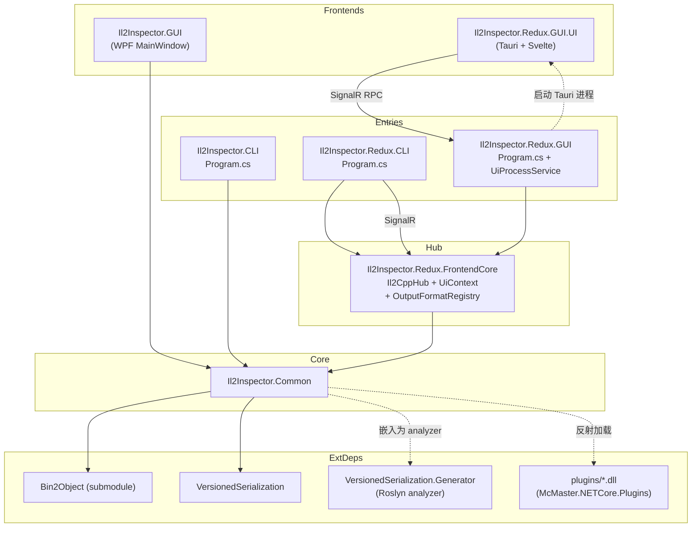
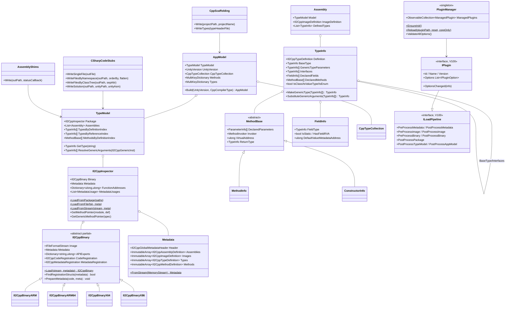

# 03 · 架构总览

## 3.1 分层

```
┌────────────────────────────────────────────────────────────────────┐
│  Frontends (UI)                                                    │
│  ├── WPF MainWindow  (Il2CppInspector.GUI/)                        │
│  └── Tauri+Svelte UI (Il2CppInspector.Redux.GUI.UI/)              │
├────────────────────────────────────────────────────────────────────┤
│  Entry executables                                                 │
│  ├── Il2CppInspector.CLI/Program.cs        (CommandLineParser)     │
│  ├── Il2CppInspector.Redux.CLI/Program.cs  (Spectre + SignalR)    │
│  └── Il2CppInspector.Redux.GUI/Program.cs  (WebApp + Tauri)        │
├────────────────────────────────────────────────────────────────────┤
│  Hub + shared state                                                │
│  └── Il2Inspector.Redux.FrontendCore (UiContext + Il2CppHub +     │
│        IOutputFormat providers)                                    │
├────────────────────────────────────────────────────────────────────┤
│  Core library                                                      │
│  └── Il2CppInspector.Common                                          │
│      ├── IL2CPP/         (Il2CppInspector, Il2CppBinary, Metadata) │
│      ├── Reflection/     (TypeModel, TypeInfo, …)                  │
│      ├── Model/          (AppModel, AppType, AppMethod)            │
│      ├── Cpp/            (CppDeclarationGenerator, CppType…)      │
│      ├── Outputs/        (CSharpCodeStubs, CppScaffolding, …)     │
│      ├── FileFormatStreams/ (PE/ELF/MachO/NSO/APK/…)               │
│      ├── Plugins/        (PluginManager + V100 API)                │
│      └── Next/           (VersionedSerialization-backed structs)   │
├────────────────────────────────────────────────────────────────────┤
│  Plugins                                                            │
│  └── ./plugins/*.dll  (loaded by McMaster.NETCore.Plugins)          │
├────────────────────────────────────────────────────────────────────┤
│  External                                                           │
│  ├── Bin2Object  (submodule, currently empty)                      │
│  ├── dnlib 4.4 · K4os.Compression.LZ4 · Spectre.Console            │
│  └── VersionedSerialization (+ Roslyn generator)                    │
└────────────────────────────────────────────────────────────────────┘
```

## 3.2 模块依赖图



## 3.3 启动流程（CLI + Redux GUI）

```mermaid
flowchart TD
    Start([用户执行 exe / dotnet run])

    Start --> CLIType{哪种入口?}

    CLIType -->|Il2Inspector.CLI| CLIMain[Program.Main]
    CLIType -->|Il2Inspector.Redux.CLI| RCLIMain[Program.Main]
    CLIType -->|Il2Inspector.Redux.GUI| RGUIMain[Program.Main]
    CLIType -->|Il2Inspector.GUI| WPFMain[App.xaml.cs]

    CLIMain --> Parse[CommandLineParser.ParseArguments<Options>]
    Parse --> PluginInit[PluginManager.EnsureInit]
    PluginInit --> LoadIns[Il2Inspector.LoadFromPackage / LoadFromFile]
    LoadIns --> TypeModel[TypeModel 构造]
    TypeModel --> AppModel[AppModel.Build]
    AppModel --> Emit[选择输出: CSharp / CppScaffolding / JSON / DLL / Python]
    Emit --> Done([ExitCode=0])

    RCLIMain --> WebApp[WebApplication.CreateSlimBuilder]
    WebApp --> MapHub[MapHub<Il2CppHub>('/il2cpp')]
    MapHub --> SpectreRun[CommandApp<InteractiveCommand>.RunAsync]
    SpectreRun --> Connect[CliClient.Connect localhost:port/il2cpp]
    Connect --> ProcessCmd[ProcessCommand.ExecuteAsync]
    ProcessCmd --> SignalRPC[hub.SubmitInputFiles / QueueExport / StartExport]
    SignalRPC --> Done

    RGUIMain --> WebApp
    WebApp --> MapHub
    MapHub --> UiService[UiProcessService.LaunchUiProcess port]
    UiService --> ExtractTauri[ExtractUiExecutable → %TEMP%/il2cppinspectorredux-ui/]
    ExtractTauri --> SpawnTauri[Process.Start tauri-exe.exe argv[0]=port]
    SpawnTauri --> TauriUI([Tauri WebView 用户交互])
    TauriUI --SignalR RPC--> MapHub

    WPFMain --> WPFWindow[MainWindow.xaml.cs]
    WPFWindow --> ClickLoad[用户点击 Load]
    ClickLoad --> PluginInit
    PluginInit --> LoadIns
```

## 3.4 核心类型关系

