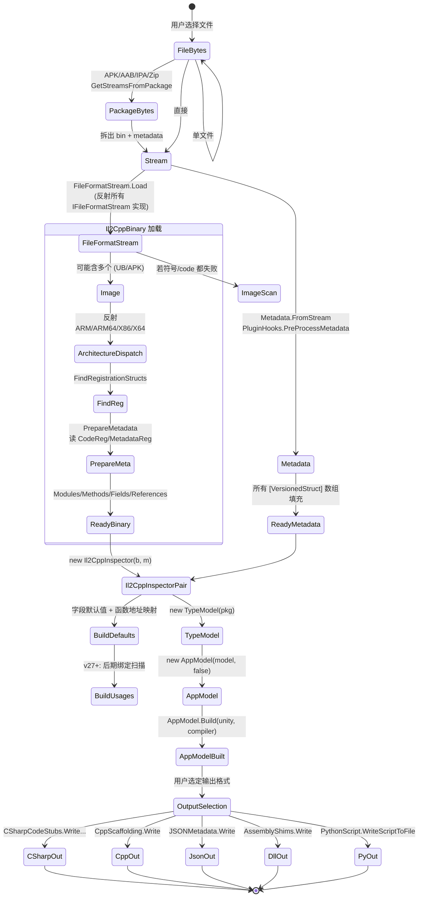

# 04 · 数据流与核心数据结构

## 4.1 三层数据模型

```
┌─────────────────────────────────────────────────────────────────────────┐
│  Layer 1: 原始字节                                                       │
│  ┌───────────────────────┐  ┌─────────────────────────────────────┐    │
│  │  IFileFormatStream    │  │  MemoryStream (global-metadata.dat)  │    │
│  │  (PE/ELF/MachO/NSO/   │  │  → Metadata.FromStream              │    │
│  │   APK/AAB/UB/...)     │  │                                     │    │
│  └───────────────────────┘  └─────────────────────────────────────┘    │
└─────────────────────────────────────────────────────────────────────────┘
                                │
                                ▼
┌─────────────────────────────────────────────────────────────────────────┐
│  Layer 2: il2cpp 类型系统 (unmanaged view)                              │
│  ┌─────────────────────────────────────────────────────────────────┐    │
│  │ Il2CppBinary: Code/Metadata Registration, Modules, Methods     │    │
│  │ Metadata:    Header + 所有类型化数组                            │    │
│  │              (Types, Methods, Fields, Params, GenericContainers│   │
│  │               Attributes, Usages, References, Specs, Generics)  │   │
│  └─────────────────────────────────────────────────────────────────┘    │
└─────────────────────────────────────────────────────────────────────────┘
                                │
                                ▼  TypeModel 构造
┌─────────────────────────────────────────────────────────────────────────┐
│  Layer 3: .NET 反射视图 (managed-style view)                            │
│  ┌─────────────────────────────────────────────────────────────────┐    │
│  │ TypeModel → Assembly[] → TypeInfo[]                            │    │
│  │           → MethodBase[] / FieldInfo / PropertyInfo / EventInfo│    │
│  │           → CustomAttributeData[]                              │    │
│  │ AppModel (叠加 C++ layout)                                    │    │
│  └─────────────────────────────────────────────────────────────────┘    │
└─────────────────────────────────────────────────────────────────────────┘
                                │
                                ▼  Output emitters
                                │
                                CSharpCodeStubs  → types.cs
                                CppScaffolding   → *.h, *.cpp, *.vcxproj
                                AssemblyShims    → *.dll
                                JSONMetadata     → metadata.json
                                PythonScript     → il2cpp.py
```

## 4.2 关键数据结构（按文件）

### 4.2.1 `IFileFormatStream` —— 二进制视图的抽象

| 字段 | 类型 | 用途 |
|------|------|------|
| `Version` | `StructVersion` | 文件格式版本（用于条件读取） |
| `Length`, `NumImages` | `long`, `uint` | 流长度 + fat/UB 中图像数 |
| `DefaultFilename`, `Format`, `Arch`, `Bits` | `string` | 描述性 |
| `GlobalOffset`, `ImageBase` | `ulong` | VA ↔ 文件偏移重算 |
| `Images` | `IEnumerable<IFileFormatStream>` | UB / APK 中的多个图像 |
| `IsModified` | `bool` | plugin 是否改写 |
| `MapVATR(va) → uint` | `uint` | VA → file offset |
| `TryMapFileOffsetToVA(off) → ulong?` | | 反向 |
| `ReadMapped{Word,UWord,Object,VersionedObject}` | 多形态 | 透明读取 + 映射 |
| `GetSymbolTable`, `GetFunctionTable`, `GetExports`, `GetSections` | | 给 `FindMetadataFromSymbols` 用 |

### 4.2.2 `Il2CppBinary` —— 运行时注册表

```csharp
public abstract partial class Il2CppBinary {
    // 头部：CodeRegistration + MetadataRegistration
    public Il2CppCodeRegistration     CodeRegistration        { get; protected set; }
    public Il2CppMetadataRegistration MetadataRegistration     { get; protected set; }
    public ulong CodeRegistrationPointer / MetadataRegistrationPointer / RegistrationFunctionPointer { get; }

    // 模块表（v24.2+）
    public Dictionary<string, Il2CppCodeGenModule> Modules { get; }

    // 方法指针（≤v24.1 全局 / ≥v24.2 按模块）
    public ulong[] GlobalMethodPointers { get; set; }
    public Dictionary<Il2CppCodeGenModule, ulong[]> ModuleMethodPointers { get; set; }
    public Dictionary<Il2CppCodeGenModule, ImmutableArray<int>> MethodInvokerIndices { get; set; }

    // 字段偏移
    public ImmutableArray<uint> FieldOffsets { get; }
    public long[] FieldOffsetPointers { get; }

    // VTable / 类型引用 / 泛型
    public ImmutableArray<uint> VTableMethodReferences { get; }
    public ImmutableArray<Il2CppType> TypeReferences { get; }
    public Dictionary<ulong, int> TypeReferenceIndicesByAddress { get; }
    public ImmutableArray<Il2CppMethodSpec> MethodSpecs { get; }
    public ImmutableArray<Il2CppGenericInst> GenericInstances { get; }
    public Dictionary<Il2CppMethodSpec, ulong> GenericMethodPointers { get; }
    public Dictionary<Il2CppMethodSpec, int>  GenericMethodInvokerIndices { get; }

    // 自定义属性生成器
    public ulong[] CustomAttributeGenerators { get; }
    public ulong[] MethodInvokePointers { get; }

    public ImmutableArray<Il2CppTypeDefinitionSizes> TypeDefinitionSizes { get; }
}
```

### 4.2.3 `Metadata` —— `global-metadata.dat` 全部类型化字段

```csharp
public class Metadata : BinaryObjectStreamReader {
    public Il2CppGlobalMetadataHeader Header { get; set; }
    public ImmutableArray<Il2CppAssemblyDefinition> Assemblies { get; set; }
    public ImmutableArray<Il2CppImageDefinition>    Images    { get; set; }
    public ImmutableArray<Il2CppTypeDefinition>     Types     { get; set; }
    public ImmutableArray<Il2CppMethodDefinition>   Methods   { get; set; }
    public ImmutableArray<Il2CppParameterDefinition> Params   { get; set; }
    public ImmutableArray<Il2CppFieldDefinition>    Fields    { get; set; }
    public ImmutableArray<Il2CppFieldDefaultValue>  FieldDefaultValues    { get; set; }
    public ImmutableArray<Il2CppParameterDefaultValue> ParameterDefaultValues { get; set; }
    public ImmutableArray<Il2CppPropertyDefinition> Properties { get; set; }
    public ImmutableArray<Il2CppEventDefinition>    Events    { get; set; }
    public ImmutableArray<Il2CppGenericContainer>   GenericContainers { get; set; }
    public ImmutableArray<Il2CppGenericParameter>   GenericParameters { get; set; }
    public ImmutableArray<TypeIndex>                GenericConstraintIndices { get; set; }
    public ImmutableArray<Il2CppCustomAttributeTypeRange> AttributeTypeRanges { get; set; }
    public ImmutableArray<Il2CppCustomAttributeDataRange>  AttributeDataRanges { get; set; }
    public ImmutableArray<Il2CppInterfaceOffsetPair> InterfaceOffsets { get; set; }
    public ImmutableArray<Il2CppMetadataUsageList>  MetadataUsageLists { get; set; }
    public ImmutableArray<Il2CppMetadataUsagePair>  MetadataUsagePairs { get; set; }
    public ImmutableArray<Il2CppFieldRef>          FieldRefs { get; set; }
    public ImmutableArray<TypeIndex>               InterfaceUsageIndices { get; set; }
    public ImmutableArray<int>                     NestedTypeIndices { get; set; }
    public ImmutableArray<int>                     AttributeTypeIndices { get; set; }
    public ImmutableArray<uint>                    VTableMethodIndices { get; set; }
    public string[]                                StringLiterals { get; set; }
    public ImmutableArray<Il2CppInlineArrayLength> TypeInlineArrays { get; set; }
    public Dictionary<int,string>                  Strings { get; }
    public Dictionary<int,byte[]>                  AssemblyPublicKeys { get; }
    public bool IsModified { get; }
    public int  FieldAndParameterDefaultValueDataOffset { get; }
    public int  AttributeDataOffset { get; }
}
```

### 4.2.4 `Il2CppInspector` —— Binary+Metadata 桥

```csharp
public class Il2CppInspector {
    public Il2CppBinary Binary { get; }
    public Metadata Metadata { get; }
    public Dictionary<ulong, ulong> FunctionAddresses { get; }      // 已排序 + diff 后的方法地址
    public Dictionary<int, Dictionary<uint, int>> AttributeIndicesByToken { get; }
    public List<MetadataUsage> MetadataUsages { get; }
    public StructVersion Version => Metadata.Version > Binary.Image.Version
                                       ? Metadata.Version : Binary.Image.Version;
    public Dictionary<int, (ulong, object)> FieldDefaultValue { get; }
    public Dictionary<int, (ulong, object)> ParameterDefaultValue { get; }
    public List<long> FieldOffsets { get; }
    public Dictionary<TypeIndex, int> TypeInlineArrays { get; }
}
```

### 4.2.5 `TypeModel` / `TypeInfo` —— 重建 .NET 反射视图

```csharp
public class TypeModel {
    public Il2CppInspector Package { get; }
    public List<Assembly> Assemblies { get; }
    public List<string>   Namespaces { get; }
    public TypeInfo[]     TypesByDefinitionIndex { get; }
    public TypeInfo[]     TypesByReferenceIndex  { get; }
    public TypeInfo[]     GenericParameterTypes  { get; }
    public Dictionary<Il2CppMethodSpec, MethodBase> GenericMethods { get; }
    public Dictionary<string, TypeInfo>            TypesByFullName { get; }
    public IEnumerable<TypeInfo> Types { get; }
    public MethodBase[] MethodsByDefinitionIndex { get; }
    public MethodInvoker[] MethodInvokers { get; }
    public ConcurrentDictionary<int, CustomAttributeData> AttributesByIndices { get; }
    public ConcurrentDictionary<int, List<CustomAttributeData>> AttributesByDataIndices { get; }
    public Dictionary<TypeInfo, List<CustomAttributeData>> CustomAttributeGenerators { get; }
    public Dictionary<ulong, List<CustomAttributeData>>    CustomAttributeGeneratorsByAddress { get; }
}

public class TypeInfo {
    public Il2CppTypeDefinition     Definition { get; }
    public Il2CppTypeDefinitionSizes Sizes     { get; }
    public int                      Index { get; }
    public TypeAttributes           Attributes { get; }
    public TypeInfo                 BaseType { get; }
    public TypeInfo[]               GenericTypeParameters { get; }
    public TypeInfo[]               GenericTypeArguments { get; }
    public TypeInfo[]               Interfaces { get; }
    public TypeInfo                 ElementType { get; }
    public FieldInfo[]              DeclaredFields { get; }
    public MethodBase[]             DeclaredMethods { get; }
    public PropertyInfo[]           DeclaredProperties { get; }
    public EventInfo[]              DeclaredEvents { get; }
    public ConstructorInfo[]        DeclaredConstructors { get; }
    public TypeInfo[]               DeclaredNestedTypes { get; }
    public string FullName / Namespace / Name / CSharpName { get; }
    public TypeInfo MakeArrayType(int), MakeByRefType(), MakePointerType();
    public TypeInfo MakeGenericType(params TypeInfo[]);
    public MethodBase MakeGenericMethod(params TypeInfo[]);
    public TypeInfo SubstituteGenericArguments(TypeInfo[]);
}
```

### 4.2.6 `AppModel` —— 复合 C++ 布局模型

```csharp
public class AppModel : IEnumerable<CppType> {
    public CppCompilerType TargetCompiler { get; }
    public UnityVersion    UnityVersion   { get; }
    public UnityHeaders    UnityHeaders   { get; }
    public CppTypeCollection CppTypeCollection { get; }
    public List<CppType> DependencyOrderedCppTypes    { get; }
    public List<CppType> RequiredForwardDefinitions   { get; }
    public MultiKeyDictionary<MethodBase, CppFnPtrType, AppMethod>  Methods { get; }
    public MultiKeyDictionary<TypeInfo,  CppComplexType, AppType>   Types   { get; }
    public Dictionary<ulong, string>    Strings  { get; }
    public Dictionary<ulong, (FieldInfo Field, string Value)> Fields / FieldRvas { get; }
    public TypeModel TypeModel { get; }
    public List<Export> Exports { get; }
    public Dictionary<string, Symbol> Symbols { get; }
    public MultiKeyDictionary<string, ulong, CppFnPtrType> AvailableAPIs { get; }
    public int WordSizeBits / WordSizeBytes;
    public AppModel(TypeModel model, bool makeDefaultBuild = true);
    public AppModel Build(UnityVersion = null, CppCompilerType = BinaryFormat, bool silent = false);
}
```

## 4.3 数据生命周期（stateDiagram-v2）



## 4.4 关键不变量

1. **`TypeModel` 与 `Metadata` 同生命周期**：`TypeModel.Package` 始终非 null；`TypeInfo` 引用链不会悬挂。
2. **`Il2CppBinary.Version` 来自 `IFileFormatStream.Version`**；`Metadata.Version` 来自 `Il2CppGlobalMetadataHeader.Version`。`Il2CppInspector.Version = max(meta, img)`。
3. **`CppTypeCollection` 的所有类型都通过 `UnityHeaders` 的内置 `.h` 文件解析得到**，不再运行时编译 C++。
4. **`AppModel.Build` 是幂等但昂贵的**：`makeDefaultBuild=false` 跳过自动构建，留待用户显式触发。
5. **泛型实例通过 `Il2CppGenericInst → Il2CppGenericClass → TypeInfo.MakeGenericType`** 物化为完整类型对象。