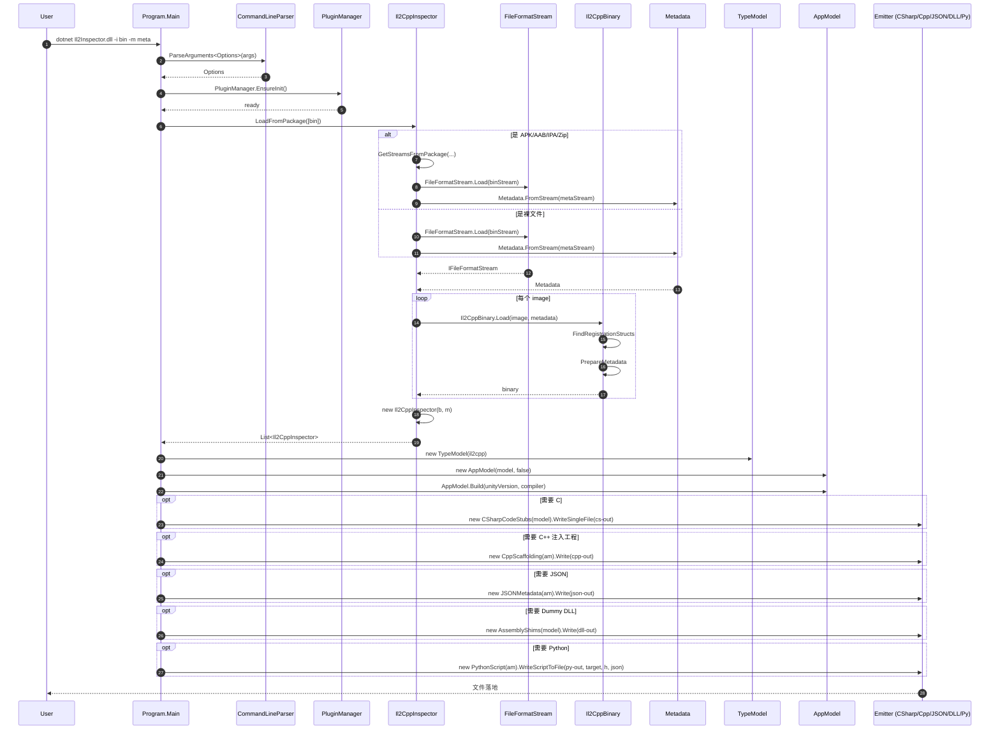
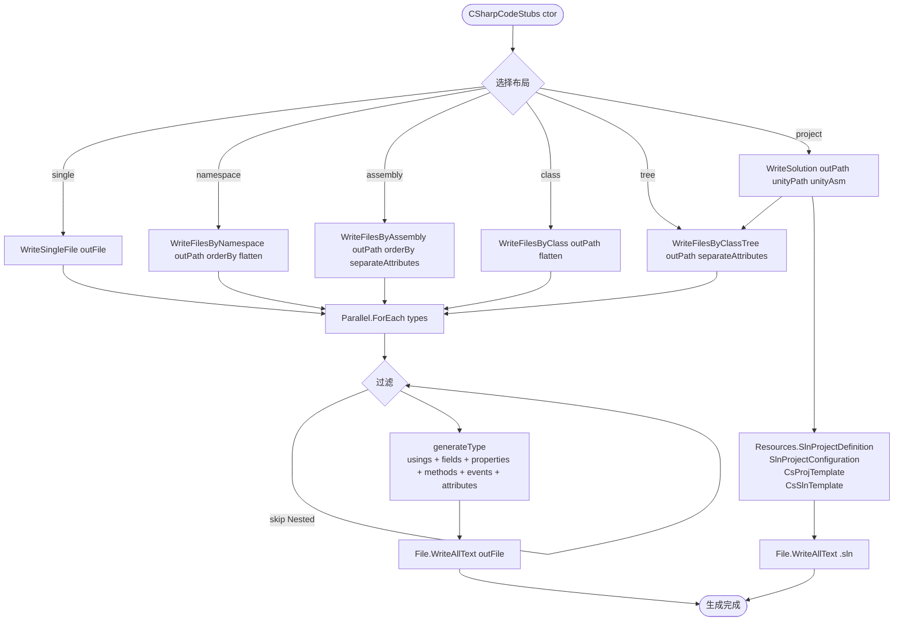
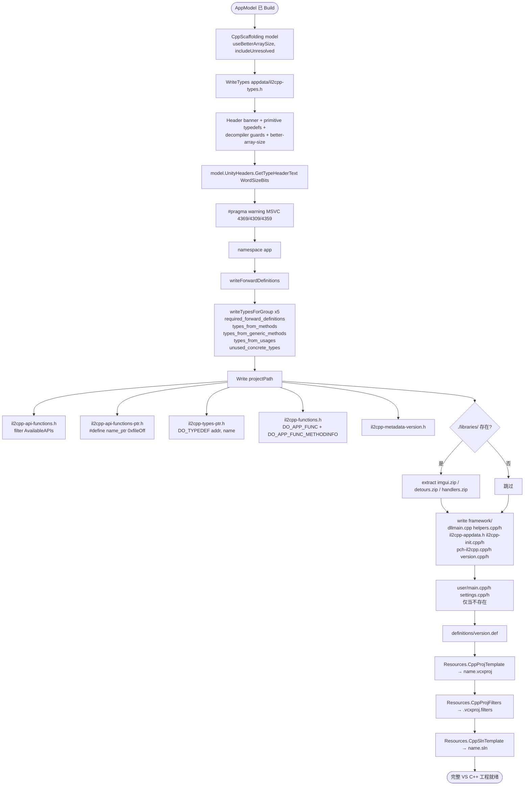
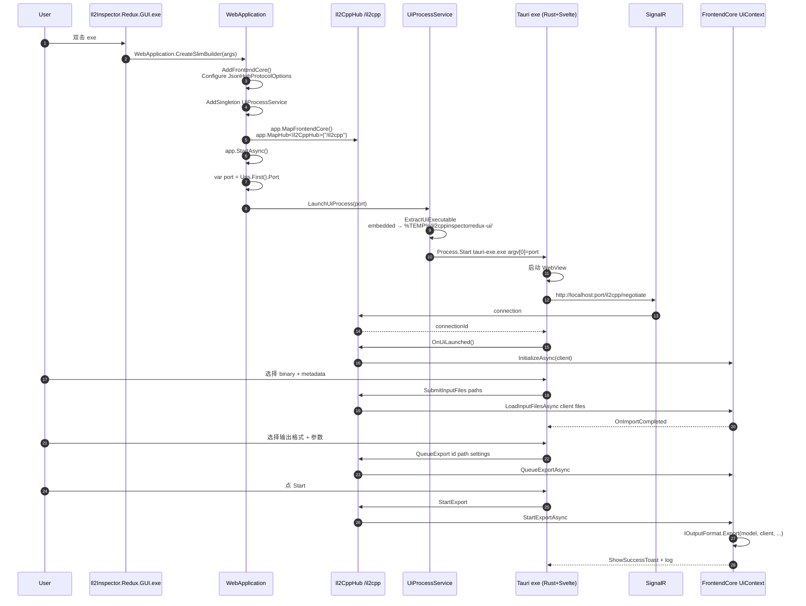
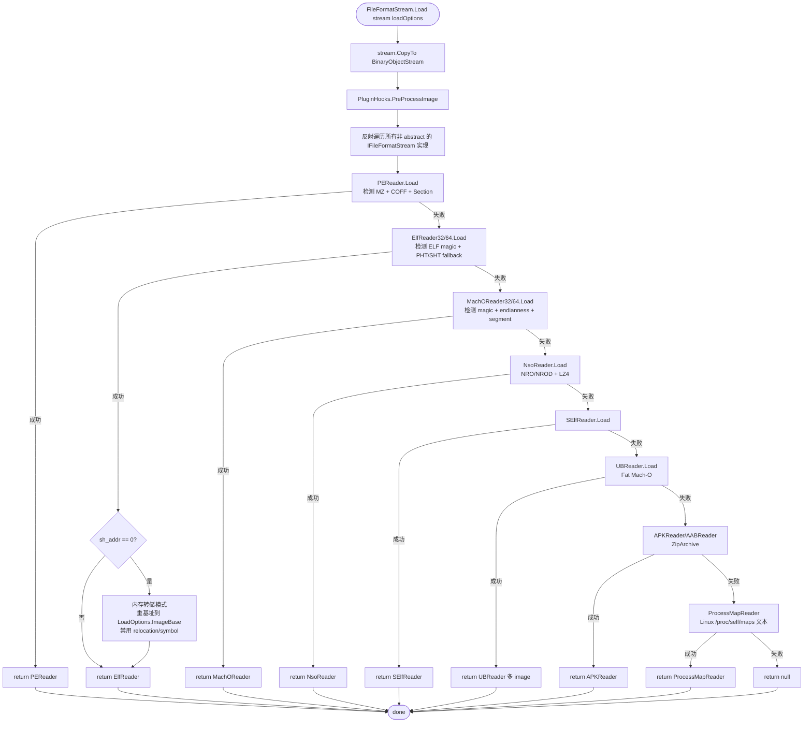
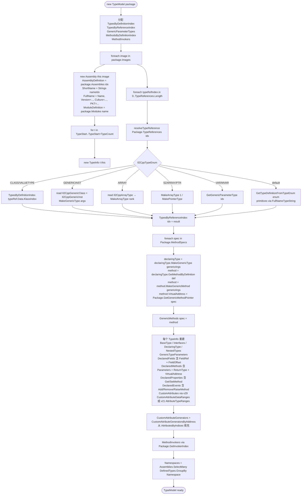
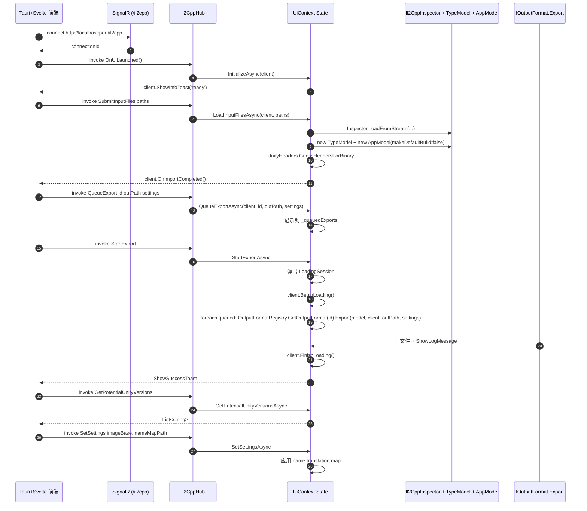
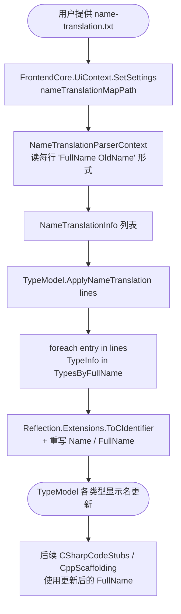
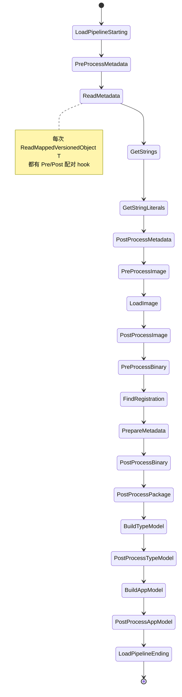

# 05 · 主要操作链（每条配 mermaid）

> 每条链都标注：输入 → 入口文件 + 函数 → 关键步骤 → 输出。
> 来源已逐条用 `grep -n` 与源文件交叉核对。

---

## 5.1 主 CLI 入口 → 加载 binary + metadata → 输出文件

**入口**：`Il2CppInspector.CLI/Program.cs:Main` → `App.Run(options)` → 全部 emitter



---

## 5.2 C# 源代码生成（CSharpCodeStubs）

**入口**：`Outputs/CSharpCodeStubs.cs:CSharpCodeStubs(TypeModel)` → 任一 `Write*` 方法



---

## 5.3 C++ scaffolding 生成（CppScaffolding + CppDeclarationGenerator）

**入口**：`Outputs/CppScaffolding.cs:CppScaffolding(AppModel)` → `Write(projectPath)`



---

## 5.4 Redux GUI 启动流程

**入口**：`Il2CppInspector.Redux.GUI/Program.cs:Main` → `UiProcessService.LaunchUiProcess(port)` → Tauri WebView



---

## 5.5 插件加载流程（PluginManager）

**入口**：`Plugins/Internal/PluginManager.cs:EnsureInit` → `Reload(pluginPath)`

```mermaid
flowchart TD
    Start([CLI/GUI 启动]) --> Ensure[PluginManager.EnsureInit]
    Ensure --> IsInit{AsInstance != null?}
    IsInit -->|是| Done1([就绪])
    IsInit -->|否| Reload[Reload pluginPath=null reset=true coreOnly=false]
    Reload --> Reset{singleton.ManagedPlugins.Clear if reset}
    Reset --> Enabled{PluginManager.Enabled?}
    Enabled -->|否| Skip([跳过])
    Enabled -->|是| Folder[pluginFolder = exeDir/plugins]
    Folder --> Exists{Directory.Exists?}
    Exists -->|否| Throw[DirectoryNotFoundException]
    Exists -->|是| Loop[foreach *.dll in plugins/**]
    Loop --> Load[PluginLoader.CreateFromAssemblyFile dll<br/>sharedTypes: V100.IPlugin]
    Load --> Asm[loader.LoadDefaultAssembly]
    Asm --> Types[asm.GetTypes]
    Types --> Assignable{typeof IPlugin && !IsAbstract?}
    Assignable -->|否| Loop
    Assignable -->|是| Create[Activator.CreateInstance type]
    Create --> AsCore{is ICorePlugin?}
    AsCore -->|是| Add1[Add ManagedPlugin Enabled=true]
    AsCore -->|否| Add2[Add ManagedPlugin Enabled=false]
    Add1 --> Loop
    Add2 --> Loop

    Loop -->|完成| CLIOpts[CLI: PluginOptions.GetPluginOptionTypes<br/>IL emit 动态生成 OptionAttribute]
    CLIOpts --> ParseOpts[CommandLineParser 解析 --plugins 'id --opt val']
    ParseOpts --> Hooks[Pipeline 推进时调用 PluginHooks.xxx<br/>PluginManager.Try 转发到每个 Enabled plugin]
    Hooks --> Recurse[栈追踪递归保护<br/>[Reentrant] 可选豁免]
    Recurse --> Done1
```

---

## 5.6 PE/ELF/Mach-O/NSO 分支解析

**入口**：`FileFormatStreams/FileFormatStream.cs:Load`



---

## 5.7 il2cpp 类型重建（TypeModel/TypeInfo 构建）

**入口**：`Reflection/TypeModel.cs:ctor(TypeModel(Il2CppInspector package))`



---

## 5.8 反汇编 / RGCTX / Generic 处理（DisassemblerMetadata）

**入口**：`FrontendCore/Outputs/DisassemblerMetadataOutput.cs:Export(...)` 间接调用

```mermaid
flowchart TD
    Start([用户在 UI 选 Disassembler IDA/Ghidra/BinaryNinja]) --> Export[DisassemblerMetadataOutput.Export model client outPath settings]
    Export --> Build[AppModel.Build settings.UnityVersion CppCompilerType.GCC]
    Build --> H[CppScaffolding model useBetterArraySize=true.WriteTypes outPath/il2cpp.h]
    H --> J[JSONMetadata model.Write outPath/il2cpp.json]
    J --> Py[PythonScript model.WriteScriptToFile outPath/il2cpp.py target il2cpp.h il2cpp.json]
    Py --> Templates[Template 替换:<br/>shared_base.py + Targets/IDA.py|Ghidra.py|BinaryNinja.py]
    Templates --> Done([输出 il2cpp.h + il2cpp.json + il2cpp.py])

    subgraph 同期: Generic/RGCTX
        GPrep[Il2CppBinary.PrepareMetadata<br/>read CodeRegistration.CodeGenModules<br/>ModuleMethodPointers module = ReadMappedUWordArray ptr count<br/>MethodInvokerIndices module = ReadMappedPrimitiveArray int ptr count<br/>GenericMethodPointers spec = ... tableEntry.Indices.MethodIndex]
        GResolve[Il2Inspector.GetGenericMethodPointer spec → 使用 sorted FunctionAddresses]
        GModel[AppModel.Build: foreach method/usage<br/>CppDeclarationGenerator.IncludeMethod + AddTypes<br/>→ 填充 MangledNameBuilder entries]
        GPrep --> GResolve --> GModel
    end

    subgraph 同期: Metadata Usages
        UBuild[buildMetadataUsages Il2Inspector ctor]
        ULate{v >= v27?}
        ULate -->|否| Direct[直接解析 UsageTables]
        ULate -->|是| Late[buildLateBindingMetadataUsages<br/>暴力扫描整个 image bytes<br/>寻找合法 encoded indices]
        Direct --> AppUses[AppModel 遍历 Package.MetadataUsages 填充 Strings/Fields/FieldRvas/Types/Methods]
        Late --> AppUses
        UBuild --> ULate
    end
```

---

## 5.9 VersionedSerialization 序列化/反序列化路径

**入口**：`Common/Next/Metadata/Il2CppGlobalMetadataHeader.cs:[VersionedStruct]` → Roslyn 生成器

```mermaid
flowchart TD
    Start([源: struct Il2CppGlobalMetadataHeader]) --> Attr[标注 [VersionedStruct] + 字段 [VersionCondition]]
    Attr --> Gen[VersionedSerialization.Generator<br/>IIncrementalGenerator<br/>ForAttributeWithMetadataName]
    Gen --> Parse[ParseSerializationInfo<br/>收集字段 + 条件]
    Parse --> Emit[EmitCode:<br/>追加 Versions static class<br/>+ Read TReader body 含 if version 守卫<br/>+ static int IReadable.Size StructVersion, ReaderConfig]
    Emit --> Comp[编译产物]

    Comp --> Use[运行时: Metadata.FromStream]
    Use --> CreateReader[Reader LittleEndianSeekableReader if Endianness=Little]
    CreateReader --> ReadHdr[Header.Read ref reader, version]
    ReadHdr --> FieldRead[foreach field:<br/>if version == Conditions<br/>read T via reader]
    FieldRead --> TypedArrays[重复 ReadMetadataArray T<br/>ReadMetadataPrimitiveArray T<br/>直到所有 typed array 读完]
    TypedArrays --> Done([Metadata ready])
```

---

## 5.10 SignalR 前后端通信（Redux CLI/GUI）

**入口**：`FrontendCore/Il2CppHub.cs` + `Redux.CLI/CliClient.cs`



---

## 5.11 名称混淆复原（NameTranslation）

**入口**：`Common/Next/NameTranslation/NameTranslationParserContext.cs` → `TypeModel.ApplyNameTranslation`



---

## 5.12 插件 hook 完整生命周期（pipeline 全景）

**入口**：所有 `PluginHooks.*` 调用串联

