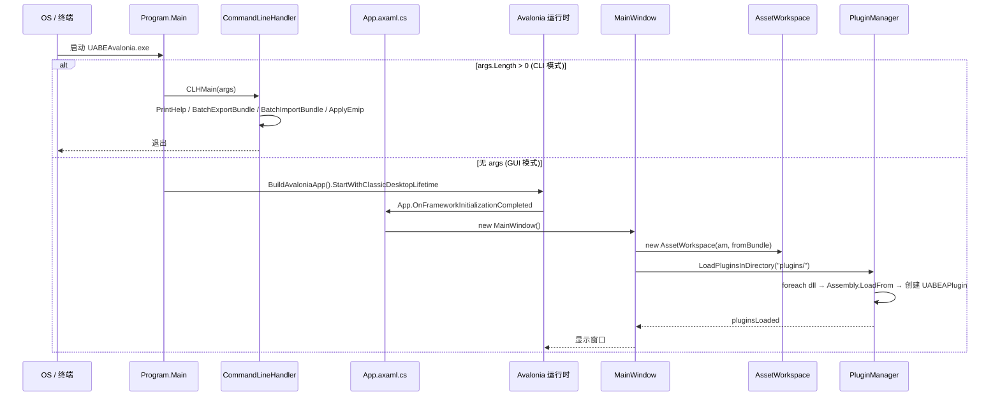
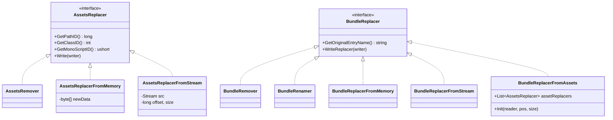
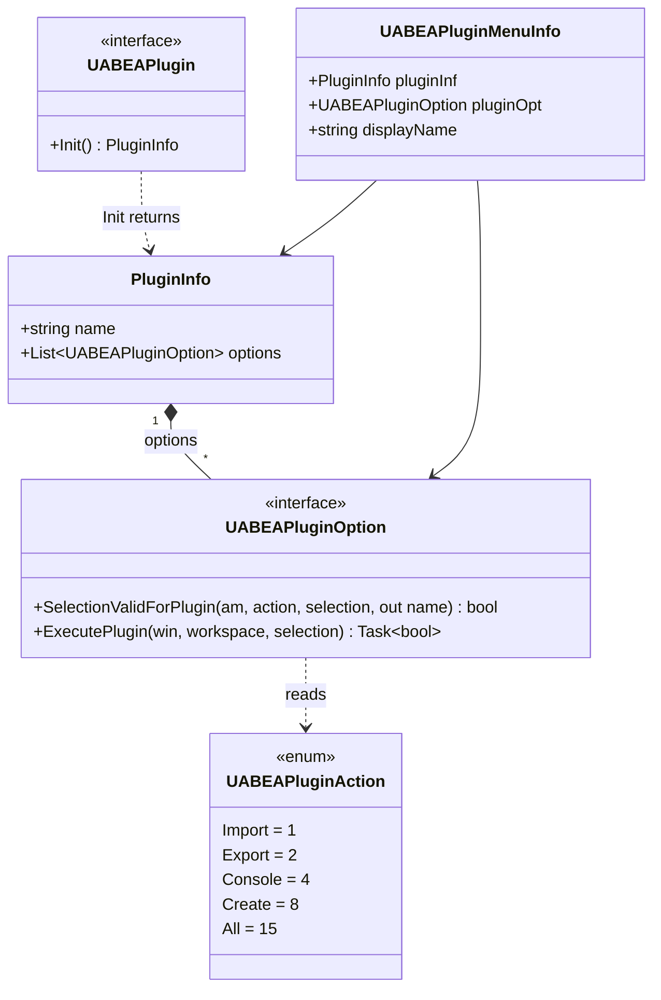

# 03 · UABEA 架构

## 3.1 总体分层

```
+---------------------------------------------------------+
|  Avalonia UI (Forms/*.axaml + Controls/AssetDataTreeView)
+---------------------------------------------------------+
|  MainWindow + InfoWindow + PluginWindow                 |
+---------------------------------------------------------+
|  Plugin Host: PluginManager.LoadPluginsInDirectory()    |
|     → UABEAPlugin.Init() → UABEAPluginOption.Execute()  |
+---------------------------------------------------------+
|  Workspace: AssetWorkspace / BundleWorkspace            |
|     → AddReplacer / GetChangedFiles / SetMonoTempGen    |
+---------------------------------------------------------+
|  Logic: AssetImportExport / Emip / FileTypeDetector     |
|     → DumpRaw/Text/Json + ImportRaw/Text/Json           |
+---------------------------------------------------------+
|  AssetsTools.NET (vendored in Libs/)                    |
|     BundleFile / AssetsFile / AssetTypeValueField / Replacers
+---------------------------------------------------------+
|  External Plugin DLLs (plugins/*.dll)                   |
|     TexturePlugin / AudioClipPlugin / Font / TextAsset  |
+---------------------------------------------------------+
```

## 3.2 模块依赖图

```mermaid
flowchart TB
  subgraph User[用户层]
    UI[Forms/MainWindow<br/>1026 LoC]
    PluginUI[PluginWindow.axaml]
    InfoUI[InfoWindow.axaml]
  end

  subgraph App[应用层]
    Program[Program.cs<br/>84]
    CLI[CommandLineHandler.cs<br/>373]
    App2[App.axaml.cs<br/>26]
    Theme[ThemeHandler]
  end

  subgraph Workspace[工作区层]
    AW[AssetWorkspace<br/>436]
    BW[BundleWorkspace<br/>203]
    UC[UnityContainer<br/>213]
    AC[AssetContainer<br/>110]
    CT[AssetsFileChangeTypes]
  end

  subgraph Logic[业务层]
    AIE[AssetImportExport<br/>719]
    EMIP[Emip / InstallerPackageFile<br/>230]
    FTD[FileTypeDetector<br/>68]
    ABU[AssetBundleUtil<br/>20]
  end

  subgraph Plugins[插件宿主]
    PM[PluginManager<br/>80]
    Plugins_API[UABEAPlugin interfaces]
  end

  subgraph Plugin_DLLs[插件 DLL]
    TP[TexturePlugin<br/>~1550 LoC]
    AP[AudioClipPlugin<br/>292]
    FP[FontPlugin<br/>252]
    TAP[TextAssetPlugin<br/>252]
  end

  subgraph Vendor[第三方]
    ATN[AssetsTools.NET]
    TexWrap[TexToolWrap.dll C++]
    Fmod5[Fmod5Sharp]
    ImgSharp[SixLabors.ImageSharp]
    Cpp2IL[Samboy063.LibCpp2IL]
    Cecil[Mono.Cecil]
    TexDec[AssetRipper.TextureDecoder]
  end

  UI --> AW
  UI --> BW
  UI --> PM
  UI --> AIE
  UI --> InfoUI
  UI --> PluginUI

  Program --> CLI
  Program --> App2

  CLI --> FTD
  CLI --> ATN
  CLI --> EMIP
  CLI --> ABU

  AW --> AC
  AW --> UC
  AW --> ATN
  AW --> Cpp2IL
  AW --> Cecil

  BW --> ATN

  AIE --> ATN
  EMIP --> ATN

  PM --> Plugins_API
  PM -->|LoadPluginsInDirectory| TP
  PM -->|LoadPluginsInDirectory| AP
  PM -->|LoadPluginsInDirectory| FP
  PM -->|LoadPluginsInDirectory| TAP

  TP --> ImgSharp
  TP --> TexDec
  TP --> TexWrap
  AP --> Fmod5
  AP --> ATN
  FP --> ATN
  TAP --> ATN
```



## 3.3 启动时序



## 3.4 关键设计模式

### 3.4.1 Replacer 模式（来自 AssetsTools.NET，UABEA 沿用）

所有修改都不是原地编辑，而是构造一个 `AssetsReplacer` / `BundleReplacer` 注册到 workspace；保存时统一 `bun.Write(writer, replacers)`。



### 3.4.2 Workspace 模式

`AssetWorkspace` 与 `BundleWorkspace` 并列存在：
- `AssetWorkspace` 管理**资产级**修改（每个 asset 一个 `AssetsReplacer`）
- `BundleWorkspace` 管理**文件级**修改（每个 bundle 内子文件一个 `BundleWorkspaceItem`）

二者通过 `MainWindow` 协调：保存时先收集 `BundleWorkspace.GetReplacers()`，再为每个被改动的 `.assets` 文件收集其 `AssetWorkspace.NewAssets`。

### 3.4.3 插件接口



### 3.4.4 类型树文本格式

`AssetImportExport.RecurseTextDump` 产生的 .txt 文件用前导空格表示深度，首字符 0/1 表示是否对齐：

```
0 PPtr<GameObject> m_GameObject
0 UInt64 m_PathID = 0
0 string m_Name = "Player"
0 Transform m_Transform
  0 PPtr<Transform> m_GameObject
  ...
[0]
0 SInt32 data = 0
[1]
0 SInt32 data = 1
```

回写 (`ImportTextAssetLoop`) 使用栈追踪 align 状态，push 当前 align，pop 时调用 `writer.Align()`。

## 3.5 错误处理与崩溃恢复

- 全局 `AppDomain.UnhandledException` → `Program.UABEAExceptionHandler` 写 `uabeacrash.log`
- Windows 下用 `mshta vbscript:...` 弹出窗口显示日志（避免 Avalonia 崩溃后无法启动）
- Unix 下直接 `Console.WriteLine` 输出堆栈

## 3.6 跨平台考量

- `AttachConsole(-1)` (Win32) / `usesConsole = true` (Unix) 让 CLI 模式可以输出到终端
- `MainWindow.axaml` 引用 Avalonia 的 `Window` / `Menu` / `TreeView`，完全跨平台
- TexturePlugin 内部使用 `SixLabors.ImageSharp`（跨平台），而 `TexToolWrap.dll` 是 native，必须随 RID 拷贝到 `runtimes/<rid>/native/`