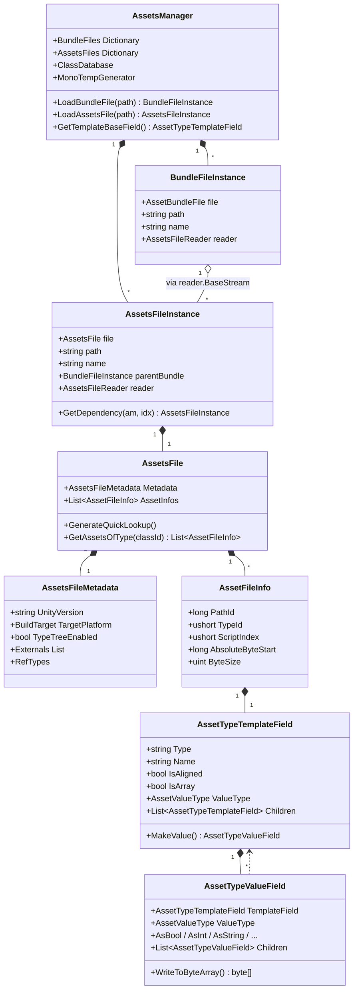
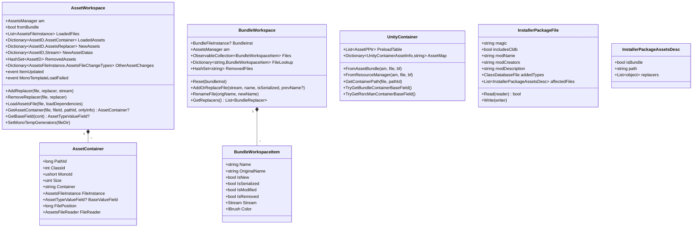
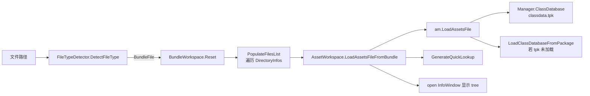
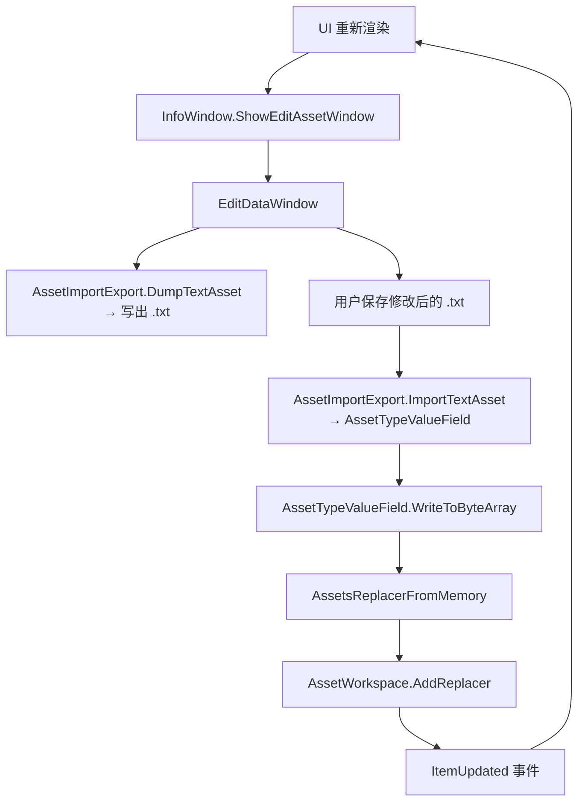
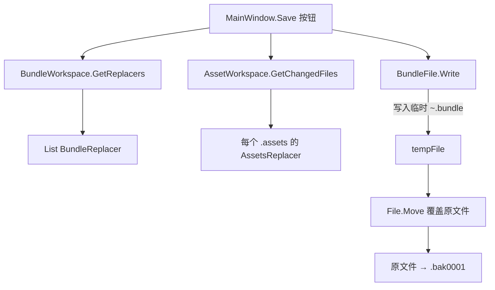
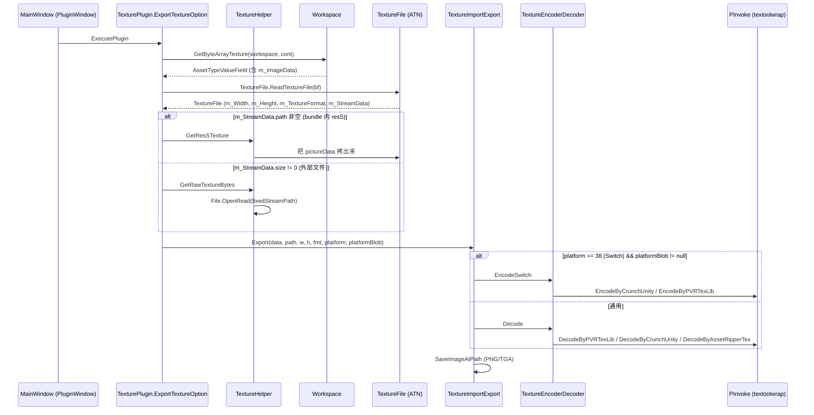

# 04 · UABEA 数据结构与数据流

## 4.1 核心数据结构

### 4.1.1 内存模型



### 4.1.2 UABEA 自定义数据结构



## 4.2 数据流

### 4.2.1 打开 .bundle



### 4.2.2 编辑 asset（树视图中双击）



### 4.2.3 保存 .bundle



### 4.2.4 Texture 导出数据流



### 4.2.5 EMIP 应用数据流

```mermaid
flowchart LR
  EMIP[.emip 文件] --> IPF[InstallerPackageFile.Read]
  IPF --> AF[affectedFiles]
  AF --> DEC{isBundle?}
  DEC -->|是| DBU[DecompressBundle<br/>→ 内存或 .decomp]
  DBU --> REPL1[遍历 BundleReplacer]
  REPL1 --> RFA[若是 BundleReplacerFromAssets:<br/>Init(reader, pos, size)]
  RFA --> W1[bun.Write → .mod]
  DEC -->|否| AFS[assets.Read]
  AFS --> REPL2[遍历 AssetsReplacer]
  REPL2 --> W2[assets.Write → .mod]
  W1 --> M1[File.Move → 原文件<br/>原文件 → .bakNNNN]
  W2 --> M2[File.Move → 原文件<br/>原文件 → .bakNNNN]
```