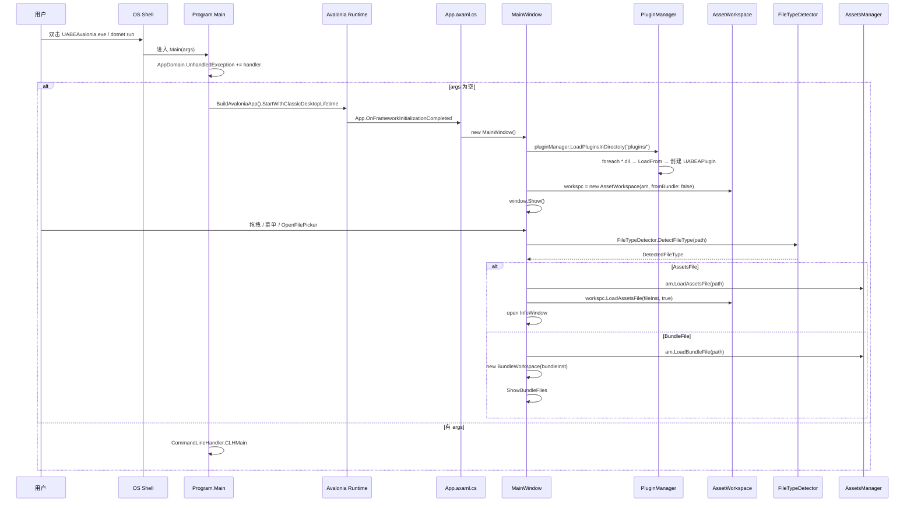
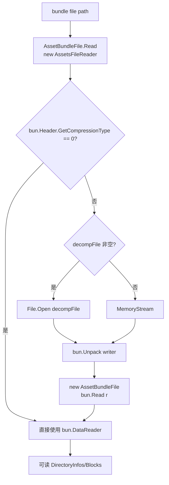
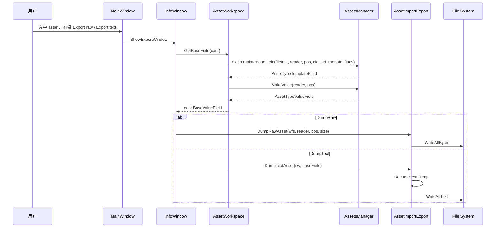
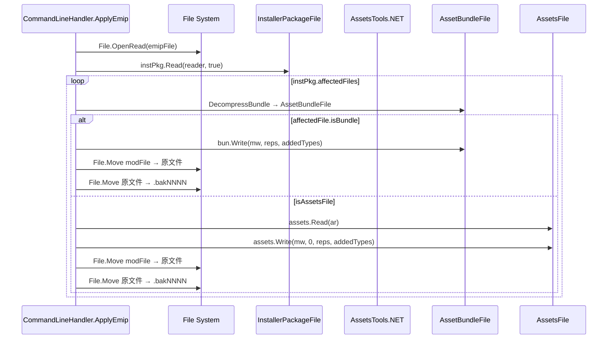
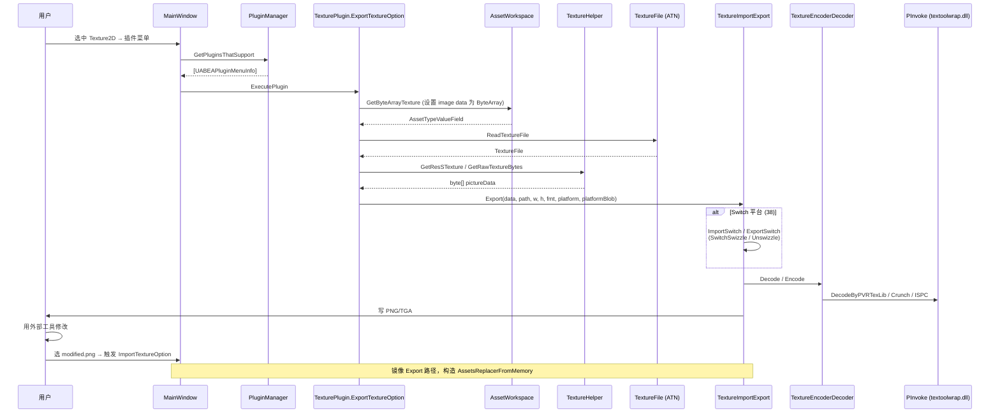
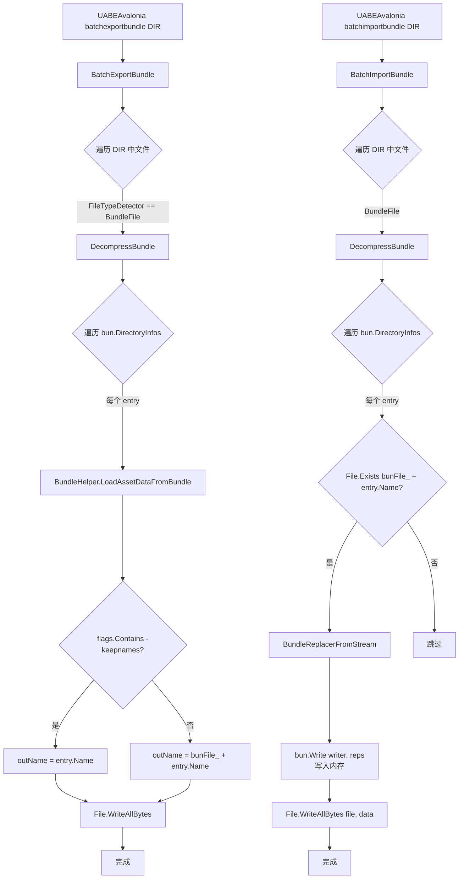
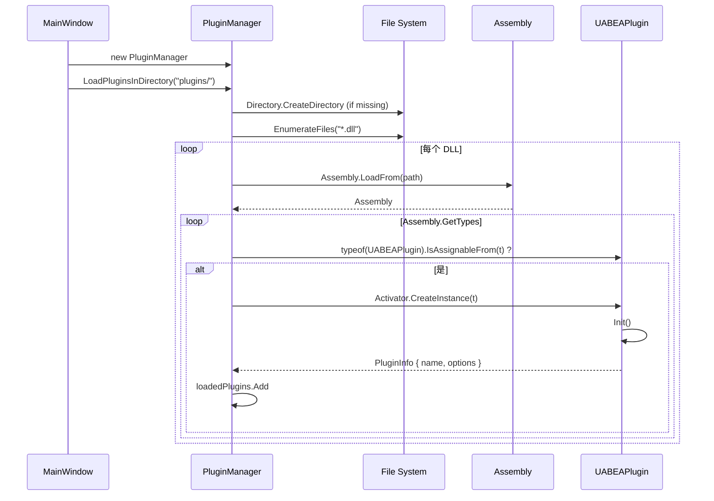

# 05 · UABEA 主要操作链

本节列出 ≥ 7 条核心操作链。每条都配有 mermaid 时序图或流程图。

---

## 5.1 启动 → 主窗体 → 打开 .assets / .bundle 文件



---

## 5.2 Bundle 解压（CLI / GUI 通用）



涉及代码：
- `CommandLineHandler.DecompressBundle` (`CommandLineHandler.cs:54`)
- `BundleWorkspace.Reset` 内 `PopulateFilesList` (`BundleWorkspace.cs:45`)
- `TextureHelper.GetResSTexture` (`TextureHelper.cs:32`)

---

## 5.3 Asset 树构建 + 选中 → DumpRaw / DumpText 导出



涉及代码：
- `AssetWorkspace.GetBaseField` (`AssetWorkspace.cs:337`)
- `AssetImportExport.DumpRawAsset` (`AssetImportExport.cs:20`)
- `AssetImportExport.DumpTextAsset` + `RecurseTextDump` (`AssetImportExport.cs:34, 40`)

---

## 5.4 Raw / Text Import 回写

```mermaid
flowchart LR
    A[用户改好 .txt] --> B[AssetImportExport.ImportTextAsset]
    B --> C[ImportTextAssetLoop<br/>维护 alignStack<br/>逐行解析类型与值]
    C --> D[AssetsFileWriter.WriteXXX]
    D --> E[byte[] savedAsset]
    E --> F[AssetTypeValueField.WriteToByteArray<br/>或 cont.BaseValueField.WriteToByteArray]
    F --> G[AssetsReplacerFromMemory]
    G --> H[AssetWorkspace.AddReplacer]
    H --> I[ItemUpdated 事件]
```

涉及代码：
- `AssetImportExport.ImportTextAsset` (`AssetImportExport.cs:328`)
- `AssetImportExport.ImportTextAssetLoop` (`AssetImportExport.cs:349`)
- `AssetImportExport.ImportRawAsset` (`AssetImportExport.cs:319`)
- `AssetWorkspace.AddReplacer` (`AssetWorkspace.cs:68`)

---

## 5.5 EMIP mod 包导入应用



涉及代码：
- `CommandLineHandler.ApplyEmip` (`CommandLineHandler.cs:237`)
- `CommandLineHandler.GetNextBackup` (`CommandLineHandler.cs:86`)
- `Emip.InstallerPackageFile.Read` (`Emip.cs:20`)
- `Emip.ParseReplacer` (`Emip.cs:116`)

---

## 5.6 插件调用（TexturePlugin 导出 PNG → 编辑 → 导入）



涉及代码：
- `TexturePlugin.ExportTextureOption.ExecutePlugin / BatchExport / SingleExport` (`ExportTextureOption.cs:36, 44, 123`)
- `TexturePlugin.ImportTextureOption.ExecutePlugin / ImportTextures` (`ImportTextureOption.cs:109, 39`)
- `TexturePlugin.TextureImportExport.Export / Import / ExportSwitch / ImportSwitch` (`TextureImportExport.cs:79, 12, 112, 47`)
- `TexturePlugin.TextureEncoderDecoder.Decode / Encode / EncodeMip / RGBAToFormatByteSize` (`TextureEncoderDecoder.cs:339, 519, 438, 12`)
- `TexturePlugin.Texture2DSwitchDeswizzler.*` (`Texture2DSwitchDeswizzler.cs:54, 98, 143, 180, 187`)
- `TexturePlugin.PInvoke.*` (`PInvoke.cs:13, 16, 19, 22, 25, 28`)

---

## 5.7 CLI batch 模式（batchexportbundle / batchimportbundle）



涉及代码：
- `CommandLineHandler.BatchExportBundle` (`CommandLineHandler.cs:101`)
- `CommandLineHandler.BatchImportBundle` (`CommandLineHandler.cs:156`)
- `CommandLineHandler.GetMainFileName / GetFlags` (`CommandLineHandler.cs:33, 43`)
- `CommandLineHandler.DecompressBundle` (`CommandLineHandler.cs:54`)

---

## 5.8 TypeTree 文本 dump/import 详细流程（操作链 4 展开）

```mermaid
flowchart TB
    subgraph DumpTextAsset
      A1[DumpTextAsset sw, baseField] --> A2[RecurseTextDump field, depth=0]
      A2 --> A3{isArray?}
      A3 -->|是| A4[写 sizeTemplate + size = N]
      A4 --> A5[for each child<br/>RecurseTextDump child depth+2]
      A3 -->|否| A6[判断 ValueType]
      A6 -->|String| A7[value = escape + quote]
      A6 -->|其他 primitive| A8[value = AsString]
      A6 -->|ManagedReferencesRegistry| A9[特殊格式 v1/v2]
      A9 --> A10[for each referencedObject<br/>RecurseTextDump child depth+3]
      A7 --> A11[sw.WriteLine]
      A8 --> A11
      A11 --> A12{field 有 children?}
      A12 -->|是| A13[RecurseTextDump children depth+1]
    end

    subgraph ImportTextAssetLoop
      B1[ImportTextAssetLoop] --> B2[while true: readLine]
      B2 --> B3[计算 thisDepth = leading spaces]
      B3 --> B4{line[thisDepth] == '['?}
      B4 -->|是 - array index| B2
      B4 -->|否| B5{thisDepth < alignStack.Count?}
      B5 -->|是| B6[pop align → aw.Align]
      B6 --> B5
      B5 -->|否| B7[parse align bit + typeName + value]
      B7 --> B8{有 =?}
      B8 -->|是| B9[按类型写 aw.WriteXXX]
      B9 --> B10{align ? aw.Align}
      B10 --> B2
      B8 -->|否| B11[alignStack.Push align]
      B11 --> B2
    end
```

涉及代码：
- `AssetImportExport.RecurseTextDump` (`AssetImportExport.cs:40`)
- `AssetImportExport.ImportTextAssetLoop` (`AssetImportExport.cs:349`)

---

## 5.9 Plugin 加载流程（GUI 启动时）



涉及代码：
- `PluginManager.LoadPlugin` (`PluginManager.cs:21`)
- `PluginManager.LoadPluginsInDirectory` (`PluginManager.cs:48`)
- `PluginManager.GetPluginsThatSupport` (`PluginManager.cs:57`)