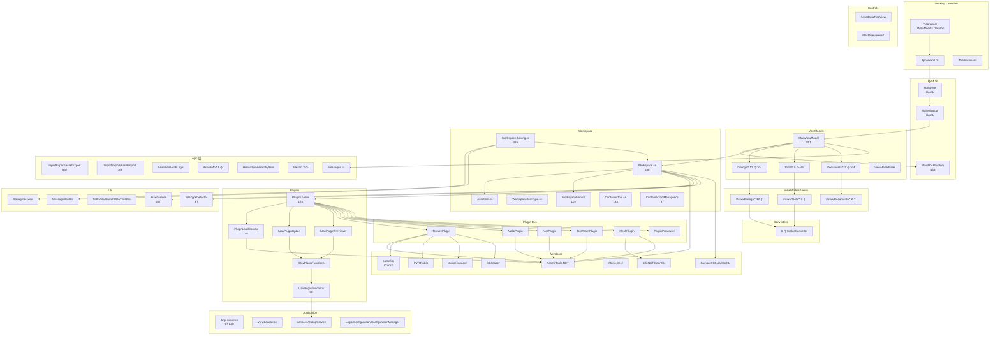
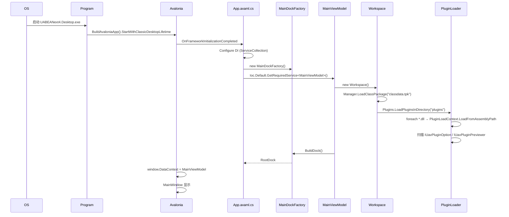
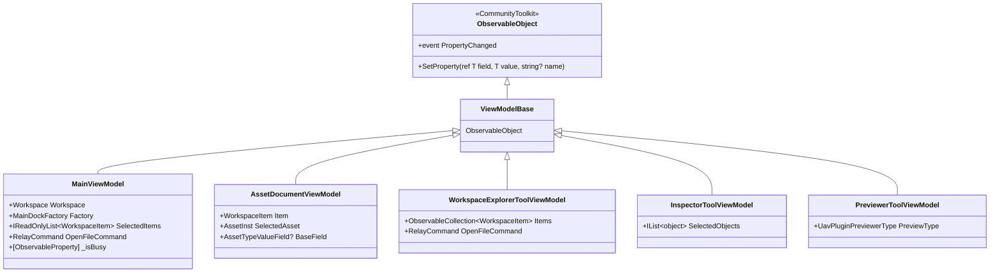
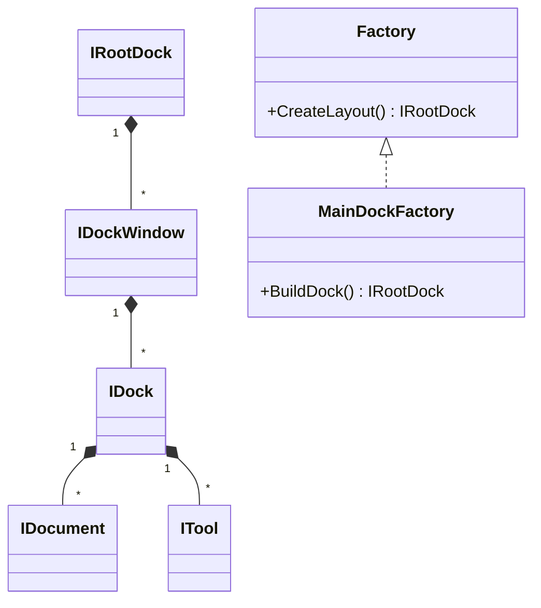
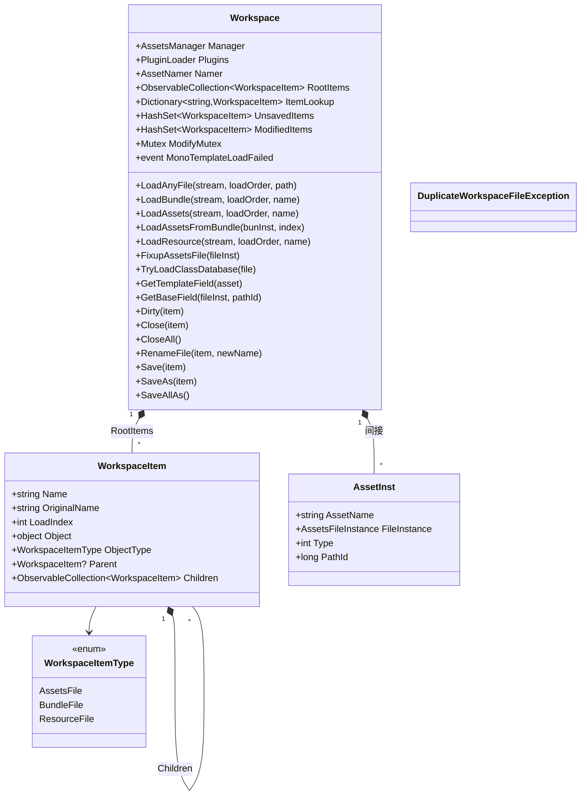
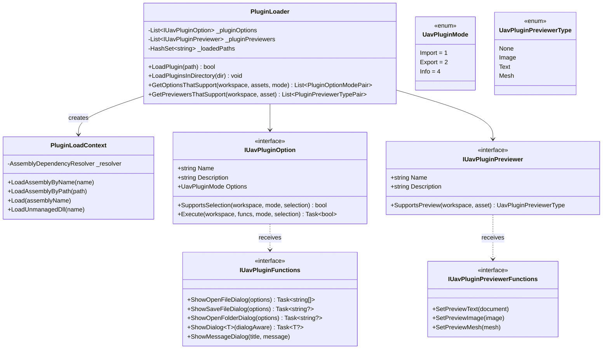
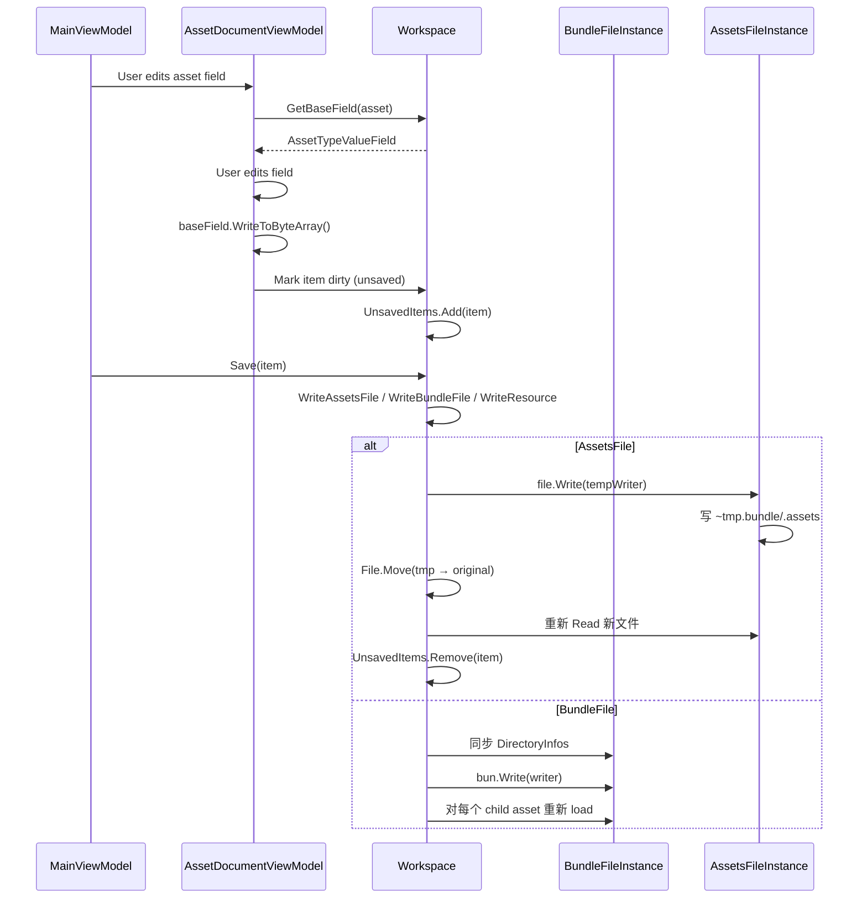

# 03 · UABEANext 架构

## 3.1 总体分层

```
+----------------------------------------------------------------+
|  UABEANext4.Desktop.exe                                        |
|  Program.cs → BuildAvaloniaApp → ClassicDesktopLifetime       |
+----------------------------------------------------------------+
|  UABEANext4.App.axaml.cs (DI 注册)                            |
+----------------------------------------------------------------+
|  Dock UI:                                                      |
|    MainDockFactory → IRootDock                                 |
|    ├─ WorkspaceExplorer (Tool)                                 |
|    ├─ Hierarchy (Tool)                                         |
|    ├─ Inspector (Tool)                                         |
|    └─ Previewer (Tool)                                         |
|    + 多个 Document tabs (Asset, Blank, ...)                    |
+----------------------------------------------------------------+
|  ViewModels (CommunityToolkit.Mvvm):                           |
|    MainViewModel → Workspace, MainDockFactory, currentSel      |
|    Dialogs: 12 个独立 VM                                       |
|    Tools: 5 个 tool VM                                         |
|    Documents: 2 个 document VM                                 |
+----------------------------------------------------------------+
|  Workspace (ObservableObject):                                 |
|    AssetsManager, PluginLoader, AssetNamer, RootItems          |
|    UnsavedItems, ModifiedItems                                 |
+----------------------------------------------------------------+
|  PluginLoader + PluginLoadContext:                             |
|    AssemblyLoadContext 隔离 → IUavPluginOption / Previewer     |
+----------------------------------------------------------------+
|  Logic 层:                                                     |
|    AssetImport/AssetExport (.txt/.json 导入导出)               |
|    SearchLogic (并发搜索)                                      |
|    Mesh/MeshObj                                                |
|    AssetInfo/* (元信息)                                        |
|    ConfigurationManager (config.json 持久化)                   |
+----------------------------------------------------------------+
|  AssetsTools.NET (vendored submodule):                         |
|    BundleFile / AssetsFile / AssetTypeValueField / Replacers   |
+----------------------------------------------------------------+
|  插件 DLL:                                                     |
|    TexturePlugin (TextureLoader + Previewer)                   |
|    AudioPlugin (FMOD5 export)                                  |
|    FontPlugin (TTF/OTF)                                        |
|    TextAssetPlugin + Previewer                                 |
|    MeshPlugin (MeshPreviewer)                                  |
|    PluginPreviewer (独立进程)                                  |
+----------------------------------------------------------------+
|  NativeLibs/{win-x64,linux-x64}/:                              |
|    textureencoder / cuttlefish / PVRTexLib                     |
+----------------------------------------------------------------+
```

## 3.2 模块依赖图



## 3.3 启动时序



## 3.4 关键设计模式

### 3.4.1 MVVM (CommunityToolkit.Mvvm)



### 3.4.2 Dock 布局



默认布局：
- **WorkspaceExplorer** (Tool, 左侧) — 显示 `RootItems` 树
- **Hierarchy** (Tool, 左下) — 显示选中 GameObject 的层级
- **Inspector** (Tool, 右侧) — 显示选中 asset 的字段
- **Previewer** (Tool, 右下) — 显示预览
- 中间区域可放 **Document** tabs（AssetDocumentView for selected asset）

### 3.4.3 Workspace 文件树



### 3.4.4 插件系统（双接口）



### 3.4.5 WeakReferenceMessenger

`UABEANext4/Logic/Messages.cs` 定义若干 `record` 类（如 `SelectedWorkspaceItemChangedMessage`, `RequestEditAssetMessage`, `RequestCloseFileMessage`, `RequestVisitAssetMessage`），ViewModel 之间通过 `WeakReferenceMessenger.Default.Send(msg)` 解耦通信。

### 3.4.6 WorkspaceItem Replacer 与 Save 流程



## 3.5 错误处理与崩溃恢复

- `Program.cs` 的 `UABEANext4.Desktop` 含 `UABEANExceptionHandler`（推测继承 UABEA 模式）
- `AppDomain.UnhandledException` → `uabeacrash.log`
- 没有弹窗（与 UABEA 不同，UABEANext 假设崩溃发生在初始化后期时 Avalonia 仍可用）

## 3.6 跨平台考量

- **Windows**: full support（验证主要平台）
- **Linux**: 通过 Avalonia + Linux native libs（textureencoder/cuttlefish/PVR）
- **macOS**: 推测支持（仓库有 macOS 路径）
- **Mobile (Android/iOS)**: 推测不支持（UABEANext 是桌面工具）

## 3.7 与 UABEA 的设计哲学差异

| 维度 | UABEA | UABEANext |
|---|---|---|
| 代码风格 | 命令式事件回调 | 声明式 MVVM |
| 状态管理 | 散落在 Form code-behind | 集中在 ViewModel |
| 窗体 | 17 个独立 .axaml | 1 主窗 + 12 dialog + 7 tool 嵌入 Dock |
| 依赖注入 | 无 | Microsoft.Extensions.DependencyInjection |
| ObservableCollection | 散用 | 全局（RootItems / Children / AssetList） |
| 消息总线 | 无 | WeakReferenceMessenger |
| 线程模型 | UI 线程 + 后台 worker | UI 线程 + SynchronizationContext + 后台 worker |
| 测试性 | 低 | 高（VM 可独立测试） |