# 04 · UABEANext 数据结构与数据流

## 4.1 核心数据结构

### 4.1.1 Workspace 文件树

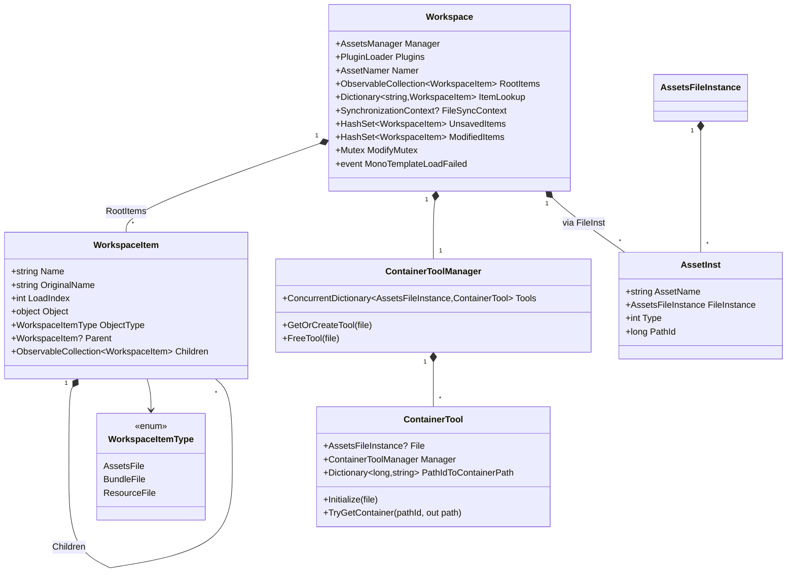

### 4.1.2 ViewModel 层

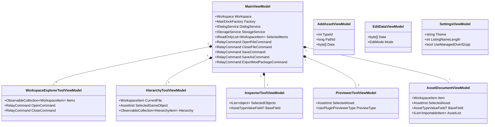

### 4.1.3 插件宿主

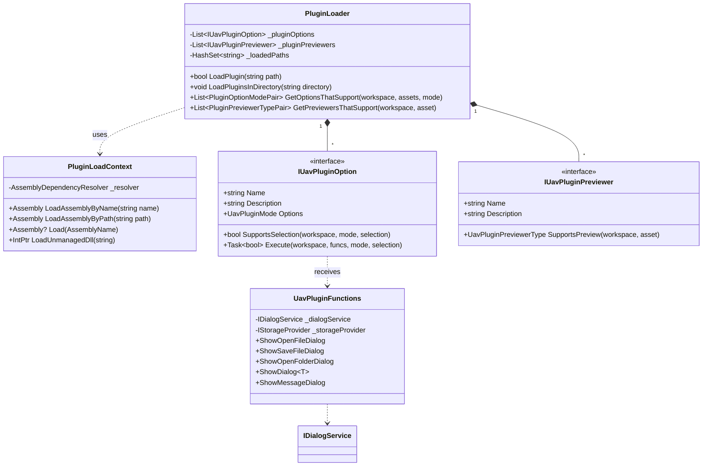

### 4.1.4 Mesh 数据结构

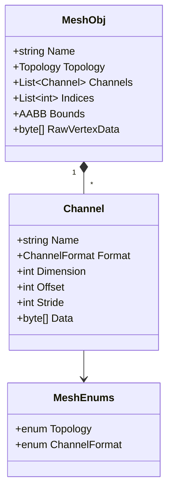

### 4.1.5 搜索

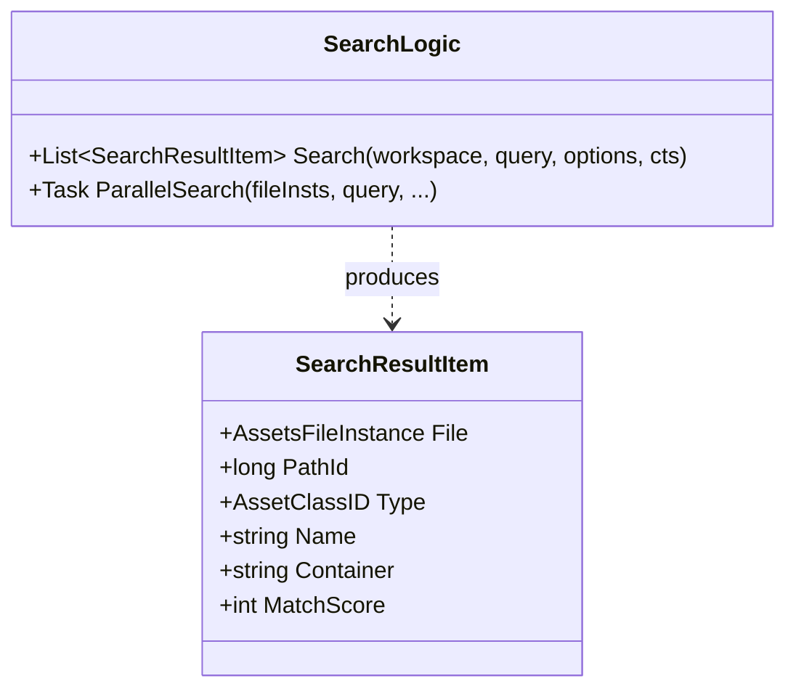

## 4.2 数据流

### 4.2.1 打开 .bundle 文件

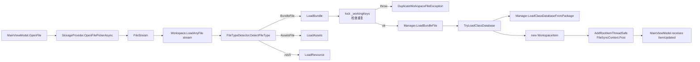

### 4.2.2 编辑 asset 字段

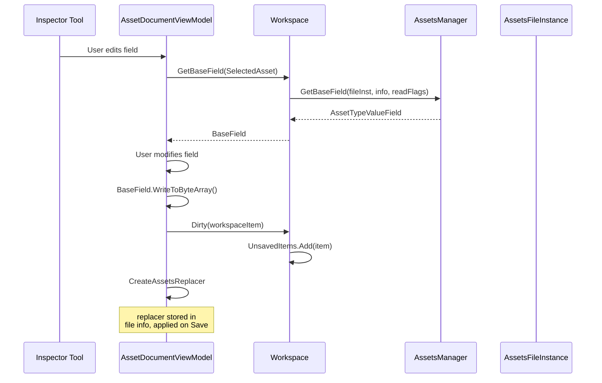

### 4.2.3 保存 .bundle

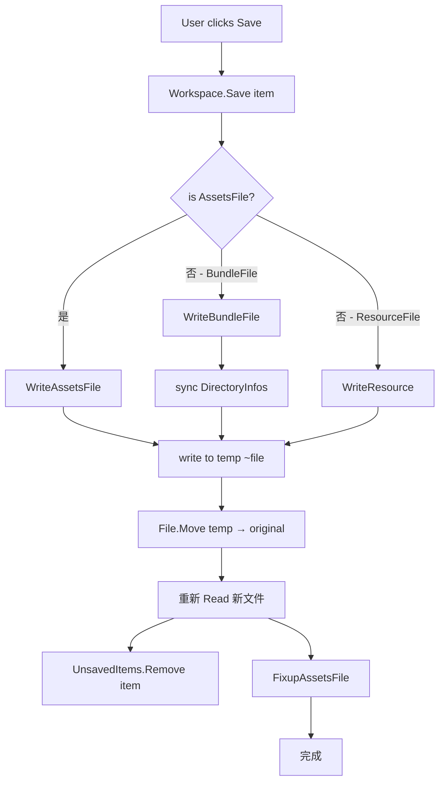

### 4.2.4 插件加载流程

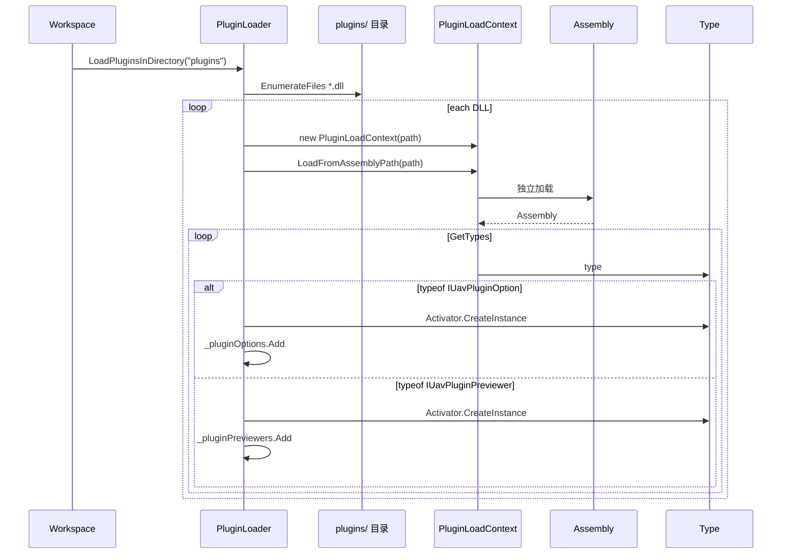

### 4.2.5 类型树文本 dump

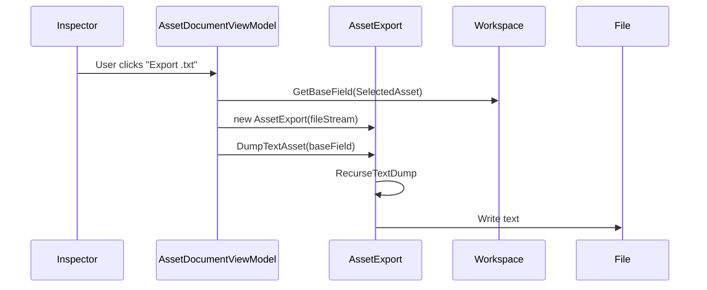

### 4.2.6 Mesh 预览数据流

### 4.2.7 搜索流程

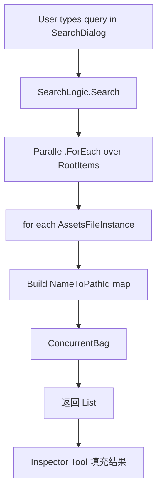