# 05 · UABEANext 主要操作链

---

## 5.1 启动 → Dock UI → 加载 plugins

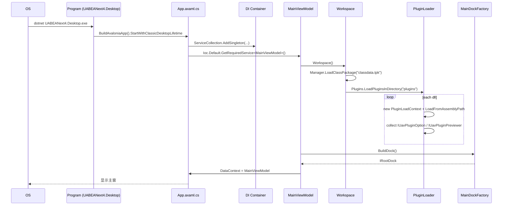

## 5.2 拖拽 / 菜单打开 .bundle 文件

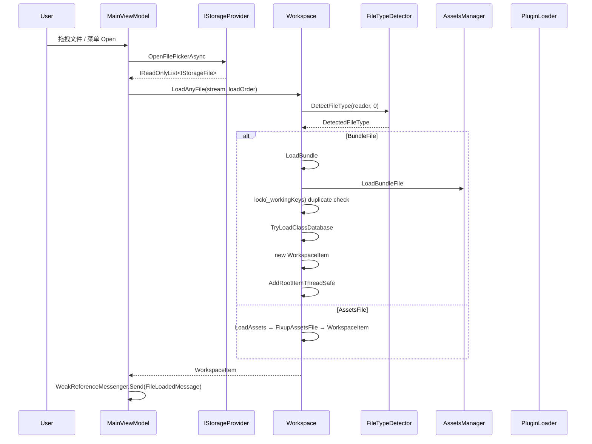

## 5.3 选中文件 → 显示文件内 asset 列表

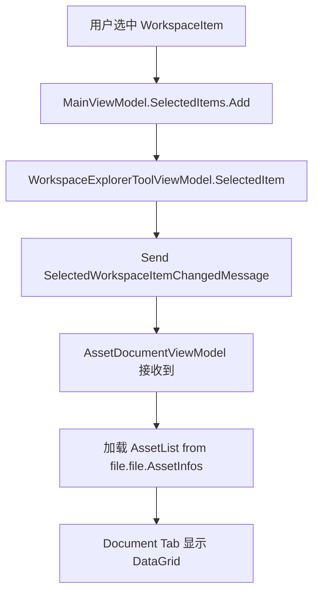

## 5.4 选中 asset → Inspector 显示字段 → 修改 → 保存

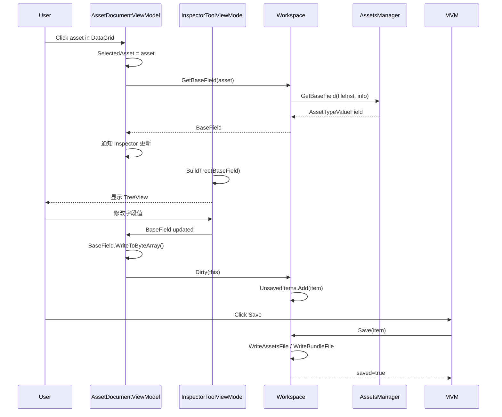

## 5.5 Bundle 解压 / 加载

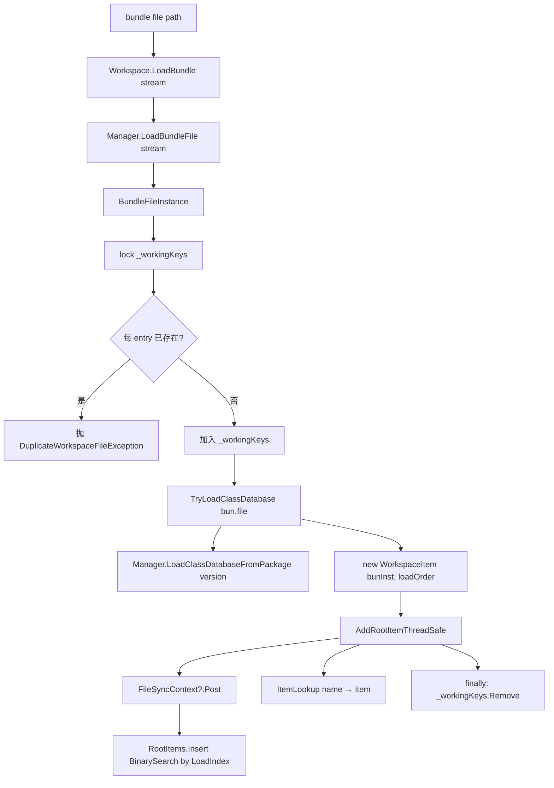

## 5.6 插件调用（Texture 导出）

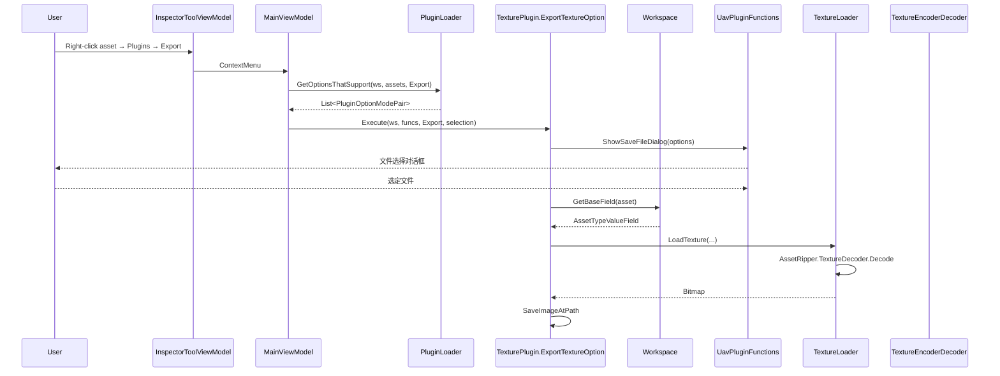

## 5.7 3D Mesh 预览

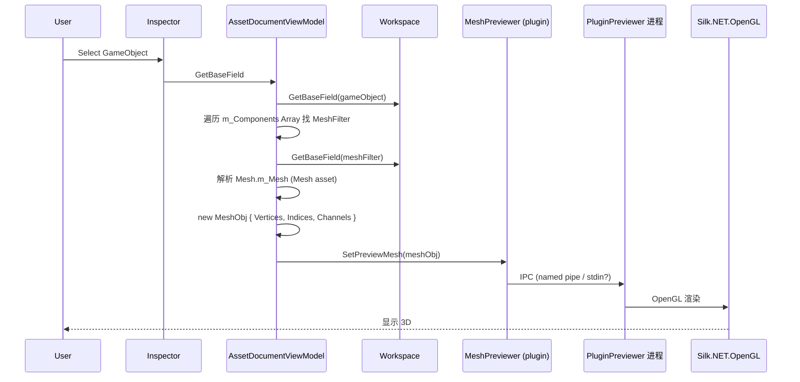

## 5.8 搜索资产

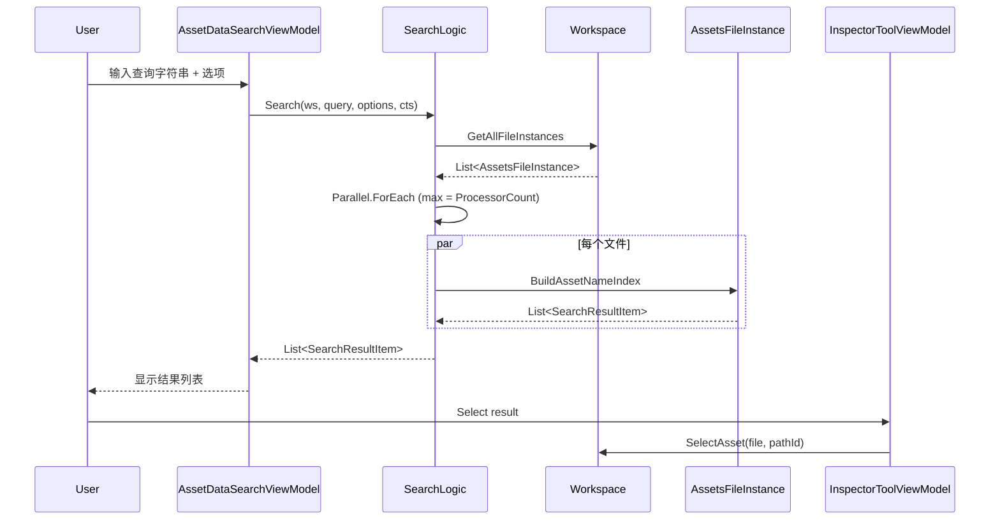

## 5.9 类型树导入导出（与 UABEA 同）

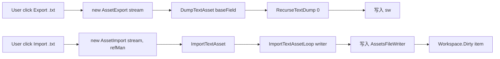

涉及：`UABEANext4/Logic/ImportExport/AssetExport.cs` (`AssetExport.cs:36, 42`)、`AssetImport.cs` (`AssetImport.cs:30, 51`)

## 5.10 配置持久化

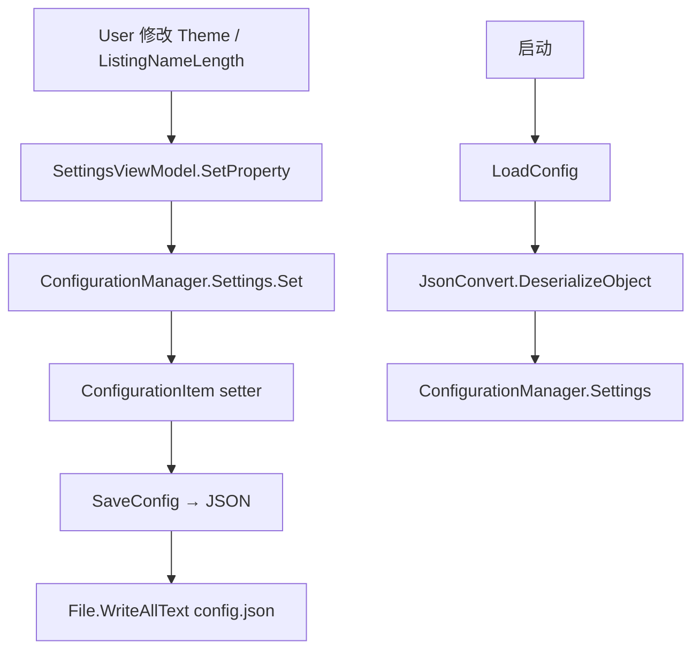

## 5.11 关闭文件

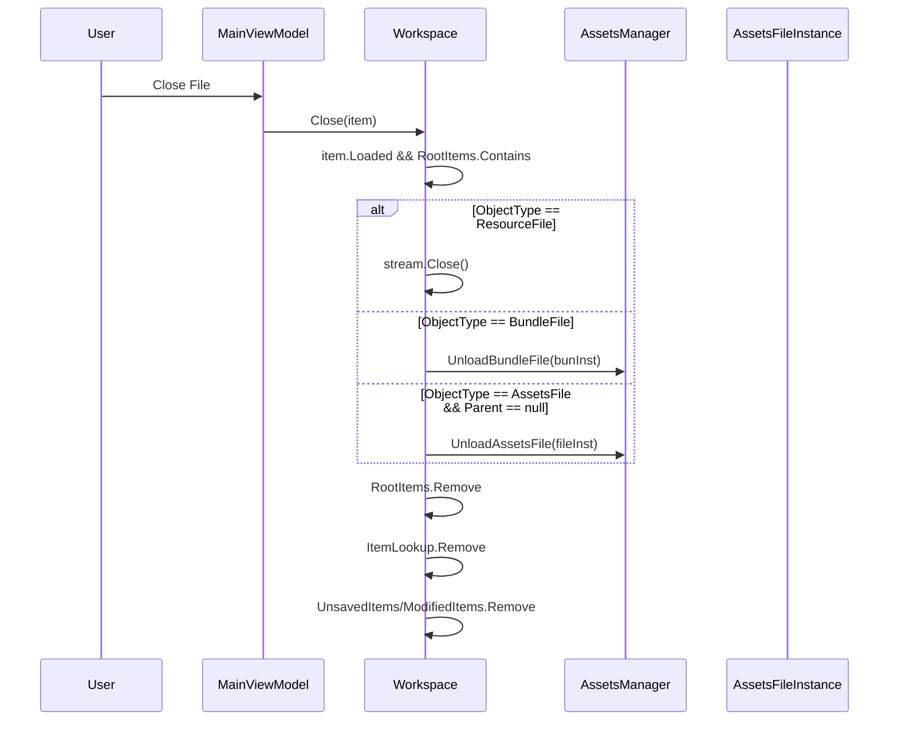

## 5.12 主题切换（Avalonia 11 + Dock）

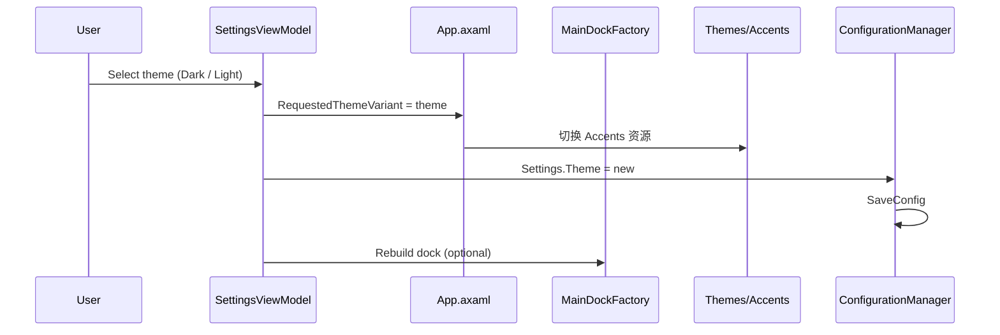

## 5.13 跨平台原生互操作

```mermaid
flowchart LR
  Build[dotnet build -r linux-x64] --> RID[RuntimeIdentifier win-x64/x86/linux-x64]
  RID --> Cop[MSBuild copy native libs]
  Cop --> NL[NativeLibs/rid/*]
  NL --> RT[runtimes/rid/native/*]
  RT --> Plug[Plugin DLL LoadUnmanagedDll]
  Plug --> PLC[PluginLoadContext.LoadUnmanagedDll]
  PLC --> Find[AssemblyDependencyResolver finds]
  Find --> Sym[LoadLib by symlink path]
  Sym --> Enc[textureencoder/cuttlefish/PVRTexLib]
```