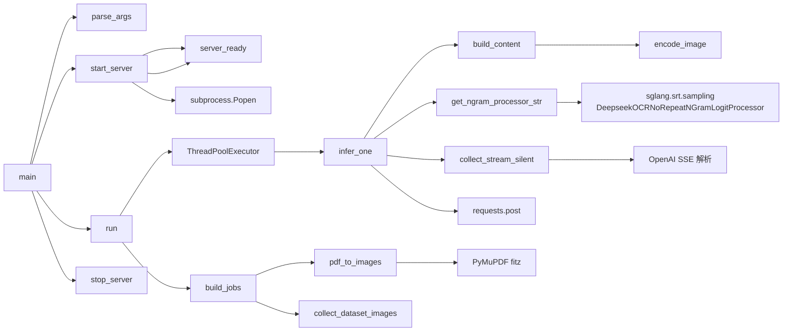

# 02 模块布局

`infer.py` 是单文件脚本，按"职责分组"组织。所有内容在 module-level，无类、无模块分割。

## 顶层结构

| 行号范围 | 区块 | 说明 |
|----------|------|------|
| 1-7 | module docstring | 描述两种输入模式（image_dir / pdf） |
| 9-19 | imports | 标准库 + requests + concurrent.futures |
| 21-37 | 常量 | 17 个 `UPPER_SNAKE_CASE` 常量 |
| 40-47 | `get_ngram_processor_str` | 延迟导入 logit 处理器 |
| 50-62 | `pdf_to_images` | PDF → 图片列表 |
| 65-70 | `encode_image` | 图片 → base64 data URL |
| 73-74 | `build_content` | 构造 OpenAI multimodal message |
| 77-82 | `server_ready` | 检查 SGLang 服务健康 |
| 85-136 | `start_server` | 启动 SGLang 子进程 |
| 139-148 | `stop_server` | 终止子进程 |
| 151-185 | `collect_stream_silent` | 收集流式响应 |
| 188-227 | `infer_one` | 单图片推理（带重试） |
| 230-237 | `collect_dataset_images` | 扫描目录收集图片 |
| 240-264 | `build_jobs` | 构建 (image, output) 任务列表 |
| 267-300 | `run` | ThreadPoolExecutor 并发调度 |
| 303-316 | `parse_args` | argparse |
| 319-325 | `main` | 顶层编排 |
| 328-329 | entry | `if __name__ == "__main__": main()` |

## 常量分组（21-37 行）

| 分组 | 行 | 常量 |
|------|----|----|
| 服务端 | 21-25 | `SERVED_MODEL_NAME`、`SERVER_URL`、`HOST`、`PORT`、`SERVER_TIMEOUT` |
| 资源 | 26, 29 | `PDF_DPI`、`MEM_FRACTION_STATIC` |
| 模型参数 | 27-28, 30-34 | `ATTENTION_BACKEND`、`PAGE_SIZE`、`PROMPT`、`TEMPERATURE`、`CONTEXT_LENGTH`、`NO_REPEAT_NGRAM_SIZE`、`NGRAM_WINDOW` |
| HTTP | 35-37 | `REQUEST_TIMEOUT`、`MAX_RETRIES`、动态 `NO_REPEAT_NGRAM_PROCESSOR_STR` |

## 函数分组（14 个，按职责分类）

### A. 模型/Logit 配置（1 个）
| 函数 | 行号 | 职责 |
|------|------|------|
| `get_ngram_processor_str` | 40 | 延迟导入 `DeepseekOCRNoRepeatNGramLogitProcessor` |

### B. 数据准备（3 个）
| 函数 | 行号 | 职责 |
|------|------|------|
| `pdf_to_images` | 50 | PDF 每页转 PNG（PyMuPDF） |
| `encode_image` | 65 | 图片 → base64 data URL |
| `build_content` | 73 | 构造 OpenAI multimodal message |

### C. 服务管理（3 个）
| 函数 | 行号 | 职责 |
|------|------|------|
| `server_ready` | 77 | GET `/health` 检查 SGLang |
| `start_server` | 85 | subprocess.Popen 启动 SGLang + 轮询 |
| `stop_server` | 139 | terminate / kill |

### D. 请求处理（3 个）
| 函数 | 行号 | 职责 |
|------|------|------|
| `collect_stream_silent` | 151 | 解析 SSE 流 → 写文件 + 计时 |
| `infer_one` | 188 | 单图片 POST → 重试 → 返回 dict |
| `collect_dataset_images` | 230 | os.walk 扫描 + 按文件大小倒排 |

### E. 编排（4 个）
| 函数 | 行号 | 职责 |
|------|------|------|
| `build_jobs` | 240 | PDF 模式 / image_dir 模式 → job 列表 |
| `run` | 267 | ThreadPoolExecutor 并发执行 + 统计 |
| `parse_args` | 303 | argparse CLI |
| `main` | 319 | 启动服务 → run → 关闭服务 |

## 模块依赖

## 关键设计点

1. **顺序生命周期**：启动 SGLang → 并发请求 → 关闭 SGLang（try/finally 保证 stop）
2. **延迟导入**：SGLang `DeepseekOCRNoRepeatNGramLogitProcessor` 仅在需要时导入（避免不必要的依赖检查）
3. **流式优先**：所有推理通过 SSE 流式响应收集，避免长时间阻塞
4. **重试退避**：502 错误重试，间隔 `3 * (attempt+1)` 秒
5. **并发限流**：`ThreadPoolExecutor` 而非进程池，避免 GPU 资源争抢
6. **失败软化**：失败的请求返回 `{"tokens":0, "decode_time":0, "text":""}`，不让单点失败中断整批
7. **资源隔离**：服务日志写到 `--server_log` 文件，stdout 干净
8. **服务复用**：检测到现有服务时不重启（`server_ready` 优先）