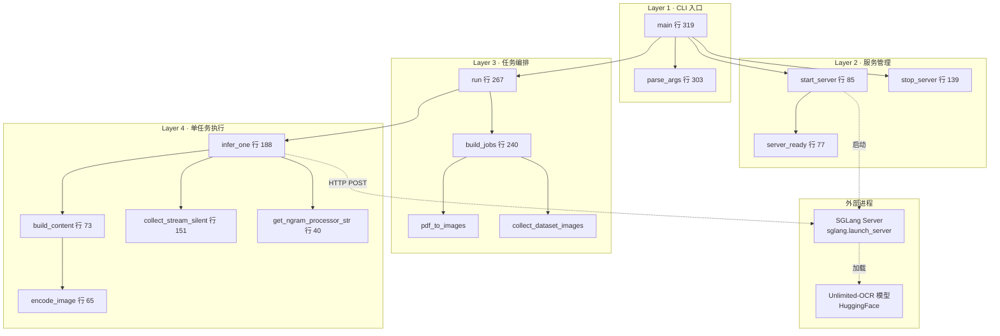
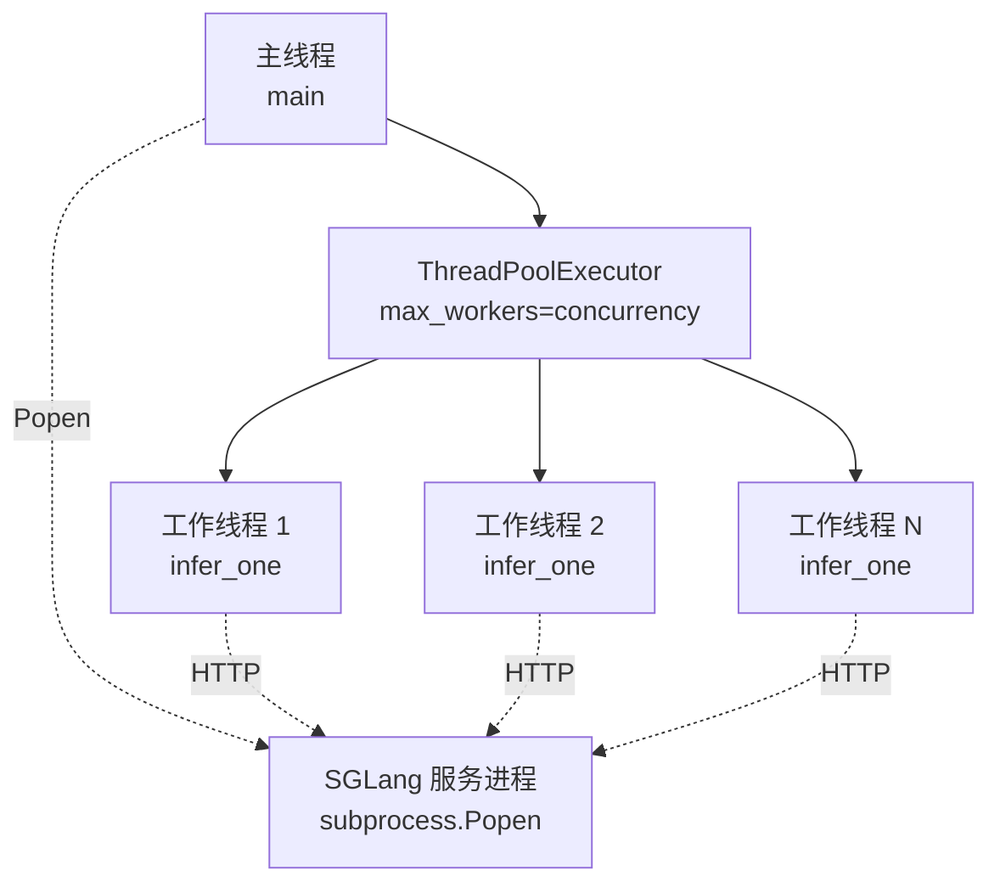
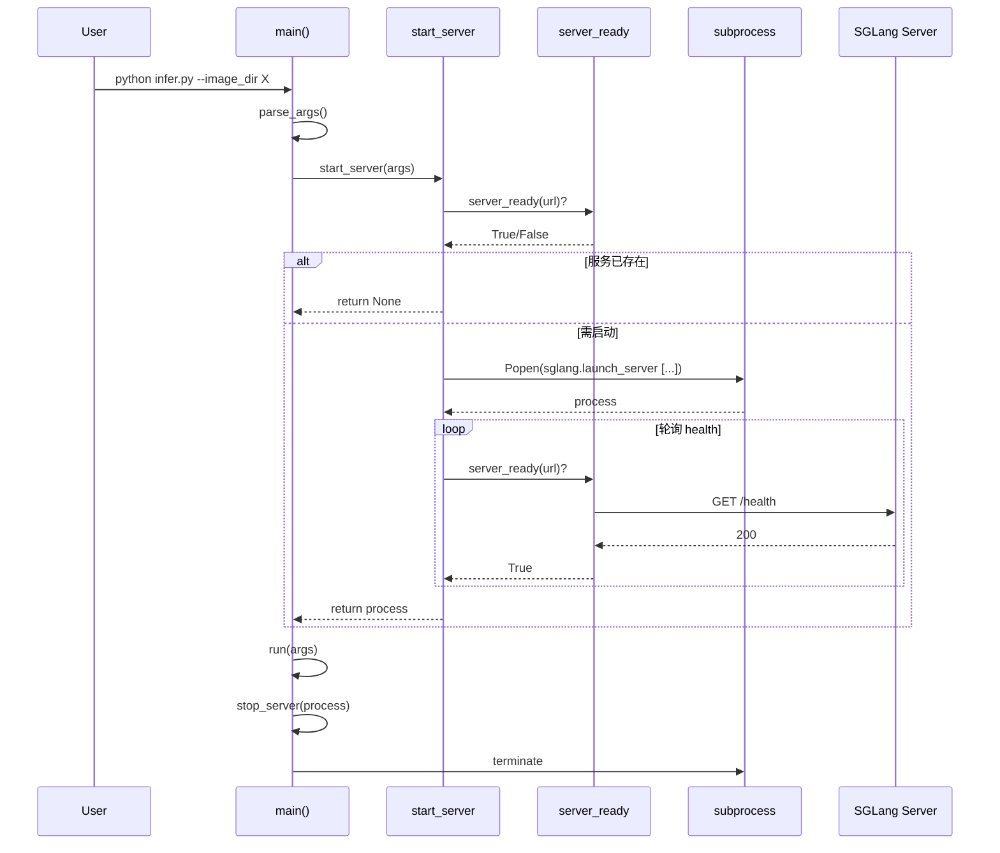
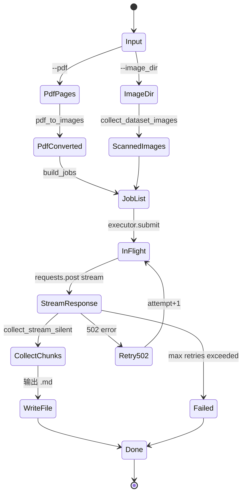

# 03 架构

## 整体架构

脚本分四层：CLI → 服务管理 → 任务编排 → 单任务执行。脚本本身作为**客户端**驱动 SGLang 服务（子进程），并通过 OpenAI 兼容 HTTP API 与之通信。



## 线程模型



- **主线程**：CLI 解析 → 启动服务 → 提交任务 → 收集 Future → 打印统计 → 关闭服务
- **SGLang 子进程**：加载模型 + 监听 `0.0.0.0:10000` + 处理推理请求
- **工作线程池**：N 个线程（默认 8），每个线程顺序执行 `infer_one`

## 启动流程



## 数据生命周期



## 单任务执行链（`infer_one`）

```mermaid
flowchart TD
    Start([infer_one image_path, output_file, args, idx]) --> Payload[构造 payload dict]
    Payload --> NgramCheck{NO_REPEAT_NGRAM_SIZE > 0?}
    NgramCheck -->|Yes| AddProcessor[payload.custom_logit_processor<br/>+ custom_params]
    NgramCheck -->|No| Skip[skip]
    AddProcessor --> LoopStart{for attempt in 0..MAX_RETRIES}
    Skip --> LoopStart
    LoopStart -->|attempt| PostReq[POST /v1/chat/completions stream]
    PostReq --> CheckStatus{status_code?}
    CheckStatus -->|502 + attempt < N| Sleep3[sleep 3*attempt+1] --> LoopStart
    CheckStatus -->|200| CollectStream[collect_stream_silent]
    CheckStatus -->|Other| RaiseError[raise_for_status]
    RaiseError --> CatchException{catch Exception}
    CatchException -->|attempt < N| PrintRetry[print retry] --> LoopStart
    CatchException -->|attempt == N| ReturnFailed[return {tokens:0,...}]
    CollectStream --> PrintResult[print idx tokens decode_time]
    PrintResult --> ReturnOK[return result]
    ReturnOK --> End([end])
    ReturnFailed --> End
```

## 关键设计决策

| 决策 | 原因 |
|------|------|
| SGLang 而非 Transformers 默认 | 高吞吐 + 长上下文 + 自定义 logit processor |
| `subprocess.Popen` 启动服务 | 单一 Python 进程管理生命周期，简化调用 |
| `ThreadPoolExecutor` 而非 `ProcessPoolExecutor` | HTTP I/O 密集而非 CPU 密集；GPU 在服务端 |
| 服务复用检测 | `server_ready` 优先于 Popen，避免端口冲突 |
| 流式 + 静默 | 用户只关心最终 .md，过程 token 不打印（区别于 README 示例） |
| 重试 502 单独处理 | SGLang 偶发 502 是过载特征，标准 backoff |
| `get_ngram_processor_str` 延迟导入 | 不强制依赖 SGLang 在解析阶段就加载 |
| `--gpu` 单值 | 简化部署；多卡留给 vLLM/SGLang 内部调度 |