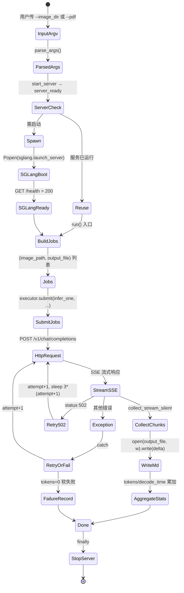
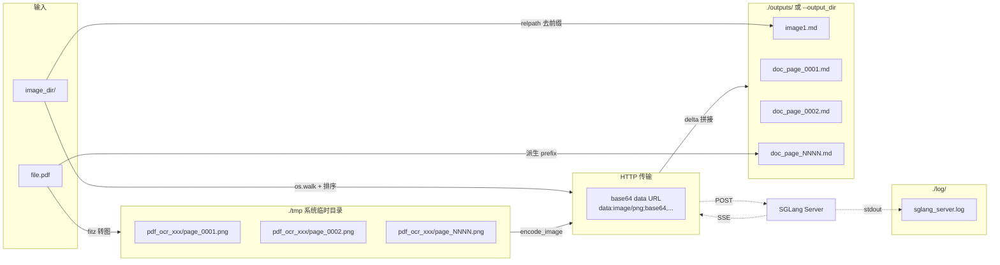
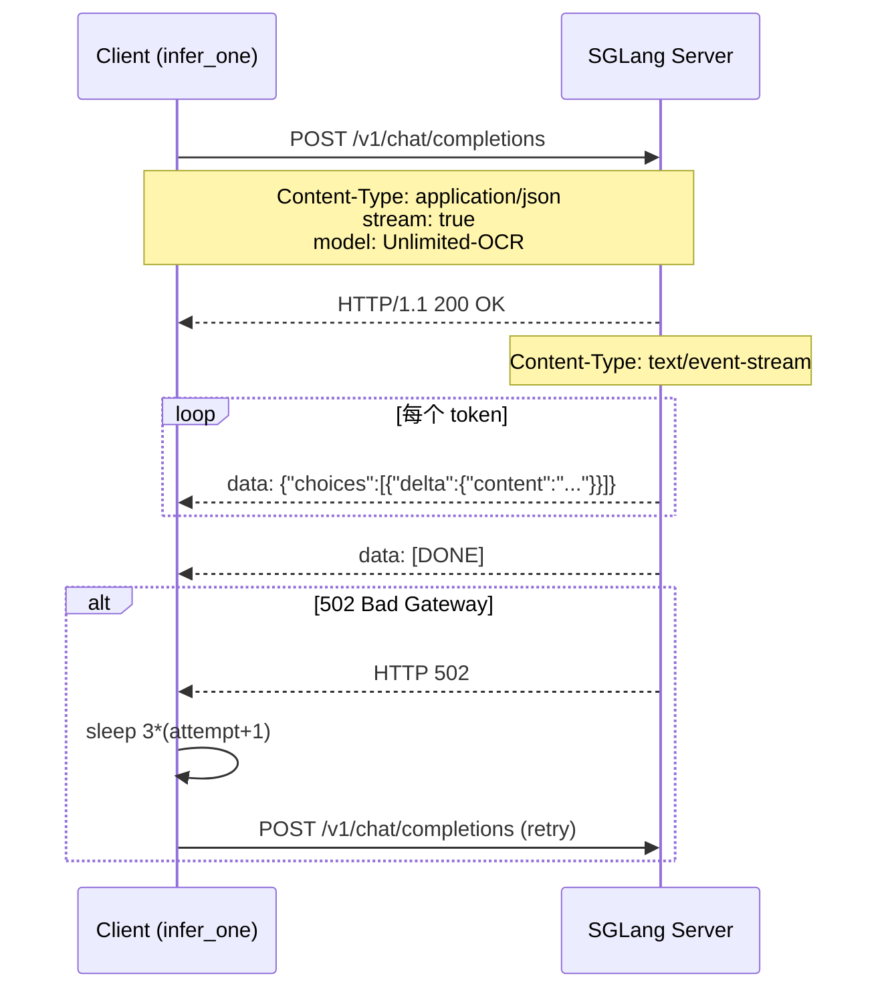

# 04 数据流

## 全生命周期



## 数据结构

脚本没有自定义类，所有数据用 `dict` / `list` / `tuple` 承载。

### `args` 命名空间（`argparse.Namespace`，`parse_args` 返回）

```python
args = Namespace(
    image_dir="",           # str: 图片目录路径
    pdf="",                 # str: PDF 文件路径
    output_dir="./outputs", # str: 输出目录
    concurrency=8,          # int: 线程池大小
    gpu="0",                # str: CUDA_VISIBLE_DEVICES 值
    model_dir="baidu/Unlimited-OCR",  # str: 模型 ID 或本地路径
    image_mode="gundam",    # str: "gundam" | "base"
    server_log="./log/sglang_server.log",  # str: 服务日志路径
)
```

### OpenAI multimodal message（`build_content` 返回）

```python
[
    {"type": "text", "text": "document parsing."},  # PROMPT
    {
        "type": "image_url",
        "image_url": {
            "url": "data:image/png;base64,iVBORw0KGgo..."
        }
    }
]
```

### 推理 payload（`infer_one` 构造）

```python
{
    "model": "Unlimited-OCR",
    "messages": [{"role": "user", "content": [...] }],
    "temperature": 0,
    "skip_special_tokens": False,
    "stream": True,
    "images_config": {"image_mode": "gundam"},
    # 可选：仅当 NO_REPEAT_NGRAM_SIZE > 0 且 NGRAM_WINDOW > 0
    "custom_logit_processor": "DeepseekOCRNoRepeatNGramLogitProcessor.to_str()",
    "custom_params": {
        "ngram_size": 35,
        "window_size": 128,
    },
}
```

### 单任务结果（`collect_stream_silent` / `infer_one` 返回）

```python
{
    "tokens": int,         # token 数（增量计数）
    "decode_time": float,  # 首个 token 到最后一个 token 的耗时（秒）
    "text": str,           # 完整文本拼接
}
```

### Job 列表（`build_jobs` 返回）

```python
[
    ("/abs/path/image1.png", "/output/dir/image1.md"),  # or None
    ("/abs/path/image2.png", "/output/dir/image2.md"),
    ...
]
```

## 文件系统布局变化



## HTTP 通信协议



## 关键数据变换

| 阶段 | 输入 | 输出 |
|------|------|------|
| PDF → 图片 | `file.pdf` | `[png_path_1, png_path_2, ...]` (tmpdir 下) |
| 图片 → base64 | `image.png` | `data:image/png;base64,<base64>` |
| base64 → message | base64 URL | OpenAI content array |
| message → payload | content array | request body dict |
| SSE → 文本 | SSE 流 | `{"tokens": N, "decode_time": t, "text": str}` |
| text → .md | text | 写入 `<output_dir>/<stem>.md` |