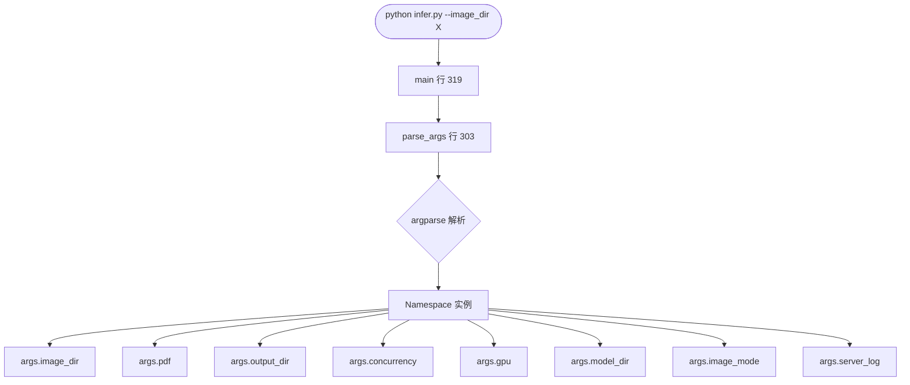
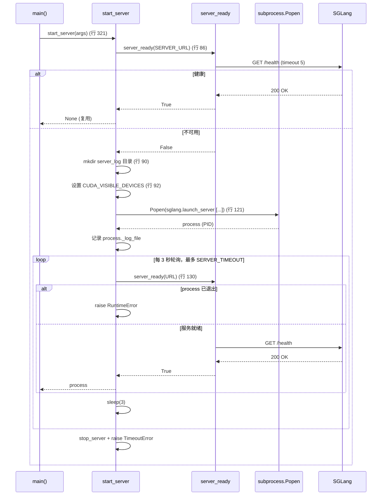
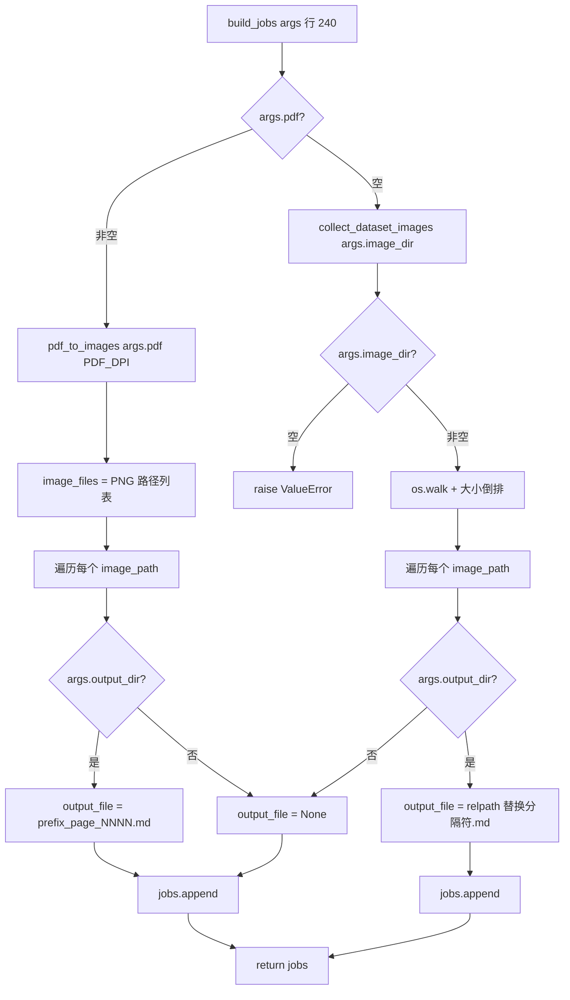
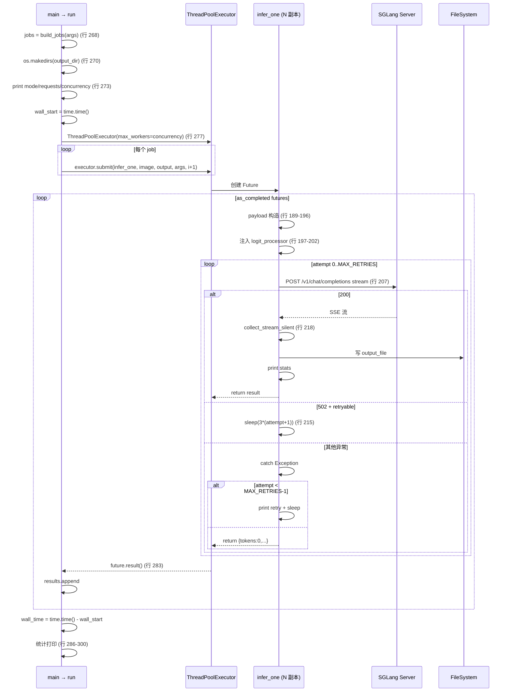
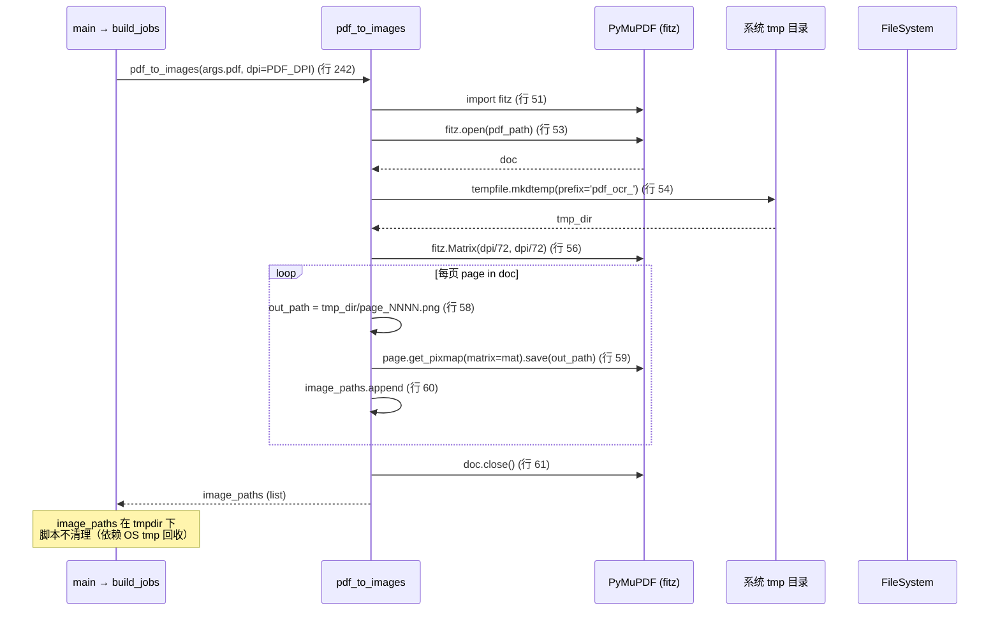
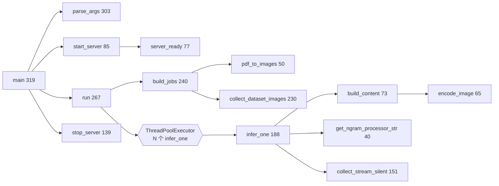

# 05 操作链

脚本的"操作链"是 7 条从 CLI 参数到 .md 输出的数据流。所有链汇聚到 `main()` 终点（`./outputs/*.md`）。

## 链 1 — CLI 解析



**关键函数**：`main`(319) · `parse_args`(303)

## 链 2 — SGLang 服务生命周期



**关键函数**：`start_server`(85) · `server_ready`(77) · `stop_server`(139) · `subprocess.Popen` · `time.sleep`

## 链 3 — Job 列表构建



**关键函数**：`build_jobs`(240) · `pdf_to_images`(50) · `collect_dataset_images`(230) · `os.path.relpath` · `os.walk`

## 链 4 — 并发调度（核心）



**关键函数**：`run`(267) · `infer_one`(188) · `collect_stream_silent`(151) · `ThreadPoolExecutor` · `as_completed`

## 链 5 — 单图片推理（`infer_one` 详细）

```mermaid
flowchart TD
    Start([infer_one image_path output_file args idx]) --> Payload[构造 payload dict 行 189-196]
    Payload --> NgramEnable{NO_REPEAT_NGRAM_SIZE > 0<br/>and NGRAM_WINDOW > 0?}
    NgramEnable -->|Yes| GetStr[get_ngram_processor_str 行 198]
    NgramEnable -->|No| Loop
    GetStr --> Inject[payload.custom_logit_processor<br/>+ custom_params 行 199-202]
    Inject --> Loop
    Loop[for attempt in range MAX_RETRIES 行 205] --> Post[requests.post stream 行 207-213]
    Post --> CheckStatus{resp.status_code?}
    CheckStatus -->|200| Collect[collect_stream_silent 行 218]
    Collect --> PrintOK[print tokens, decode_time 行 219]
    PrintOK --> ReturnOK[return result]
    CheckStatus -->|502 and attempt < N-1| SleepBackoff[sleep 3 * attempt+1 行 215]
    SleepBackoff --> Loop
    CheckStatus -->|其他| Raise[raise_for_status 行 217]
    Raise --> Catch{catch Exception 行 221}
    Catch -->|attempt < N-1| PrintRetry[print retry 行 223]
    PrintRetry --> SleepRetry[sleep 3 * attempt+1 行 224]
    SleepRetry --> Loop
    Catch -->|attempt == N-1| PrintFail[print FAILED 行 226]
    PrintFail --> ReturnFail[return {tokens:0, decode_time:0, text:}]
    ReturnOK --> End
    ReturnFail --> End
```

**关键函数**：`infer_one`(188) · `collect_stream_silent`(151) · `get_ngram_processor_str`(40) · `requests.post` · `time.sleep`

## 链 6 — SSE 流式响应收集

```mermaid
flowchart TD
    Start([collect_stream_silent resp output_file]) --> OpenFile{output_file?}
    OpenFile -->|非空| F1[open w utf-8 行 155]
    OpenFile -->|None| F0[f = None]
    F1 --> Loop
    F0 --> Loop[for raw_line in resp.iter_lines 行 157]
    Loop --> SkipEmpty{raw_line 为空?}
    SkipEmpty -->|Yes| Loop
    SkipEmpty -->|No| Decode[bytes → str 解码 行 160]
    Decode --> HasData{以 data: 开头?}
    HasData -->|No| Loop
    HasData -->|Yes| StripData[data: 后的内容 strip 行 163]
    StripData --> Done{data == [DONE]?}
    Done -->|Yes| BreakOut[break]
    Done -->|No| TryJson[try json.loads 行 167]
    TryJson -->|JSONDecodeError or KeyError| Loop
    TryJson -->|OK| GetDelta[delta = choices[0].delta.content 行 168]
    GetDelta --> HasDelta{delta 非空?}
    HasDelta -->|No| Loop
    HasDelta -->|Yes| TimeFirst{first_token_time 为 None?}
    TimeFirst -->|Yes| MarkTime[first_token_time = time.time 行 174]
    TimeFirst -->|No| Count
    MarkTime --> Count[token_count += 1 行 175]
    Count --> Append[chunks.append delta 行 176]
    Append --> WriteFile{f?}
    WriteFile -->|Yes| WriteDelta[f.write delta 行 178]
    WriteFile -->|No| Loop
    WriteDelta --> Loop
    BreakOut --> Finally[finally: 关闭 f 行 180-181]
    Finally --> CalcTime[end_time = time.time 行 183]
    CalcTime --> DecodeTime[decode_time 计算 行 184]
    DecodeTime --> ReturnDict[return {tokens, decode_time, text}]
```

**关键函数**：`collect_stream_silent`(151) · `requests.get/post` · `resp.iter_lines` · `json.loads`

## 链 7 — PDF 转图片



**关键函数**：`pdf_to_images`(50) · `tempfile.mkdtemp` · `fitz.open` · `fitz.Matrix` · `page.get_pixmap`

## 整体调用图（简化）

