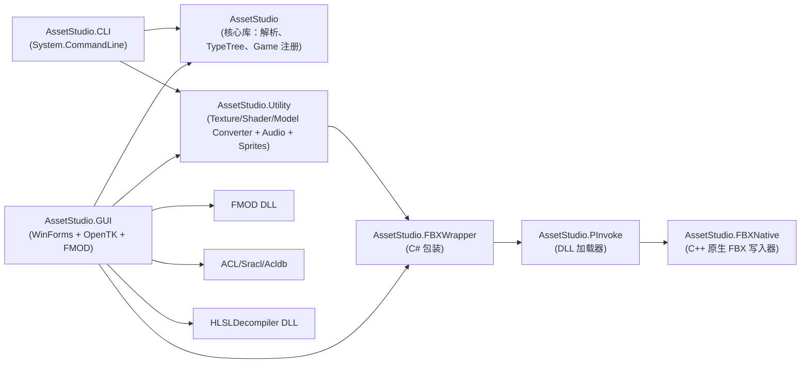

# 01 项目总览（Overview）

## 1. 项目基本信息

| 属性 | 值 |
|---|---|
| 名称 | AssetStudio（Razmoth 维护的 Perfare/AssetStudio 分支） |
| 主语言 | C#（.NET 8 / .NET 10） |
| 辅助语言 | C++（`AssetStudio.FBXNative`，通过 .vcxproj 编译为原生 DLL） |
| 解决方案 | `AssetStudio.sln` |
| 目标框架 | `net8.0;net10.0`（核心库）；`net8.0-windows;net10.0-windows`（GUI/CLI，依赖 WinForms） |
| 入口可执行文件 | `AssetStudio.GUI.exe`（WinForms）、`AssetStudio.CLI.exe`（命令行） |
| 版本 | csproj 中 `1.36.00`；README 中标注 `v2.4.0` |

## 2. 项目定位

AssetStudio 是一个 **离线 Unity 资源解析与导出工具**，无需运行 Unity 编辑器或游戏，就能从游戏发行包中提取资产并转换为常用格式。

核心能力：

- **容器解析**：`UnityFS` / `UnityWeb` / `UnityRaw` / `ENCR` / `BlockFile` / `Blk` / `Blb` / `Mhy` 等十余种 Unity 打包格式
- **多游戏解密**：通过 `GameManager` 注册的 38 种游戏类型（`Normal`、`GI`、`BH3`、`SR`、`ZZZ`、`Naraka`、`ArknightsEndfield`、`AnchorPanic`、`DreamscapeAlbireo`、`JJKPhantomParade` 等），每种携带各自的 ExpansionKey / SBox / InitVector / BlockKey
- **压缩解压**：LZMA / LZ4 / LZ4HC / LZ4-Mr0k / LZ4-Inv / LZ4-Lit / Zstd / Brotli / GZip / Crunched
- **TypeTree 反序列化**：从 SerializedFile 重建每个 Unity 类的强类型对象
- **资产导出**：
  - 纹理：DXT / ETC2 / ASTC / PVRTC / Crunched → PNG/JPG/WebP/BMP
  - 网格：OBJ / FBX
  - 着色器：HLSL（DX9/DX11）/ GLSL（GL/GLES/Vulkan 反编译成 SPIRV）/ Metal / 控制台原始字节
  - 音频：FMOD 驱动的 `.wav` / 原始格式
  - 文本、字体、动画、MonoBehaviour JSON、MiHoYoBinData 等
- **3D 预览**：WinForms + OpenTK，渲染 Mesh / SkinnedMesh / GameObject
- **音频预览**：内置 FMOD
- **资源图谱**：`CABMap` / `AssetMap` 缓存，支持 `--map_op` / `--map_type` / `--dummy_dlls` 等参数
- **MonoBehaviour 反序列化**：通过 `--dummy_dlls` 加载用户提供的 dll 目录，使用 `Mono.Cecil` 进行类型匹配，再用 TypeTree 解析字节流为 JSON

## 3. 技术栈

### NuGet 依赖

| 包 | 版本 | 用途 |
|---|---|---|
| `MessagePack` | 2.6.100-alpha | `AssetMap.map` 二进制序列化 |
| `Newtonsoft.Json` | 13.0.3 | JSON 序列化 |
| `ZstdSharp.Port` | 0.7.2 | Zstd 解压 |
| `OpenTK` | 4.8.0 | GUI 端 3D 预览、FMOD 绑定 |
| `System.CommandLine` | 2.0.0-beta4.22272.1 | CLI 参数解析 |
| `System.Configuration.ConfigurationManager` | 8.0.1 | CLI 的 App.config 持久化 |

### 原生依赖

- `AssetStudio.FBXNative.dll`（C++，被 `AssetStudio.FBXWrapper` + `AssetStudio.PInvoke` 加载）
- `fmod.dll`（仅 GUI）
- `acl.dll` / `sracl.dll` / `acldb.dll`（Animation Compression Library，3D 骨骼动画压缩）
- `HLSLDecompiler.dll`（DX11 HLSL 反编译）
- `BinaryDecompiler.lib`

### 端口代码

- 整个 `AssetStudio/Brotli/` 是纯 C# 的 Brotli 解码器
- `AssetStudio/LZ4/` 是 LZ4 + LZ4-Mr0k + LZ4-Inv + LZ4-Lit 的纯 C# 实现
- `AssetStudio/7zip/` 是 7zip LZMA 解码器的纯 C# 移植
- `AssetStudio/Math/` 是 Vector / Quaternion / Matrix / Color / Half 纯 C# 实现
- `AssetStudio/YAML/` 是自实现的 YAML emitter（用于 `Object.Dump()` 输出）

## 4. 运行模式

### 4.1 GUI（`AssetStudio.GUI`）

Windows-only WinForms 程序，提供：

- 树形目录（按 `originalPath` → `assetsFile.fileName` → GameObject 嵌套）
- 资产列表（虚拟模式 ListView，支持排序、过滤、正则搜索）
- 类型树浏览器
- 预览面板：Texture（4 通道开关）、3D 模型（OpenTK 旋转/缩放/线框）、音频（FMOD 播放）、字体（PrivateFontCollection）、Shader / TextAsset / MonoBehaviour 文本
- 通过右上角工具栏切换 Game 类型、Unity 版本、加载 CABMap / AssetMap、构建/上传 Asset Index（GI 系列）
- 通过右键菜单导出 Raw / Dump / Convert / JSON 四种模式

入口：`AssetStudio.GUI/Program.cs`（仅一行调用 `Application.Run(new MainForm())`）

### 4.2 CLI（`AssetStudio.CLI`）

跨平台（mono-friendly），使用 `System.CommandLine` 解析 18+ 个选项，常见命令形态：

```bash
AssetStudio.CLI.exe <input> <output> --game <GameName> [options...]
```

详见 [06_build_and_run.md](06_build_and_run.md)。

## 5. 项目子模块



## 6. 文档约束

- **代码标识符、文件名、类名、函数名**：全部保留原文
- **叙述**：中文
- **mermaid 图**：完整声明（flowchart TD / sequenceDiagram / classDiagram / stateDiagram-v2）