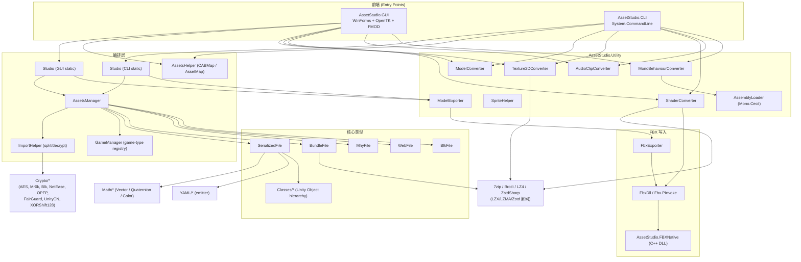
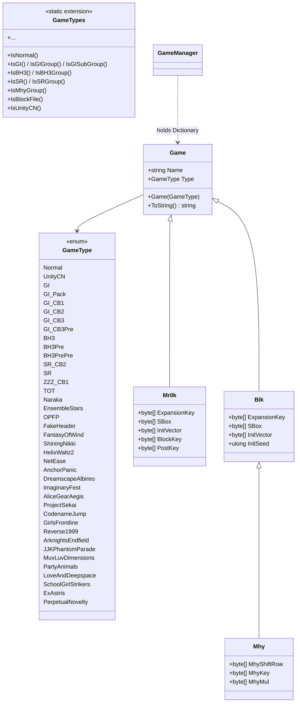
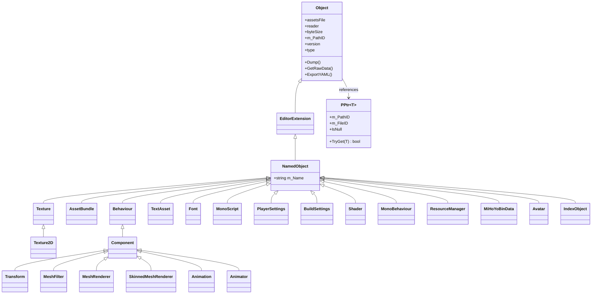
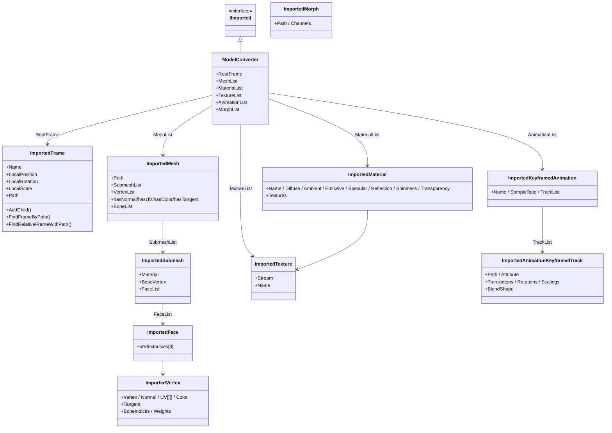

# 03 架构总览（Architecture）

## 1. 分层架构

AssetStudio 采用清晰的 **分层 + 静态状态** 架构。底层为 IO 与解析，中间层为核心数据结构，顶层为 GUI/CLI 双前端。**两个项目都把 `AssetsManager`、`Studio`、`AssemblyLoader` 设为 static global**，因此不需要 DI 容器。

### 1.1 模块依赖图

### 1.2 关键设计决策

1. **静态 `Studio` 类持有全局状态**：`assetsManager`、`assemblyLoader`、`exportableAssets` 都是 `static`。GUI/CLI 各自一份，互不干扰。
2. **并行 IO**：所有"批处理"任务（Load/Read/Export）都用 `Parallel.For` / `Parallel.ForEach`，度数为 `Environment.ProcessorCount`。
3. **`FileReader.PreProcessing(Game)` 扩展方法**：把"游戏类型感知"的解密逻辑封装成 FileReader 上的链式扩展，再由 `AssetsManager.LoadFile(FileReader)` 调度。
4. **TypeTree 驱动反序列化**：`ObjectReader` 通过 `m_SerializedType.m_Type.m_Nodes` 逐字段读取。
5. **`ResourceIndex` / `AIVersionManager`**：独立缓存系统，专门处理 GI 系列的 container ID → 真实路径映射（从 `gi-asset-indexes` GitHub 仓库动态拉取）。
6. **原生 P/Invoke 边界**：`FbxExporter` 与 `HLSLDecompiler` 是仅有的两处原生调用边界；其余均为纯 C#。

## 2. 核心类继承与组合

### 2.1 Game 类型继承（`AssetStudio/GameManager.cs`）

### 2.2 Object 类继承（`AssetStudio/Classes/*.cs`）

> `RuntimeAnimatorController` 是 `AnimatorController` / `AnimatorOverrideController` 的共同父。

### 2.3 `IImported` 中间表示（FBX 输出中间结构）

## 3. 调用方向

- **下行（依赖方向）**：GUI/CLI → Studio（静态） → AssetsManager → SerializedFile / BundleFile / MhyFile / ...
- **上行（数据流方向）**：FileReader → SerializedFile → Object（强类型） → Studio.exportableAssets → Exporter → 输出文件
- **横向**：Utility 项目独立于前端项目，被两端通过 `using static` 引入；不会反过来引用 Studio/AssetsManager
- **原生边界**：`AssetStudio.Utility` 通过 `AssetStudio.FBXWrapper` 调用 `AssetStudio.FBXNative`；`ShaderConverter` 通过 `AssetStudio.PInvoke.DllLoader` 加载 `HLSLDecompiler.dll`

## 4. 线程模型

- **GUI**：UI 线程持有 `MainForm`；`AssetsManager.LoadFiles/ReadAssets/ProcessAssets` 跑在 `Task.Run` 里；导出跑在 `Task.Run` 里，通过 `BeginInvoke` 回到 UI 线程刷新进度条 / 状态栏
- **CLI**：单线程主流程，但 `assetsManager.LoadFiles`、`AssetsHelper.LoadFiles` 内部用 `Parallel.For` 进行并行 IO；`ExportAssets` 用 `Parallel.ForEach` 并行导出
- **取消**：`AssetsManager.tokenSource`、`AssetsHelper.tokenSource` 是 `CancellationTokenSource`；GUI 的 "Abort" 菜单调用 `tokenSource.Cancel()`