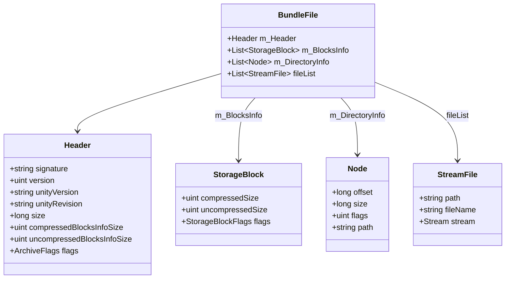
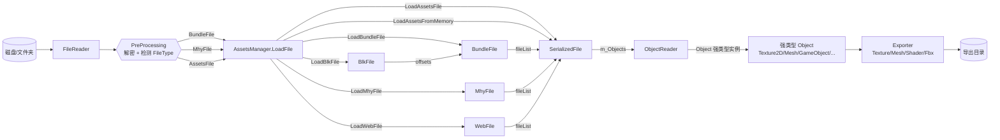
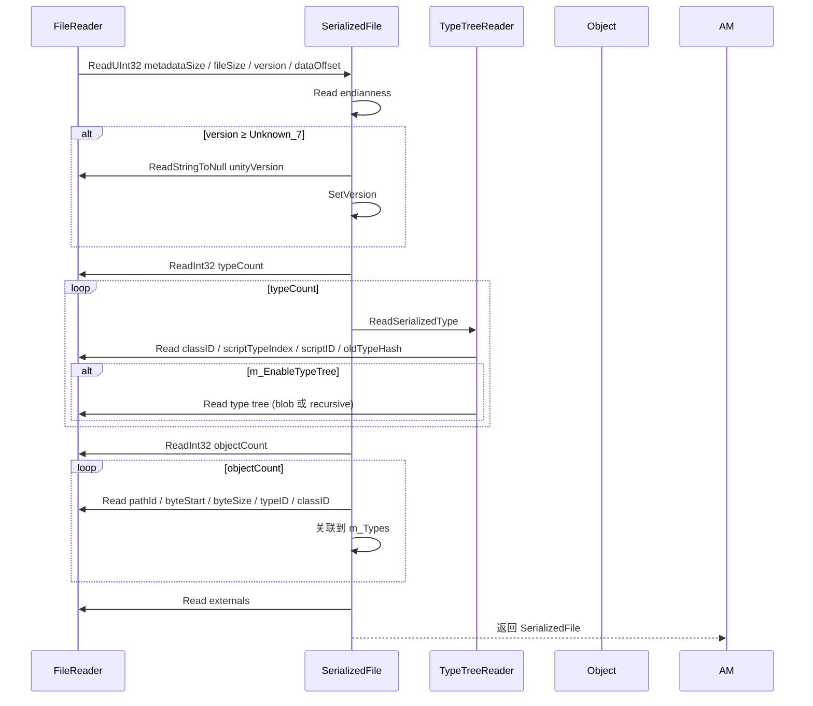
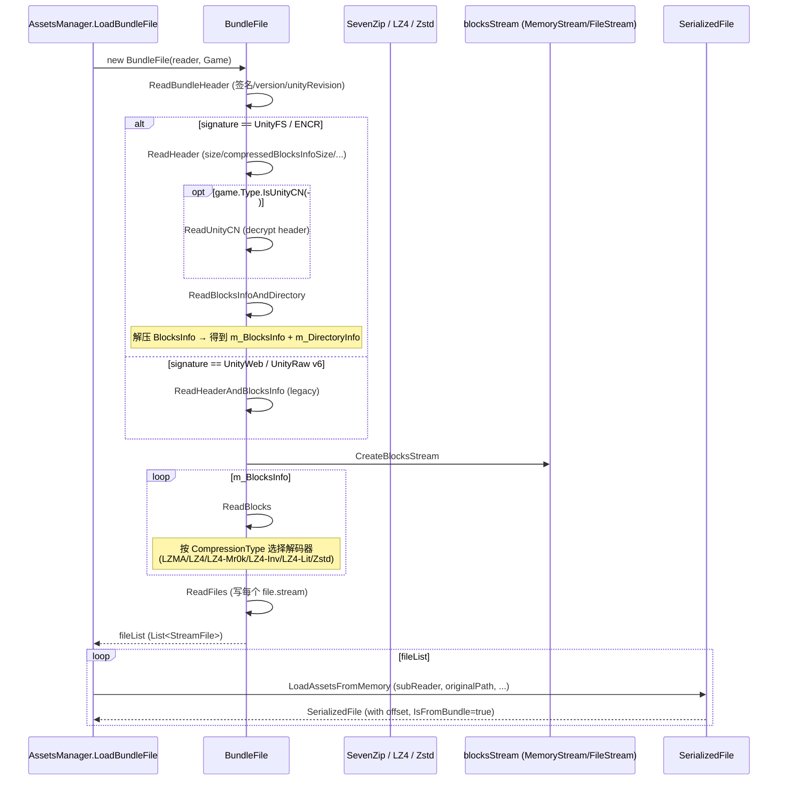
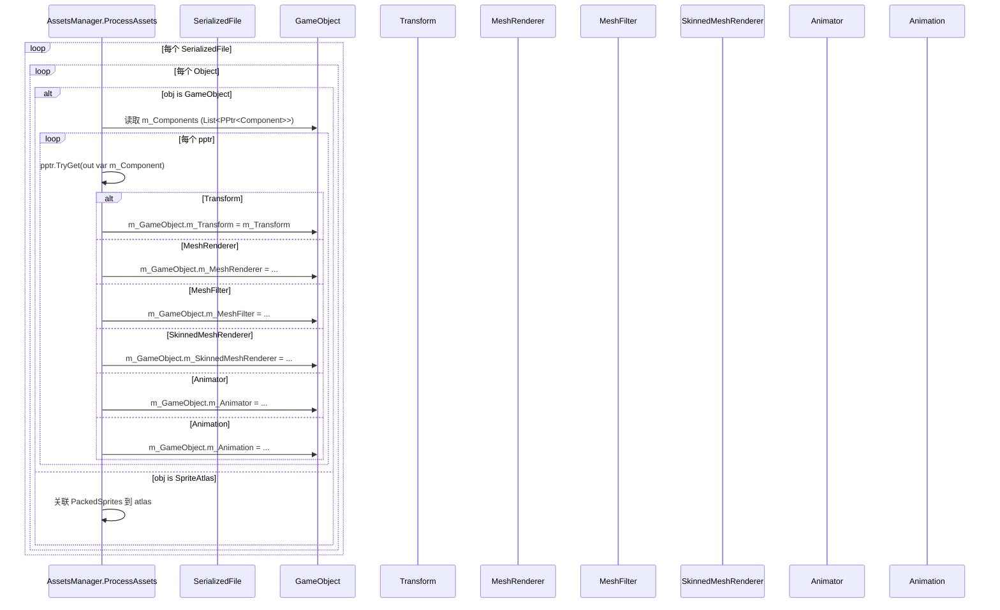
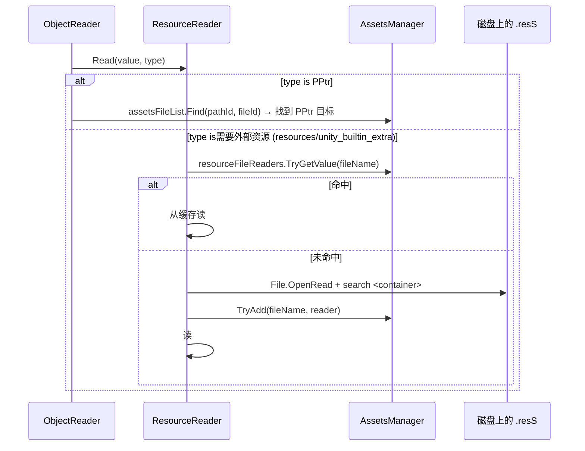
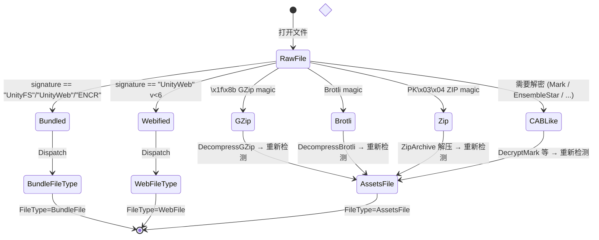

# 04 数据结构与数据流（Data Flow）

本章覆盖 AssetStudio 中**最核心**的四个数据结构，以及从磁盘文件到强类型 `Object` 集合的完整数据流。

## 1. 核心数据结构

### 1.1 `AssetsManager`（`AssetStudio/AssetsManager.cs`）

整个项目最顶层的编排器。负责：

- 维护 `assetsFileList`（所有解析过的 `SerializedFile`）
- 维护 `resourceFileReaders`（跨文件的资源二进制流，如 .resS）
- 维护 `importFiles` / `importFilesHash`（待处理文件队列）
- 维护 `noexistFiles`（已经知道不存在的依赖路径，避免重复 IO）
- 维护 `assetsFileListHash`（已加载的 SerializedFile fileName 集合）
- 调度并行加载（`Parallel.For` + wave-based 重试）
- 暴露 `LoadFiles(string[])` / `LoadFolder(string)` / `Clear()` / `CheckStrippedVersion(SerializedFile)`
- 通过 `OnVersionPrompt` 事件对外请求"stripped Unity version"（如果 folder 探测失败且 DefaultVersion 为空）

```csharp
public class AssetsManager
{
    public Game Game;
    public event EventHandler<VersionPromptEventArgs> OnVersionPrompt;
    public bool Silent = false;
    public bool SkipProcess = false;
    public bool ResolveDependencies = false;
    public string SpecifyUnityVersion;
    public string DefaultVersion;
    public CancellationTokenSource tokenSource = new();
    public List<SerializedFile> assetsFileList = new();

    internal ConcurrentDictionary<string, BinaryReader> resourceFileReaders;
    internal List<string> importFiles;
    internal ConcurrentDictionary<string, byte> importFilesHash;
    internal ConcurrentDictionary<string, byte> noexistFiles;
    internal ConcurrentDictionary<string, byte> assetsFileListHash;
}
```

### 1.2 `SerializedFile`（`AssetStudio/SerializedFile.cs`）

Unity 中 **单个** `.assets` / `.unity3d` 文件的逻辑表示。解析后字段：

| 字段 | 类型 | 说明 |
|---|---|---|
| `assetsManager` | `AssetsManager` | 所属的 AssetsManager |
| `reader` | `FileReader` | 当前文件 reader |
| `game` | `Game` | 解析时使用的 Game（影响 m_NextOffset 加密等） |
| `offset` | `long` | 在 bundle 内的偏移（bundle-loaded 时记录） |
| `originalPath` / `fullName` / `fileName` | `string` | 路径信息 |
| `version` | `int[4]` | 解析后的 Unity 版本号（major/minor/patch/build） |
| `buildType` | `BuildType` | 包含 f/p/b 的 BuildType（版本字符串中的字母） |
| `header` | `SerializedFileHeader` | 头：metadataSize/fileSize/version/dataOffset |
| `unityVersion` | `string` | 字符串形式的 Unity 版本 |
| `m_TargetPlatform` | `BuildTarget` | 平台 |
| `m_Types` | `List<SerializedType>` | 类型表 |
| `bigIDEnabled` | `int` | PathID 是否 64-bit |
| `m_Objects` | `List<ObjectInfo>` | 对象表（pathId/byteStart/byteSize/type/classID） |
| `m_Externals` | `List<FileIdentifier>` | 外部依赖 |
| `m_RefTypes` | `List<SerializedType>` | 引用类型（仅 SupportsRefObject 之后） |
| `userInformation` | `string` | userInformation 段 |
| `Objects` | `List<Object>` | 已反序列化的强类型对象 |
| `ObjectsDic` | `Dictionary<long, Object>` | pathId → Object |
| `WasOriginallyStripped` / `IsFromBundle` | `bool` | 标记用 |

关键方法：

- `SerializedFile(FileReader, AssetsManager)`：构造时一次性解析 header + types + objects + externals + refTypes
- `SetVersion(string)`：版本字符串 → `version[4]` + `buildType`
- `AddObject(Object)`：添加到 `Objects` + `ObjectsDic`
- `IsVersionStripped`：当 `unityVersion == "0.0.0"`

### 1.3 `BundleFile`（`AssetStudio/BundleFile.cs`）

UnityFS / UnityWeb / UnityRaw / ENCR 容器的解析器。结构：



压缩类型 `CompressionType`：`None`、`Lzma`、`Lz4`、`Lz4HC`、`Lzham`、`Lz4Mr0k`、`Lz4Inv`、`Lz4Lit4`、`Lz4Lit5`、`Zstd`。

### 1.4 `GameManager`（`AssetStudio/GameManager.cs`）

静态注册表，把 `GameType`（枚举）映射到对应的 `Game` / `Mr0k` / `Blk` / `Mhy` 实例：

```csharp
static GameManager()
{
    Games.Add(index++, new(GameType.Normal));
    Games.Add(index++, new(GameType.UnityCN));
    Games.Add(index++, new Mhy(GameType.GI, GIMhyShiftRow, GIMhyKey, GIMhyMul, GIExpansionKey, GISBox, GIInitVector, GIInitSeed));
    Games.Add(index++, new Mr0k(GameType.GI_Pack, PackExpansionKey, blockKey: PackBlockKey));
    // ... 共 38 项
}
```

关键方法：

- `GetGame(GameType)` / `GetGame(int)` / `GetGame(string)`：按 enum / 索引 / 名字查询
- `GetGames()` / `GetGameNames()`：枚举所有
- `SupportedGames()`：格式化为字符串

`GameTypes` 静态扩展类提供 `IsGI()` / `IsBH3Group()` / `IsMhyGroup()` / `IsBlockFile()` 等谓词。

## 2. 数据流

### 2.1 总体数据流



### 2.2 SerializedFile 解析细节



### 2.3 Bundle 解压细节



### 2.4 GameObject 关联建立（`AssetsManager.ProcessAssets`）



### 2.5 资源跨文件引用（`ResourceReader`）



## 3. 状态机：`FileReader.PreProcessing`

