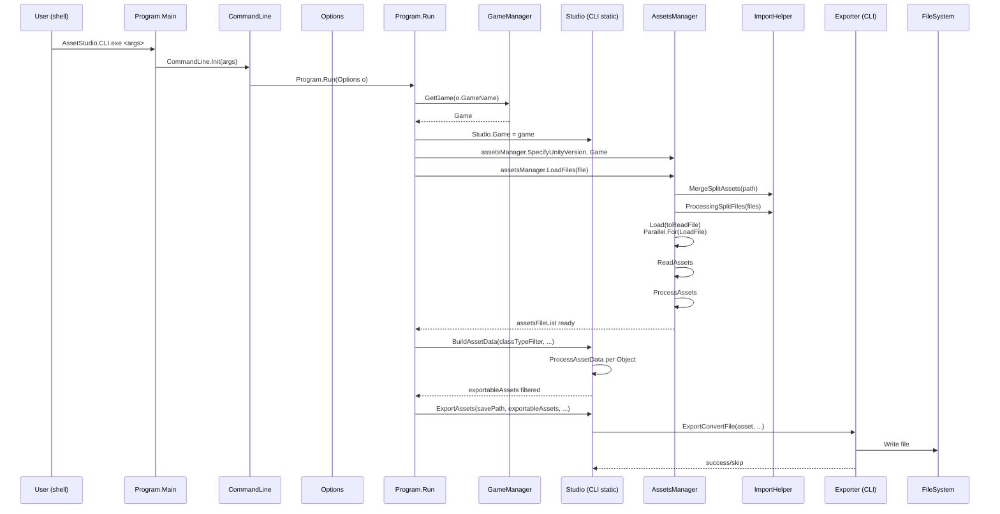
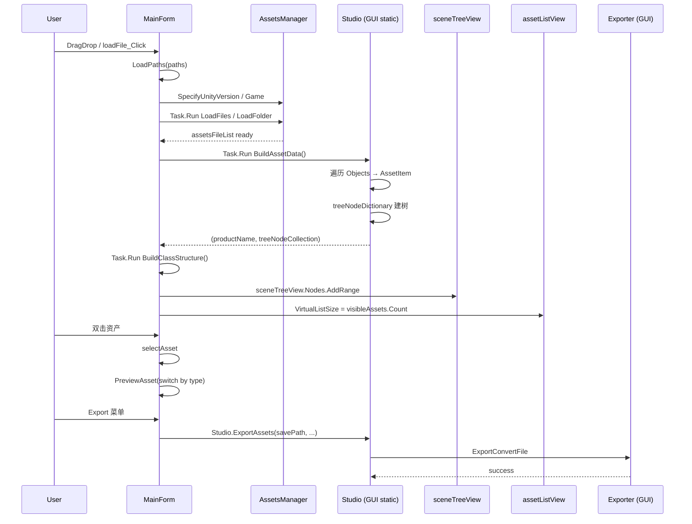
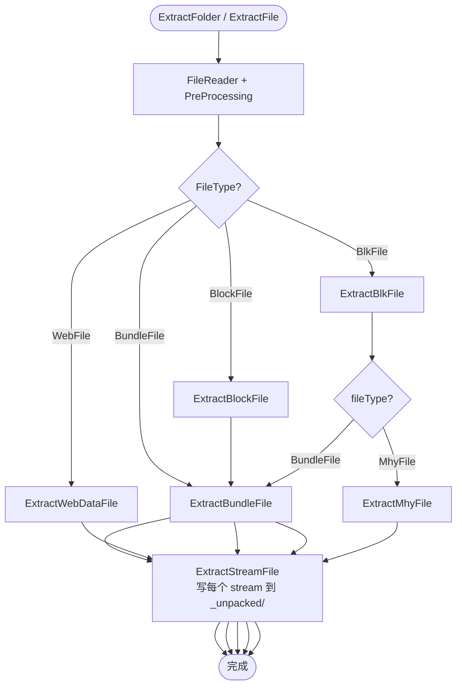
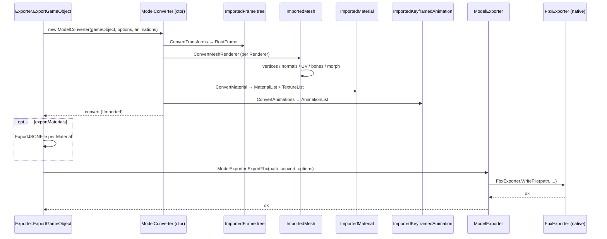
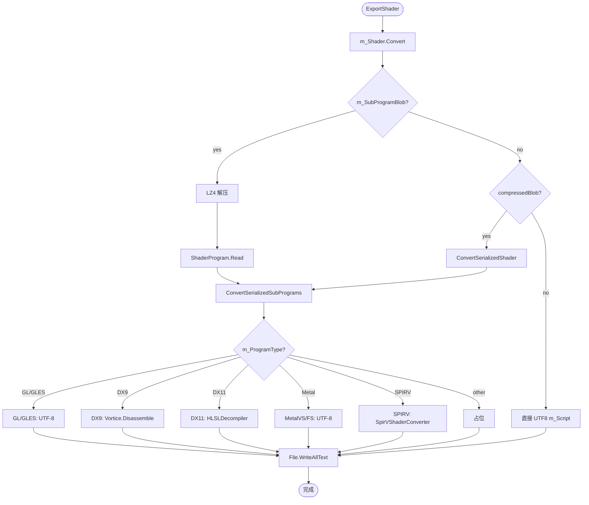
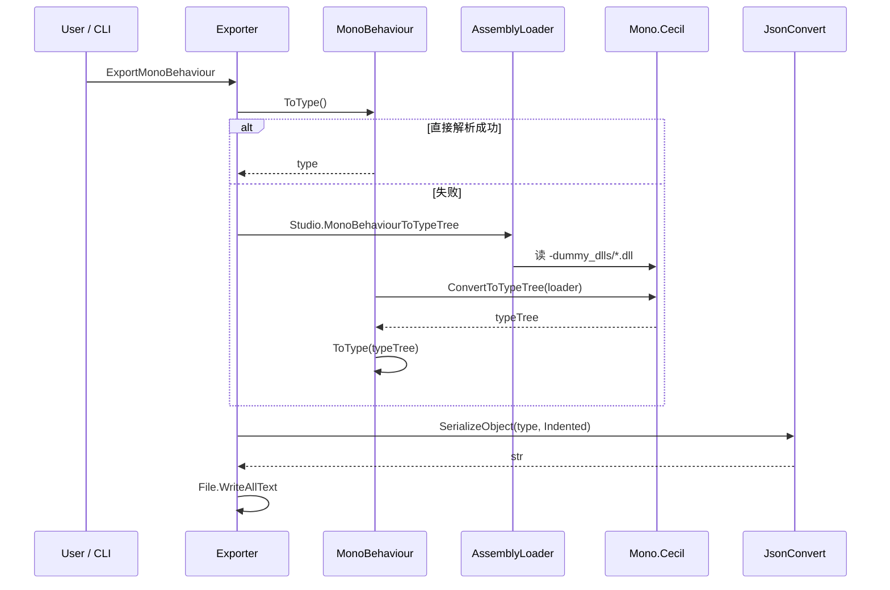
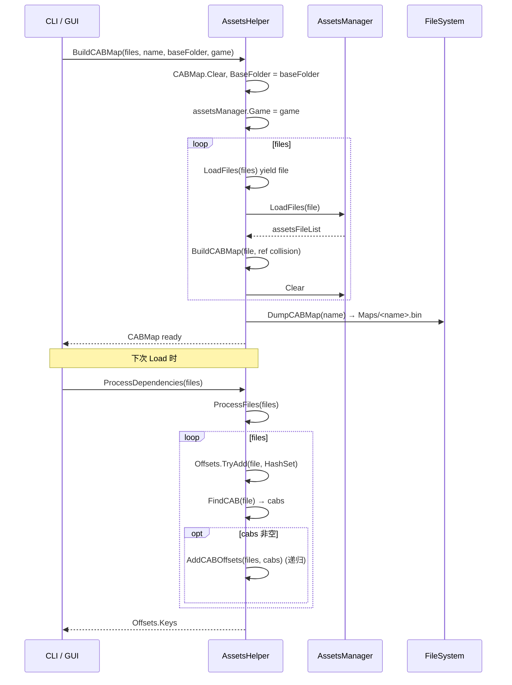
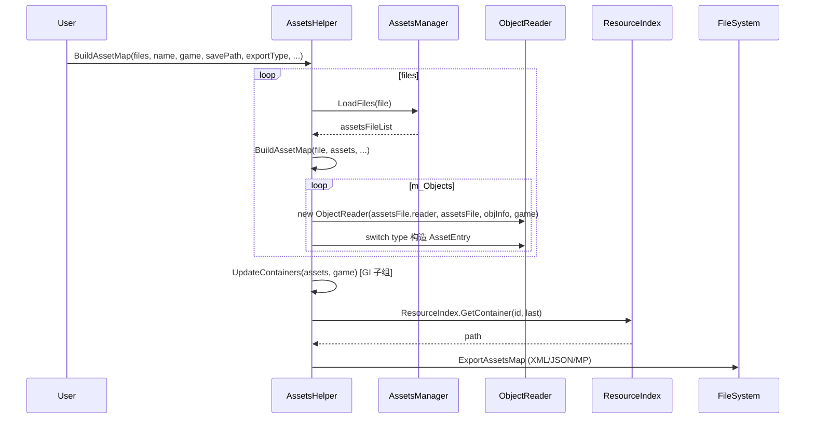
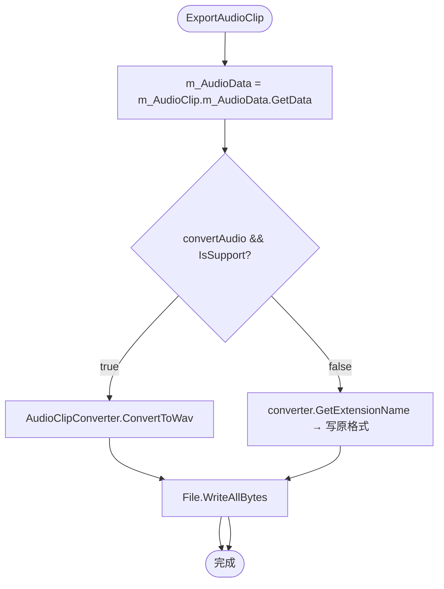

# 05 操作链（Operation Chains）

本章列出 AssetStudio 中 **6 条以上** 关键操作链，每条包含：

- 输入 → 步骤 → 输出
- mermaid 时序图
- 关键函数清单（含 file:line）

> 图中 `CLI:`/`GUI:` 前缀只是为了区分 CLI 与 GUI；同名静态类调用视为等价。

---

## 链 1：CLI 主流程 — 加载 + 反序列化 + 导出

> 适用场景：用户在 shell 中跑 `AssetStudio.CLI.exe <input> <output> --game GI --types Texture2D:Both,Shader:Both --export_type Convert`

**输入**：一个或多个 `.unity3d` / `.assets` / 数据目录
**输出**：在 `<output>` 下按类型/容器分组的导出文件
**步骤**：

1. `Program.Main(args)` → `CommandLine.Init(args)`
2. `CommandLine.RegisterOptions()` 创建 `RootCommand` + 18 个 `Option` + `Options`
3. `rootCommand.SetHandler(Program.Run, optionsBinder)`
4. `Program.Run(Options o)`：
   - `GameManager.GetGame(o.GameName)` → `game`
   - 若 `UnityCN` → `UnityCNManager.TryGetEntry + UnityCN.SetKey`
   - `Studio.Game = game`；`Logger.Default = ConsoleLogger`
   - `AssetsHelper.SetUnityVersion(o.UnityVersion)`
   - `TypeFlags.SetTypes(...)` + `--types` 解析
   - `o.Output.Create()`；`MiHoYoBinData.Encrypted/Key` 若 `--key`
   - 若 `--ai_file` 且 `IsGISubGroup` → `ResourceIndex.FromFile`
   - 若 `--dummy_dlls` → `assemblyLoader.Load`
   - 若 `--map_op` 包含 CABMap / AssetMap / Both → 分支进入
   - 否则（`--map_op None` 或 `--map_op Load`）：
     - 收集 `files[]`
     - 对每个 file：`assetsManager.LoadFiles(file)` → `BuildAssetData` → `ExportAssets`
5. `assetsManager.LoadFiles` → `DetectUnityVersionFromFolder` → `MergeSplitAssets` → `ProcessingSplitFiles` → `AssetsHelper.ProcessDependencies?` → `Load(files)` → 并行 `LoadFile` → `ReadAssets` → `ProcessAssets`
6. `BuildAssetData` 把 `assetsFile.Objects` 转换为 `AssetItem`，按 name/type/container 过滤
7. `ExportAssets` 用 `Parallel.ForEach` 并行导出：调 `ExportConvertFile` switch 按 `item.Type` 分派



**关键函数**：

- `Program.Main(string[])` — `AssetStudio.CLI/Program.cs:14`
- `Program.Run(Options)` — `AssetStudio.CLI/Program.cs:16`
- `CommandLine.Init` — `AssetStudio.CLI/Components/CommandLine.cs:14`
- `CommandLine.RegisterOptions` — `AssetStudio.CLI/Components/CommandLine.cs:19`
- `OptionsBinder.GetBoundValue` — `AssetStudio.CLI/Components/CommandLine.cs:247`
- `AssetsManager.LoadFiles(string[])` — `AssetStudio/AssetsManager.cs:48`
- `AssetsManager.LoadFolder(string)` — `AssetStudio/AssetsManager.cs:73`
- `AssetsManager.Load(string[])` — `AssetStudio/AssetsManager.cs:96`
- `AssetsManager.LoadFile(FileReader)` — `AssetStudio/AssetsManager.cs:296`
- `AssetsManager.LoadBundleFile(FileReader, ...)` — `AssetStudio/AssetsManager.cs:485`
- `AssetsManager.LoadAssetsFile(FileReader)` — `AssetStudio/AssetsManager.cs:330`
- `AssetsManager.ReadAssets` — `AssetStudio/AssetsManager.cs:937`
- `AssetsManager.ProcessAssets` — `AssetStudio/AssetsManager.cs:1010`
- `Studio.BuildAssetData(...)` — `AssetStudio.CLI/Studio.cs:231`
- `Studio.ProcessAssetData(...)` — `AssetStudio.CLI/Studio.cs:283`
- `Studio.ExportAssets(...)` — `AssetStudio.CLI/Studio.cs:366`
- `Exporter.ExportConvertFile` — `AssetStudio.CLI/Exporter.cs:467`
- `ImportHelper.MergeSplitAssets` — `AssetStudio/ImportHelper.cs:19`
- `ImportHelper.ProcessingSplitFiles` — `AssetStudio/ImportHelper.cs:49`

---

## 链 2：GUI 主流程 — 拖拽/Load → 树+列表+预览

**输入**：拖入或 `loadFile_Click`/`loadFolder_Click` 选择文件/目录
**输出**：左侧场景树、右侧资产列表、底部预览
**步骤**：

1. 用户触发 `loadFile_Click` / `loadFolder_Click` / `MainForm_DragDrop`
2. `MainForm.LoadPaths(paths)`：
   - `ResetForm()` 清空 UI 状态
   - `assetsManager.SpecifyUnityVersion = specifyUnityVersion.Text`
   - `assetsManager.Game = Studio.Game`
   - `Task.Run(() => assetsManager.LoadFiles/LoadFolder)`
   - `BuildAssetStructures()`
3. `BuildAssetStructures`：
   - `Task.Run(BuildAssetData)` → GUI 版 `BuildAssetData` 返回 `(productName, List<TreeNode>)`
   - `Task.Run(BuildClassStructure)` → `(Dictionary<string, SortedDictionary<int, TypeTreeItem>>)`
   - 填充 `sceneTreeView.Nodes`、`assetListView.VirtualListSize`、`classesListView`
   - 构造 `filterTypeToolStripMenuItem` 子菜单
4. 用户双击列表项 → `selectAsset` → `PreviewAsset(assetItem)` switch
5. 用户点击导出菜单 → `MainForm.ExportAssets(ExportFilter, ExportType)` → `Studio.ExportAssets(...)`



**关键函数**：

- `MainForm.MainForm` — `AssetStudio.GUI/MainForm.cs:84`
- `MainForm.LoadPaths` — `AssetStudio.GUI/MainForm.cs:294`
- `MainForm.loadFile_Click` — `AssetStudio.GUI/MainForm.cs:310`
- `MainForm.loadFolder_Click` — `AssetStudio.GUI/MainForm.cs:329`
- `MainForm.MainForm_DragDrop` — `AssetStudio.GUI/MainForm.cs:285`
- `MainForm.BuildAssetStructures` — `AssetStudio.GUI/MainForm.cs:377`
- `MainForm.PreviewAsset` — `AssetStudio.GUI/MainForm.cs:923`
- `MainForm.ExportAssets(ExportFilter, ExportType)` — `AssetStudio.GUI/MainForm.cs:2052`
- `Studio.BuildAssetData()` — `AssetStudio.GUI/Studio.cs:234`
- `Studio.BuildClassStructure` — `AssetStudio.GUI/Studio.cs:489`
- `Studio.ExportAssets(string, List<AssetItem>, ExportType, bool)` — `AssetStudio.GUI/Studio.cs:530`

---

## 链 3：Bundle-only 提取（CLI / GUI "Extract"）

**输入**：单个 .unity3d 文件或文件夹
**输出**：在 `<savePath>/<fileName>_unpacked/<原路径>` 下释放每个 entry

**步骤**：

1. CLI 调用路径：通常通过 `Studio.ExtractFolder(path, savePath)`（CLI 没有自动调用，但调用方可以）
2. `ExtractFolder` 遍历 `Directory.GetFiles(path, "*.*", SearchOption.AllDirectories)`
3. 对每个 file：`ExtractFile(file, savePath)`
4. `ExtractFile(string, string)`：
   - `new FileReader(fileName)`
   - `reader.PreProcessing(Game)` 检测 FileType
   - switch：`BundleFile` → `ExtractBundleFile`，`WebFile` → `ExtractWebDataFile`，`BlkFile` → `ExtractBlkFile`，`BlockFile` → `ExtractBlockFile`，其它 → dispose
5. `ExtractBundleFile`：
   - `new BundleFile(reader, Game)`
   - `ExtractStreamFile(extractPath, bundleFile.fileList)` 写入每个 stream
6. `ExtractBlkFile`：
   - `BlkUtils.Decrypt(reader, (Blk)Game)` → `XORStream`
   - 在 XORStream 上 `GetOffsets` 拿到 sub-block offsets
   - 对每个 offset 建 `FileReader(dummyPath, stream, isPartial=true)`，按 FileType 分派到 `ExtractBundleFile`/`ExtractMhyFile`



**关键函数**：

- `Studio.ExtractFolder(string, string)` — CLI: `AssetStudio.CLI/Studio.cs:35`，GUI: `AssetStudio.GUI/Studio.cs:34`
- `Studio.ExtractFile(string[])` — CLI: `AssetStudio.CLI/Studio.cs:49`，GUI: `AssetStudio.GUI/Studio.cs:50`
- `Studio.ExtractFile(string, string)` — CLI: `AssetStudio.CLI/Studio.cs:60`，GUI: `AssetStudio.GUI/Studio.cs:63`
- `Studio.ExtractBundleFile` — CLI: `AssetStudio.CLI/Studio.cs:78`，GUI: `AssetStudio.GUI/Studio.cs:81`
- `Studio.ExtractWebDataFile` — CLI: `AssetStudio.CLI/Studio.cs:98`，GUI: `AssetStudio.GUI/Studio.cs:101`
- `Studio.ExtractBlkFile` — CLI: `AssetStudio.CLI/Studio.cs:111`，GUI: `AssetStudio.GUI/Studio.cs:114`
- `Studio.ExtractBlockFile` — CLI: `AssetStudio.CLI/Studio.cs:142`，GUI: `AssetStudio.GUI/Studio.cs:145`
- `Studio.ExtractMhyFile` — CLI: `AssetStudio.CLI/Studio.cs:158`，GUI: `AssetStudio.GUI/Studio.cs:161`
- `Studio.ExtractStreamFile` — CLI: `AssetStudio.CLI/Studio.cs:178`，GUI: `AssetStudio.GUI/Studio.cs:181`
- `FileReader.PreProcessing` — `AssetStudio/FileReader.cs:163`

---

## 链 4：Texture 导出（含格式解码 + 通道开关）

**输入**：`AssetItem item` where `item.Asset is Texture2D`
**输出**：PNG / JPG / BMP / WebP / `.tex`（原始压缩格式）

**步骤**：

1. `Exporter.ExportTexture2D(item, exportPath, imageFormat)`
2. 若 `convertTexture` 设置为 true（GUI 默认）：
   - `TryExportFile(exportPath, item, ".png", out var path)`
   - `m_Texture2D.ConvertToImage(true)` → `Image`：
     - 内部创建 `Texture2DConverter(m_Texture2D)`
     - `DecodeTexture2D(bytes)` 按 `m_TextureFormat` switch 到 30+ 个 `DecodeXxx`
     - 包装成 `Image`（基于 `ImageExtensions`）
   - `image.WriteToStream(file, ImageFormat)`
3. 否则写 `.tex`（`m_Texture2D.image_data.GetData()` 原始字节）

```mermaid
flowchart TD
    Start([ExportTexture2D])
    A1{item.Type == Texture2D?}
    A2{convertTexture?}
    Convert[m_Texture2D.ConvertToImage(true)]
    Decode[Texture2DConverter.DecodeTexture2D]
    Switch{TextureFormat}
    Writes[image.WriteToStream]
    Raw[写 .tex 原始字节]
    End([完成])

    Start --> A1 --> A2
    A2 -- true --> Convert --> Decode --> Switch
    Switch -- DXT --> Writes
    Switch -- ETC2 --> Writes
    Switch -- ASTC --> Writes
    Switch -- ... --> Writes
    Writes --> End
    A2 -- false --> Raw --> End
```

**关键函数**：

- `Exporter.ExportTexture2D` — CLI: `AssetStudio.CLI/Exporter.cs:12`，GUI: `AssetStudio.GUI/Exporter.cs:12`
- `Texture2DExtensions.ConvertToImage(Texture2D, bool)` — `AssetStudio.Utility/Texture2DExtensions.cs`
- `Texture2DConverter.DecodeTexture2D` — `AssetStudio.Utility/Texture2DConverter.cs:29`
- `Texture2DConverter.SwapBytesForXbox` — `AssetStudio.Utility/Texture2DConverter.cs:225`
- 各 `DecodeXxx` 私有方法 — `AssetStudio.Utility/Texture2DConverter.cs:238..694`
- `TryExportFile` — CLI: `AssetStudio.CLI/Exporter.cs:300`，GUI: `AssetStudio.GUI/Exporter.cs:300`
- `ImageExtensions.WriteToStream` — `AssetStudio.Utility/ImageExtensions.cs`

---

## 链 5：GameObject → FBX 导出

**输入**：`AssetItem item` where `item.Asset is GameObject` + 可选 `animationList`
**输出**：`<exportPath>/<gameObject.m_Name>.fbx`

**步骤**：

1. `Exporter.ExportGameObject(item, exportPath, animationList)`
2. `TryExportFolder` 创建子目录
3. `ExportGameObject(gameObject, exportPath + sep, animationList)`：
   - 构造 `ModelConverter.Options { imageFormat, game, collectAnimations, exportMaterials, materials, uvs, texs }`
   - `new ModelConverter(gameObject, options, animations)` → 构造期就完成了 Transform 树、Mesh、Material、Bone、Morph、Animation 转换
4. 若 `options.exportMaterials` → 把 `options.materials` 写出到 `Materials/<name>.json`
5. `ExportFbx(convert, exportPath)`：
   - 构造 `Fbx.ExportOptions { eulerFilter, scaleFactor, castToBone, ... }`
   - `ModelExporter.ExportFbx(path, convert, options)` → `FbxExporter.WriteFile(...)`（原生 DLL）



**关键函数**：

- `Exporter.ExportGameObject(AssetItem, string, List<AssetItem>)` — CLI: `AssetStudio.CLI/Exporter.cs:390`，GUI: `AssetStudio.GUI/Exporter.cs:389`
- `Exporter.ExportGameObject(GameObject, string, List<AssetItem>)` — CLI: `AssetStudio.CLI/Exporter.cs:399`，GUI: `AssetStudio.GUI/Exporter.cs:398`
- `ModelConverter` 构造器 — `AssetStudio.Utility/ModelConverter.cs:27, 53, 84`
- `ModelConverter.InitWithAnimator` — `AssetStudio.Utility/ModelConverter.cs:106`
- `ModelConverter.InitWithGameObject` — `AssetStudio.Utility/ModelConverter.cs:115`
- `ModelConverter.ConvertTransforms` — `AssetStudio.Utility/ModelConverter.cs:251`
- `ModelConverter.ConvertMeshRenderer(Renderer)` — `AssetStudio.Utility/ModelConverter.cs:269`
- `ModelConverter.ConvertMaterial` — `AssetStudio.Utility/ModelConverter.cs:647`
- `ModelConverter.ConvertAnimations` — `AssetStudio.Utility/ModelConverter.cs:789`
- `ModelConverter.DeoptimizeTransformHierarchy` — `AssetStudio.Utility/ModelConverter.cs:1102`
- `Exporter.ExportFbx(IImported, string)` — CLI: `AssetStudio.CLI/Exporter.cs:435`，GUI: `AssetStudio.GUI/Exporter.cs:463`

---

## 链 6：Shader 反编译（HLSL / GLSL / SPIRV）

**输入**：`AssetItem item` where `item.Asset is Shader`
**输出**：`*.shader`（含 SubProgram 块的文本）

**步骤**：

1. `Exporter.ExportShader(item, exportPath)`
2. `m_Shader.Convert()` → `ShaderConverter.Convert(this Shader)`（扩展方法）：
   - 若 `m_SubProgramBlob != null`（5.3-5.4）：LZ4 解压 → 构造 `ShaderProgram` → `Export(script)` 替换 `GpuProgramIndex N`
   - 若 `compressedBlob != null`（5.5+）：`ConvertSerializedShader(shader)`：
     - 按 `platforms / offsets / compressedLengths / decompressedLengths` 解压每个 blob
     - 构造 `ShaderProgram[]`
     - `ConvertSerializedShader(m_ParsedForm, platforms, programs)`：输出 Shader 文本（Properties / SubShader / Pass / Program vp|fp|gp|hp|dp|rtp）
3. `ConvertSerializedSubPrograms` 按 `m_GpuProgramType` 分派到合适格式
4. `ShaderSubProgram.Export()` 根据 `m_ProgramType` 走：
   - GL 系：直接 UTF8 输出
   - DX9：`Compiler.Disassemble`（Vortice.D3DCompiler）
   - DX11：`HLSLDecompiler.DecompileShader` → HLSL 文本
   - MetalVS/FS：直接 UTF8
   - SPIRV：`SpirVShaderConverter.Convert(m_ProgramCode)`（Smolv）
   - 其它：占位



**关键函数**：

- `Exporter.ExportShader` — CLI: `AssetStudio.CLI/Exporter.cs:66`，GUI: `AssetStudio.GUI/Exporter.cs:66`
- `ShaderConverter.Convert(this Shader)` — `AssetStudio.Utility/ShaderConverter.cs:18`
- `ShaderConverter.ConvertSerializedShader(Shader)` — `AssetStudio.Utility/ShaderConverter.cs:44`
- `ShaderConverter.ConvertSerializedShader(SerializedShader, ShaderCompilerPlatform[], ShaderProgram[])` — `AssetStudio.Utility/ShaderConverter.cs:82`
- `ShaderConverter.ConvertSerializedSubShader` — `AssetStudio.Utility/ShaderConverter.cs:108`
- `ShaderConverter.ConvertSerializedPass` — `AssetStudio.Utility/ShaderConverter.cs:127`
- `ShaderConverter.ConvertSerializedSubPrograms` — `AssetStudio.Utility/ShaderConverter.cs:208`
- `ShaderSubProgram.Export` — `AssetStudio.Utility/ShaderConverter.cs:1006`
- `HLSLDecompiler.DecompileShader` — `AssetStudio.Utility/ShaderConverter.cs:1177`

---

## 链 7：MonoBehaviour → JSON（含 Dummy DLL）

**输入**：`AssetItem item` where `item.Asset is MonoBehaviour`，可选 `--dummy_dlls` 提供 DLL 目录
**输出**：`*.json`

**步骤**：

1. `Exporter.ExportMonoBehaviour(item, exportPath)`
2. `TryExportFile(..., ".json", ...)`
3. `m_MonoBehaviour.ToType()` 试图直接从 TypeTree 解析；若失败：
   - `Studio.MonoBehaviourToTypeTree(m_MonoBehaviour)`：
     - 若 `!assemblyLoader.Loaded` → GUI 弹 `OpenFolderDialog` 让用户选 DLL 目录；CLI 在 `Program.Run` 中预先 `assemblyLoader.Load(o.DummyDllFolder)`
     - `m_MonoBehaviour.ConvertToTypeTree(assemblyLoader)` → 重新生成 TypeTree
   - `m_MonoBehaviour.ToType(type)`
4. `JsonConvert.SerializeObject(type, Formatting.Indented)`
5. `File.WriteAllText(exportFullPath, str)`



**关键函数**：

- `Exporter.ExportMonoBehaviour` — CLI: `AssetStudio.CLI/Exporter.cs:93`，GUI: `AssetStudio.GUI/Exporter.cs:93`
- `Studio.MonoBehaviourToTypeTree` — CLI: `AssetStudio.CLI/Studio.cs:503`，GUI: `AssetStudio.GUI/Studio.cs:918`
- `MonoBehaviour.ToType()` — `AssetStudio/Classes/MonoBehaviour.cs`
- `MonoBehaviour.ConvertToTypeTree(AssemblyLoader)` — `AssetStudio/Classes/MonoBehaviour.cs`
- `AssemblyLoader.Load(string)` — `AssetStudio.Utility/AssemblyLoader.cs`

---

## 链 8：CABMap 构建与依赖解析

**输入**：`--map_op CABMap` 或 `--map_op Both`
**输出**：`Maps/<mapName>.bin`

**步骤**：

1. `Program.Run` → `AssetsHelper.BuildCABMap(files, mapName, o.Input.FullName, game)`
2. `BuildCABMap` → `LoadFiles(files)`（逐文件 `assetsManager.LoadFiles`，每次 `Clear`）
3. 每个文件 `BuildCABMap(file, ref collision)`：遍历 `assetsManager.assetsFileList`，把 `(fileName → {Path, Offset, Dependencies})` 加到 `CABMap`
4. `DumpCABMap(mapName)`：写入 `Maps/<mapName>.bin`
5. 下次 `LoadFiles` 时 `AssetsHelper.ProcessDependencies`：
   - 若 `CABMap` 不为空 → `ProcessFiles(files)` → `FindCAB` 找每个 path 对应的 cab → `AddCABOffsets` 把依赖也加入 `Offsets`
   - 返回 `Offsets.Keys` 作为最终要加载的 (file, offset) 列表



**关键函数**：

- `AssetsHelper.BuildCABMap(string[], string, string, Game)` — `AssetStudio/AssetsHelper.cs:142`
- `AssetsHelper.LoadFiles(string[])` (private yield) — `AssetStudio/AssetsHelper.cs:167`
- `AssetsHelper.BuildCABMap(string, ref int)` (private) — `AssetStudio/AssetsHelper.cs:196`
- `AssetsHelper.DumpCABMap` — `AssetStudio/AssetsHelper.cs:222`
- `AssetsHelper.LoadCABMapInternal` — `AssetStudio/AssetsHelper.cs:248`
- `AssetsHelper.LoadCABMap` — `AssetStudio/AssetsHelper.cs:269`
- `AssetsHelper.ParseCABMap` — `AssetStudio/AssetsHelper.cs:291`
- `AssetsHelper.ProcessFiles` — `AssetStudio/AssetsHelper.cs:113`
- `AssetsHelper.ProcessDependencies` — `AssetStudio/AssetsHelper.cs:128`
- `AssetsHelper.AddCABOffsets` — `AssetStudio/AssetsHelper.cs:81`
- `AssetsHelper.FindCAB` — `AssetStudio/AssetsHelper.cs:105`
- `AssetsHelper.TryGet` — `AssetStudio/AssetsHelper.cs:69`
- `AssetsHelper.ClearOffsets` — `AssetStudio/AssetsHelper.cs:63`

---

## 链 9：AssetMap 构建（导出 XML/JSON/MessagePack 资产清单）

**输入**：`--map_op AssetMap` 或 `--map_op Both`
**输出**：`Maps/<name>.xml` / `.json` / `.map`（MessagePack）

**步骤**：

1. `AssetsHelper.BuildAssetMap(files, name, game, savePath, exportListType, typeFilters, nameFilters, containerFilters)`
2. 遍历每个 file → `LoadFiles(files)` → `assetsManager.LoadFiles`
3. `BuildAssetMap(file, assets, ...)`：
   - 遍历 `assetsFile.m_Objects`
   - switch `objectReader.type`：AssetBundle/GameObject/Shader/Animator/MiHoYoBinData/IndexObject/Texture2D/... → 构造 `AssetEntry`
   - 关联 `AssetBundle.m_Container.m_PreloadTable[k]` → `containers.Add((pptr, containerName))`
   - 关联 `IndexObject.AssetMap` → `mihoyoBinDataNames.Add((pptr, hash))`
   - 关联 `MiHoYoBinData.Type` → 记录 dump type
4. 后处理：把 `mihoyoBinDataNames`、`containers` 回填到 `AssetEntry.Text/Container`
5. 按 filter regex 过滤
6. `UpdateContainers(assets, game)`：GI 子组用 `ResourceIndex.GetContainer(id, last)` 替换
7. `ExportAssetsMap(assets, game, name, savePath, exportListType)`：
   - XML / JSON / MessagePack 三种格式（可叠加 HasFlag）



**关键函数**：

- `AssetsHelper.BuildAssetMap(...)` — `AssetStudio/AssetsHelper.cs:316`
- `AssetsHelper.BuildAssetMap(string, List<AssetEntry>, ...)` (private) — `AssetStudio/AssetsHelper.cs:340`
- `AssetsHelper.UpdateContainers(List<AssetEntry>, Game)` (private) — `AssetStudio/AssetsHelper.cs:594`
- `AssetsHelper.ExportAssetsMap` (private) — `AssetStudio/AssetsHelper.cs:623`
- `AssetsHelper.ParseAssetMap` — `AssetStudio/AssetsHelper.cs:504`
- `AssetsHelper.BuildBoth` — `AssetStudio/AssetsHelper.cs:687`
- `ResourceIndex.FromFile` — `AssetStudio/ResourceIndex.cs:13`
- `ResourceIndex.GetContainer` — `AssetStudio/ResourceIndex.cs:75`

---

## 链 10：AudioClip 导出（FMOD 解码 → .wav 或原始）

**输入**：`AssetItem item` where `item.Asset is AudioClip`
**输出**：`.wav`（已解码）或原格式（如 `.ogg`/`.fsb`/...）

**步骤**：

1. `Exporter.ExportAudioClip(item, exportPath)`
2. `m_AudioClip.m_AudioData.GetData()` 获取原始 bytes
3. `new AudioClipConverter(m_AudioClip)`：
   - 内部用 `FMOD.Sound` 探测/解码（基于 `fmod.dll`）
   - `IsSupport` 判断是否可转为 WAV
4. 若 `convertAudio && converter.IsSupport`：
   - `converter.ConvertToWav()` → byte[] wav
   - 写 `.wav`
5. 否则 `converter.GetExtensionName()` → 写原格式



**关键函数**：

- `Exporter.ExportAudioClip` — CLI: `AssetStudio.CLI/Exporter.cs:41`，GUI: `AssetStudio.GUI/Exporter.cs:41`
- `AudioClipConverter` 构造器 — `AssetStudio.Utility/AudioClipConverter.cs`
- `AudioClipConverter.ConvertToWav` — `AssetStudio.Utility/AudioClipConverter.cs`
- `AudioClipConverter.IsSupport` / `GetExtensionName` — `AssetStudio.Utility/AudioClipConverter.cs`
- `AudioClip.m_AudioData.GetData()` — `AssetStudio/Classes/AudioClip.cs`

---

## 总结

| 链号 | 主题 | 入口函数 | 关键中段 | 输出函数 |
|---|---|---|---|---|
| 1 | CLI Load+Export | `Program.Run` | `AssetsManager.LoadFiles` → `ReadAssets` → `ProcessAssets` → `Studio.BuildAssetData` | `Studio.ExportAssets` |
| 2 | GUI Load+UI | `MainForm.LoadPaths` | `Studio.BuildAssetData` + `BuildClassStructure` | `Studio.ExportAssets` |
| 3 | Extract-only | `Studio.ExtractFolder` / `ExtractFile` | `FileReader.PreProcessing` → `ExtractBundleFile`/`ExtractBlkFile`/... | `ExtractStreamFile` |
| 4 | Texture2D | `Exporter.ExportTexture2D` | `Texture2DConverter.DecodeTexture2D` (switch 30+ formats) | `image.WriteToStream` |
| 5 | GameObject→FBX | `Exporter.ExportGameObject` | `ModelConverter` ctor → `ConvertTransforms/Mesh/Material/Animations` → `FbxExporter` | `ModelExporter.ExportFbx` |
| 6 | Shader→文本 | `Exporter.ExportShader` | `ShaderConverter.Convert` → `ShaderSubProgram.Export` → `HLSLDecompiler` / `SpirVShaderConverter` | `File.WriteAllText` |
| 7 | MonoBehaviour | `Exporter.ExportMonoBehaviour` | `MonoBehaviour.ToType` + `AssemblyLoader.Load` + `ConvertToTypeTree` | `File.WriteAllText` |
| 8 | CABMap | `AssetsHelper.BuildCABMap` | `BuildCABMap(file)` → `DumpCABMap` | `Maps/<name>.bin` |
| 9 | AssetMap | `AssetsHelper.BuildAssetMap` | `BuildAssetMap(file, assets)` → `UpdateContainers` → `ExportAssetsMap` | `Maps/<name>.{xml,json,map}` |
| 10 | AudioClip | `Exporter.ExportAudioClip` | `AudioClipConverter.ConvertToWav` | `File.WriteAllBytes` |