# 03 — Architecture

This document captures the static structure of dnSpy: how sub-projects depend on each other, the inheritance hierarchy of the public API, and the lifetime of one debugging session as a state diagram.

## 3.1 Module dependency graph

The main app and the extensions share a contract-only assembly (`dnSpy.Contracts.DnSpy`); the decompiler uses an embedded ILSpy 5; the debugger engine is its own extension tree.

```mermaid
flowchart TD
    subgraph "Entry points"
        A1["dnSpy.exe<br/>MainApp/StartUpClass.cs:33<br/>WPF GUI"]
        A2["dnSpy.Console.exe<br/>dnSpy.Console/"]
    end

    subgraph "Main WPF app"
        M1["dnSpy/dnSpy/dnSpy<br/>Documents, Tabs, Search,<br/>MVVM, Themes, Hex"]
    end

    subgraph "Contracts (interface-only)"
        C1["dnSpy.Contracts.DnSpy"]
        C2["dnSpy.Contracts.Logic"]
        C3["dnSpy.Contracts.Debugger"]
        C4["dnSpy.Contracts.Debugger.DotNet"]
        C5["dnSpy.Contracts.Debugger.DotNet.CorDebug"]
        C6["dnSpy.Contracts.Debugger.DotNet.Mono"]
    end

    subgraph "Decompiler"
        D1["dnSpy.Decompiler<br/>(CSharpFormatter, IL helpers, MSBuild)"]
        D2["dnSpy.Decompiler.ILSpy.Core<br/>(CSharpDecompiler, VBDecompiler, ILDecompiler)"]
        D3["dnSpy.Decompiler.ILSpy<br/>(TheExtension: MEF plugin wrapper)"]
        D4["Vendored: ICSharpCode.Decompiler (pre-8) + NRefactory"]
    end

    subgraph "Debugger"
        G1["dnSpy.Debugger<br/>(DbgManagerImpl 1234 LoC, UI, tool windows)"]
        G2["dnSpy.Debugger.DotNet<br/>(.NET glue)"]
        G3["dnSpy.Debugger.DotNet.CorDebug<br/>(DbgEngineImpl 974 LoC; ICorDebug adapter)"]
        G4["dnSpy.Debugger.DotNet.Mono<br/>(Mono soft-debugger adapter)"]
        G5["dnSpy.Debugger.DotNet.Interpreter<br/>(pure-IL interpreter)"]
        G6["dnSpy.Debugger.DotNet.Metadata<br/>(DmdRuntime)"]
        G7["Vendored: Mono.Debugger.Soft"]
    end

    subgraph "Other extensions"
        E1["dnSpy.Analyzer<br/>(static analysis)"]
        E2["dnSpy.AsmEditor<br/>(in-place assembly editor)"]
        E3["dnSpy.Scripting.Roslyn<br/>(Roslyn REPL)"]
        E4["dnSpy.BamlDecompiler<br/>(BAML -> XAML)"]
    end

    subgraph "Roslyn (vendored)"
        R1["dnSpy.Roslyn + dnSpy.Roslyn.CSharp.EditorFeatures + ..."]
    end

    subgraph "External libs"
        X1["dnlib 3.3.2<br/>(metadata read/write)"]
        X2["Iced 1.9.0<br/>(x86/x64 disassembler)"]
        X3["ClrMD<br/>(crash dumps)"]
        X4["ICSharpCode.TreeView<br/>(vendored tree control)"]
    end

    A1 --> M1
    A2 --> M1
    M1 --> C1
    M1 --> C2
    M1 --> D1
    M1 --> G1
    M1 --> R1
    M1 --> X4
    D1 --> D2
    D1 --> C2
    D2 --> D4
    D2 --> C2
    D3 --> D2
    D3 --> C1
    D3 --> C2
    G1 --> C1
    G1 --> C3
    G1 --> X2
    G2 --> G1
    G2 --> C4
    G2 --> G6
    G3 --> G2
    G3 --> C5
    G3 --> X1
    G3 --> X2
    G3 --> X3
    G4 --> G2
    G4 --> G7
    G4 --> C6
    G5 --> G2
    G5 --> G6
    G6 --> C4
    E1 --> C1
    E1 --> X1
    E2 --> C1
    E2 --> X1
    E2 --> R1
    E3 --> C1
    E3 --> R1
    E4 --> C1
    R1 --> C1
```



## 3.2 Public service hierarchy

```mermaid
classDiagram
    class IAppWindow {
        <<interface>>
        +Window MainWindow
        +IAppCommandLineArgs CommandLineArgs
        +IWpfCommands MainWindowCommands
        +bool AppLoaded
        +event MainWindowClosing
        +event MainWindowClosed
    }
    class IAppCommandLineArgs {
        <<interface>>
        +string? SettingsFilename
        +IEnumerable~string~ Filenames
        +bool SingleInstance
        +bool Activate
        +string Language
        +string Culture
        +string SelectMember
        +bool NewTab
        +string? SearchText
        +string SearchFor
        +string SearchIn
        +string Theme
        +bool LoadFiles
        +bool? FullScreen
        +int DebugAttachPid
        +string DebugAttachProcess
    }
    class IDsDocumentService {
        <<interface>>
        +IDsDocument[] GetDocuments()
        +IDisposable DisableAssemblyLoad()
        +event CollectionChanged
        +IAssemblyResolver AssemblyResolver
    }
    class IDocumentTabService {
        <<interface>>
        +IDocumentTreeView DocumentTreeView
        +ITabGroupService TabGroupService
        +IEnumerable~IDocumentTab~ SortedTabs
        +IEnumerable~IDocumentTab~ VisibleFirstTabs
    }
    class ITabGroupService {
        <<interface>>
        +IEnumerable~ITabGroup~ TabGroups
        +ITabGroup? ActiveTabGroup
        +bool IsHorizontal
        +ITabGroup Create()
        +void Close(ITabGroup)
    }
    class IDecompilerService {
        <<interface>>
        +IEnumerable~IDecompiler~ AllDecompilers
        +IDecompiler Decompiler
        +event DecompilerChanged
        +IDecompiler? Find(Guid)
        +IDecompiler FindOrDefault(Guid)
    }
    class IDecompiler {
        <<interface>>
        +DecompilerSettingsBase Settings
        +string ContentTypeString
        +string GenericNameUI
        +string UniqueNameUI
        +double OrderUI
        +Guid GenericGuid
        +Guid UniqueGuid
        +string FileExtension
        +string? ProjectFileExtension
        +void Decompile(MethodDef, IDecompilerOutput, DecompilationContext)
    }
    class IDocumentSearcher {
        <<interface>>
        +bool TooManyResults
        +bool SyntaxHighlight
        +IDecompiler Decompiler
        +ISearchResult? SearchingResult
        +void Start(IEnumerable~DsDocumentNode~)
        +void Start(IEnumerable~SearchTypeInfo~)
        +void Cancel()
    }
    class DbgManager {
        <<abstract>>
        +DbgDispatcher Dispatcher
        +event Message
        +event MessageProcessCreated
        +event MessageRuntimeCreated
        +event MessageModuleLoaded
        +event MessageThreadCreated
        +event MessageExceptionThrown
        +event MessageEntryPointBreak
        +void Start(DebugProgramOptions)
        +void Terminate()
        +void Break()
        +void Continue()
    }
    class DbgEngine {
        <<abstract>>
        +DbgStartKind StartKind
        +DbgEngineRuntimeInfo RuntimeInfo
        +string[] DebugTags
        +void Start(DebugProgramOptions)
        +event Message
        +DbgInternalRuntime CreateInternalRuntime(DbgRuntime)
        +void Stop()
    }
    class IExtension {
        <<interface>>
        +ExtensionInfo ExtensionInfo
        +IEnumerable~string~ MergedResourceDictionaries
        +void OnEvent(ExtensionEvent, object?)
    }
    IAppWindow <|.. AppWindow
    IDsDocumentService <|.. DsDocumentService
    IDocumentTabService <|.. DocumentTabService
    ITabGroupService <|.. TabGroupService
    IDecompilerService <|.. DecompilerService
    IDocumentSearcher <|.. DocumentSearcher
    DbgManager <|-- DbgManagerImpl
    DbgEngine <|-- DbgEngineImpl
    DbgEngineImpl <|-- DotNetDbgEngineImpl
    DotNetDbgEngineImpl <|-- CorDebugEngineImpl
    IExtension <|.. TheExtension
```



## 3.3 Debugging session state

```mermaid
stateDiagram-v2
    [*] --> Idle
    Idle: App loaded, no debug session
    Idle --> SelectingProcess: user picks Attach to Process
    SelectingProcess: AttachableProcessesServiceImpl enumerates Win32 processes
    SelectingProcess --> Starting: user picks a PID
    Starting: DotNetAttachToProgramOptions.Create(pid)
    Starting: DbgManager.Start(DebugProgramOptions)
    Starting: DbgEngineProviderImpl.Create(manager, options)
    Starting: DotNetDbgEngineImpl created
    Starting --> Connecting: DbgEngineImpl.Start(options)
    Connecting: CoreCLR/CLR hosting via DotNetDbgProcessStarter
    Connecting: ICorDebug.CreateProcess / DebugActiveProcess
    Connecting: subscribe to ICorDebugManagedCallback events
    Connecting --> Attached: OnConnected(objectFactory, runtime)
    Attached: DbgRuntime, DbgProcess, DbgThread, DbgModule(s) created
    Attached: MessageRuntimeCreated/MessageProcessCreated/MessageModuleLoaded events fire
    Attached --> Running: Continue()
    Running: process runs; debugger idle
    Running --> BreakpointHit: breakpoint fires
    BreakpointHit: DbgBoundCodeBreakpointImpl.Hit()
    BreakpointHit: BreakAllHelper.Break()
    BreakpointHit: MessageEntryPointBreak -> UI highlights active frame
    BreakpointHit --> Attached: user Continue / Step
    Running --> ProcessExit: process terminates
    ProcessExit: MessageProcessExited -> UI clears debug windows
    ProcessExit --> Idle
    Attached --> Stopping: user Stop Debugging
    Stopping: DbgEngine.Stop()
    Stopping --> Idle
    Connecting --> Failed: DebugProgramOptions invalid
    Failed: DebuggerSettings.AllowTargetInvocation -> user prompted to allow
    Failed --> Idle
```



## 3.4 Engine layering

There are five concentric layers; the inner layers do not know about the outer ones.

| Layer | Concrete types | Responsibility |
|---|---|---|
| Metadata | dnlib 3.3.2 — `dnlib.DotNet.ModuleDef`, `TypeDef`, `MethodDef`, `FieldDef`, ... | Read + write PE / .NET assemblies; obfuscation-tolerant |
| Decompiler | `dnSpy.Decompiler.ILSpy.Core.CSharp.CSharpDecompiler`, `VBDecompiler`, `ILDecompiler` | dnlib model -> decompiled text via NRefactory AST + transforms |
| Decompiler output | `IDecompilerOutput`, `ITextColorWriter`, `DecompilationContext` | Color-aware emission of decompiled text into a tab |
| Debugger contracts | `DbgManager`, `DbgEngine`, `DbgRuntime`, `DbgProcess`, `DbgThread`, `DbgModule`, `DbgObject` | Live debugger state abstraction (engine-agnostic) |
| Debugger engines | `DotNetDbgEngineImpl`, `CorDebugEngineImpl`, `MonoEngineImpl`, `InterpreterEngineImpl` | Concrete ICorDebug / Mono soft-debugger / interpreter adapters |

The split between decompiler and debugger is deliberate: the decompiler is dnlib-driven (write-back is the key feature), while the debugger uses ClrMD-style abstractions (read-only, dynamic).

## 3.5 MEF composition graph (GUI)

dnSpy uses BOTH VS-MEF (for the assembly catalog) AND classic MEF (`System.ComponentModel.Composition`) for extension discovery.

```mermaid
flowchart LR
    subgraph "App"
        App["App.xaml.cs"]
    end

    subgraph "VS-MEF (cached)"
        VSMef["AttributedPartDiscoveryV1<br/>ComposableCatalog.Create<br/>CachedComposition"]
    end

    subgraph "Classic MEF (extensions)"
        ClsMef["System.ComponentModel.Composition<br/>[Export] / [ImportingConstructor]"]
    end

    subgraph "Built-in assemblies"
        A1["dnSpy.exe"]
        A2["dnSpy.Contracts.DnSpy.dll"]
        A3["dnSpy.Roslyn.dll"]
        A4["dnSpy.Decompiler.dll"]
    end

    subgraph "Extensions (*.x.dll)"
        E1["dnSpy.Debugger.x.dll"]
        E2["dnSpy.Debugger.DotNet.CorDebug.x.dll"]
        E3["dnSpy.Debugger.DotNet.Mono.x.dll"]
        E4["dnSpy.Debugger.DotNet.Interpreter.x.dll"]
        E5["dnSpy.Scripting.Roslyn.x.dll"]
        E6["dnSpy.Analyzer.x.dll"]
        E7["dnSpy.AsmEditor.x.dll"]
        E8["dnSpy.BamlDecompiler.x.dll"]
        E9["dnSpy.Decompiler.ILSpy.x.dll"]
        E10["user plugins"]
    end

    App --> VSMef
    App --> ClsMef
    VSMef --> A1
    VSMef --> A2
    VSMef --> A3
    VSMef --> A4
    ClsMef --> E1
    ClsMef --> E2
    ClsMef --> E3
    ClsMef --> E4
    ClsMef --> E5
    ClsMef --> E6
    ClsMef --> E7
    ClsMef --> E8
    ClsMef --> E9
    ClsMef --> E10
```

The dual-MEF setup is necessary because the core app and contracts use VS-MEF (faster, cached), while extension plugins use classic MEF (lower friction for third parties).