# 04 — Data Flow

This document traces the lifecycle of an in-place edited method: load assembly -> decompile -> user edit -> Roslyn recompile -> dnlib write-back.

## Top-level pipeline

```mermaid
flowchart LR
    A["File<br/>(.dll/.exe/.nupkg)"] --> B["OpenDocumentsHelper<br/>Documents/Tabs"]
    B --> C["DefaultDsDocumentLoader.Load"]
    C --> D["DsDocument<br/>(DsPEDocument / DsDotNetDocument)"]
    D --> E["DsDocumentService.Add<br/>(ReaderWriterLockSlim)"]
    E --> F["DocumentTreeView<br/>DocumentService.CollectionChanged"]
    F --> G["IDocumentTreeNodeProvider<br/>build tree"]
    G --> H["User clicks node"]

    H --> I["DocumentTreeView.NodeActivated"]
    I --> J["DocumentTabService.DocumentTreeView_NodeActivated"]
    J --> K["IDocumentTabContentFactory.TryCreateAsync"]
    K --> L{"which factory?"}
    L -- default --> M["DefaultDocumentTabContentProvider<br/>-> IDecompiler.Decompile(MethodDef, ...)"]
    L -- Roslyn edit --> N["RoslynLanguageCompiler<br/>edit round-trip"]
    M --> O["CSharpDecompiler.Decompile<br/>(dnSpy.Decompiler.ILSpy.Core)"]
    O --> P["IDecompilerOutput<br/>(color-aware)"]
    N --> P
    P --> Q["TextEditor tab<br/>(AvalonEdit)"]

    Q --> R["user edits -> Apply"]
    R --> S["CSharpCompilation.Create<br/>+ Emit"]
    S --> T["PE blob"]
    T --> U["AsmEditor saves via dnlib<br/>to original DsDocument"]
    U --> V["DocumentService.CollectionChanged"]
    V --> F
```

## Phase-by-phase detail

### Phase 1: Load

`OpenDocumentsHelper.OpenDocuments(documentTreeView, window, mruList, files, false)` (`dnSpy/dnSpy/dnSpy/MainApp/App.xaml.cs:586`) is the universal entry. For each file:

1. `DefaultDsDocumentLoader.Load(filename)` creates a `DsDocument` (PE/pe-image/bundle).
2. `DsDocumentService.Add(document)` adds it; guarded by `DisableAssemblyLoad()` pattern + `ReaderWriterLockSlim` (`Documents/DsDocumentService.cs:103+`).
3. `AssemblyResolver` resolves referenced assemblies (NuGet / shared framework / GAC).
4. `DocumentTreeView.DocumentService.CollectionChanged` fires; tree nodes are built via `IDocumentTreeNodeProvider`s.
5. `IDecompilerService.Decompiler` (e.g. C#) decompiles nodes on demand via `IDocumentTreeNodeData.OnRefresh`.
6. `DocumentTabService` opens a tab in the active tab group via `TabGroupService.ActiveTabGroup.ActiveTabContent`.

### Phase 2: Document / tab model

A `DsDocument` wraps a `dnlib.DotNet.ModuleDef`. A `DsPEDocument` adds PE-file semantics (file offsets, method bodies, ...). `DsDotNetDocument` adds .NET-specific fields (assembly references, ...). When the user activates a tree node:

1. `DocumentTreeView.NodeActivated` raises `DocumentTreeNodeActivatedEventArgs`.
2. `DocumentTabService.DocumentTreeView_NodeActivated` switches on the node type:
   - `AssemblyReferenceNode` -> resolves the reference, navigates tree
   - `DerivedTypeNode` / `BaseTypeNode` -> selects the target type
   - `TypeReferenceNode` / `MethodReferenceNode` / ... -> resolves and selects the target
   - otherwise: `ActiveTabContentImpl` -> `TabContentImpl.Show(impl, nodes)` -> creates new `TabContentImpl` if none; reuses existing tab if same content
3. `IDocumentTabContentFactory.TryCreateAsync(...)` enumerates `IReferenceDocumentTabContentProvider`s (Roslyn-based edits) and `IDefaultDocumentTabContentProvider`s (the default decompile tab) in `Order` ascending.
4. The chosen factory decompiles the node.

### Phase 3: Decompile

`DocumentTreeNodeDecompiler.DecompileAsync(method/type)` calls `IDecompiler.Decompile(MethodDef, IDecompilerOutput, DecompilationContext)` -> writes to `IDecompilerOutput` (color-aware).

For C# decompiles (the default), the active `IDecompiler` is the one registered by `dnSpy.Decompiler.ILSpy.TheExtension`, which delegates to `dnSpy.Decompiler.ILSpy.Core.CSharp.CSharpDecompiler` (525 LoC, the embedded ILSpy 5 + NRefactory 5 decompiler).

`IDecompilationCache.GetOrCreateAsync(...)` memoizes results so re-clicking a node doesn't re-decompile.

### Phase 4: Render

`IDecompilerOutput` emits color-stamped tokens into the `AvalonEdit` `TextBuffer`. Syntax highlighting is driven by `Microsoft.VisualStudio.Text.Classification.*` (reimplemented in `dnSpy/dnSpy/Text/`).

`TabGroupService.ActiveTabGroup.ActiveTabContent = impl` -> raises `TabSelectionChanged`.

### Phase 5: Edit (Roslyn round-trip, only if AsmEditor is loaded)

When the user edits a method and clicks Apply:

1. `RoslynLanguageCompiler` (`dnSpy.Roslyn/Compiler/`) parses the buffer into a `SyntaxTree`.
2. `CSharpCompilation.Create(...)` builds a compilation with project references resolved by `AssemblyResolver`.
3. `Emit` produces a new PE blob.
4. `AsmEditor` writes the blob back to the original `DsDocument` via dnlib (preserving metadata tokens where possible, falling back to token renumbering when structural changes happen).
5. `DocumentTreeView.DocumentService.CollectionChanged` raises `NotifyDocumentCollectionChangedEventArgs`; tree nodes refresh.

### Phase 6: Debugger attach (CorDebug variant)

When the user attaches to a running .NET process:

1. `AttachableProcessesServiceImpl` enumerates Win32 processes (icons, architecture, titles).
2. `AttachableProcessImpl` -> `DotNetAttachToProgramOptions.Create(pid)`.
3. `DbgManager.Start(DebugProgramOptions)` (`Extensions/dnSpy.Debugger/dnSpy.Debugger/Impl/DbgManagerImpl.cs`).
4. `DbgEngineProviderImpl.Create(manager, options)` -> `DotNetDbgEngineImpl` -> `DbgEngineImpl` (CorDebug).
5. `DbgEngineImpl.Start(options)` (`Extensions/dnSpy.Debugger.DotNet.CorDebug/Impl/DbgEngineImpl.cs:80`):
   - Launches `CoreCLR` / `CLR` hosting via `DotNetDbgProcessStarter`.
   - Calls `ICorDebug.CreateProcess` / `DebugActiveProcess`.
   - Subscribes to `ICorDebugManagedCallback` events.
6. `OnConnected(objectFactory, runtime)` -> creates `DbgRuntime`, `DbgProcess`, `DbgThread`, `DbgModule`s.
7. `MessageRuntimeCreated` / `MessageProcessCreated` / `MessageModuleLoaded` events fire on the dispatcher thread.
8. `DbgCallStackServiceImpl`, `LocalsToolWindow`, `CallStackToolWindow`, `ModulesToolWindow`, `ThreadsToolWindow`, `WatchToolWindow` all update via MEF-imported `IMessageProcessor`s.
9. When a breakpoint hits, `DbgBoundCodeBreakpointImpl.Hit()` -> `BreakAllHelper.Break()` -> `MessageEntryPointBreak` -> UI highlights active frame.

### Phase 7: Roslyn REPL

When the user types in the C# Interactive window:

1. `ScriptControlVM.Submit(text)` (`Common/ScriptControlVM.cs`).
2. `CSharpScript.RunAsync(text, ScriptOptions.Default.WithReferences(...).WithImports(...))` (`Microsoft.CodeAnalysis.Scripting`).
3. `ScriptState` returned; `ScriptGlobals` exposes dnSpy internals (current assembly list, debugger, ...) to user code.
4. Output captured by `CachedWriter` and `ScriptControl.WriteOutput`.
5. State (globals, references, imports, lib paths) persisted in `ReplSettings`.

## Errors and diagnostics

- `CompositionFailedException` — MEF composition fails; cached composition falls back to slow path.
- `FileNotFoundException` — referenced assembly missing.
- `BadImageFormatException` — invalid PE.
- `DebugProgramOptions invalid` — DebuggerSettings.AllowTargetInvocation prompt shown to user.
- `ICorDebug` failure — anti-anti-debug hooks may be needed; P/Invoke patches in `dnSpy.Debugger.DotNet.CorDebug/AntiAntiDebug/`.

## Caching

- `CachedMefInfo` caches the MEF composition blob to `<profileDir>/dnSpy-mef-info.bin` to speed subsequent startups.
- `IDecompilationCache` (per-tab) caches decompile results.
- `AssemblyListSettings` persists the user's assembly list across runs.
- `DecompilationCache.cs` lives under `Documents/Tabs/`.