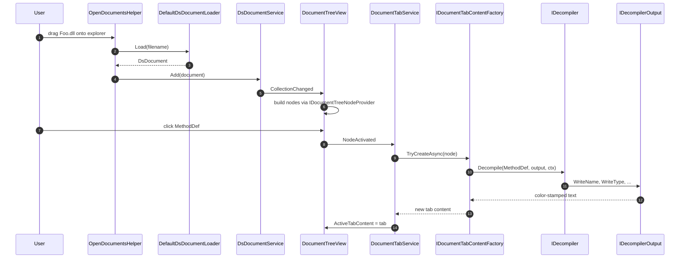
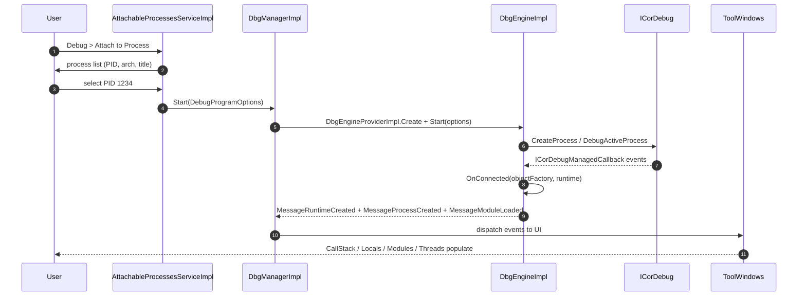
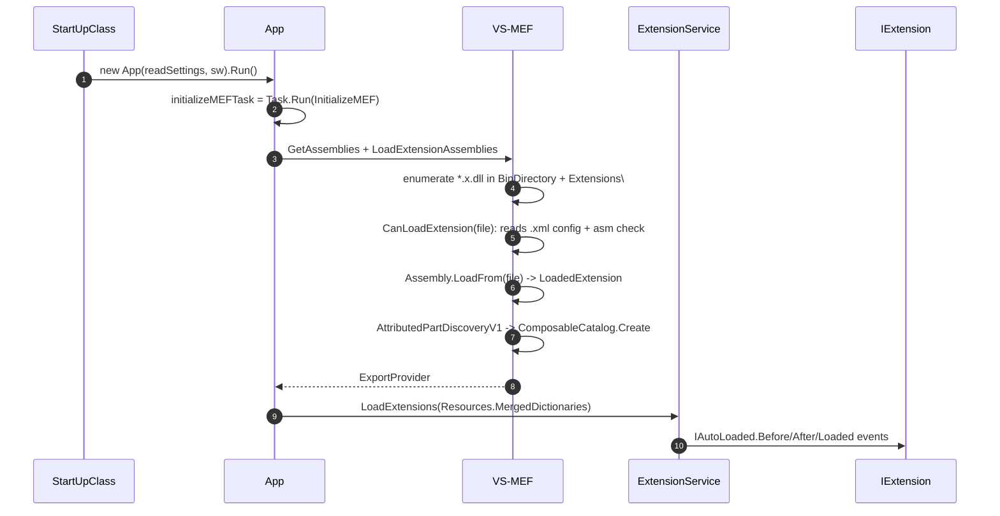
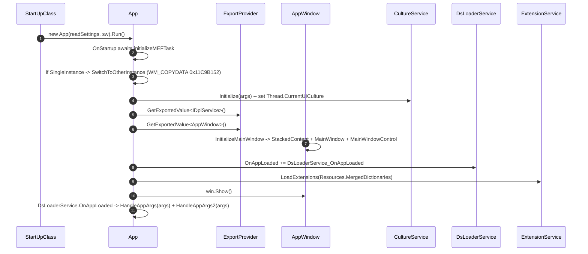
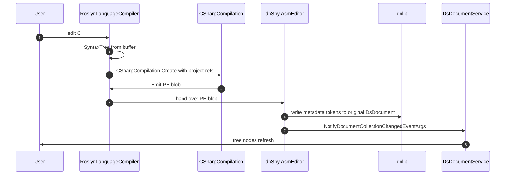
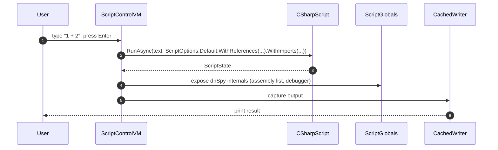
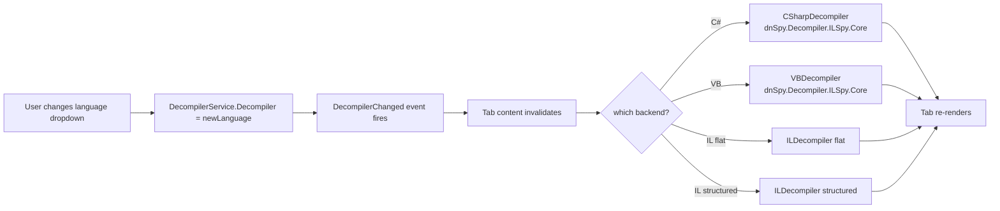
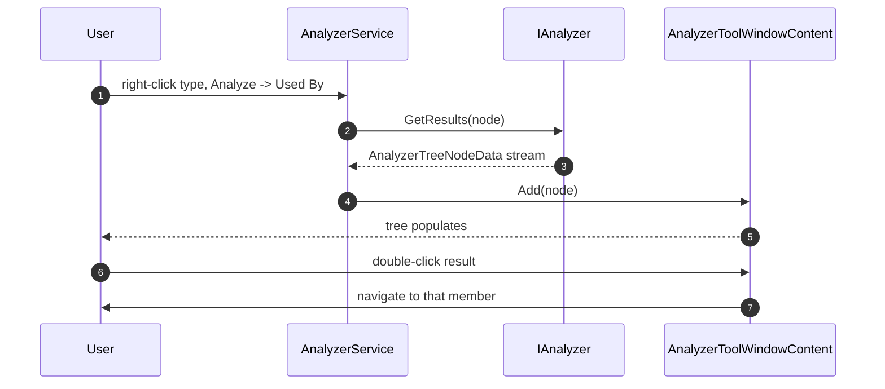
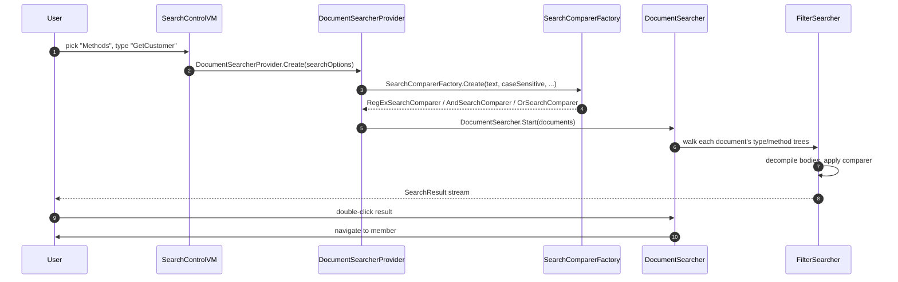
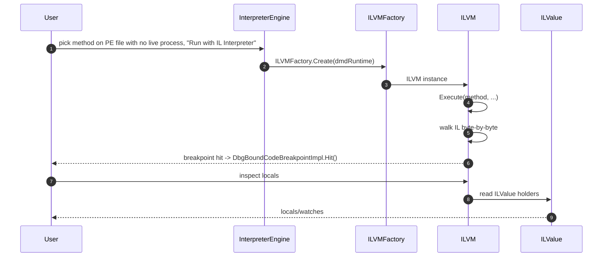

# 05 — Operation Chains

This document enumerates 12 end-to-end operation chains. Each chain has an input contract, a numbered sequence of file:line references, and a mermaid diagram. The chains come from the inventory report (`/tmp/ilspy-dnspy-inventory/dnSpy.md` §6) and cross-reference [09_callstacks.md](./09_callstacks.md) for the text-based view.

**Chain index:**

| # | Name | Input | Trigger |
|---|---|---|---|
| 1 | Decompile a .NET assembly to a tab | user drops `Foo.dll` on the explorer | `DocumentTreeView.NodeActivated` |
| 2 | Debugger attach (CorDebug) | user picks `Debug > Attach to Process…` | `DbgManager.Start` |
| 3 | Plugin (extension) loading | `*.x.dll` next to `dnSpy.exe` | `App.InitializeMEF` |
| 4 | WPF main window / MVVM | MEF composition complete | `App.OnStartup` |
| 5 | Document / tab management | user clicks a member node | `DocumentTreeView.NodeActivated` |
| 6 | Decompile + edit (Roslyn round-trip) | user edits + clicks Apply | `AsmEditor` save |
| 7 | Roslyn REPL | user types `1 + 2` in C# Interactive | `ScriptControlVM.Submit` |
| 8 | Multi-language decompilation | user changes the language dropdown | `DecompilerService.Decompiler` setter |
| 9 | Static analysis | right-click -> Analyze | `AnalyzerService.GetResults` |
| 10 | Search | user opens Search window | `DocumentSearcherProvider.Create` |
| 11 | BAML -> XAML | user opens a .baml resource | `BamlDecompiler.Decompile` |
| 12 | IL interpreter (no-process debugging) | user picks "Run with IL Interpreter" | `ILVM.Execute` |

---

## Chain 1 — Decompile a .NET assembly to a tab



Steps:

1. `OpenDocumentsHelper.OpenDocuments(documentTreeView, window, mruList, files, false)` (`MainApp/App.xaml.cs:586`).
2. `DefaultDsDocumentLoader.Load(filename)` creates a `DsDocument` (PE/pe-image/bundle).
3. `DsDocumentService.Add(document)` — guarded by `DisableAssemblyLoad()` pattern; uses `ReaderWriterLockSlim` for perf.
4. `AssemblyResolver` resolves referenced assemblies (NuGet / shared framework / GAC).
5. `DocumentTreeView.DocumentService.CollectionChanged` fires; tree nodes are auto-built via `IDocumentTreeNodeProvider`s.
6. `IDecompilerService.Decompiler` (e.g. C#) decompiles nodes on demand via `IDocumentTreeNodeData.OnRefresh`.
7. `DocumentTabService` opens a tab in the active tab group via `TabGroupService.ActiveTabGroup.ActiveTabContent`.

Output: New tab with C# source for the activated member.

---

## Chain 2 — Debugger attach (CorDebug)



Steps:

1. `AttachableProcessesServiceImpl` enumerates Win32 processes (with icons, architectures, titles).
2. `AttachableProcessImpl` -> `DotNetAttachToProgramOptions.Create(pid)`.
3. `DbgManager.Start(DebugProgramOptions)` (`Extensions/dnSpy.Debugger/dnSpy.Debugger/Impl/DbgManagerImpl.cs`).
4. `DbgEngineProviderImpl.Create(manager, options)` instantiates `DotNetDbgEngineImpl` -> `DbgEngineImpl` (CorDebug).
5. `DbgEngineImpl.Start(options)` (`dbgEngineImpl.cs:80`):
   - Launches `CoreCLR` / `CLR` hosting via `DotNetDbgProcessStarter`.
   - Calls `ICorDebug.CreateProcess` / `DebugActiveProcess`.
   - Subscribes to `ICorDebugManagedCallback` events.
6. `OnConnected(objectFactory, runtime)` -> creates `DbgRuntime`, `DbgProcess`, `DbgThread`, `DbgModule`s.
7. `MessageRuntimeCreated` / `MessageProcessCreated` / `MessageModuleLoaded` events fire on the dispatcher thread.
8. `DbgCallStackServiceImpl`, `LocalsToolWindow`, `CallStackToolWindow`, `ModulesToolWindow`, `ThreadsToolWindow`, `WatchToolWindow` all update via MEF-imported `IMessageProcessor`s.
9. When a breakpoint hits, `DbgBoundCodeBreakpointImpl.Hit()` -> `BreakAllHelper.Break()` -> `MessageEntryPointBreak` -> UI highlights active frame.

Output: Debugger UI populated; can set breakpoints, step, inspect locals.

---

## Chain 3 — Plugin (extension) loading



Steps:

1. `StartUpClass.Main` -> `new App(readSettings, sw).Run()` (`MainApp/StartUpClass.cs:21`).
2. `App` ctor calls `initializeMEFTask = Task.Run(() => InitializeMEF(readSettings, useCache: readSettings))` (`MainApp/App.xaml.cs:114`).
3. `InitializeMEF` -> `GetAssemblies()` -> `LoadExtensionAssemblies()` -> `GetExtensionFiles(BinDirectory)` enumerates `*.x.dll` in `BinDirectory`, `Extensions\`, and each subdir of `Extensions\` (also from `args.ExtraExtensionDirectory`).
4. `CanLoadExtension(file)` reads `<file>.xml` `ExtensionConfig` (OS / Framework / App version check); `CanLoadExtension(asm)` checks public key + minimum reference version 5.0.0.0.
5. `Assembly.LoadFrom(file)` -> `loadedExtensions.Add(new LoadedExtension(asm))`.
6. `assembly[]` passed to `AttributedPartDiscoveryV1` (`App.xaml.cs:155`).
7. `ComposableCatalog.Create(resolver).AddParts(parts).CreateExportProvider()` returns VS-MEF `ExportProvider`.
8. `extensionService.LoadExtensions(Resources.MergedDictionaries)` merges plugin `MergedResourceDictionaries` XAML files.
9. `IAutoLoaded.BeforeExtensions` / `.AfterExtensions` / `.AfterExtensionsLoaded` triggered (via `IAutoLoadedMetadata`).

Output: Extension's `[Export]` types visible via MEF; `[ExportExtension] IExtension.OnEvent` called with `Loaded`.

---

## Chain 4 — WPF main window / MVVM



Steps:

1. `OnStartup(StartupEventArgs)` blocks on `initializeMEFTask.GetAwaiter().GetResult()` (`App.xaml.cs:521`).
2. If `args.SingleInstance && !AppSettingsImpl.AllowMoreThanOneInstance`, `SwitchToOtherInstance()` enumerates windows and forwards args via `WM_COPYDATA` (header `0x11C9B152`).
3. `cultureService.Initialize(args)` — sets `Thread.CurrentThread.CurrentUICulture` per `--culture`.
4. `exportProvider.GetExportedValue<IDpiService>()` to init DPI early.
5. `appWindow = exportProvider.GetExportedValue<AppWindow>()` (created by `[ImportingConstructor]` w/ all dependencies).
6. `appWindow.InitializeMainWindow()` constructs `StackedContent` (toolbar / center / status), `MainWindow` (`MetroWindow`), `MainWindowControl` (dock layout).
7. `dsLoaderService.OnAppLoaded += DsLoaderService_OnAppLoaded`; `extensionService.LoadExtensions(Resources.MergedDictionaries)`; `win.Show()`.
8. `DsLoaderService.OnAppLoaded` -> `DnSpyEventSource.Log.StartupStop()`; `HandleAppArgs(args)` — applies `--language`, `--new-tab`, `--full-screen`, opens files via `OpenDocumentsHelper`.
9. `HandleAppArgs2(args)` dispatches to all `IAppCommandLineArgsHandler` exports in `Order` ascending.

Output: dnSpy main window visible; all tool windows docked per saved state.

---

## Chain 5 — Document / tab management

```mermaid
flowchart TD
    A[User clicks MethodDef node] --> B[DocumentTreeView.NodeActivated]
    B --> C[DocumentTabService.DocumentTreeView_NodeActivated]
    C --> D{switch on node type}
    D -- AssemblyReferenceNode --> E[resolve reference, navigate tree]
    D -- DerivedTypeNode / BaseTypeNode --> F[select target type]
    D -- TypeReferenceNode / ... --> G[resolve and select]
    D -- default --> H[ActiveTabContentImpl -> TabContentImpl.Show]
    H --> I[IDocumentTabContentFactory.TryCreateAsync]
    I --> J{which factory?}
    J -- default --> K[DefaultDocumentTabContentProvider]
    J -- Roslyn edit --> L[IReferenceDocumentTabContentProvider]
    K --> M[DocumentTreeNodeDecompiler.DecompileAsync]
    L --> N[RoslynLanguageCompiler edit round-trip]
    M --> O[IDecompiler.Decompile(MethodDef, IDecompilerOutput, ctx)]
    N --> O
    O --> P[IDecompilationCache.GetOrCreateAsync]
    P --> Q[TabGroupService.ActiveTabGroup.ActiveTabContent = impl]
    Q --> R[TabSelectionChanged raised]
```

Steps:

1. `DocumentTreeView.NodeActivated` raises `DocumentTreeNodeActivatedEventArgs`.
2. `DocumentTabService.DocumentTreeView_NodeActivated` switches on the node type:
   - `AssemblyReferenceNode` -> resolves the reference, navigates tree
   - `DerivedTypeNode` / `BaseTypeNode` -> selects the target type
   - `TypeReferenceNode` / `MethodReferenceNode` / `PropertyReferenceNode` / `EventReferenceNode` / `FieldReferenceNode` -> resolves and selects the target
   - otherwise: `ActiveTabContentImpl` -> `TabContentImpl.Show(impl, nodes)` -> creates new `TabContentImpl` if none; reuses existing tab if same content
3. `IDocumentTabContentFactory.TryCreateAsync(...)` enumerates `IReferenceDocumentTabContentProvider`s (Roslyn-based edits) and `IDefaultDocumentTabContentProvider`s (the default decompile tab) in `Order` ascending.
4. `DocumentTreeNodeDecompiler.DecompileAsync(method/type)` calls `IDecompiler.Decompile(MethodDef, IDecompilerOutput, DecompilationContext)` -> writes to `IDecompilerOutput` (color-aware).
5. `IDecompilationCache.GetOrCreateAsync(...)` memoizes results.
6. `TabGroupService.ActiveTabGroup.ActiveTabContent = impl` -> raises `TabSelectionChanged`.

Output: Decompiled C# / VB / IL visible in the tab; syntax highlighting active.

---

## Chain 6 — Decompile + edit (Roslyn round-trip)



Steps:

1. `RoslynLanguageCompiler` (`dnSpy.Roslyn/Compiler/`) creates a `SyntaxTree` from the editor buffer.
2. `CSharpCompilation.Create(...)` with project references (resolved by `AssemblyResolver`).
3. `Emit` produces a new `PE` blob.
4. `AsmEditor` saves the blob back to the original `DsDocument` (writes metadata tokens via dnlib).
5. `DocumentTreeView.DocumentService.CollectionChanged` raises `NotifyDocumentCollectionChangedEventArgs`; tree nodes refresh.

Output: Compiled assembly updated in-memory.

---

## Chain 7 — Roslyn REPL



Steps:

1. `ScriptControl.axaml.cs` -> `ScriptControlVM.Submit(text)` (`Common/ScriptControlVM.cs`).
2. `CSharpScript.RunAsync(text, ScriptOptions.Default.WithReferences(...).WithImports(...))` (`Microsoft.CodeAnalysis.Scripting`).
3. `ScriptState` returned; `ScriptGlobals` exposes dnSpy internals (current assembly list, debugger, ...) to user code.
4. Output captured by `CachedWriter` and `ScriptControl.WriteOutput`.
5. State (globals, references, imports, lib paths) persisted in `ReplSettings`.

Output: Evaluated result printed in REPL; state persists for next submission.

---

## Chain 8 — Multi-language decompilation



Steps:

1. `DecompilerService.Decompiler = newLanguage` (`DecompilerService.cs`).
2. `DecompilerChanged` event fires; tab content invalidates.
3. Next decompile request calls `IDecompiler.Decompile(...)` on the new backend:
   - `CSharpDecompiler` (NRefactory-based via `dnSpy.Decompiler.ILSpy.Core`) -> `IDecompilerOutput` colored text
   - `VBDecompiler` -> VB.NET text
   - `ILDecompiler` (flat or structured) -> IL text
   - Decompiler GUIDs in `dnSpy.Decompiler.ILSpy.Core/DecompilerConstants`: `LANGUAGE_CSHARP`, `LANGUAGE_CSHARP_ILSPY`, `LANGUAGE_VB`, `LANGUAGE_IL`, etc.

Output: Tab re-renders in the chosen language; selection preserved via `Decompiler.UniqueGuid`.

---

## Chain 9 — Static analysis (Analyzer)



Steps:

1. `AnalyzerService.GetResults(node)` (`AnalyzerService.cs`) iterates registered `IAnalyzer`s.
2. Each analyzer yields `AnalyzerTreeNodeData` instances (e.g. `MethodUsedByNode`, `BaseTypeTreeNode`, `DerivedTypeTreeNode`, `AttributeAppliedToNode`, `FieldAccessNode`, ...).
3. Nodes are streamed to the analyzer tool window via `AnalyzerToolWindowContent.Add(node)`.
4. Async fetch uses `AsyncFetchChildrenHelper` for expensive resolution (cross-assembly references).
5. Double-clicking a result navigates the assembly explorer to that member (`DocumentTreeView.SelectItems`).

Output: Tree of "used by" / "inherits from" / ... results.

---

## Chain 10 — Search (text / type / method / constant / metadata-token / resource)



Steps:

1. `SearchControlVM.StartSearch()` -> `DocumentSearcherProvider.Create(searchOptions)`.
2. `SearchComparerFactory.Create(searchText, caseSensitive, matchWholeWords, matchAnyWords)` builds `RegExSearchComparer` / `AndSearchComparer` / `OrSearchComparer` / literal variants.
3. `DocumentSearcher.Start(IEnumerable<DsDocumentNode>)` (`Search/DocumentSearcher.cs`).
4. `FilterSearcher` walks each document's type/method trees, decompiles bodies, applies the comparer.
5. `OnNewSearchResults` fires for each batch; `SearchResult` produced; matched source lines highlighted via `SyntaxHighlight`.
6. `TooManyResults` triggers cancellation; `OnSearchCompleted` fires.
7. User double-clicks a result -> navigates to the matching member.

Output: Result list; clicking opens the member in a tab.

---

## Chain 11 — BAML -> XAML

```mermaid
flowchart LR
    A[User opens WPF assembly, selects .baml] --> B[BamlResourceNodeProvider creates nodes]
    B --> C[BamlDecompiler.Decompile(bamlStream)]
    C --> D[BamlDisassembler parses records]
    D --> E[IRewritePass chain via RecursionCounter]
    E --> F[XamlDecompiler.Emit(xamlContext, outputCreator)]
    F --> G[XamlOutputCreator writes to TextEditor]
    G --> H[XmlnsDictionary handles namespaces]
    H --> I[Readable XAML tab]
```

Steps:

1. `BamlResourceNodeProvider` creates `BamlResourceElementNode`s.
2. `BamlDecompiler.Decompile(bamlStream)` parses BAML records (`BamlDisassembler` for IL-style list).
3. `IRewritePass` chain (e.g. field reference resolution, type lookup) applied via `RecursionCounter` to avoid infinite loops.
4. `XamlDecompiler.Emit(xamlContext, outputCreator)` produces XAML.
5. `XamlOutputCreator` writes into the text editor with proper namespace handling (`XmlnsDictionary`).

Output: Readable XAML tab.

---

## Chain 12 — IL interpreter (no-process debugging)



Steps:

1. `dnSpy.Debugger.DotNet.Interpreter` engine activates via `DbgEngineProviderImpl.Create`.
2. `ILVMFactory.Create(dmdRuntime)` creates a virtual machine.
3. `ILVM.Execute(method, ...)` walks the IL byte-by-byte.
4. Breakpoints trigger `DbgBoundCodeBreakpointImpl.Hit()` -> standard message pump.
5. Locals/watches read from `ILValue` holders.

Output: Method executed in-process; breakpoints honored; no external runtime needed.