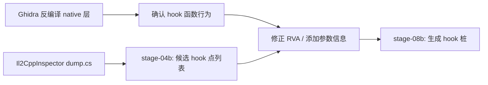
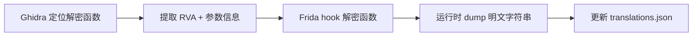

# Ghidra 嵌入逆向流程分析

> Ghidra 在本工作区作为 **最深层静态分析工具** 使用，在前端工具有限的场景下提供反编译级分析能力。

---

## 1. 定位：工作流中的层次

```
APK
  │
  ├─ [0-3] 快速扫描: apktool / jadx / strings / unzip   ← 批量、快速、浅层
  │
  ├─ [3b]  il2cpp dump: Il2CppDumper / Il2CppInspector ← 结构化 C# 层
  │
  ├─ [3/4b] Hook 分析: stage-04b 启发式 / dump.cs    ← 定位修改点
  │
  ├─ [4b+] 深层静态分析: Ghidra ← ★ 本工具适用位置
  │   ├─ libil2cpp.so native 函数分析（反编译 ARM64）
  │   ├─ 识别反调试/字符串加密/协议加密
  │   └─ 验证 Il2CppDumper 未覆盖的 native 层代码
  │
  ├─ [5a/8b] 动态验证: Frida                     ← 运行时确认
  │
  └─ [11] 最终验证: adb install + logcat          ← 集成测试
```

## 2. 适用场景

### 2.1 native 层反调试分析（D 级加固场景）

当 `libil2cpp.so` 或 `libunity.so` 含反调试检测时，Ghidra 可用于：
- 搜索 `TracerPid`、`/proc/self/status`、`ptrace` 等反调试模式
- 配合 `ida.py` / `ghidra.py`（Il2CppDumper/Il2CppInspector 生成）加载符号

### 2.2 字符串加密/混淆还原

当 Il2CppDumper 输出的 `stringliteral.json` 为乱码时（加密字符串）：
- 在 Ghidra 中加载 `libil2cpp.so`
- 运行内置 `RecursiveStringFinder.py` 或手动定位解密函数
- 配合 Frida 动态 dump 解密后字符串

### 2.3 协议加密分析（网络检测绕过）

当游戏使用自定义加密通信（如 XXTEA、AES）：
- Ghidra 反编译 native 层的 `connect/send/recv` wrapper
- 识别加密算法常数（S-box、魔数、轮常数）
- 定位解密函数地址 → 输出 RVA 供 Hook

### 2.4 Dalvik 层深度分析（jadx 无法处理时）

当 jadx 反编译失败或输出有误：
- Ghidra 直接加载 DEX 做字节码级分析
- 支持所有 Android 版本（含 CDEX/VDEX）
- 可导出为 Smali 或重建项目

### 2.5 Unity Mono 模式（非 il2cpp）

当游戏为 Unity Mono（`Assembly-CSharp.dll` 明文）：
- Ghidra 的 JVM 处理器可用于分析 .NET 元数据
- 但推荐首选 ILSpy/dnSpy（本工作区已有）

## 3. 不适用场景

| 场景 | 原因 | 推荐替代 |
|------|------|---------|
| 纯 C# 层分析 | 不需要 native 反汇编 | Il2CppDumper/Il2CppInspector |
| 批量字符串提取 | Ghidra 无批量导出 | `strings` + Python |
| 运行时验证 | Ghidra 是静态工具 | Frida |
| 资源提取 | 非 Ghidra 设计目标 | UnityPy/AssetStudio |
| 大规模式样匹配 | 脚本效率有限 | `grep -r` + Python |

## 4. 与本工作区工具的整合

### 4.1 配合 Il2CppInspector/Il2CppDumper

```bash
# 1. Il2CppInspector 生成 IDA/Ghidra 脚本
dotnet Il2CppInspector -i libil2cpp.so -m global-metadata.dat --select-outputs

# 2. Ghidra 加载 libil2cpp.so
ghidraProject -import libil2cpp.so -processor AARCH64:LE:64:v8A

# 3. 在 Ghidra 中运行 IDA/Ghidra 脚本（加载符号/结构体）
# File → Parse IDA Pro IDB → 选择 Il2CppInspector 输出的 .py / .idb
```

### 4.2 配合 stage-04b hook 分析



### 4.3 配合 Frida 动态分析



## 5. 在本工作区的使用方式

### 启动 Ghidra GUI

```bash
# 需要先构建 Ghidra（JDK 25+）
cd tools/crack-intergration-tools/source-projects/ghidra
gradle buildGhidra  # 构建完整发布包
# 或直接从预编译发布包运行
./ghidraRun
```

### 使用 Headless 模式（批处理）

```bash
# 分析 libil2cpp.so 并导出分析结果
analyzeHeadless /tmp/ghidra_proj MyProject \
  -import /path/to/libil2cpp.so \
  -processor AARCH64:LE:64:v8A \
  -postScript SearchForStrings.java \
  -readOnly
```

### Headless 脚本搜索反调试模式

```python
# ghidra_anti_debug_finder.py (PyGhidra)
from ghidra.program.model.listing import CodeUnit
from ghidra.util.task import ConsoleTaskMonitor

monitor = ConsoleTaskMonitor()
listing = currentProgram.getListing()
pattern = ["TracerPid", "ptrace", "/proc/", "status"]

for addr in currentProgram.getSymbolTable().getSymbols():
    name = addr.getName()
    if any(p in name for p in pattern):
        print(f"Found: {name} @ {addr.getAddress()}")
```

## 6. 在当前项目中的价值评估

| 项目 | il2cpp? | Ghidra 价值 |
|------|---------|------------|
| TinkerIslandSurvivalStory | ✅ (v39) | 中—Il2CppInspector 已产出 dump.cs，Ghidra 用于确认反调试/加密 |
| StickmanCounterTerrorStrike | ✅ | 中—同上模式 |
| SuperCity | ✅ | 中 |
| 纯 Android Java 项目 | ❌ | 低—jadx 已足够 |
| Unity Mono | ❌ | 低—ILSpy 更合适 |
| Cocos Creator (JSC) | ❌ | 低—需专用解密工具 |
