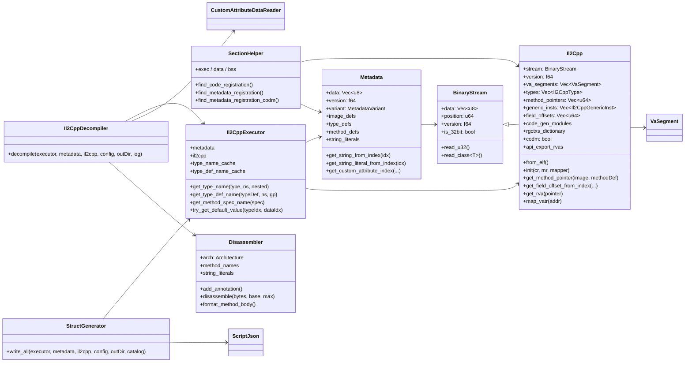

# 03 架构

## 总体分层

```mermaid
flowchart TB
    subgraph Frontend["SvelteKit Frontend"]
        Routes["+page.svelte (router)"]
        Components["13 Svelte 组件"]
        Stores["stores.ts (svelte stores)"]
        DumpRunner["dumpRunner.ts (beginDump)"]
        DumpEvents["dumpEvents.ts (listen)"]
        I18n["i18n.ts (7 langs)"]
    end

    subgraph Tauri["Tauri 2 Shell"]
        Main["main.rs -> lib::run()"]
        Commands["#[tauri::command]"]
        Events["emit dump-log/complete/..."]
        AppState["AppState { input_sender, dump_running }"]
    end

    subgraph Backend["Rust Backend (lib.rs)"]
        Init["run_dump()"]
        DecryptMeta["try_decrypt_metadata()"]
        DetectUnity["detect_unity_version()"]
        DetectFmt["detect_format()"]
        InitElf["init_elf()"]
        InitPe["init_pe()"]
        InitMacho["init_macho()"]
        InitMachoFat["init_macho_fat()"]
        InitNso["init_nso()"]
        InitWasm["init_wasm()"]
        Decompile["Il2CppDecompiler::decompile()"]
        StructGen["StructGenerator::write_all()"]
        DummyGen["generate_dummy_dlls()"]
        Generics["dump_generics()"]
        StaticField["StaticFieldExporter::write_document()"]
        Embedded["embedded_scripts::write_scripts()"]
    end

    subgraph Domain["Domain modules"]
        Il2Cpp["Il2Cpp struct"]
        Metadata["Metadata + MetadataVariant"]
        SectionHelper["SectionHelper"]
        Executor["Il2CppExecutor"]
        CadReader["CustomAttributeDataReader"]
        Disassembler["Disassembler (V5)"]
    end

    subgraph Formats["Format Parsers"]
        Elf["Elf::new + new_with_codm_diag"]
        Macho["MachO::new + new_with_codm_fixups"]
        Pe["Pe::new"]
        Nso["Nso::new"]
        Wasm["Wasm::new"]
    end

    subgraph IO["IO Layer"]
        BinStream["BinaryStream"]
        VersionAware["VersionAwareStream"]
    end

    Routes --> Components
    Routes --> Stores
    Routes --> DumpRunner
    DumpRunner -->|invoke start_dump| Commands
    DumpEvents -->|listen| Events
    Commands --> Init
    Commands -->|set sender| AppState
    Init -->|request_input| AppState
    Init --> DecryptMeta
    Init --> DetectUnity
    Init --> DetectFmt
    Init --> InitElf
    Init --> InitPe
    Init --> InitMacho
    Init --> InitMachoFat
    Init --> InitNso
    Init --> InitWasm
    Init --> Decompile
    Init --> StructGen
    Init --> DummyGen
    Init --> Generics
    Init --> StaticField
    Init --> Embedded

    InitElf --> Elf
    InitPe --> Pe
    InitMacho --> Macho
    InitNso --> Nso
    InitWasm --> Wasm

    Elf --> SectionHelper
    Pe --> SectionHelper
    Macho --> SectionHelper
    Nso --> SectionHelper
    Wasm --> SectionHelper

    Decompile --> Executor
    StructGen --> Executor
    DummyGen --> Executor
    Generics --> Executor
    StaticField --> Executor

    Decompile --> CadReader
    DummyGen --> CadReader
    Decompile --> Disassembler

    InitElf --> Il2Cpp
    InitPe --> Il2Cpp
    InitMacho --> Il2Cpp
    InitNso --> Il2Cpp
    InitWasm --> Il2Cpp

    Decompile --> Metadata
    Executor --> Metadata
    SectionHelper --> Metadata

    Il2Cpp --> BinStream
    Metadata --> BinStream
    BinStream --> VersionAware
```



## 关键设计点

### 1. Tauri 2 异步 + Event 流

后端 `start_dump` 在独立 `std::thread::spawn` 中跑（`lib.rs:1209`），并通过 `app.emit("dump-log", ...)` 推送进度。前端 `dumpEvents.ts` 通过 `@tauri-apps/api/event.listen` 订阅事件。

`AppState.input_sender: Mutex<Option<mpsc::Sender<String>>>` 是同步/异步桥：

```rust
fn request_input(app: &AppHandle, state: &AppState, prompt_type: &str) -> String {
    let (tx, rx) = mpsc::channel();
    *state.input_sender.lock().unwrap() = Some(tx);
    app.emit("dump-input-request", InputRequestEvent { prompt_type });
    rx.recv().unwrap_or_default()  // 阻塞等待前端 submit_input
}
```

前端 `submit_input(response)` 把用户输入送进 channel，完成 dump 线程。

### 2. Auto-XOR metadata 解密

`lib.rs:148 try_decrypt_metadata` 依序尝试 7 种 XOR 方案：

1. **单字节 XOR**：key = magic[0] ^ data[0]
2. **4 字节 rolling XOR**
3. **8 字节 rolling XOR**
4. **16/32/64/128/256 字节 rolling XOR**
5. **Position-dependent XOR**：`data[i] ^= key4[i%4] ^ (i as u8)`
6. **Masked-position XOR**：`data[i] ^= key4[i%4] ^ ((i & 0xFF) as u8)`
7. **Header-only XOR**：仅前 256 字节

每种方案独立尝试，若 `is_valid_metadata_version` 校验通过则采纳并返回方案描述。

### 3. CODM 兼容

`metadata::MetadataVariant::Codm` (`il2cpp/metadata.rs:9`) 枚举：

```rust
pub enum MetadataVariant {
    Standard,
    Codm,  // v104 / v106 内部混淆
}
```

`detect_codm_variant` (`il2cpp/metadata.rs:14`) 通过启发式判断（字段大小、magic 是否合法）。CODM 模式下：

- `Metadata::load_metadata_codm` (`il2cpp/metadata.rs:418`) 用 `read_metadata_array_codm<T>` 替代普通 loader
- `Elf::new_with_codm_diag` (`formats/elf.rs:204`) 容忍坏指针
- `MachO::new_with_codm_fixups` (`formats/macho.rs:156`) 应用 iOS chained fixups
- `SectionHelper::find_metadata_registration_codm` (`search/section_helper.rs:492`) 备用搜索策略

### 4. 内嵌 V5 Disassembler

`disassembler/mod.rs` 抽象：`Disassembler { arch: Architecture, ... }`。`Architecture::from_elf_machine` / `from_pe_machine` / `from_macho_cputype` 决定后端：

| 架构 | 后端 |
|------|------|
| ARM32 / ARM64 | `yaxpeax-arm` (`disassembler/arm.rs`) |
| x86 / x64 | `iced-x86` (`disassembler/x86.rs`) |

注解引擎：

- `add_string_new_wrapper_rva`、`add_box_helper_rva`、`add_object_new_helper_rva`、`add_unbox_helper_rva`：boxing/unboxing 注解
- `add_string_literal(rva, value)`：字符串字面量
- `add_type_info(rva, name)`：类型信息句柄
- `add_method_ref(rva, name)`：方法引用
- `add_field_ref(rva, name)`：字段引用
- `set_method_names(map)`：方法名表
- `add_static_field(rva, type_name, offset, field_name)`：静态字段访问

输出：`format_method_body(bytes, base, max) -> String` 把指令、注解、控制流（CFG）拼成可读文本。

### 5. C++ Header Scaffolding（拓扑排序）

`output/cpp_scaffolding.rs` + `output/cpp_type_dependency_graph.rs` + `output/cpp_ast.rs` + `output/cpp_type_model.rs`：

- `CppType` 枚举区分基础类型、复合 struct、enum、pointer、array、alias
- `CppTypeGroup` 枚举按 section 分组：UnityApi / UnityTypes / UnityStructs / UnityEnums / GameClasses / ForwardDeclarations
- `CppTypeGroupRegistry` 跟踪类型所在 group；可在 dependency resolve 时 promote
- `cpp_type_dependency_graph` 构造有向图 + 拓扑排序
- `CppHeaderEmitter` 按 group 顺序输出，GCC/MSVC 布局可切换（4/8 字节对齐、`__declspec(align(...))`）

`HeaderManager.guess_headers_for_binary` 自动挑选 Unity 原生头（`il2cpp-class-internals.h` / `il2cpp-api-functions.h` 等）。

### 6. Dummy DLL（dotnetdll 库）

vendored `dotnetdll-main` 是 Rust 写的 .NET assembly 写入器；`generate_dummy_dlls` (`output/dummy_assembly_generator.rs:142`) 调用它生成 stub DLL。

### 7. 跨平台 Tauri 2

单一 Rust crate 编译目标：
- 桌面：`pnpm tauri build` -> `.exe` / `.dmg` / `.AppImage`
- Android：`pnpm tauri android init && pnpm tauri android dev`
- iOS：`pnpm tauri ios init && pnpm tauri ios dev`

### 8. Panic capture

```rust
let result = std::panic::catch_unwind(std::panic::AssertUnwindSafe(|| {
    run_dump(&app, &state, &binary_path, &metadata_path, &output_dir, &config)
}));
match result {
    Ok(Ok(output_path)) => emit("dump-complete", success),
    Ok(Err(msg)) => emit("dump-complete", failure),
    Err(panic_info) => emit("dump-crash", CrashEvent { crash_log }),
}
```

`dump-crash` 携带时间戳 + OS/ARCH + panic message，前端 `CrashScreen` 显示完整报告。

## 静态类全景



## 线程模型

| 线程 | 责任 |
|------|------|
| 主线程（Tauri runtime） | 处理 invoke / emit |
| dump 线程（`std::thread::spawn`） | 跑 `run_dump` |
| GC / async runtime | Tauri 2 内部 |

`AppState.dump_running: Mutex<bool>` 防止并发 dump；`DumpGuard` RAII 在 drop 时清标记。