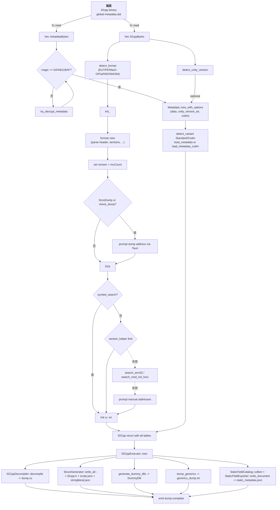
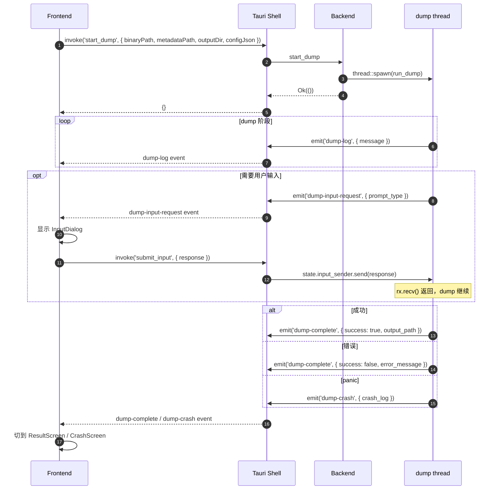

# 04 核心数据流

## 关键数据结构

### `Il2Cpp` (`il2cpp/base.rs:15`)

| 字段 | 类型 | 说明 |
|------|------|------|
| `stream` | `BinaryStream` | 整个 il2cpp 二进制的字节视图 |
| `version` | `f64` | il2cpp 版本（v16~v39 + CODM） |
| `is_32bit` | `bool` | |
| `va_segments` | `Vec<VaSegment>` | VA 段表（替代 C# 版的 sections） |
| `data_sections` | `Vec<SearchSection>` | 用于 metadata usage 搜索 |
| `types` | `Vec<Il2CppType>` | 所有 Il2CppType |
| `method_pointers` | `Vec<u64>` | 当前 image 的所有 method 指针 |
| `generic_method_pointers` | `Vec<u64>` | |
| `invoker_pointers` | `Vec<u64>` | |
| `custom_attribute_generators` | `Vec<u64>` | |
| `reverse_pinvoke_wrappers` | `Vec<u64>` | |
| `unresolved_virtual_call_pointers` | `Vec<u64>` | |
| `generic_insts` | `Vec<Il2CppGenericInst>` | |
| `generic_inst_pointers` | `Vec<u64>` | |
| `method_specs` | `Vec<Il2CppMethodSpec>` | |
| `field_offsets` | `Vec<u64>` | |
| `code_gen_modules` | `HashMap<String, Il2CppCodeGenModule>` | v24.2+ |
| `rgctxs_dictionary` | `HashMap<String, HashMap<u32, Vec<Il2CppRGCTXDefinition>>>` | v24.2+ |
| `method_spec_generic_method_pointers` | `HashMap<...>` | |
| `image_base` | `u64` | dump 模式用的反推 image base |
| `is_pe` | `bool` | 是否 PE |
| `codm` | `bool` | CODM 模式开关 |
| `arch` | `Option<Architecture>` | 决定 disassembler 后端 |
| `exported_symbols` | `Vec<String>` | |
| `api_export_rvas` | `HashMap<String, u64>` | il2cpp_*/mono_* 导出 |
| `e_machine` | `u16` | ELF machine code |
| `data_search_sections` | `Vec<SearchSection>` | |
| `is_dumped` | `bool` | |
| `type_definition_sizes` | `Vec<u32>` | |

### `Metadata` (`il2cpp/metadata.rs:66`)

| 字段 | 说明 |
|------|------|
| `data: Vec<u8>` | 整文件 |
| `version: f64` | il2cpp 版本 |
| `variant: MetadataVariant` | Standard / Codm |
| `header: Il2CppGlobalMetadataHeader` | |
| `image_defs / assembly_defs / type_defs / method_defs / parameter_defs / field_defs / property_defs / event_defs / generic_containers / generic_parameters / string_literals / field_refs` | |
| `attribute_type_ranges` | v21~v28 |
| `attribute_data_ranges` | v29+ |
| `attribute_types` | v21~v28 |
| `metadata_usage_dic` | v19~v26 |
| `metadata_usages_count` | |
| `interface_indices / nested_type_indices / constraint_indices / vtable_methods` | |
| `rgctx_entries` | v<=24.1 |
| `unity_version` | 自动从 binary 探测 |
| `version_aware` | 缓存 |
| `attribute_lookup` | token → range index |

### `Config` (`config.rs:5`)

40+ 字段，serde，JSON 序列化 camelCase。

关键字段（详见 `07_functions_index.md` / `08_functions_detail/core.md`）：
- dumpMethod / Field / Property / Attribute / MethodOffset / FieldOffset / TypeDefIndex / AssemblyName
- generateStruct / generateDummyDll / requireAnyKey / dummyDllAddToken
- forceIl2cppVersion / forceVersion / forceDump / noRedirectedPointer
- splitDumpPerType
- generateGenericsDump / dumpGenerics{Rgctx,MethodSpecs,...}
- dumpDisassembly / dumpDisassemblyTarget / dumpDisassemblyHexBytes / dumpDisassemblyFieldNames / dumpDisassemblyAnnotations / dumpDisassemblyCfg / maxDisassemblyInstructions
- generateCppScaffold / mangleNames / enhancedIdaMetadata / generateUnityHeaders / compilerLayout / useTopologicalSort
- codm
- dumpStaticFieldMetadata / dumpFieldRvaData / maxFieldRvaDumpBytes

### `Il2CppType` 等 POD（`il2cpp/structures.rs`）

完整 Rust port，包括 `UnityVersion` + `BuildType`、所有 il2cpp 元数据 POD。

## 数据生命周期

## 关键映射

- **RVA → FileOffset**：`Il2Cpp::map_vatr(addr)` (`base.rs:582`) 按 `va_segments` 线性扫描。
- **FileOffset → RVA**：`Il2Cpp::map_rtva(offset)` (`base.rs:591`)。
- **methodIndex → methodPointer**：`Il2Cpp::get_method_pointer(image, methodDef)` (`base.rs:492`)。
- **fieldIndex → fieldOffset**：`Il2Cpp::get_field_offset_from_index(...)` (`base.rs:547`)。
- **typeHandle → TypeDef**：在 IsDumped + v>=27 下用 `type_handle - metadata.image_base - metadata.header.type_definitions_offset` / sizeOf(TypeDef)。

## Tauri 事件协议

