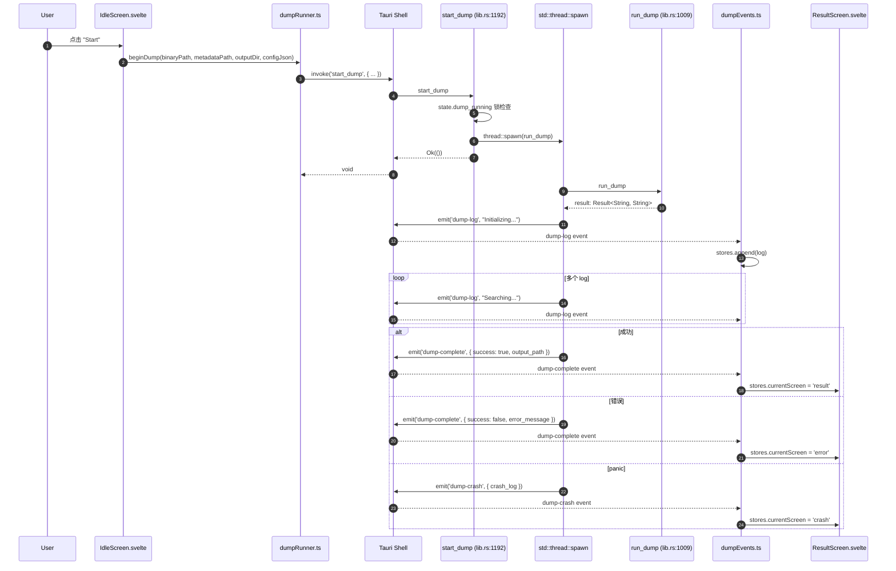
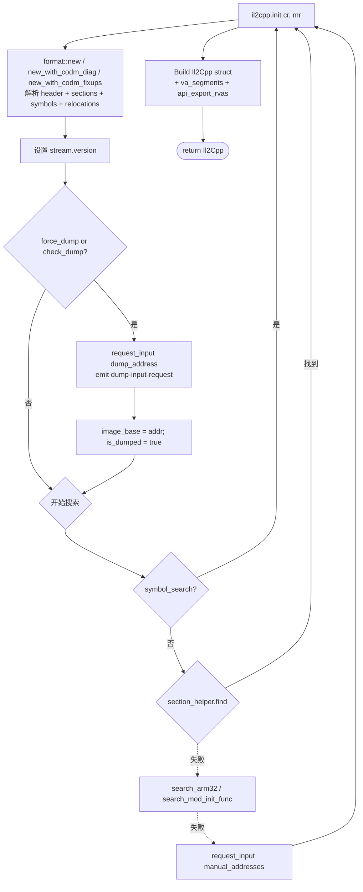
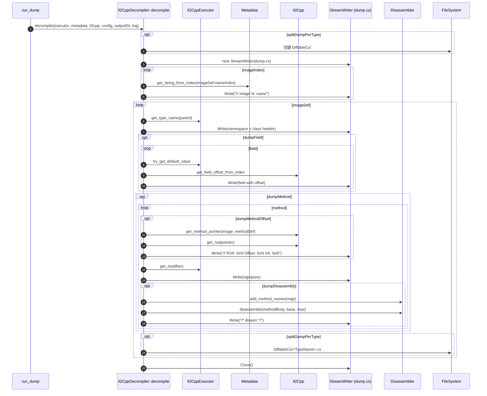
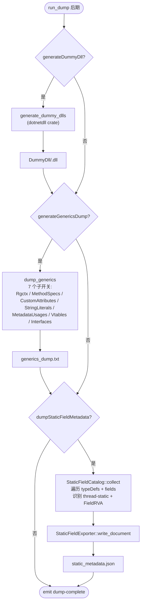
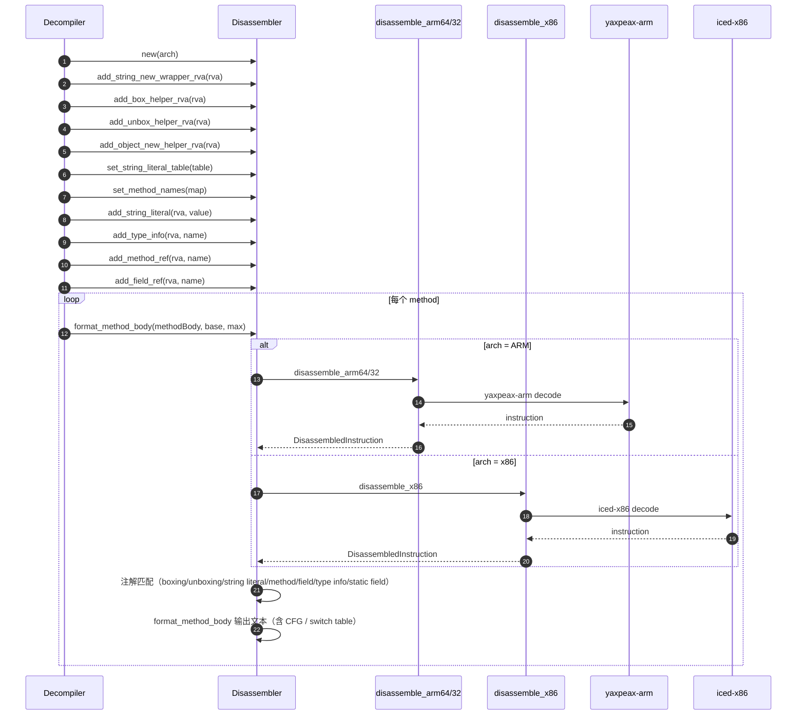
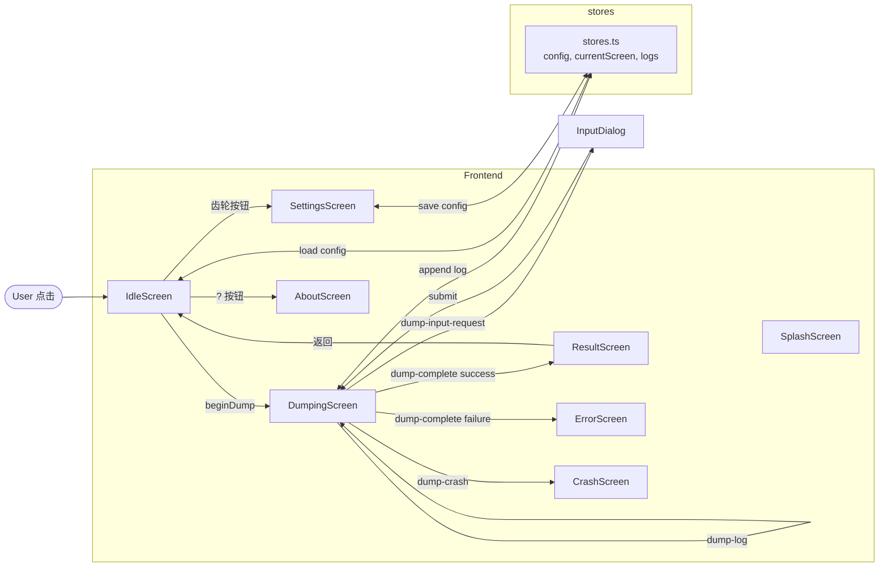
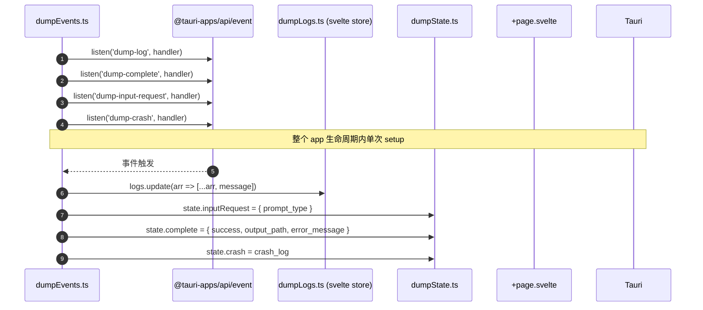

# 05 操作链

下面用 mermaid 图描述 8 条主操作链。

---

## 链 1 — 启动 / GUI Dump 入口（Tauri command start_dump）



---

## 链 2 — 二进制 + Metadata 格式探测 + XOR 解密

```mermaid
flowchart TD
    Start([run_dump 开始]) --> ReadBin[fs::read binary_path]
    ReadBin --> UnityVer[detect_unity_version<br/>扫描 '2xxx.x' / '6xxx.x' 字符串]
    ReadBin --> ReadMeta[fs::read metadata_path]
    ReadMeta --> Magic{"magic == 0xFAB11BAF?"}
    Magic -->|是| MetaCtor[Metadata::new_with_options]
    Magic -->|否| Decrypt["try_decrypt_metadata<br/>依次尝试 7 种 XOR 方案"]

    Decrypt -->|None| FailErr[返回错误]
    Decrypt -->|Some scheme| LogDec[emit log 'Encrypted metadata detected (...)']
    LogDec --> MetaCtor

    MetaCtor --> DetectVariant["detect_codm_variant<br/>heuristic 启发式判断"]
    DetectVariant --> LoadMeta{Standard?}
    LoadMeta -->|是| StdLoad[load_metadata<br/>解析所有 Defs]
    LoadMeta -->|否| CodmLoad[load_metadata_codm<br/>用 read_metadata_array_codm]

    ReadBin --> DetFmt[detect_format<br/>按 magic 分类]
    DetFmt -->|ELF| InitElf
    DetFmt -->|PE| InitPe
    DetFmt -->|Mach-O| InitMacho
    DetFmt -->|Fat Mach-O| InitMachoFat
    DetFmt -->|NSO| InitNso
    DetFmt -->|WASM| InitWasm

    StdLoad --> InitX
    CodmLoad --> InitX[统一调度]
```

---

## 链 3 — PE / ELF / Mach-O / NSO / WASM 分支 init



各分支差异：

| 格式 | symbol_search | search_arm32 | search_mod_init_func | codm 路径 |
|------|---------------|--------------|----------------------|-----------|
| ELF | `Elf::symbol_search` (`elf.rs:859`) | `Elf::search_arm32` (`elf.rs:1497`) | – | `Elf::new_with_codm_diag` (`elf.rs:204`) |
| PE | `Pe::symbol_search` (`pe.rs:213`) | – | – | – |
| Mach-O | `MachO::symbol_search` (`macho.rs:451`) | – | `MachO::search_mod_init_func` (`macho.rs:483`) | `MachO::new_with_codm_fixups` (`macho.rs:156`) |
| NSO | – | – | – | – |
| WASM | – | – | – | – |

---

## 链 4 — `dump.cs` + DiffableCs 写出



`output/decompiler.rs:18 decompile` 入口。

---

## 链 5 — `il2cpp.h` + C++ scaffolding（拓扑排序）

```mermaid
flowchart TD
    Start([StructGenerator::write_all]) --> BuildNames[build_type_def_image_names_pub]
    BuildNames --> BuildDict[build_struct_name_dic_pub]
    BuildDict --> LoopM[遍历 methodDef 构造 ScriptMethod]
    LoopM --> GenSig[generate_method_signature]
    GenSig --> Order[合并 method_pointers + ... 去重排序]
    Order --> Addr[填 Addresses[]]
    Addr --> MU{"Version >= 27?"}
    MU -->|是| Scan[SectionHelper.Data 扫描 metadataUsage]
    MU -->|否| Skip[跳过]
    Scan --> AddMU[AddMetadataUsage*]
    Skip --> AddMU

    AddMU --> StrLit[写 stringliteral.json]
    StrLit --> ScriptJSON[写 script.json]
    ScriptJSON --> HeaderChoice{Version?}
    HeaderChoice -->|22| H22[header_v22]
    HeaderChoice -->|23/24| H240[header_v240]
    HeaderChoice -->|24.1| H241[header_v241]
    HeaderChoice -->|24.2~| H242[header_v242]
    HeaderChoice -->|27| H27[header_v27]
    HeaderChoice -->|29| H29[header_v29]
    H22 --> Emit
    H240 --> Emit
    H241 --> Emit
    H242 --> Emit
    H27 --> Emit
    H29 --> Emit[emit il2cpp.h]

    Emit --> OptCpp{config.generateCppScaffold?}
    OptCpp -->|是| CppBuild["CppScaffolding::build<br/>-> CppTypeGroupRegistry"]
    CppBuild --> DepGraph[cpp_type_dependency_graph<br/>拓扑排序]
    DepGraph --> Emitter["CppHeaderEmitter::emit_all_with_groups<br/>按 CppTypeGroup 分文件输出"]
    Emitter --> WriteCpp[写 .hpp + .h]
    OptCpp -->|否| End
    WriteCpp --> End([结束])
```

`output/struct_generator.rs:72 write_all` 入口。

---

## 链 6 — DummyDll + generics + static_field_exporter



---

## 链 7 — V5 disassembler 引擎（ARM + x86）



`disassembler/mod.rs:333 format_method_body` 入口。

---

## 链 8 — UI 事件流（前端 dumpEvents.ts + Tauri 事件）





`src/lib/dumpEvents.ts` 通过 `setupDumpEvents()` 一次性注册所有监听。