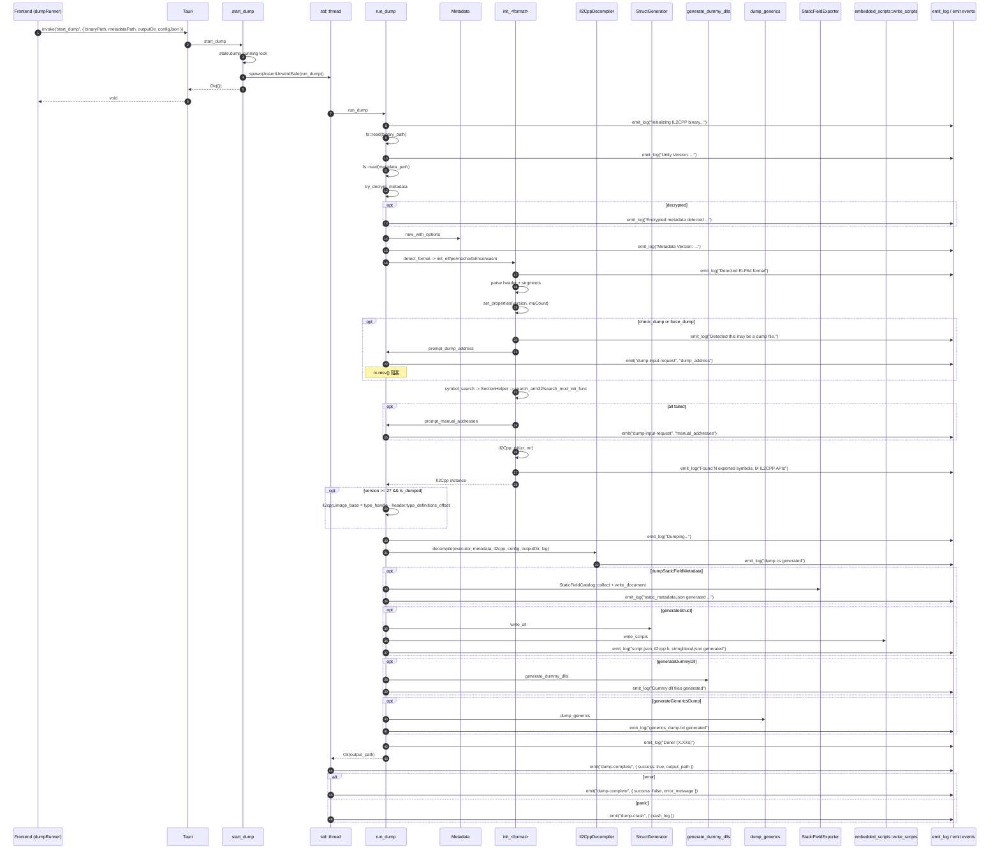
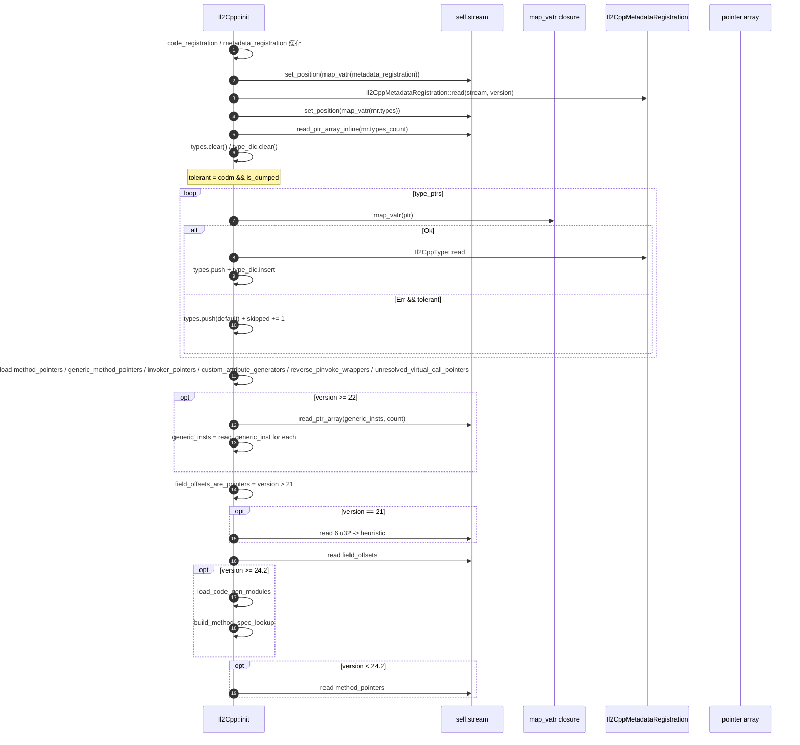
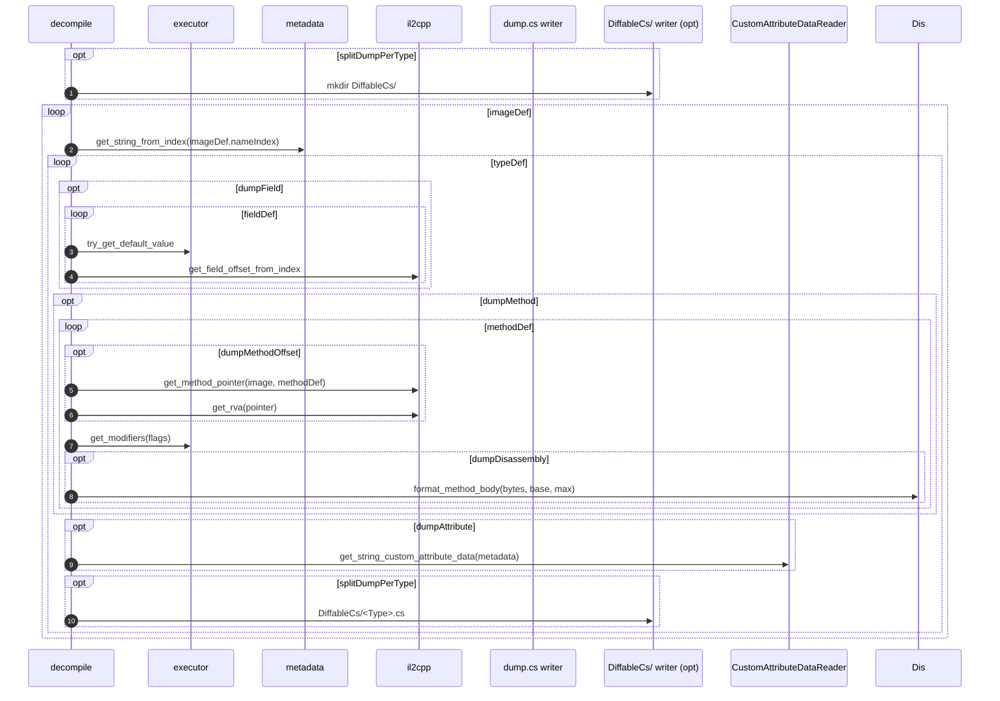
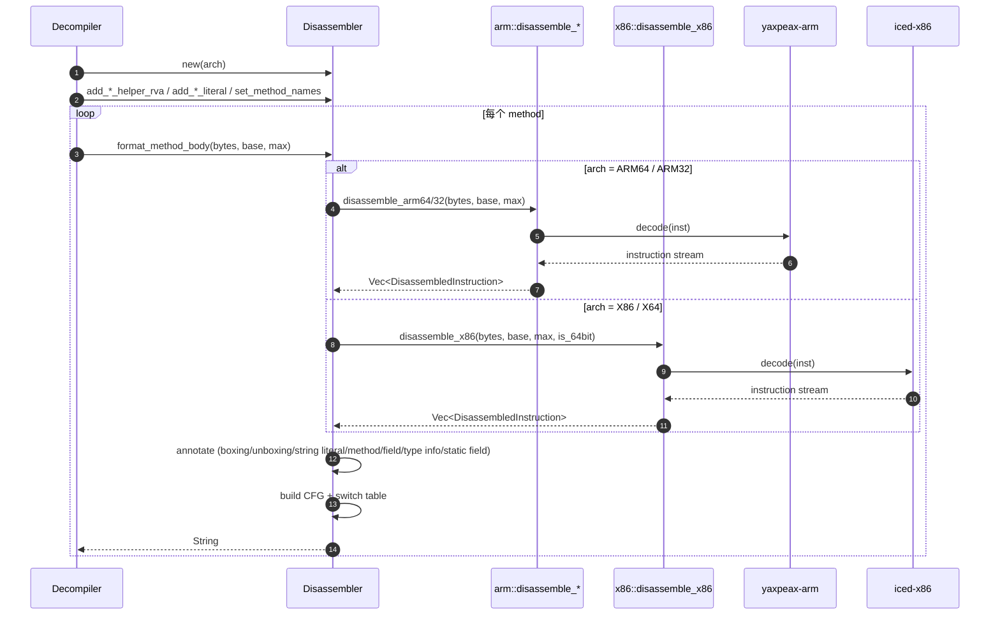
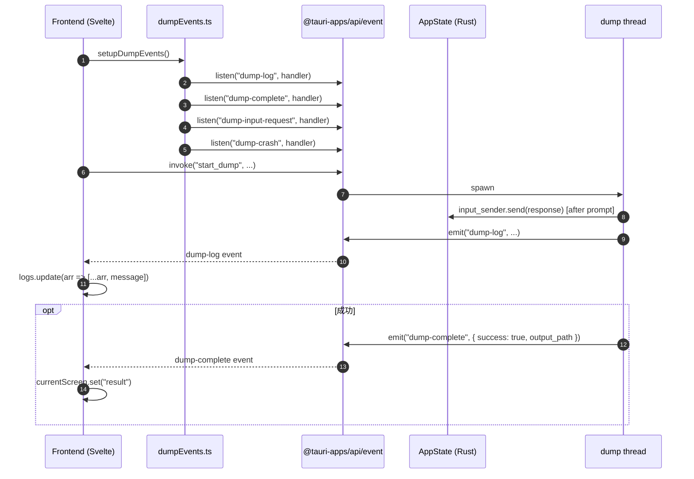
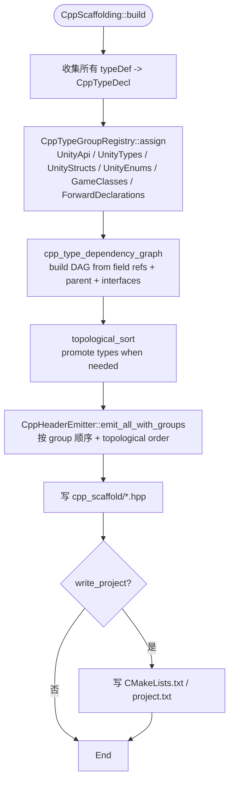
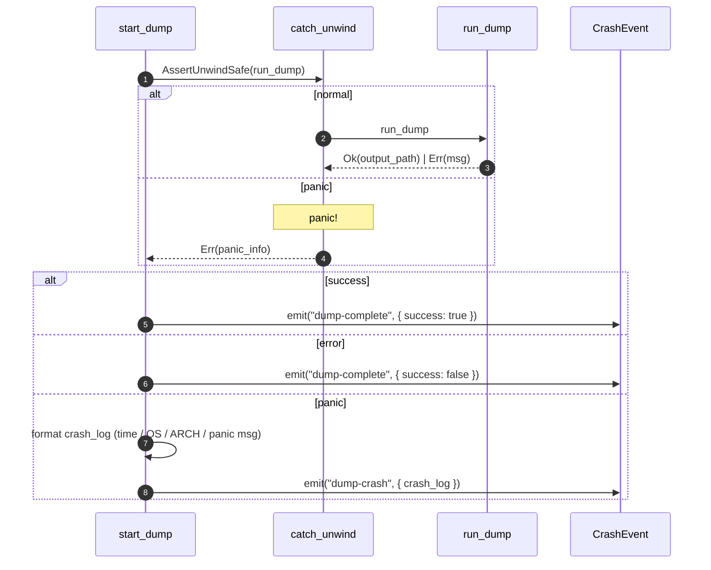

# 09 — 关键调用栈汇总

---

## 栈 1 — `start_dump` 总入口



---

## 栈 2 — `try_decrypt_metadata` 7 种方案依序尝试

```mermaid
flowchart TD
    Start([try_decrypt_metadata data]) --> Length{data.len() >= 16?}
    Length -->|否| None[return None]
    Length -->|是| K1["k1 = magic[0] ^ data[0]<br/>if k1 != 0 and (1..4).all(magic[i]^data[i] == k1):<br/>test = data.clone() ^ k1<br/>if is_valid_metadata_version(test): return scheme"]
    K1 -->|None| K4["key4 = magic XOR data[0..4]<br/>test ^= key4[i%4]<br/>if version ok: return scheme"]
    K4 -->|None| K8["key8 = magic XOR data[0..4] ++ data[4..8]<br/>test ^= key8[i%8]"]
    K8 -->|None| Rolling["key_len in 16/32/64/128/256<br/>key[i] = (magic XOR data)[i%4] ++ data[i%4..]<br/>test = data XOR key rolling"]
    Rolling -->|None| Pos["test ^= key4[i%4] ^ (i as u8)<br/>position-dependent XOR"]
    Pos -->|None| Masked["test ^= key4[i%4] ^ ((i & 0xFF) as u8)<br/>masked position XOR"]
    Masked -->|None| Header["for first 256 bytes:<br/>test[i] ^= key4[i%4]<br/>header-only XOR"]
    Header -->|None| Done[return None]
    Header -->|成功| Done
```

---

## 栈 3 — `Il2Cpp::init` 内部



`il2cpp/base.rs:162` 入口。

---

## 栈 4 — `Il2CppDecompiler::decompile` 内部（简化）



---

## 栈 5 — V5 Disassembler 流程



---

## 栈 6 — Tauri 事件协议



---

## 栈 7 — C++ Header Scaffolding 拓扑排序



---

## 栈 8 — Panic Capture

