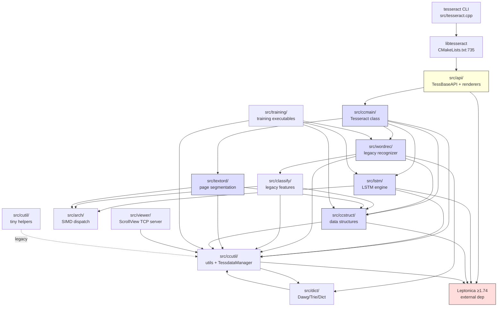
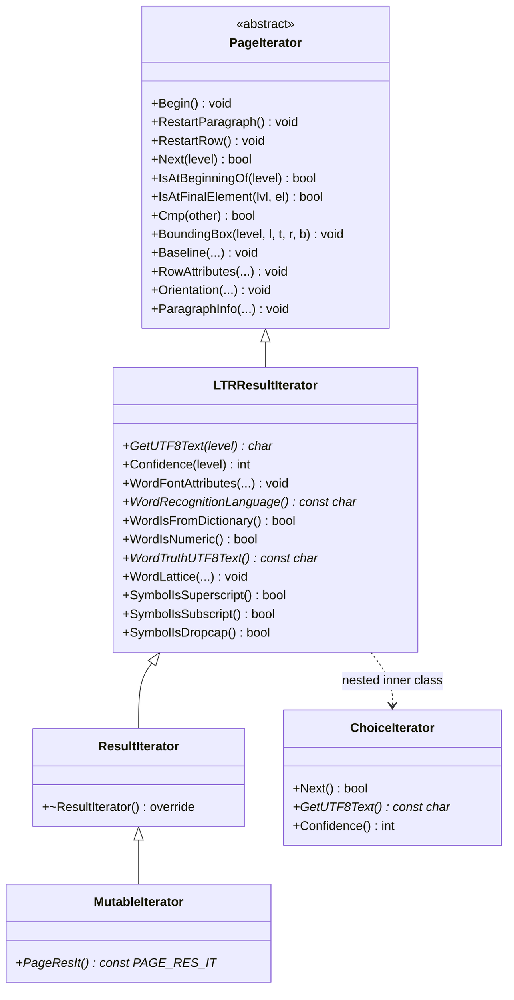
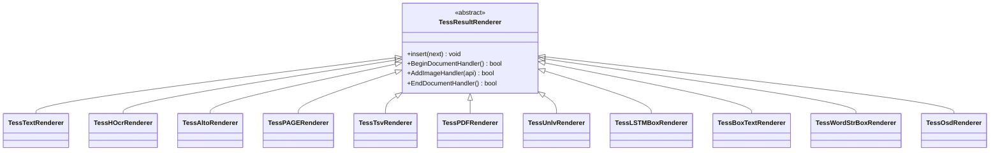
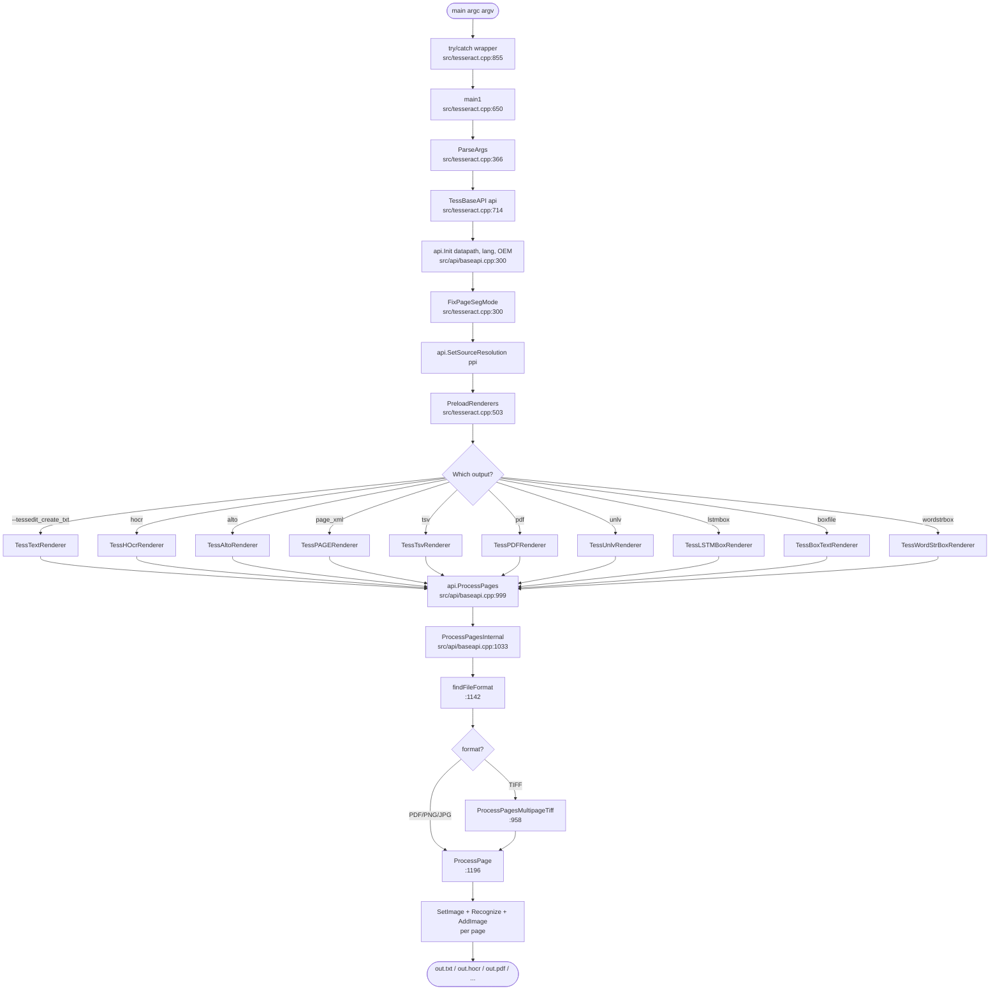
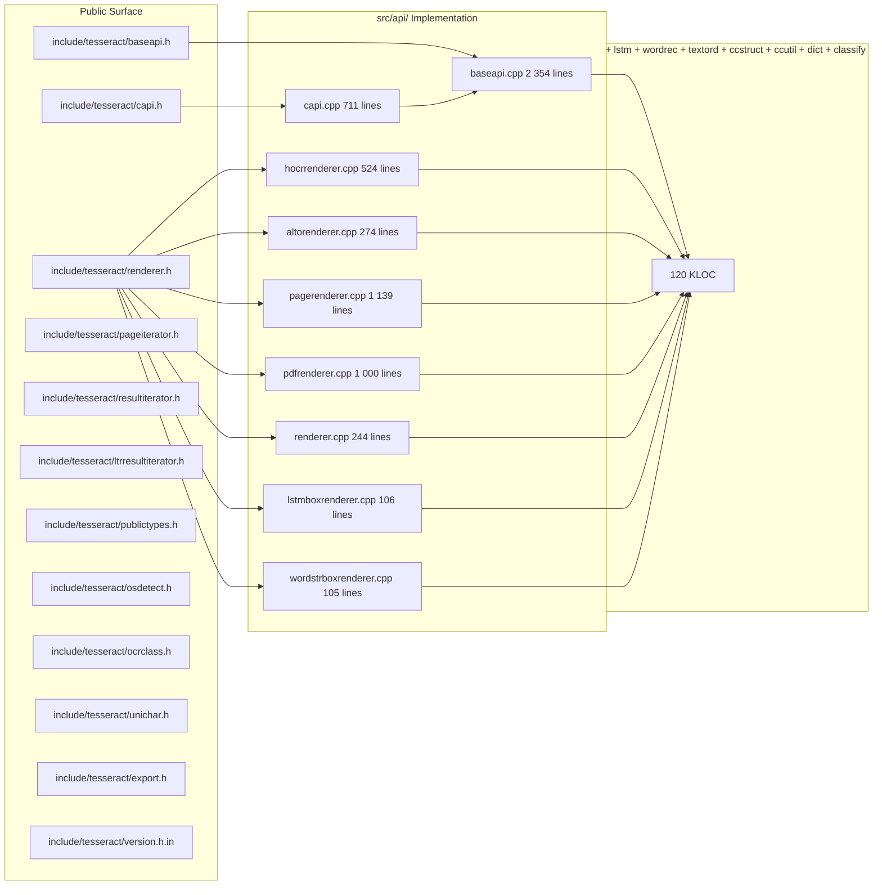

# 03 — Architecture

This document presents two complementary views of the Tesseract architecture:

1. **Module dependency graph** — who calls whom across the 14 `src/` modules.
2. **Class hierarchy** — the inheritance chain from `PageIterator` up through
   `MutableIterator`, and the renderer hierarchy from `TessResultRenderer`.

A third diagram shows the **startup flow** from `main()` to first user-visible
output, satisfying the codebase-deep-documentation requirement of one
flowchart-style top-level entry.

---

## 3.1 Module dependency graph

Key observations:

- **`src/api/`** is the only module that the user-facing C++/C API touches.
  Everything else is hidden behind `TessBaseAPI`.
- **`src/ccmain/`** is the central orchestrator (the `Tesseract` class).
- **`src/lstm/`** is the modern recognizer; **`src/wordrec/`** is legacy,
  dispatched by `OEM_TESSERACT_ONLY` (`src/ccmain/tessedit.cpp:171-172`).
- **Leptonica** is the only external hard dependency — it provides `Pix`,
  the image class Tesseract uses internally.

---

## 3.2 Class hierarchy — iterators

Hierarchy summary:

| Class | Header:line | Role |
|---|---|---|
| `PageIterator` | `include/tesseract/pageiterator.h:50` | layout-only traversal (block → para → line → word → symbol) |
| `LTRResultIterator` | `include/tesseract/ltrresultiterator.h:45` | adds text extraction; for LTR (Latin) scripts |
| `ResultIterator` | `include/tesseract/resultiterator.h:32` | adds recognition-specific helpers |
| `MutableIterator` | `src/ccmain/mutableiterator.h:51` | exposes internal `PAGE_RES_IT *` |
| `ChoiceIterator` | `include/tesseract/ltrresultiterator.h:180` | nested in LTR; alternative word choices with confidences |

> **Lifespan warning** (every header repeats this): `PageIterator` and its
> subclasses point to data inside `TessBaseAPI`; calling `Init/SetImage/Recognize/Clear/End/DetectOS`
> invalidates them.

---

## 3.3 Class hierarchy — renderers

Composition: `TessResultRenderer::insert()` (`include/tesseract/renderer.h:54`)
chains renderers so a single `ProcessPages` call can produce multiple output
formats in parallel (e.g. `.txt` + `.pdf`).

---

## 3.4 Startup flow — from `main()` to first OCR result

This flowchart covers both CLI and library entry points — `TessBaseAPI::ProcessPages`
is the same call regardless of which renderer chain was constructed.

---

## 3.5 Recognition pipeline — 7 stages

When `TessBaseAPI::Recognize(ETEXT_DESC *)` runs (`src/api/baseapi.cpp:762-844`),
the work flows through 7 stages. Each stage can be considered its own
subsystem; see [`INDEX.md`](./INDEX.md) § 4 for the file:line references.

```mermaid
flowchart LR
    IMG[Input image<br/>Pix or raw buffer] --> S1
    S1[1. Image loading & thresholding<br/>src/api/baseapi.cpp:2070 FindLines<br/>src/ccmain/thresholder.cpp:284 ThresholdToPix] --> S2
    S2[2. Component finding<br/>Textord::find_components<br/>src/ccmain/pagesegmain.cpp:309] --> S3
    S3[3. Layout / page segmentation<br/>src/ccmain/pagesegmain.cpp:272 SetupPageSegAndDetectOrientation<br/>src/textord/colfind.cpp FindBlocks] --> S4
    S4[4. Orientation & Script detection<br/>src/ccmain/pagesegmain.cpp:366<br/>os_detect_blobs include/tesseract/osdetect.h:122] --> S5
    S5{5. OEM dispatch<br/>init_lstm_components<br/>src/ccmain/tessedit.cpp:171-172}
    S5 -->|OEM_LSTM_ONLY| S5L[LSTM Recognizer<br/>src/lstm/lstmrecognizer.cpp:247 RecognizeLine<br/>src/ccmain/linerec.cpp:229 LSTMRecognizeWord]
    S5 -->|OEM_TESSERACT_ONLY| S5W[Legacy Recognizer<br/>src/wordrec/chopper.cpp:385 chop_word_main<br/>src/wordrec/segsearch.cpp:33 SegSearch]
    S5L --> S6
    S5W --> S6
    S6[6. Language model / dictionary<br/>src/wordrec/language_model.cpp:1235 UpdateBestChoice<br/>src/dict/dict.cpp probability_in_context_] --> S7
    S7[7. Output / rendering<br/>src/ccmain/output.cpp:39 output_pass<br/>src/api/renderer.cpp:88 AddImage] --> OUT[out.txt / hocr / pdf / …]
```

Legacy vs LSTM is selected at `Init` time. The dispatch happens once and is
cached in `Tesseract::AnyLSTMLang()` / `Tesseract::AnyTessLang()`.

---

## 3.6 Public-API encapsulation

`src/api/` is intentionally isolated (`cmake/SourceLists.cmake:5-15`):

`include/tesseract/*.h` is the *only* surface visible to library consumers;
no headers from `src/ccmain/` etc. are exposed.

See [`04_operation_chains.md`](./04_operation_chains.md) for end-to-end call
chains, and [`05_api_surface.md`](./05_api_surface.md) for the full
`TessBaseAPI` method table.