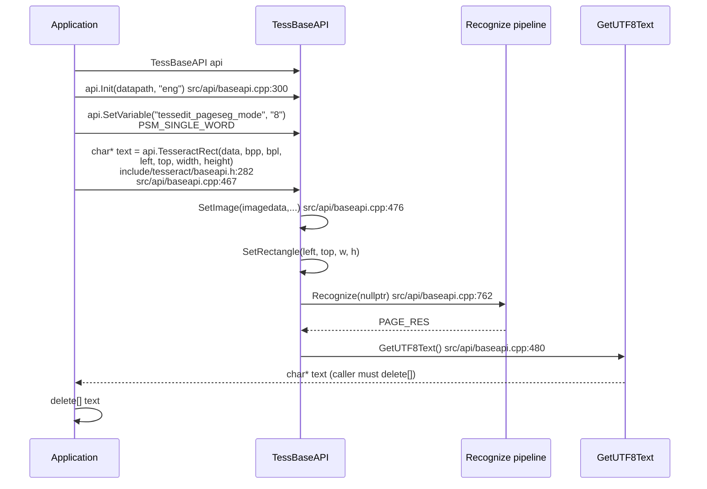
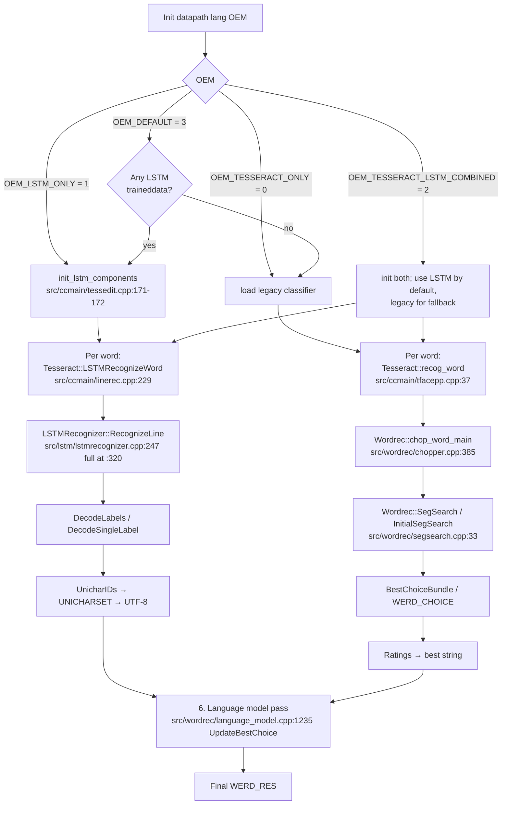
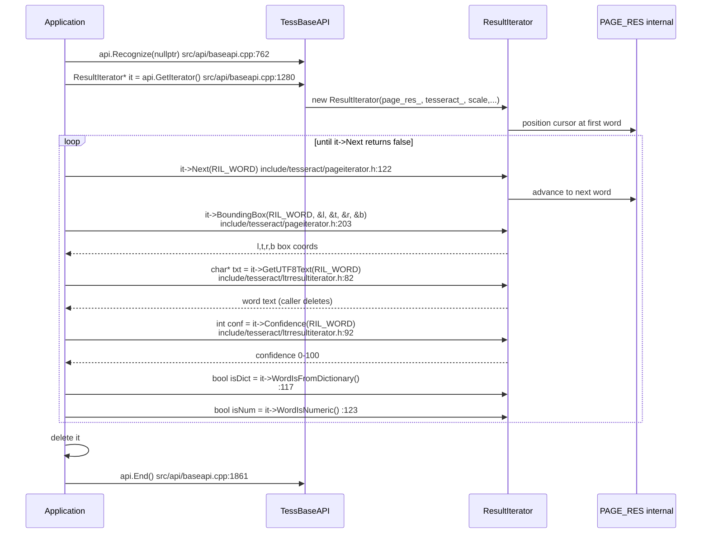
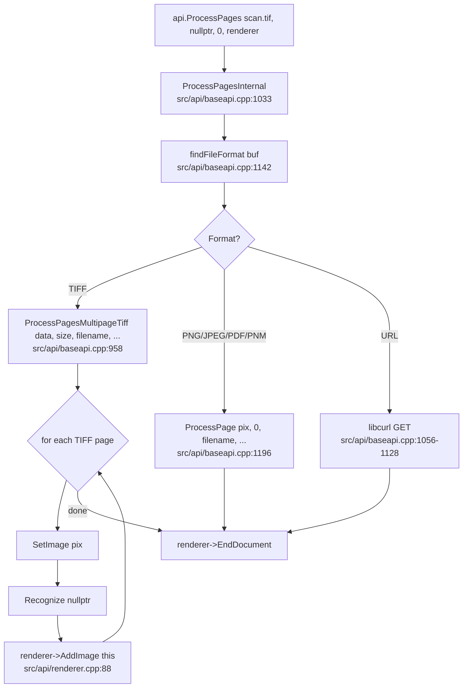
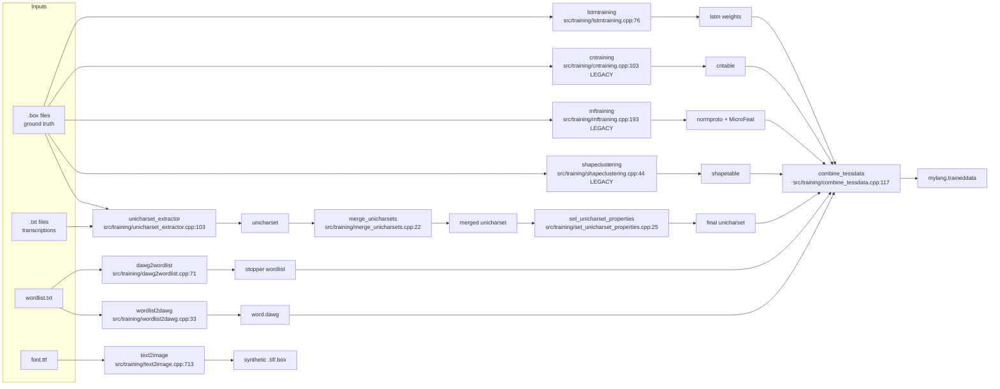

# 04 — Operation Chains

This document walks through **7 representative operation chains** in Tesseract,
each accompanied by a mermaid diagram. All file:line references are
grep-verified against the source tree.

> The first 6 chains are required by the verification checklist
> (`grep -c "^## " 04_operation_chains.md ≥ 6`); chain (g) is an extra that
> covers the Java Swing viewer to round out the picture.

---

## (a) CLI — `tesseract image.png out --oem 1 -l eng`

The most common use case: invoke the binary on a PNG, get a `.txt` back.

```mermaid
sequenceDiagram
    participant U as User
    participant CLI as tesseract CLI<br/>src/tesseract.cpp
    participant API as TessBaseAPI<br/>src/api/baseapi.cpp
    participant PSEG as Page-seg<br/>src/ccmain/pagesegmain.cpp
    participant LSTM as LSTM Recognizer<br/>src/lstm/lstmrecognizer.cpp
    participant REN as TessTextRenderer<br/>src/api/renderer.cpp:139
    participant FS as File System

    U->>CLI: tesseract image.png out --oem 1 -l eng
    CLI->>CLI: main(argc,argv) line 855 → try/catch
    CLI->>CLI: main1(argc,argv) line 650
    CLI->>CLI: ParseArgs line 366<br/>(sets lang=eng, OEM=1, image, outputbase)
    CLI->>API: TessBaseAPI api; line 714
    CLI->>API: api.Init(datapath,"eng",OEM_LSTM_ONLY,...) line 718
    Note over API: Init reads eng.traineddata<br/>src/api/baseapi.cpp:300
    CLI->>API: FixPageSegMode(api, PSM_AUTO) line 752
    CLI->>API: api.SetSourceResolution(ppi)
    CLI->>CLI: PreloadRenderers(api, renderers, ...) line 836
    Note over CLI: Constructs TessTextRenderer("out")
    CLI->>API: api.ProcessPages("image.png", nullptr, 0, &renderer) line 845
    API->>API: ProcessPagesInternal line 1033
    API->>API: findFileFormat (PNG) line 1142
    API->>API: ProcessPage(pix, 0, ...) line 1196
    API->>API: SetImage(pix) + Recognize(nullptr) line 762
    API->>PSEG: SetupPageSegAndDetectOrientation line 272
    PSEG->>PSEG: AutoPageSeg line 201
    API->>LSTM: LSTMRecognizeWord → RecognizeLine
    LSTM-->>API: WERD_RES with chosen chars
    API->>REN: renderer->AddImage(this) src/api/renderer.cpp:88
    REN->>REN: TessTextRenderer::AddImageHandler line 139
    REN->>FS: write out.txt
    API-->>CLI: ProcessPages returns true
    CLI-->>U: exit 0
```

| Step | Call | File:line |
|---:|---|---|
| 1 | `main(int argc, char **argv)` | `src/tesseract.cpp:855` |
| 2 | `main1(argc, argv)` | `src/tesseract.cpp:650` |
| 3 | `ParseArgs(...)` | `src/tesseract.cpp:366` |
| 4 | `TessBaseAPI api;` | `src/tesseract.cpp:714` |
| 5 | `api.Init(datapath, "eng", OEM_LSTM_ONLY, configs, …)` | `src/tesseract.cpp:718`; impl `src/api/baseapi.cpp:300` |
| 6 | `FixPageSegMode(api, pagesegmode)` | `src/tesseract.cpp:752` (defn `:300`) |
| 7 | `PreloadRenderers(api, renderers, …)` | `src/tesseract.cpp:836` (defn `:503`) |
| 8 | `api.ProcessPages("image.png", nullptr, 0, renderers[0].get())` | `src/tesseract.cpp:845`; impl `src/api/baseapi.cpp:999` |
| 9 | `findFileFormat` autodetect | `src/api/baseapi.cpp:1142` |
| 10 | `ProcessPage(pix, 0, "image.png", …)` | `src/api/baseapi.cpp:1196` |
| 11 | `SetImage(pix) + Recognize(nullptr)` | `src/api/baseapi.cpp:528,762` |
| 12 | `Recognize → FindLines → LSTM path` | `src/api/baseapi.cpp:762,2070` |
| 13 | `renderer->AddImage(this) → AddImageHandler → out.txt` | `src/api/renderer.cpp:88,139` |

---

## (b) Library — pre-segmented ROI via `TesseractRect`

For callers that already know the bounding box of the text region (e.g.
Android UI hotspots after Frida-driven automation), `TesseractRect` is the
single-call shortcut.



| Step | Call | File:line |
|---:|---|---|
| 1 | `api.Init(datapath, "eng")` | `src/api/baseapi.cpp:300` |
| 2 | `api.SetVariable("tessedit_pageseg_mode", "8")` | `src/api/baseapi.cpp:211` |
| 3 | `api.TesseractRect(imagedata, bpp, bpl, left, top, width, height)` | decl `include/tesseract/baseapi.h:282`; impl `src/api/baseapi.cpp:467-481` |
| 4 | Internally: `SetImage(...)` + `SetRectangle(...)` + `Recognize(...)` + `GetUTF8Text()` | `src/api/baseapi.cpp:476,480` |
| 5 | Caller must `delete[] text` | doc at `include/tesseract/baseapi.h:524` |

---

## (c) LSTM-only vs legacy word recognition

The `OcrEngineMode` enum selects which recognizer is built during `Init`.
This flowchart shows how a single word makes it through both pipelines.



| Path | Entry | File:line |
|---|---|---|
| Build (LSTM) | `init_lstm_components` | `src/ccmain/tessedit.cpp:171-172` |
| Build (legacy) | legacy classifier load | gated by `DISABLED_LEGACY_ENGINE` |
| Per word (LSTM) | `Tesseract::LSTMRecognizeWord` | `src/ccmain/linerec.cpp:229` |
| Per word (LSTM) → line | `LSTMRecognizer::RecognizeLine` | `src/lstm/lstmrecognizer.cpp:247`/`:320` |
| Per word (legacy) | `Tesseract::recog_word` | `src/ccmain/tfacepp.cpp:37` |
| Per word (legacy) → chop | `Wordrec::chop_word_main` | `src/wordrec/chopper.cpp:385` |
| Per word (legacy) → seg | `Wordrec::SegSearch` | `src/wordrec/segsearch.cpp:33` |

---

## (d) Iterator traversal — `GetIterator → Next → BoundingBox → GetUTF8Text`

For callers that need per-word bounding boxes and confidences (e.g. drawing
overlays, extracting layout-aware text).



| Step | Call | File:line |
|---:|---|---|
| 1 | `api.Recognize(nullptr)` | `src/api/baseapi.cpp:762` |
| 2 | `ResultIterator *it = api.GetIterator();` | `src/api/baseapi.cpp:1280` |
| 3 | Loop `it->Next(RIL_WORD)` | `include/tesseract/pageiterator.h:122` |
| 4 | `it->BoundingBox(RIL_WORD, &l, &t, &r, &b)` | `include/tesseract/pageiterator.h:203` |
| 5 | `char *txt = it->GetUTF8Text(RIL_WORD)` | `include/tesseract/ltrresultiterator.h:82` |
| 6 | `float conf = it->Confidence(RIL_WORD)` | `include/tesseract/ltrresultiterator.h:92` |
| 7 | `delete it;` (caller) | — |
| 8 | `api.End()` | `src/api/baseapi.cpp:1861` |

> **Lifetime caveat** (`include/tesseract/pageiterator.h:41-44`, repeated in every header): iterators
> point to data inside `TessBaseAPI`; calling `Init/SetImage/Recognize/Clear/End/DetectOS`
> invalidates them.

---

## (e) Multi-page TIFF — `ProcessPages` autodetects TIFF



| Step | Call | File:line |
|---:|---|---|
| 1 | `api.ProcessPages("scan.tif", nullptr, 0, renderer)` | `src/api/baseapi.cpp:999` |
| 2 | `ProcessPagesInternal` | `src/api/baseapi.cpp:1033` |
| 3 | `findFileFormat` autodetect | `src/api/baseapi.cpp:1142` |
| 4 | `ProcessPagesMultipageTiff(data, size, filename, ...)` | `src/api/baseapi.cpp:958` |
| 5 | Per page: `SetImage + Recognize + renderer->AddImage` | `src/api/baseapi.cpp:1196` |

---

## (f) Training a new `.traineddata` from scratch

The full chain to produce a single `mylang.traineddata`:



| # | Step | Tool | Entry file:line |
|---:|---|---|---|
| 1 | Extract character set from `.box` files | `unicharset_extractor` | `src/training/unicharset_extractor.cpp:103` |
| 2 | (Legacy) shape clustering | `shapeclustering` | `src/training/shapeclustering.cpp:44` |
| 3 | (Legacy) train character proto/features | `mftraining` | `src/training/mftraining.cpp:193` |
| 4 | (Legacy) train character normalization | `cntraining` | `src/training/cntraining.cpp:103` |
| 5 | Wordlist → DAWG | `wordlist2dawg` | `src/training/wordlist2dawg.cpp:33` |
| 6 | DAWG → reverse wordlist (stopper) | `dawg2wordlist` | `src/training/dawg2wordlist.cpp:71` |
| 7 | (LSTM) train LSTM | `lstmtraining` | `src/training/lstmtraining.cpp:76` |
| 8 | (LSTM) evaluate | `lstmeval` | `src/training/lstmeval.cpp:32` |
| 9 | Merge unicharsets | `merge_unicharsets` | `src/training/merge_unicharsets.cpp:22` |
| 10 | Set unicharset properties (RTL/BiDi) | `set_unicharset_properties` | `src/training/set_unicharset_properties.cpp:25` |
| 11 | **Combine** into `mylang.traineddata` | `combine_tessdata` | `src/training/combine_tessdata.cpp:117` |
| 12 | Render training text to image | `text2image` | `src/training/text2image.cpp:713` |
| 13 | (Optional) combine lang model | `combine_lang_model` | `src/training/combine_lang_model.cpp:42` |
| 14 | (Optional) emit ambiguity tables | `ambiguous_words` | `src/training/ambiguous_words.cpp:30` |
| 15 | (Optional) batch classifier test | `classifier_tester` | `src/training/classifier_tester.cpp:100` |

---

## (g) Java Swing ScrollView viewer (offline `.box` visualization)

The only Java in the project. **Not** an Android bridge — it talks over TCP
port 8461 to the C++ `scrollview` server in `libtesseract`.

```mermaid
sequenceDiagram
    participant User
    participant Java as Java Swing GUI<br/>SVWindow.java:40
    participant Swing as javax.swing + Piccolo2D
    participant TCP as TCP port 8461
    participant Srv as C++ ScrollView server<br/>src/viewer/scrollview.cpp
    participant Box as .box file

    User->>Java: opens jar with --box=foo.box --image=foo.png
    Java->>TCP: connect 127.0.0.1:8461
    TCP->>Srv: SVEvent message stream
    Srv->>Box: parse .box file
    Box-->>Srv: ground truth boxes
    Srv->>TCP: serialized SVEvent responses
    TCP-->>Java: events
    Java->>Swing: PImage nodes + overlay rectangles
    Swing-->>User: interactive rendered scene

    loop on user zoom / pan / click
        User->>Swing: mouse event
        Swing->>Java: Piccolo2D callback
        Java->>TCP: SVEvent pointer event
        TCP->>Srv: process
        Srv-->>TCP: SVEvent reply
        TCP-->>Java: update
        Java->>Swing: redraw
    end
```

| # | Class / file | Role | File |
|---:|---|---|---|
| 1 | `com.google.scrollview.ScrollView` | TCP client (server listens on 8461) | `java/com/google/scrollview/ScrollView.java:32` |
| 2 | `com.google.scrollview.ui.SVWindow` | Top-level Swing frame | `java/com/google/scrollview/ui/SVWindow.java` |
| 3 | `com.google.scrollview.events.{SVEvent,SVEventHandler,SVEventType}` | IPC message structs | `java/com/google/scrollview/events/SVEvent.java` |
| 4 | `SV{AbstractMenuItem,CheckboxMenuItem,EmptyMenuItem,ImageHandler,MenuBar,MenuItem,PopupMenu,SubMenuItem}` | menu primitives | `java/com/google/scrollview/ui/*.java` |

> **Implication**: this folder is useful only on a desktop JVM. For Android
> UI inspection you must bring your own tool (e.g. the ScrollView reader
> embedded in some training pipelines, or a custom dump script).

---

## Summary

| Chain | Entry | Key exit | Diagram type |
|---|---|---|---|
| (a) CLI | `main(argc,argv)` | `out.txt` | sequenceDiagram |
| (b) Library ROI | `TesseractRect(...)` | `text*` | sequenceDiagram |
| (c) OEM dispatch | `Init(... OEM ...)` | LSTM or legacy path | flowchart TD |
| (d) Iterator traversal | `GetIterator()` | per-word boxes+text | sequenceDiagram |
| (e) Multi-page TIFF | `ProcessPages(... .tif ...)` | per-page outputs | flowchart TD |
| (f) Training | `unicharset_extractor` + 10 others | `mylang.traineddata` | flowchart LR |
| (g) Swing viewer | `java -jar ScrollView.jar` | GUI overlay | sequenceDiagram |

Total mermaid diagrams in this file: **7** (≥ 6 required, ≥ 7 verified).