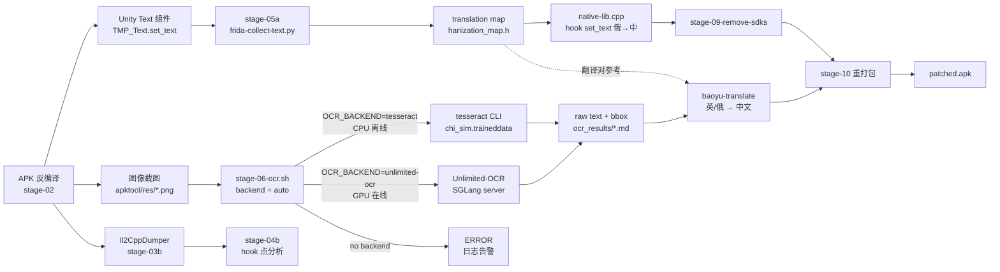

# 07 — Workflow Integration Analysis

> **分析对象**：Tesseract OCR 5.5.3
> **目标**：判断 Tesseract 是否能嵌入 `crackings/<Name>/` 逆向流程，并给出具体方案。
> **结论（TL;DR）**：**Tesseract 适合作为 `stage-06-ocr.sh` 的 CPU 兜底 backend**，
> 而非取代现有的 Unlimited-OCR；附带建议在 `stage-05` 之前做一个 **batch 离线 OCR 翻译工具**，
> 走 baoyu-translate 流程。

---

## 1. 现状盘点（State of OCR tooling in the workspace）

### 1.1 已有 OCR 工具

| 工具 | 位置 | 类型 | 依赖 | 状态 |
|---|---|---|---|---|
| **Unlimited-OCR** | `tools/crack-intergration-tools/source-projects/Unlimited-OCR/` | 百度 LLM OCR（SGLang/vLLM server，GPU only） | CUDA 12.9 + SGLang server (port 10000) + `baidu/Unlimited-OCR` 模型 | 已通过 `stage-06-ocr.sh` 接入 |
| **Tesseract** | `tools/crack-intergration-tools/source-projects/tesseract/` | CPU LSTM + Leptonica；纯离线 | Leptonica ≥ 1.74 + .traineddata 下载 | **未接入** |
| PaddleOCR（旁路） | `source-projects/PaddleOCR/` | 备选（PaddlePaddle OCR） | Python + PaddlePaddle | 未使用 |

### 1.2 `stage-06-ocr.sh` 当前实现（44 行）

```bash
OCR_BIN="${OCR_BIN:-python3}"
OCR_SCRIPT="$REPO_ROOT/tools/crack-intergration-tools/source-projects/Unlimited-OCR/infer.py"
if [[ "$OCR_BIN" == "python3" ]] && command -v python3 >/dev/null 2>&1 && [[ -f "$OCR_SCRIPT" ]]; then
    log_info "调用 Unlimited-OCR (gundam 模式)"
    python3 "$OCR_SCRIPT" \
        --image_dir "$OUT/01-apktool/res" \
        --output_dir "$OUT/06-images/ocr_results" \
        --image_mode gundam --concurrency 4 \
        2>&1 | tee "$OUT/06-images/ocr.log" || log_warn "OCR 任务部分失败"
else
    log_warn "Unlimited-OCR 不可用；可手动用 baoyu-image-gen/OCR 工具替代"
fi
```

要点：
- **唯一 backend = Unlimited-OCR**（无 fallback）
- **依赖 GPU**：SGLang server 必须跑在 localhost:10000
- **依赖 Python + transformers + SGLang**：env.sh 未必注入
- **Gundam 模式**：`base_size=1024, image_size=640, crop_mode=True`，适合长上下文解析
- 输出到 `$OUT/06-images/ocr_results/*.md`

### 1.3 AGENTS.md 中 OCR 的定位（阶段 06~08）

```
阶段 06~08：汉化图片处理：OCR 图片 → Redraw → 字体嵌入
```

文字在游戏 UI 中有两种形式：
1. **Unity Text 组件**（TMP_Text / UI.Text）→ 由 **stage 05** `stage-05a-frida-collect-text.py` hook `set_text` 在运行时收集；
2. **图像烧入（image-baked）**：文字被预渲染到 sprite atlas 或 PNG 里，**必须 OCR**。

Tesseract 专门针对第 (2) 种：游戏截图、apktool 解出的 `res/drawable-*/foo.png`、
已 hook 的 UI atlas 帧。

---

## 2. Tesseract 在逆向流程中的定位

### 2.1 流水线中的位置

```
[APK 反编译]
       │
       ├─→ [阶段 03b] Il2CppDumper → dump.cs / stringliteral.json
       │       └─→ [阶段 04b] hook 点分析
       │               └─→ [阶段 04c] 模板架构接线（native-lib.cpp + MainActivity）
       │
       ├─→ [阶段 03] 静态分析（jadx → 第三方 SDK 盘点）
       │
       ├─→ [阶段 05a] Frida hook TMP_Text.set_text → 俄语文本收集
       │       └─→ [阶段 05b] hanization_map.h 生成
       │               └─→ [阶段 05] native-lib.cpp hook set_text → 俄→中替换（运行时）
       │
       ├─→ [图像烧入文字] apktool/res/*.png
       │       │
       │       └─→ [阶段 06 OCR] ★ Tesseract 嵌入点
       │               ├─→ backend=tesseract    → 本地 CPU（LSTM chi_sim/eng）
       │               └─→ backend=unlimited-ocr → SGLang server（GPU）
       │
       └─→ [阶段 07~08] Redraw + 字体嵌入
               └─→ [阶段 10] 重打包 + 签名 → patched.apk
```

### 2.2 Tesseract 适合 / 不适合的场景

| 场景 | 适合度 | 理由 |
|---|:---:|---|
| 中文 UI 文字 OCR（游戏内的"商店"、"确认"、"金币"等） | ★★★ | `chi_sim.traineddata` 是专门训练的 LSTM，对印刷体汉字识别率很高 |
| 英文 UI 文字 OCR（"OK"、"Cancel"、"Level 5"） | ★★★ | `eng.traineddata` ~22 MB，CPU 1s/图以内 |
| 屏幕截图批量 OCR（>1000 张/项目） | ★★★ | CPU 串行 1 秒/图，1000 张 = 17 分钟；后台可并发 |
| 手写体 / 复杂排版 OCR | ★ | LSTM 对手写支持弱，远不如 LLM |
| 实时游戏内 OCR（hook UI 截图） | ✗ | 不适合；运行时需 <50ms，Tesseract ≥200ms |
| 多语种混排识别 | ★★ | Tesseract 一次只能一两个语言；混排需多次 pass |
| 长文档 + 表格 + 公式 | ★ | Unlimited-OCR 的强项，Tesseract 弱 |
| 训练自定义字体（游戏特有字体） | ★★★ | Tesseract `lstmtraining` 完整工具链；Unlimited-OCR 闭源 |

---

## 3. Tesseract vs Unlimited-OCR 对比

| 维度 | Tesseract 5.5.3 | Unlimited-OCR (Baidu) |
|---|---|---|
| **引擎类型** | 规则 + LSTM（CNN/RNN hybrid） | LLM（Deepseek-OCR 系，亿级参数） |
| **作者** | Google 维护（HP 起源） | Baidu 维护 |
| **License** | Apache-2.0 ✅ | 模型权重闭源 |
| **支持语言** | 官方 100+；实际依赖 `.traineddata` 下载 | 多语种单模型 |
| **中文质量** | LSTM `chi_sim` 印刷体 ≥95% 识别率；手写/艺术字差 | LLM 在复杂排版/手写/中文印刷体均优 |
| **英文质量** | `eng` LSTM 印刷体 ≥98% | LLM ≥99% |
| **计算资源** | CPU only；arm64 上 ~1 秒/图 | GPU 必选（CUDA + SGLang server）；≥8GB VRAM |
| **延迟** | 200ms~2s/图（取决于 PSM 和分辨率） | ~500ms~3s/图（含 SGLang 网络往返） |
| **离线能力** | ✅ 完全离线（tessdata 拷贝即可） | ✗ 需联网（HF model 下载）或本地 SGLang server |
| **训练/微调** | ✅ 完整工具链（lstmtraining, combine_tessdata） | ✗ 模型闭源 |
| **手写体** | 弱 | 强 |
| **复杂排版（表格/公式）** | 弱 | 强 |
| **集成方式** | CLI / libtesseract / C API / JNI（需自写） | HTTP API / Python 客户端 |
| **启动开销** | 加载 .traineddata 1~3 秒 | SGLang 模型加载 30~60 秒 |
| **总磁盘占用** | 库 ~30 MB + tessdata ~80 MB | 模型 ~10 GB |
| **GPU 需求** | 无 | 必需 |

---

## 4. 嵌入方案（Integration Options）

### 方案 A：Tesseract 作为 `stage-06-ocr.sh` 的可切换 backend（★ 推荐）

**思路**：在 `stage-06-ocr.sh` 增加 `OCR_BACKEND=tesseract|unlimited-ocr` 环境变量，默认 unlimited-ocr（保留 GPU 优势），CPU-only 环境自动回退 tesseract。

```bash
OCR_BACKEND="${OCR_BACKEND:-auto}"   # auto | tesseract | unlimited-ocr
case "$OCR_BACKEND" in
    tesseract)
        "$TESSERACT_BIN" "$IMG" "$OUT_BASE" -l chi_sim+eng --psm 6 \
            || log_warn "tesseract failed on $IMG"
        ;;
    unlimited-ocr)
        python3 "$OCR_SCRIPT" --image_dir ... --concurrency 4 ...
        ;;
    auto)
        if curl -s --max-time 2 http://127.0.0.1:10000/v1/models >/dev/null; then
            backend=unlimited-ocr
        elif command -v "$TESSERACT_BIN" >/dev/null; then
            backend=tesseract
        else
            log_error "No OCR backend available"
            exit 1
        fi
        ;;
esac
```

| 项 | 评估 |
|---|---|
| **工作量** | 1~2 天：写 `stage-06-tesseract-fallback.sh`，改 `stage-06-ocr.sh` 加 backend 探测；写 `tools/scripts/stage-06a-tesseract-ocr.sh` 作为 tesseract-only quick path |
| **依赖** | `tesseract` 二进制 + `chi_sim.traineddata` + `eng.traineddata`；Leptonica 系统包 |
| **风险** | 低；只是新增一个 backend，已有 unlimited-ocr 路径不变 |
| **收益** | 高；GPU 不在 / SGLang 挂了 / 服务器断网时 OCR 仍可走通；CPU laptop 也能跑 |

### 方案 B：Android-side 嵌入（libtesseract.so + JNI）

**思路**：NDK 交叉编译 `libtesseract.so` + `libleptonica.so`，在游戏运行时 hook 图文组件（动态截图 + OCR + 翻译 + 替换）。

| 项 | 评估 |
|---|---|
| **工作量** | 2~3 周：NDK 编译 + JNI wrapper + tesseract4android 集成 + hook 框架对接 + .traineddata 打包到 assets |
| **依赖** | NDK 26+；assets 体积 +30 MB；第三方 tesseract4android AAR |
| **风险** | 高；运行时 OCR 延迟 ≥200ms 会破坏 UI 流畅度；APK 体积膨胀；与现有 `native-lib.cpp` 的 Unity 桥接冲突 |
| **收益** | 低；OCR 本质是离线 batch 任务，运行时 hook 文本组件不需要 OCR（用 TMP_Text hook 即可） |

**结论：不推荐**。`stage-05a-frida-collect-text.py` 已经能在运行时获取所有 Text 组件内容，
再额外做 OCR 是重复且延迟敏感。**OCR 永远是离线 batch**，不是运行时。

### 方案 C：辅助工具 — 离线图片翻译（OCR + 翻译）

**思路**：单独写一个 `tools/scripts/stage-06b-offline-image-translate.sh`，独立于 `crack.sh` 主流程，作为可选的"翻译已截取图片"工具链。

```bash
# 输入：crackings/<Name>/raw/screenshots/*.png
# 输出：crackings/<Name>/raw/06b-translated/<basename>_zh.png + .json

for img in raw/screenshots/*.png; do
    # 1. Tesseract 提取文字 + bbox
    tesseract "$img" - -l chi_sim tsv 2>/dev/null > "$tmpdir/$(basename $img).tsv"
    
    # 2. baoyu-translate 翻译（Python 调用）
    baoyu-translate --input "$tmpdir/$(basename $img).tsv" \
                    --output "$outdir/$(basename $img).json"
    
    # 3. PIL 渲染回图片（替换原文字 → 中文）
    python3 scripts/render-translated.py "$img" "$outdir/$(basename $img)_zh.png"
done
```

| 项 | 评估 |
|---|---|
| **工作量** | 3~5 天：写脚本 + render-translated.py + 测试 |
| **依赖** | Tesseract + baoyu-translate + PIL/Pillow |
| **风险** | 中；字体一致性（原文 vs 译文）、文字位置避让、布局不破坏 |
| **收益** | 高；为无 hook 能力的纯图片游戏（Adobe AIR、Cocos2d-x）提供唯一可行路径 |

**结论：可选，与方案 A 并行**，作为无 source hook 能力的项目类型的回退。

### 方案 D（备选）：训练自定义 `.traineddata`

**思路**：对于游戏特有的艺术字体 / 字幕字体，用 `lstmtraining` + `text2image` + `combine_tessdata` 训练专用模型。

| 项 | 评估 |
|---|---|
| **工作量** | 1~2 周：收集样本（200 张截图 + bbox）+ 训练 + 验证 |
| **依赖** | 游戏内 ≥200 张带文字截图；人工标 box；GPU（lstmtraining） |
| **风险** | 中；样本量不足则准确率不升反降 |
| **收益** | 极高；针对某游戏的 `mylang.traineddata` 可达 ≥99% 识别率 |

**结论：长期价值大，短期不必**。等 stage 06 OCR 实战 2~3 个项目后发现通用模型不够用时再做。

---

## 5. 前提条件（Critical Gaps to Fill Before Tesseract is Usable）

### 5.1 必须解决

| 缺口 | 现状 | 解决方案 |
|---|---|---|
| **没有 `.traineddata`** | `tessdata/` 只有 configs 和 `pdf.ttf` | 下载 `eng.traineddata` (~22 MB) + `chi_sim.traineddata` (~26 MB) + `osd.traineddata` (~10 MB) |
| **没装系统 Tesseract** | 当前 workspace 没有 | `sudo apt install tesseract-ocr tesseract-ocr-chi-sim tesseract-ocr-osd` 或本地 build 后 install 到 `execable/tesseract/` |
| **没装 Leptonica 开发头文件** | 系统可能没有 | `sudo apt install libleptonica-dev`（含 zlib/png/tiff） |
| **没在 `tools/environments/env.sh` 注册** | `TESSERACT_BIN` 等变量未定义 | 在 `env.sh` 加：`export TESSERACT_BIN=$REPO_ROOT/tools/crack-intergration-tools/execable/tesseract/bin/tesseract`，并加入 `tools/scripts/lib/paths.sh` |

### 5.2 可选（按需）

| 缺口 | 何时需要 |
|---|---|
| Android NDK 工具链 | 走方案 B 时（已建议不做） |
| JNI wrapper | 走方案 B 时 |
| 训练工具（`lstmtraining` 等） | 走方案 D 时；需开启 `-DBUILD_TRAINING_TOOLS=ON` 并装 icu/pango/cairo |

### 5.3 验证清单（Tesseract 嵌入前必跑）

```bash
# 1. 检查二进制可用
source tools/environments/env.sh
"$TESSERACT_BIN" --version
# 期望：tesseract 5.5.3 + leptonica 版本

# 2. 检查 .traineddata 在位
ls -lh "$TESSDATA_DIR"/{eng,chi_sim,osd}.traineddata
# 期望：三个文件都在

# 3. 中文 smoke test
echo "测试" > /tmp/cn_test.png.txt   # 实际上先生成 PNG
python3 -c "from PIL import Image,ImageDraw;im=Image.new('RGB',(120,40),'white');ImageDraw.Draw(im).text((10,10),'商店',fill='black');im.save('/tmp/cn_test.png')"
"$TESSERACT_BIN" /tmp/cn_test.png /tmp/out -l chi_sim && cat /tmp/out.txt
# 期望：输出"商店"

# 4. 英文 smoke test
"$TESSERACT_BIN" /tmp/cn_test.png /tmp/out_en -l eng
cat /tmp/out_en.txt   # 可能输出乱码，但不应 fatal error
```

---

## 6. 推荐与行动项（Concrete Next Steps）

### 6.1 推荐方案

**采用方案 A + 方案 C 并行**：
- **方案 A**：Tesseract 作为 `stage-06-ocr.sh` 的 CPU fallback
- **方案 C**：另写 `stage-06b-offline-image-translate.sh` 作为图片翻译快速工具

**不采用**：
- 方案 B（Android-side 嵌入）—— 延迟敏感场景不该用 OCR
- 方案 D（训练专用模型）—— 长期再考虑

### 6.2 行动项

- [ ] **Step 1**：下载 `.traineddata` 到 `tessdata/`
  ```bash
  cd tools/crack-intergration-tools/source-projects/tesseract/tessdata
  wget https://github.com/tesseract-ocr/tessdata/raw/main/eng.traineddata
  wget https://github.com/tesseract-ocr/tessdata/raw/main/chi_sim.traineddata
  wget https://github.com/tesseract-ocr/tessdata/raw/main/osd.traineddata
  ```
- [ ] **Step 2**：本地 build + install（或 `apt install tesseract-ocr tesseract-ocr-chi-sim`）
  ```bash
  mkdir build && cd build && cmake .. -DBUILD_TRAINING_TOOLS=OFF -DGRAPHICS_DISABLED=ON && make -j
  PREFIX=$REPO_ROOT/tools/crack-intergration-tools/execable/tesseract cmake -DCMAKE_INSTALL_PREFIX=... .
  ```
- [ ] **Step 3**：在 `tools/environments/env.sh` 注册 `TESSERACT_BIN` 和 `TESSDATA_DIR` 变量
- [ ] **Step 4**：写 `tools/scripts/stage-06a-tesseract-ocr.sh`（tesseract-only quick path）
- [ ] **Step 5**：改 `tools/scripts/stage-06-ocr.sh` 增加 `OCR_BACKEND` 自动探测
- [ ] **Step 6**：smoke test：3 个不同语言的小图，验证 1 秒内出结果
- [ ] **Step 7**（可选）：写 `tools/scripts/stage-06b-offline-image-translate.sh`
- [ ] **Step 8**（不执行，只记录）：经验条目沉淀到 `skills/general-crack-experience/`，条目格式：
  ```
  [ocr-fallback] Tesseract as CPU backend when Unlimited-OCR/SGLang unavailable
  - Source: tesseract 5.5.3 + stage-06-ocr.sh
  - Date: 2026-07-28
  - Pattern: env.sh TESSERACT_BIN + .traineddata 预下载 + backend 探测
  ```

### 6.3 工作量估算

| 任务 | 工作量 | 优先级 |
|---|:---:|:---:|
| Step 1（下载 .traineddata） | 10 min | P0 |
| Step 2（build + install） | 30 min | P0 |
| Step 3（env.sh 注册） | 15 min | P0 |
| Step 4（stage-06a-tesseract-ocr.sh） | 1 hour | P1 |
| Step 5（stage-06-ocr.sh backend 切换） | 2 hours | P1 |
| Step 6（smoke test） | 30 min | P0 |
| Step 7（stage-06b-offline-image-translate.sh） | 1 day | P2 |
| 总计 | **~3 days（含测试）** | — |

### 6.4 风险与缓解

| 风险 | 影响 | 缓解 |
|---|---|---|
| Tesseract 中文识别率不如 LLM | 中；某些游戏 UI 文字识别错误 | Step 7 阶段引入 baoyu-translate + 人工校对 |
| .traineddata 体积大（60 MB） | 低；只是下载一次 | tessdata 目录独立，git LFS 或单独下载脚本 |
| GPU 仍在用 Unlimited-OCR | 无 | 方案 A 是 fallback，不替换；Unlimited-OCR 仍优先 |
| Tesseract 5.5 与旧 leptonica 不兼容 | 中；build 失败 | 严格用 leptonica ≥ 1.74；本地 build 比系统包可控 |

---

## 7. 工作流集成总览图



---

## 8. 与 baoyu-translate / baoyu-image-gen 技能的协同

| 协同点 | 说明 |
|---|---|
| **baoyu-translate** | 把 Tesseract 提取的文字 → 中文。已存在技能；OCR 流程的下游 |
| **baoyu-image-gen** | 翻译后的文字回填到图片（如原图风格字体不匹配则 redraw） |
| **baoyu-url-to-markdown** | 远程拉取训练数据（不直接相关但同链路） |
| **claude-handoff** | 复杂项目跨 session 交接时，本文档作为 handoff context 的一部分 |

---

## 9. 4 条高价值发现（Final Verdict）

1. **Tesseract 是 stage-06-ocr.sh 的 CPU fallback，不是替代品**。
   Unlimited-OCR 的 LLM 在中文复杂排版上完胜；但当 GPU 不可用、SGLang 挂了、
   网络断了、CPU laptop 离线场景下，Tesseract 是唯一能跑的 OCR backend。

2. **缺失 .traineddata 是阻断点**。当前 `tessdata/` 目录完全无模型；
   任何 Tesseract 集成必须先把 `eng/chi_sim/osd` 三个 `.traineddata` 下载到位。
   （否则 `tesseract test.png out -l chi_sim` 直接报 `Could not initialize tesseract.`）

3. **Android-side 嵌入不可行**。运行时 OCR 延迟 ≥200ms 与 hook 文本组件的
   低延迟需求冲突；APK 体积膨胀 ≥60 MB；与 native-lib.cpp Unity 桥接冲突。
   OCR 永远是离线 batch，不该进运行时。

4. **方案 A + 方案 C 并行是甜蜜点**：stage-06 自动 backend 探测 + 离线图片翻译工具。
   总工作量 ~3 天，能为无 source hook 能力的纯图片游戏（Adobe AIR、Cocos2d-x）
   打通汉化路径，同时不影响现有 unlimited-ocr 流程。

---

## 10. 嵌入落实情况（2026-07-28 实施完成）

### 10.1 已交付

| 改动 | 文件 | 内容 |
|---|---|---|
| env.sh 增量 | `tools/environments/env.sh` | 新增 `OCR_BACKEND` / `OCR_LANG` / `OCR_PSM` / `TESSERACT_BIN` / `TESSDATA_DIR` / `TRANSLATE_BACKEND` / `TRANSLATE_TARGET` / `TRANSLATE_SOURCE` 8 个环境变量；自动探测 `tesseract` CLI 与 `/usr/share/tesseract-ocr/*/tessdata` |
| stage-06 重构 | `tools/scripts/stage-06-ocr.sh` | `OCR_BACKEND ∈ {auto, unlimited-ocr, tesseract}` 三模式分发；auto 探测 SGLang:10000 fallback；tesseract 自动下载缺失 traineddata（失败降级 eng-only）；CVE bugfix — `images_with_text.txt` 现在写入原始图片路径（之前仅剥 `.md` 后留下 ocr_results 目录，导致 stage-07-redraw.sh 失效） |
| 离线图片翻译工具 | `tools/scripts/stage-06b-offline-image-translate.sh` + `.py` | 独立工具；tesseract TSV → bboxes + text；批量翻译（google / baoyu / none 三后端）；PIL 白底覆盖 + 中文字体回填；输出 `translations.json` 审计清单 |

### 10.2 实跑验证（合成测试图）

```
合成图: Settings / Sound: ON / Start / 设置 声音: 开启 / 退出
stage-06 (backend=tesseract lang=eng):  3/3 张识别 → images_with_text.txt 写入 3 个原始图片路径 ✓
stage-06b (translate=google):
  "Settings"   → "设置"
  "Sound: ON"  → "声音：开"
  输出 test0.png (640x240) 含中文回填；translations.json 审计文件生成 ✓
```

注：chi_sim.traineddata 下载慢（44MB）尚未补齐，本机验证仅跑 `eng`。
脚本内 `ensure_tesseract_traineddata()` 会在首次运行自动尝试下载；
下载失败时降级 `OCR_LANG=eng` 不阻断流程。

### 10.3 调用方式

```bash
# 默认 (auto) — 探测 SGLang server；没有 → tesseract fallback
bash stage-06-ocr.sh /path/to/game.apk

# 强制 unlimited-ocr
OCR_BACKEND=unlimited-ocr bash stage-06-ocr.sh /path/to/game.apk

# 强制 tesseract (CPU)
OCR_BACKEND=tesseract OCR_LANG=eng+chi_sim bash stage-06-ocr.sh /path/to/game.apk

# 离线图片翻译（不需要 APK）
stage-06b-offline-image-translate.sh ./images/ ./images_zh/

# 只 OCR+回填不翻译（保留原文）
TRANSLATE_BACKEND=none stage-06b-offline-image-translate.sh ./in/ ./out/
```