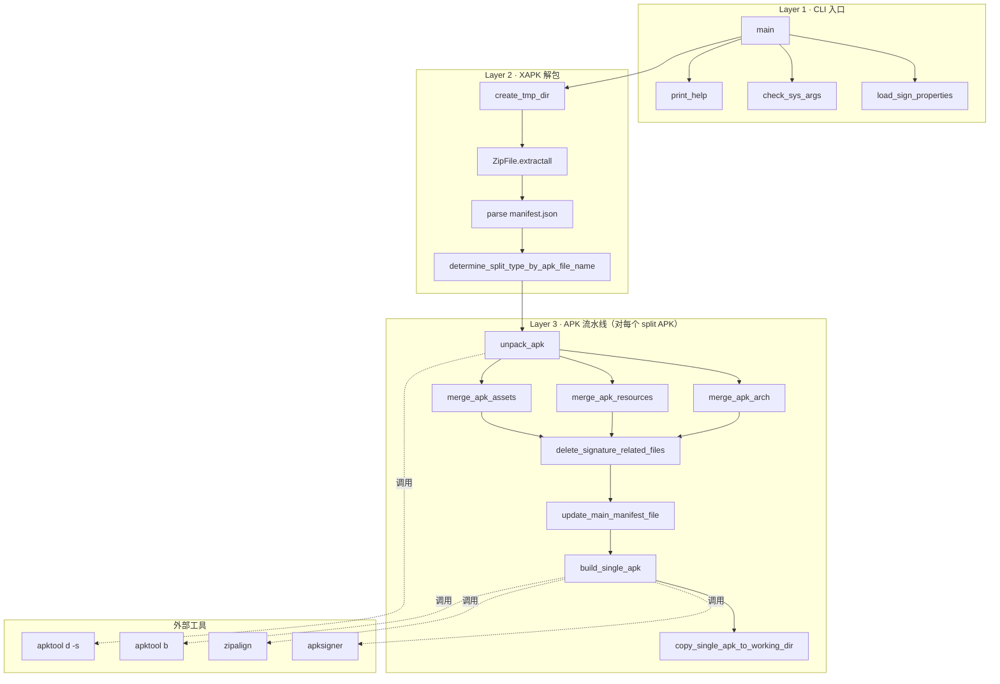
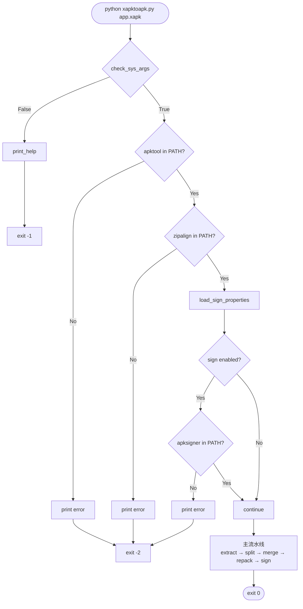

# 03 架构

## 整体架构

脚本是顺序流水线，没有并发、没有异步，所有逻辑在 `main()` 函数中以串行步骤串起来。架构上分为三层：



## 模块依赖（按函数分组）

```mermaid
flowchart LR
    A[CLI 入口]
    B[系统/进程工具]
    C[临时目录]
    D[APK 分片分类]
    E[apktool.yml 处理]
    F[分片合并]
    G[apktool 集成]
    H[后处理 zipalign+sign]
    I[Manifest 清理]
    J[签名配置]
    K[高层编排]
    Ext1[apktool CLI]
    Ext2[zipalign CLI]
    Ext3[apksigner CLI]

    A --> B
    A --> C
    A --> D
    A --> G
    A --> K
    A --> J
    K --> G
    K --> H
    G --> B
    H --> B
    H --> J
    F --> E
    D -. reads .xapk manifest .- XAPK[(XAPK)]
    G -. invokes .- Ext1
    H -. invokes .- Ext2
    H -. invokes .- Ext3
```

## 启动流程



## 关键设计点

1. **顺序流水线，无并发**：所有操作在 `main()` 单线程串行执行
2. **临时目录隔离**：所有中间产物在 `.xapktoapk/` 下，结束时 `shutil.rmtree` 清理
3. **apktool 作为外部 blackbox**：脚本不解析 APK 内部结构，所有解码/重打包都委托给 apktool CLI
4. **Windows 兼容**：通过 `is_windows()` + `get_path_to_batch()` 双路径（POSIX 用 `shutil.which`；Windows 找 `.bat` 用 `cmd /c` 调）
5. **签名可选**：默认不签；启用签名才检查 apksigner
6. **错误处理极简**：所有外部命令失败都 `raise Exception`，由 Python 默认 traceback 退出