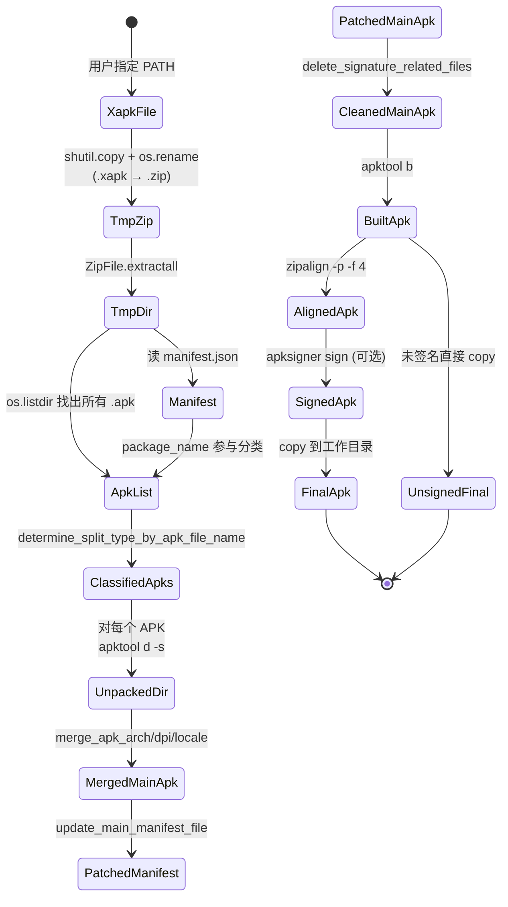

# 04 数据流

## 全生命周期



## 数据结构

脚本没有自定义类，所有数据用 `dict` / `list` / `tuple` 承载。

### `target_apks` 字典（main 中构建，行 575-586）

```python
target_apks = {
    "com.example.app.apk": {
        "apk_file_name": "com.example.app.apk",
        "apk_file_path": "/abs/path/to/.xapktoapk/com.example.app.apk",
        "apk_dir_name":  "com.example.app",
        "apk_dir_path":  "/abs/path/to/.xapktoapk/com.example.app",
        "apk_split_type": "main" | "arch" | "dpi" | "locale",
    },
    "config.arm64_v8a.apk": { ... },
    "config.xxxhdpi.apk": { ... },
    "config.en.apk": { ... },
    ...
}
```

### `apktool.yml` 解析结果（`parse_apktool_config` 返回）

```python
properties = {
    "lines_all": [...],                      # 全部行
    "lines_do_not_compress": [...],          # 块内有效行
    "lines_do_not_compress_index_start": int, # 块首行（不含 start_block_literal 行）
    "lines_do_not_compress_index_end":   int, # 块末行
}
```

### 签名配置（`load_sign_properties` 返回）

```python
sign_config = {
    "sign.enabled":         "true",
    "sign.keystore.file":   "/path/to/keystore",
    "sign.keystore.password": "...",
    "sign.key.alias":       "...",
    "sign.key.password":    "...",
}
```

或 `None` 表示禁用签名。

### Manifest 替换表（`update_main_manifest_file` 内）

```python
replacements = {
    '<meta-data android:name="com.google.firebase.messaging.default_notification_icon" android:resource="@null"/>': '',
    'android:isSplitRequired="true" ':                                       '',
    'android:requiredSplitTypes="base__abi,base__density" ':                 '',
    'android:splitTypes="" ':                                                '',
    'android:value="STAMP_TYPE_DISTRIBUTION_APK"':                           'android:value="STAMP_TYPE_STANDALONE_APK"',
    '<meta-data android:name="com.android.vending.splits.required" android:value="true"/>': '',
    '<meta-data android:name="com.android.vending.splits" android:resource="@xml/splits0"/>': '',
}
```

## 文件系统布局变化

```mermaid
flowchart LR
    subgraph Disk0["工作目录（输入）"]
        D0[application.xapk]
    end

    subgraph Disk1[".xapktoapk/ 临时目录"]
        D1[target.zip]
        D2[manifest.json]
        D3[com.example.app.apk]
        D4[config.arm64_v8a.apk]
        D5[config.xxxhdpi.apk]
        D6[config.en.apk]
        D7[com.example.app/]
        D8[config.arm64_v8a/]
        D9[config.xxxhdpi/]
        D10[config.en/]
        D11[target.apk]
        D12[aligned_target.apk]
    end

    subgraph Disk2["工作目录（输出）"]
        DEnd[application.apk]
    end

    D0 -->|shutil.copy| D1
    D1 -->|ZipFile.extractall| D2
    D1 -->|extractall| D3
    D1 -->|extractall| D4
    D1 -->|extractall| D5
    D1 -->|extractall| D6
    D3 -->|apktool d -s| D7
    D4 -->|apktool d -s| D8
    D5 -->|apktool d -s| D9
    D6 -->|apktool d -s| D10
    D7 & D8 & D9 & D10 -->|合并 lib/res/assets 到 D7| D7
    D7 -->|apktool b| D11
    D11 -->|zipalign| D12
    D12 -->|rename| D11
    D11 -->|apksigner sign (可选)| D11
    D11 -->|shutil.copy| DEnd
    DEnd -->|shutil.rmtree .xapktoapk| Cleanup((清理))
```