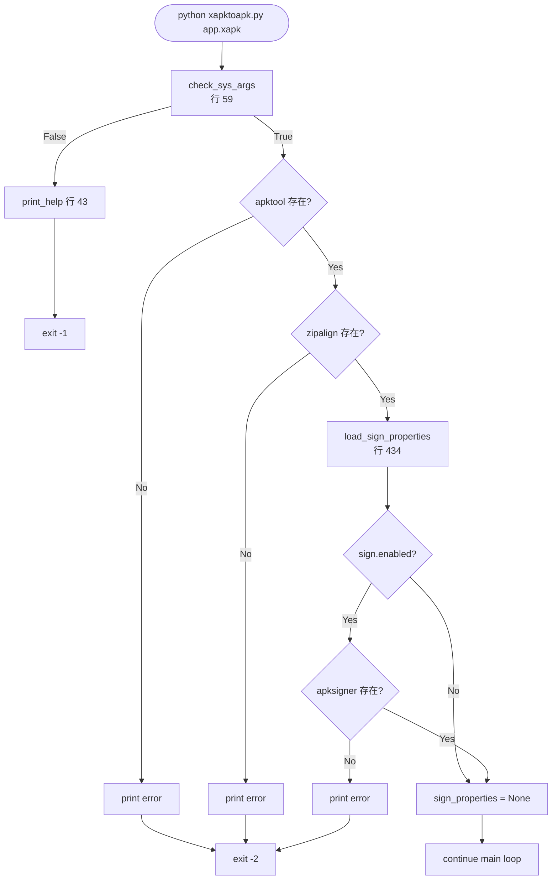
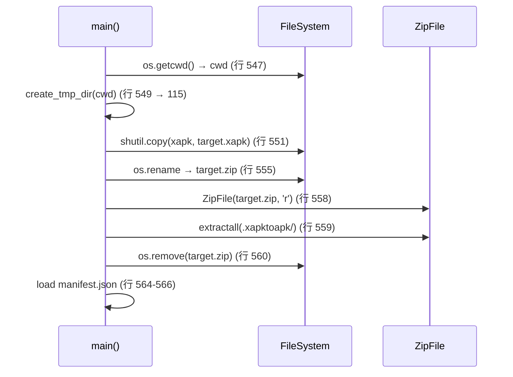
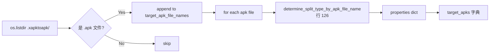
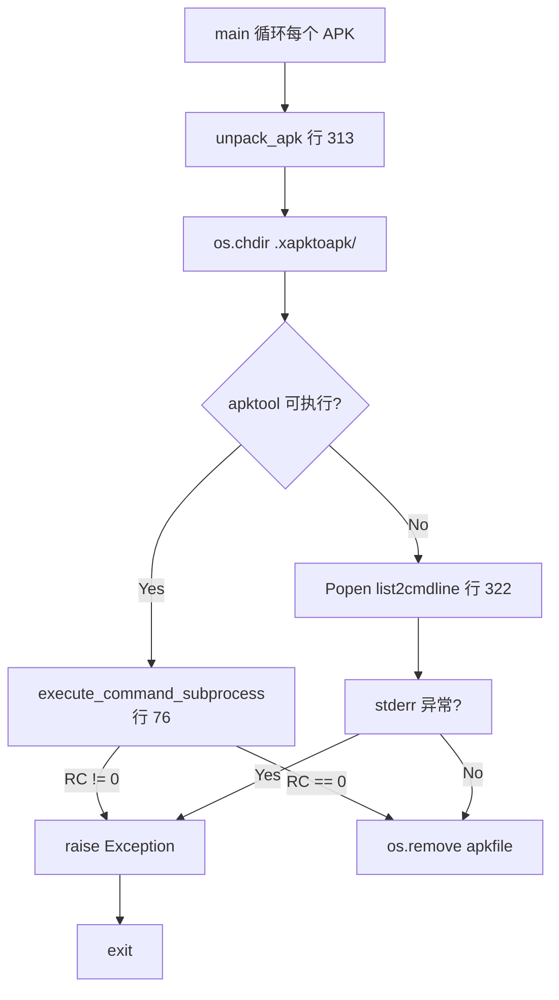
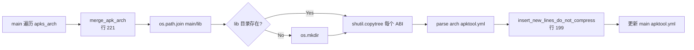
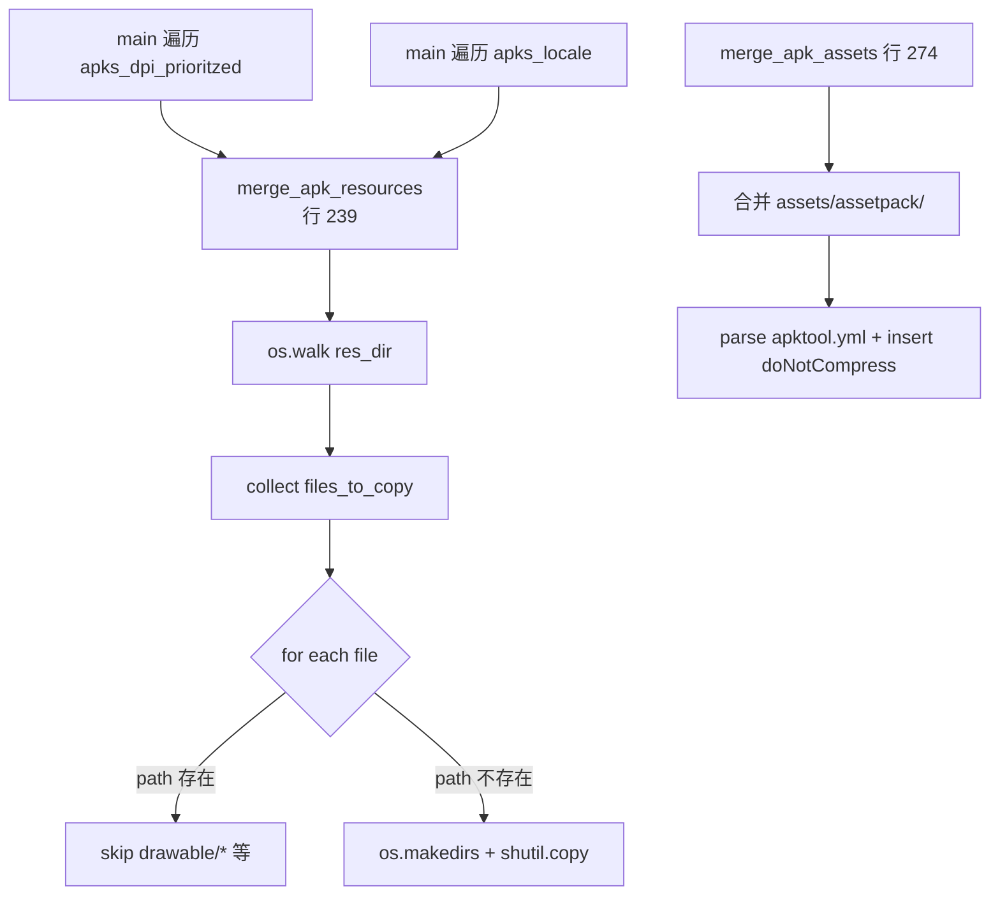
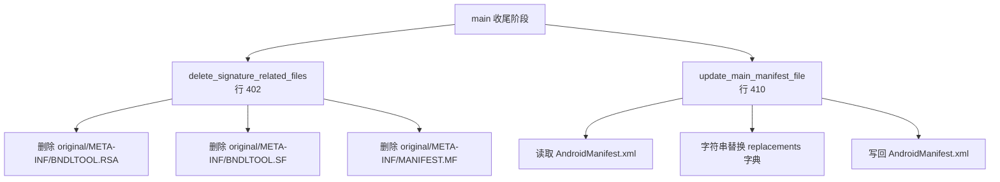
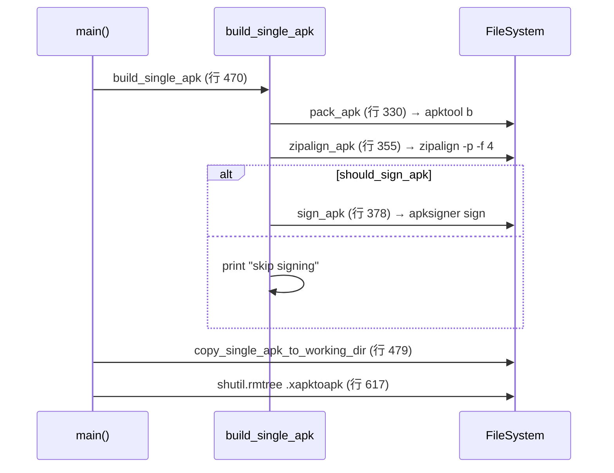

# 05 操作链

脚本的"操作链"是 8 条从输入到局部产物的数据流。所有链都汇聚到 `main()` 的最终返回（`application.apk`）。

## 链 1 — CLI 入口与依赖检查

**关键函数**：`check_sys_args`(59) · `print_help`(43) · `load_sign_properties`(434) · `check_if_executable_exists_in_path`(100) · `get_path_to_batch`(107)

## 链 2 — XAPK 解包为目录

**关键函数**：`create_tmp_dir`(115) · `create_or_recreate_dir`(89) · `file_split_name_and_extension`(121)

## 链 3 — APK 列表构建与 split 类型分类

分类规则（行 126-145）：
- `xapk_package_name.apk` 或 `base.apk` → `main`
- `config.<X>.apk` 且 `<X>` 以 `dpi` 结尾 → `dpi`
- `config.<X>.apk` 且 `<X>` ∈ `[arm64_v8a, armeabi_v7a, armeabi, x86, x86_64]` → `arch`
- `config.<X>.apk` 其他 → `locale`
- 其余文件 → `locale`（兜底）

**关键函数**：`determine_split_type_by_apk_file_name`(126) · `get_apks_of_type`(148) · `get_main_apk`(157)

## 链 4 — 每个 APK 用 apktool 解包

**关键函数**：`unpack_apk`(313) · `execute_command_subprocess`(76) · `get_executable_in_path`(104) · `get_path_to_batch`(107)

## 链 5 — arch 分片合并到 main

**关键函数**：`merge_apk_arch`(221) · `parse_apktool_config`(183) · `get_do_not_compress_lines`(161) · `insert_new_lines_do_not_compress`(199)

## 链 6 — dpi / locale 分片合并到 main

DPI 优先级（行 500）：`xxxhdpi → xxhdpi → xhdpi → hdpi → mdpi → ldpi → nodpi → tvdpi`，剩余字典序倒排兜底（行 494）。

**关键函数**：`merge_apk_resources`(239) · `merge_apk_assets`(274) · `prioritize_dpi_apk_list`(499) · `prioritize_dpi_apk_list_rev_sort`(494)

## 链 7 — 清理与 Manifest 修改

**关键函数**：`delete_signature_related_files`(402) · `delete_file_if_exists`(397) · `update_main_manifest_file`(410)

## 链 8 — 重打包 + zipalign + sign

**关键函数**：`build_single_apk`(470) · `pack_apk`(330) · `zipalign_apk`(355) · `sign_apk`(378) · `copy_single_apk_to_working_dir`(479)