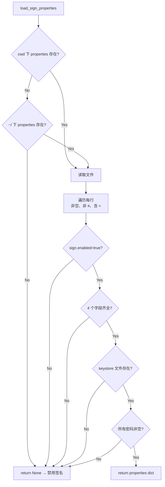

# 06 编译与运行

## 运行

```bash
# 直接调用
python xapktoapk.py application.xapk

# 加执行权限后直接运行
chmod +x xapktoapk.py
./xapktoapk.py application.xapk

# 建立符号链接到 PATH
ln -s /abs/path/xapktoapk.py /usr/local/bin/xapktoapk
xapktoapk application.xapk
```

参数规则（仅 1 个位置参数）：

| 位置 | 类型 | 说明 |
|------|------|------|
| `argv[1]` | 路径 | `.xapk` 文件路径（相对或绝对） |

## 退出码

| 退出码 | 触发条件 |
|--------|----------|
| `-1`（即 255） | 参数错误：`len(sys.argv) != 2` 或扩展名不是 `.xapk` 或文件不存在 → 触发 `print_help()` |
| `-2`（即 254） | 依赖缺失：`apktool` / `zipalign` / `apksigner` 不在 `$PATH` |
| 其他 | `raise Exception` 未被捕获时由 Python 默认 traceback 退出（码 1） |

## 运行时依赖

### 必备（必须）

| 工具 | 用途 | 安装 |
|------|------|------|
| `apktool` | APK 解包/重打包 | `brew install apktool` / `apt install apktool` / https://github.com/iBotPeaches/Apktool |
| `zipalign` | 4 字节对齐 ZIP 条目 | Android SDK build-tools / `sdkmanager "build-tools;30.0.0"` |

### 可选（启用签名时）

| 工具 | 用途 |
|------|------|
| `apksigner` | V1/V2/V3 APK 签名 |

### Python 依赖

**无第三方包**。仅标准库：`json, os, platform, shutil, sys, zipfile, subprocess`。

## 配置文件

### `xapktoapk.sign.properties`

位置（优先级从高到低）：

1. 脚本运行目录（`cwd`）
2. 用户家目录（`~/`）

格式（key=value，行首 `#` 视为注释）：

```properties
sign.enabled=true
sign.keystore.file=/home/user/.android/debug.keystore
sign.keystore.password=android
sign.key.alias=androiddebugkey
sign.key.password=android
```

### 加载逻辑（`load_sign_properties` 行 434）



## 路径示例

```
# 用户目录布局
~/projects/
├── my-app.xapk              # 输入
├── xapktoapk.py             # 脚本
├── xapktoapk.sign.properties  # 配置文件
└── my-app.apk               # 输出（与 xapk 同目录）
```

临时目录 `.xapktoapk/` 在 `cwd` 下创建，结束时 `shutil.rmtree` 删除。

## 跨平台差异

| 行为 | Linux / macOS | Windows |
|------|---------------|---------|
| 调 apktool / apksigner | 直接调可执行文件 | 找 `.bat` 后用 `list2cmdline` + `Popen` |
| 临时目录隐藏 | 不处理 | `attrib +h` |
| 路径分隔符 | `/` | 自动用 `os.path.join` |
| 退出码 | 同 | 同（但 traceback 文本可能不同） |